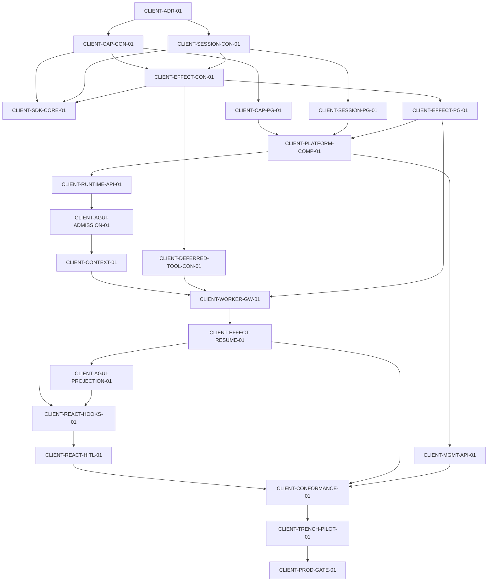

# ADR-CLIENT-01：Client Integration Plane（客户端集成面）

状态：Proposed（`CLIENT-ADR-01`，待评审接受）

> 本文冻结 Zebra Cloud Agent 前端接入平面的 V1 架构决策。后续 `CLIENT-*`
> 任务不得自行改变本文决策；需要变更时必须先修订本 ADR，再调整任务卡。
> 任务注册与依赖顺序见 `docs/AGENT_TASKS.md` 的 Client Integration Plane
> Board。

## 1. 背景与问题

产品定位（AGENTS.md、ADR-012）：Zebra 的交付目标是独立的 Cloud Agent
Runtime 服务（控制面、无状态 Worker、沙箱舰队），由 Trench 等业务系统通过
签名授权与不透明命名空间消费。

当前 AG-UI Command 已能接收 `state`、`tools`、`context`、`forwardedProps`
（`apps/api/src/zebra_agent_api/ag_ui_command.py`），但这些数据只是
Command Payload：

- 没有形成持久化的 Client Binding；
- 没有进入 Worker 恢复出的 `RecoveredTask`；
- 工具执行位置只有 `ZEBRA`、`HOST`、`SANDBOX`
  （`packages/agent-core/src/agent_core/domain/tools.py`），缺少 `CLIENT`。

因此 Cloud Agent 目前只能被动接收前端快照，无法以可审计、可重放、可恢复的
方式驱动前端。若先在 React Hook 层做一套在线执行的前端工具机制，会形成
只能在线执行、无法审计、无法重放、无法处理多 Tab 的临时体系。

实施顺序因此固定为：

```text
领域契约
→ PostgreSQL 持久化
→ Client Admission
→ 前端状态注入
→ Durable Client Effect
→ Worker suspend/resume
→ React SDK
→ 多前端一致性测试
→ Trench 试点
```

React Hook 不得先于后端 Binding、Fence、Effect Receipt 和恢复链路落地。

## 2. V1 冻结决策

| 决策项 | V1 决策 |
| --- | --- |
| 首个客户端 | React、Next.js Web |
| 浏览器访问方式 | 浏览器只访问 Host BFF，由 BFF 代理 Zebra |
| 传输协议 | AG-UI SSE 下行，HTTP Command 和 Receipt 上行 |
| 前端能力类型 | Readable、Action、Approval、Clarification |
| Component Generative UI | 后续阶段解锁 |
| 前端动作形式 | 类型化 Hook Handler |
| DOM 控制 | 禁止 Selector、任意 click、任意 JS |
| 正式业务写入 | 继续经过 Host Backend Tool |
| Client Controller | 一个 Task Run 同时一个 Active Controller |
| 其他浏览器实例 | Observer，只读流，不执行动作 |
| Subagent UI 权限 | 默认关闭 |
| Orchestrator UI 权限 | 只能提出 UI Intent，不能执行 Client Action |
| UI 执行 Agent | Root Agent 或后续 Presenter Agent |
| Client Effect | PostgreSQL 持久化，带 Receipt、Fence 和 Idempotency |
| 浏览器离线 | Task 进入 `waiting_client_effect` 并释放 Worker Lease |
| 配置事实源 | Published Frontend Capability Profile |
| 运行时能力 | Mounted Capability Snapshot，只能收窄 |
| 前端状态性质 | Agent 上下文和交互投影，不作为业务事实源 |
| 灰度开关 | 默认关闭，按 Host、namespace、frontend profile 开启 |

## 3. 核心概念

### 3.1 Client Integration Plane

浏览器侧前端能力接入 Cloud Agent 的完整平面：能力发布（Profile）、会话
接入（Session + Grant）、运行绑定（Run Binding + Control Lease）、动作
执行（Client Effect + Receipt）与投影（AG-UI）的总称。它与 Host
Integration Plane（Host Capability Manifest、Host Backend Tool、Host
Effect）平行且独立。

### 3.2 Frontend Capability Profile

前端能力的配置事实源，由平台管理面发布（Management API），内容包含
Readable、Action、Component 契约与受限 JSON Schema。不变式：

- Profile 按 `frontend_app_id + revision` 发布，Revision 发布后不可变；
- 相同内容生成相同 Digest；
- Action、Readable、Component 名称在 Profile 内唯一；
- 参数必须是受限 JSON Schema，禁止可执行字符串 Selector；
- 字段名不得出现 Secret、Token、Password；
- `business_write_forbidden` 风险等级无法发布；
- 所有字符串、数组、Schema 和 Profile 大小有上限。

### 3.3 Mounted Capability Snapshot

运行时某个 Client Session 实际挂载的能力快照，由 Hook mount/unmount 上报。
不变式：

- 必须是某个 Published Profile 的子集，只能收窄，不能扩大；
- Runtime Hook 不能增加 Profile 中未发布的能力；
- Snapshot 固定 Profile Digest 与自身 Digest，供 Binding 校验。

### 3.4 Client Session

一个浏览器 Tab 实例与 Zebra 之间的会话，由 Host BFF 签发的 Client Grant
建立。不变式：

- Client Grant 必须绑定 `host_app_id`、`namespace_id`、`frontend_app_id`
  与 Origin，并映射当前用户身份；
- Client Grant 只能包含 Client 能力，不能替代 HostGrant；
- Session Open 只返回一次独立 Session Secret，服务端只保存其 SHA-256；
- Cloud HTTP 的 `Authorization` 专用于 HostGrant；Session Secret 通过独立的
  `X-Zebra-Client-Session` 头传递，两个凭据不得复用或互相替代；
- Session Secret 只负责会话认证，不能复用为 Controller Fence；
- Session 有心跳与过期；过期 Session 不能续租。

### 3.5 Client Run Binding

一次 Task Run 与一个 Client Session 的绑定，固定该 Run 期间可用的前端
能力。不变式：

- 绑定键为 `task_id + run_id + client_session_id`；
- 必须固定 Profile Digest 和 Mounted Snapshot Digest；
- Client 能力只能从 Task Capability 继续收窄；
- Binding Revision 单调递增；
- 与既有 `TaskBindingSnapshot`（Host 资源绑定）分离，互不吞并。

### 3.6 Client Control Lease（与 Fence）

控制权租约：一个 Run 同时最多一个 Active Controller，其余浏览器实例为
Observer。不变式：

- 两个 Tab 同时 Claim 时只有一个成功（CAS）；
- Lease 续期与动作执行需要当前 Fence；
- Client 心跳同时续 Controller Lease；Provider 卸载显式释放 Lease，崩溃时
  仍以有界 TTL 作为兜底；
- 旧 Fence 更新产生零写入；
- Fence Token 不能进入 Event 或日志，只持久化 Hash；
- Observer 无法执行 Action 或提交 Receipt。

### 3.7 Client Effect

Cloud Agent 调用浏览器 Hook 的持久化执行请求。不变式：

- 必须带 Action Contract Digest、Client Binding Digest、Fence Hash、
  Expected UI Revision 和 Idempotency Key；
- 必须分别绑定业务 Task 和实际等待 Continuation 的 Parent Session；Task
  rollover 后不得把 Task ID 当成 Segment/Session ID；
- Effect Request、Continuation 和 Scheduled Event 在同一事务提交；
- 建议状态机：`pending` / `delivered` / `succeeded` / `failed` /
  `declined` / `unavailable` / `stale_ui_state` / `expired` / `uncertain` /
  `cancelled`；
- Stale Fence、Stale Revision、过期 Effect 全部 fail closed；
- Uncertain 状态不能自动重试高风险动作；
- Client Effect 终态不能直接代表业务写入成功。

### 3.8 Client Effect Receipt

浏览器对 Client Effect 的执行回执。不变式：

- 必须关联准确的 Effect ID，并带 Idempotency Key；
- 一个 Effect 只能接受一个语义一致的终态 Receipt；
- 相同 Idempotency Key 且相同 Request Digest 返回原 Effect；相同 Key 但
  Request Digest 不同判为冲突；
- Receipt、Effect Terminal 和 Parent Resume Command 在同一事务提交；
- Receipt 不得包含 Token、Cookie、DOM 或完整页面数据。

## 4. 接入拓扑与信任边界

```text
浏览器（React + Zebra SDK）
  → Host BFF（签发 Client Grant、代理 Zebra 请求、映射当前用户）
    → Zebra API（AG-UI SSE 下行；HTTP Command / Receipt 上行）
      → Worker（Client Tool Gateway → Client Effect Schedule）
```

- 浏览器只访问 Host BFF；Direct Browser-to-Zebra 模式默认关闭。
- Client Grant 由 Host BFF 签发，绑定 `host_app_id`、`namespace_id`、
  `frontend_app_id`、Origin 和当前用户；它不能替代 HostGrant，也不能越出
  Client 能力范围。
- Host BFF 用 Client Grant 建立 Session 后，只把一次性 Session Credential
  交给该 Tab；Run Binding 返回的 Controller Fence 是另一条独立密钥。
- Namespace 漂移（Grant 的 namespace 与目标 Task 不一致）产生零写入。
- Worker 永不直接连接浏览器、永不执行 React Handler；Worker 只负责
  Schedule Effect 与消费 Receipt 后的 Continuation。

## 5. 能力与安全边界

### 5.1 禁止的通用能力 API

前端 Hook 体系严禁提供：

```text
executeJavaScript(code)
querySelector(selector)
click(selector)
setGlobalState(path, value)
dispatchRedux(action)
eval(expression)
injectHtml(html)
runBrowserCommand(command)
```

Agent 对浏览器没有任何任意 JavaScript 或 DOM 权限。

### 5.2 语义化业务动作

平台允许的能力必须采用业务语义命名，例如：

```text
trench.ui.event.open
trench.ui.entity.select
trench.ui.timeline.range.set
trench.ui.report-draft.fill
trench.ui.evidence-panel.open
```

能力语义在 Published Profile 中声明，前端以类型化 Hook Handler 实现。

### 5.3 业务写入边界

以下行为不允许通过普通 Client Action 完成：删除业务记录、发布正式报告、
提交订单、发送正式消息、支付、权限变更、审批业务流程、更新业务数据库。

标准路径固定为：

```text
Client Action 填写草稿或打开确认页面
→ 用户确认
→ Host Backend Tool 执行业务写入
→ Host Effect Receipt
→ 前端刷新状态
```

现有 Host Capability Manifest、Resource Binding 和 Effect Reconciliation
继续作为后端业务能力权威；Client Capability Profile 保持独立。

### 5.4 AG-UI 状态命名空间

AG-UI `state` 用于同步 Agent 与 UI 的共享视图，但 Agent 不得直接通过
JSON Patch 修改业务前端状态。命名空间约定：

```json
{
  "zebra": {
    "task": {},
    "orchestration": {},
    "clientEffects": {},
    "approvals": {}
  },
  "hostUi": {
    "route": "",
    "selection": {},
    "readables": {},
    "revision": 0
  }
}
```

写权限：

```text
Zebra Projection      只能写 /zebra/*
Client SDK            只能上报 /hostUi/*
Agent 改变 Host UI    必须调用语义化 Client Action
```

Agent 无法通过 StateDelta 绕过 Action Handler。前端状态（Readable）是
Agent 上下文和交互投影，不作为业务事实源。

## 6. 分层修改边界

| 层 | 允许修改 | 禁止内容 |
| --- | --- | --- |
| `agent-core` | Client Profile、Session、Binding、Lease、Effect、Receipt 领域契约和 Port | HTTP、PostgreSQL、React、FastAPI、Trench 名称 |
| `agent-control-plane` | Admission、Binding、Profile Validation、Client Effect 应用服务 | Worker、Runtime、FastAPI、Storage Adapter |
| `agent-storage` | PostgreSQL Adapter、Migration、原子事务 | Hook Handler、React、Host 业务语义 |
| `agent-integrations/ag_ui` | Client Effect 和 Client State 的纯投影 | 数据库写入、权限决策、业务调用 |
| `apps/api` | Management API、Runtime API、Client Grant 校验、Receipt 接收 | 执行前端 Handler、直接运行 Agent |
| `apps/worker` | Client Tool Gateway、Effect Schedule、Continuation、Resume | 浏览器连接、React 状态、任意 DOM 操作 |
| TypeScript SDK | Hook 注册、Client Session、SSE、Receipt、Fence、本地去重 | HostGrant Secret、数据库访问、任意代码执行 |
| Host BFF | Client Grant 签发、Zebra 请求代理、当前用户身份映射 | Agent Runtime 状态和 Worker 调度 |
| 业务前端 | 注册语义化 Readable 和 Action | 直接修改 Zebra Task、Attempt、Effect 状态 |

现有 `agent-control-plane` 架构测试已限制其导入 Worker、Runtime、FastAPI
和 Storage Adapter，该边界继续保留。`agent-core` 与 Worker 不出现任何
Host 业务名称分支（Trench 词汇只存在于 Profile、Fixture 与 Host 侧）。

## 7. 执行与恢复模型

### 7.1 能力交集

Client Tool 暴露给模型前必须满足：

```text
Agent Capability
∩ Task Binding
∩ Client Run Binding
∩ Published Profile
∩ Mounted Snapshot
∩ Client Grant
∩ Zebra Client Policy
```

- 无 Active Client Controller 时不暴露 Client Action；
- 浏览器 SDK 没有 Controller Fence 时不得执行 Handler；执行前必须同时
  校验 Action Contract Digest、Client Binding Digest 和 UI Revision；
- Root Agent 或后续 Presenter Agent 才能获得 UI Control；Researcher、
  Tester、Reviewer 默认无 UI Control；
- Subagent 默认没有 UI 权限；Orchestrator 只能提出 UI Intent、只能调用
  orchestration 工具（现有 `system/orchestrator@1` 的 `orchestration.*`
  限制继续保留）。

### 7.2 Suspend / Resume

- Client Tool 调用只负责 Schedule Effect；Schedule 成功后 Parent Session
  进入 `waiting_client_effect` 并释放 Worker Lease；
- Receipt 到达后，Receipt 终态与 Resume Command 原子提交，新 Worker 恢复
  原 Tool Call ID：Success 产生一次 Tool Completed，Failure 产生一次
  Tool Failed，Stale / Unavailable / Declined 可返回模型继续规划；
- 浏览器离线时 Effect 保持 Pending、Task 保持等待态、Lease 保持释放；
  重连后 Hook Handler 只执行一次；
- AG-UI Event Store Replay 是恢复基础：Redis 丢失后仍能从 PostgreSQL
  恢复，Event 与 Effect 状态可以相互审计。

### 7.3 幂等与 Fail-Closed

- Deferred Client Tool 不产生 `TOOL_EXECUTION_COMPLETED`，不向模型注入
  临时假结果，Harness 返回明确的 `waiting_external_tool` disposition；
- 恢复时只能接受匹配的 Tool Receipt；Unknown 或 Uncertain 结果不自动
  重复执行 Action；
- 所有 Profile、Binding、Snapshot、Effect、Receipt 都有 Digest，审计可
  关联 Task、Run、Client、Action、Effect 和 Receipt。

## 8. 实施顺序与阶段门

依赖顺序（与任务注册一致）：



阶段门：

- Gate 0 架构门：`CLIENT-ADR-01` Done，解锁契约卡；
- Gate 1 契约门：Capability / Session-Fence / Effect 状态机契约与
  `ToolExecutionLocation.CLIENT` 完成，解锁 PostgreSQL 任务；
- Gate 2 持久化门：真实 PostgreSQL Profile Registry、Client Lease、
  Effect/Receipt 与备份恢复验证通过，解锁 API 与 Composition；
- Gate 3 Readable 垂直切片门：React Readable → Client Binding → State
  Snapshot → Worker Recovery → Agent Context；
- Gate 4 Client Action 垂直切片门：Client Tool Call → Durable Effect →
  Parent Suspend → Browser Hook → Receipt → Parent Resume → Model
  Continuation；
- Gate 5 SDK 门：Strict Mode、Unmount、多 Tab、断线、重连、Idempotency、
  Fence、Receipt 全部通过；
- Gate 6 多业务门：`fake-frontend-a` / `fake-frontend-b` 使用同一
  Conformance Suite，Core 与 Worker 无业务名称分支；
- Gate 7 Trench Pilot 门：Readables、Host Backend Tool、Research Child、
  Client Action、Receipt、Resume 真实全链路；
- Gate 8 生产门：安全、恢复、审计、灰度、回滚、容量、告警全部具备证据。

V1 明确锁定（不得提前实施）：React Component Generative UI、CopilotKit
Adapter、Flutter SDK、小程序 SDK、Agent Team UI Control、Subagent UI
Control、Direct Browser-to-Zebra、任意 DOM Automation。

## 9. 与既有决策的关系

- ADR-012：本文是云端产品主线下"业务系统消费 Agent Runtime"的前端接入
  补全，方向一致。
- ADR-015（Zebra Embedded 与 CopilotKit/AG-UI 边界）：本文在其 AG-UI
  边界上增加持久化客户端平面；CopilotKit Adapter 继续锁定。
- ADR-017（Agent Layer 与多 Host 接入）：Host Capability Manifest 继续
  负责后端业务能力；Client Capability Profile 独立，不复用 Host
  Connector 合同。
- ADR-023（Stateless Command 与 Revision）：Client Effect Receipt 与
  Resume 沿用同一无状态命令与 Revision 语义。
- `CLOUD_Lease_Fencing_Effect_Outbox` 合同：Host Effect 的
  Outbox/Reconciliation 模式是 Client Effect 的先例；Client Effect 使用
  独立表结构，不修改 `effect_outbox` 与 Host Effect 状态机。
- Worker Lease 语义（`waiting_*` 释放租约、Fence CAS）延续现有
  Delegation/Wakeup 先例；Client Control Lease 是浏览器侧对应物。

## 10. ADR 验收清单

1. 浏览器经 Host BFF 接入 —— 第 4 节；
2. Frontend Profile 与 Runtime Mount 分离 —— 第 3.2 / 3.3 节；
3. 一个 Run 一个 Controller —— 第 3.6 节；
4. 正式业务写入继续走 Host Tool —— 第 5.3 节；
5. Client Effect 使用持久化请求和回执 —— 第 3.7 / 3.8 节；
6. Agent 无任意 JavaScript 和 DOM 权限 —— 第 5.1 / 5.2 节；
7. Subagent 默认没有 UI 权限 —— 第 7.1 节；
8. Orchestrator 只能提出 UI Intent —— 第 7.1 节；
9. TaskBinding 与 ClientRunBinding 分离 —— 第 3.5 节；
10. AG-UI Event Store Replay 是恢复基础 —— 第 7.2 节；
11. Client State 与 Host 业务事实分离 —— 第 5.4 节；
12. 所有 Profile、Binding、Receipt 都有 Digest —— 第 3.2 / 3.5 /
    3.7 / 3.8 节。
