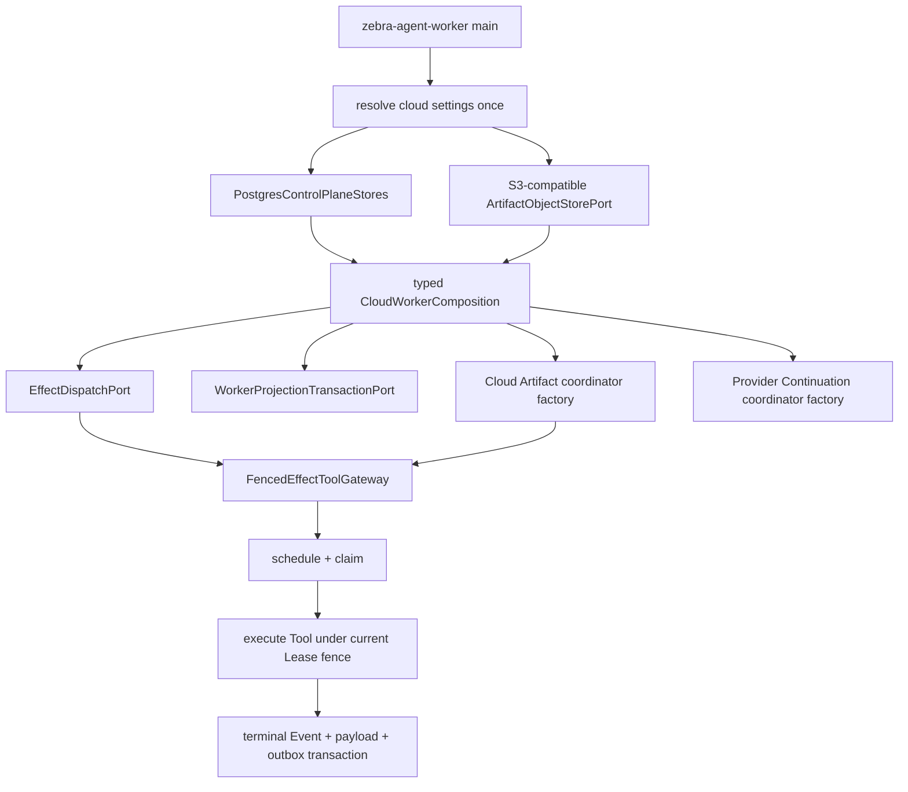
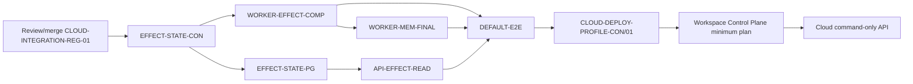

# Zebra Cloud Effect 默认接线与应用组合收口方案 v1.0

- 方案编号：`CLOUD-EFFECT-COMP-CLOSE-01`
- 状态：`Planning`，仅冻结建议方案，不激活实现任务
- 基线：`zebra-cloud-trench@978e02de`
- 输入：[周期性审查20260812.md](./周期性审查20260812.md)
- 适用范围：Cloud API/Worker application composition、fenced Effect、云端
  Artifact payload、Provider Continuation、Effect 状态只读和 Worker governed
  Memory finalization
- 明确不适用：Profile 正交化、Workspace Control Plane、Redis/AG-UI、Trench、
  Kubernetes/生产发布

## 1. 决策摘要

下一步开发应先关闭默认 Cloud application composition 的副作用执行阻断，之后
才能继续 production Profile、Workspace Control Plane 和 Trench 联调。

本轮不接受只在 Worker 中增加：

```python
effect_dispatch=active_stores.effects
```

该一行只能绕过第一个接口错配，随后仍会把 PostgreSQL cloud Artifact metadata
adapter 当作本地 `ArtifactPayloadStorePort` 使用，并让 Cloud API handoff 把
`EffectDispatchPort` 当作 `EffectLedgerPort` 查询。正确的最小闭环必须显式区分：

```text
Local execution mutation   -> EffectLedgerPort
Cloud execution mutation   -> EffectDispatchPort
API/validation read model  -> EffectStateReadPort
```

Cloud Worker composition 还必须一次性注入同一 namespace 下的：

```text
PostgresControlPlaneStores
EffectDispatchPort
WorkerProjectionTransactionPort
CloudToolOutputArtifactCoordinator factory
CloudProviderContinuationCoordinator factory
cloud governed Memory finalization strategy
deployment namespace
```

任何必要依赖缺失时启动失败，不允许回退 SQLite、legacy Effect ledger 或进程内
payload。

## 2. 证据复核

### 2.1 `P0.1` 已确认，并且比审查文本描述的范围更大

当前代码存在一条完整、可静态复核的错误链：

1. `packages/agent-storage/src/agent_storage/runtime_composition.py` 将
   `PostgresControlPlaneStores` 强制转换为本地 `ControlPlaneStores`。
2. 本地 `ControlPlaneStores.effects` 是 `EffectLedgerPort`；Cloud
   `CloudControlPlane.effects` 是 `EffectDispatchPort`，两者不是兼容接口。
3. `apps/worker/src/zebra_agent_worker/main.py` 调用默认 Worker builder 时不注入
   `effect_dispatch`。
4. `build_worker_loop_service()` 只自动注入 workspace transaction 和 namespace，
   把 `effect_dispatch=None` 继续传给 `SessionExecutionService`。
5. `SessionExecutionService` 将 `active_stores.effects` 保存为 legacy
   `_effect_ledger`，而 `_effect_dispatch` 仍为 `None`。
6. 首个非只读 Tool 因而进入 `EffectGuardedToolGateway`，调用 `reserve()`；
   `PostgresEffectDispatchStore` 没有该方法。

当前 cloud profile 回归只证明选择了 cloud composer，没有执行默认 Worker 的真实
副作用 Tool，因此没有覆盖这个断点。

### 2.2 只注入 dispatch 仍不安全

当 `FencedEffectToolGateway` 没有 cloud Effect payload coordinator 时，它会调用
本地 Artifact Port 的：

```text
store_payload
read_payload_bytes
```

Cloud bundle 中的 `PostgresCloudArtifactPayloadStore` 管理的是 fenced metadata
lifecycle，提供 `reserve_for_worker`、`record_object_for_worker`、
`finalize_for_worker` 等方法，不是本地 bytes Store。默认 cloud composition 必须
使用现有 `CloudToolOutputArtifactCoordinator` 和 S3-compatible
`ArtifactObjectStorePort`，不能把 metadata adapter 再次伪装成本地 Port。

### 2.3 API 也受同一类型伪装影响

`SessionHandoffApi` 当前从 `active_stores.effects` 调用：

```text
terminal_keys(root_session_id)
has_uncertain(root_session_id)
```

这两个查询只存在于 legacy `EffectLedgerPort`，不在 `EffectDispatchPort`。因此
Cloud handoff 即使不执行 Tool，也可能在验证阶段发生接口方法缺失。需要提取一个
窄的 `EffectStateReadPort`，由 SQLite ledger 和 PostgreSQL outbox 分别实现。

### 2.4 同一 cast 还隐藏了三个相邻运行时错配

Effect 是第一个必修阻断，但不是唯一错配：

| Cloud 字段 | 被伪装成的 local Port | 默认路径风险 |
| --- | --- | --- |
| `artifact_payloads` | `ArtifactPayloadStorePort` | attachment/effect payload 调用 `store_payload()` 时方法缺失 |
| `provider_continuations` | `ProviderContinuationStorePort` | fallback 调用 local `store/load_compatible` 签名时不兼容 |
| `memories` | `MemoryStorePort` | Session 完成时 extraction/promotion 调用 `upsert()`，cloud store 没有该方法 |

尤其是 Memory：默认 Worker 在 `SESSION_COMPLETED` 后仍会执行 candidate extraction
和 promotion。若只修 Effect，副作用 Tool 可以执行，但 Session 仍可能在 finalization
阶段因 `PostgresGovernedMemoryStore.upsert()` 不存在而失败。因此完整 Gate 必须同时
提供 cloud governed Memory finalization strategy，或在构造阶段明确拒绝 terminal
execution；不允许靠测试选择“永不完成的 Session”掩盖问题。

这证明根因是 shared composer 把不等价的 local/cloud bundle 强制视为同一类型，
而不是一个孤立的 Worker 参数遗漏。实现必须先冻结 purpose-typed application
composition，再分别迁移 Worker 和 API。

### 2.5 本地未合并工作没有关闭该缺口

- `CLOUD-INTEGRATION-REG-01@8bbdf5b5` 修复 recovered Lease heartbeat checkpoint
  和 local API lazy-store，不改变 Effect composition。
- `CLOUD-TRN-NEXT-PLAN-01@808d71eb` 已规划 Profile、command-only API、live、
  recovery、Host/AG-UI 和 Trench 路线，但没有登记本缺口。
- 所有本地/远端 refs 中均未发现默认 Worker 自动选择
  `active_stores.effects` 作为 fenced dispatch 的实现。

所以本方案不是重复建设，而是应插入既有 Gate 0 与 production Profile 之间的新增
前置门。

### 2.6 其他审查结论的处置

| 审查项 | 判断 | 本方案处置 |
| --- | --- | --- |
| `P0.1` Effect 默认接线 | 已确认，立即阻断副作用 Tool | 本方案完整处理 |
| `P0.2` cloud/production Profile 分裂 | 已确认 | 沿用后续 `CLOUD-DEPLOY-PROFILE-CON/01`，不得抢跑 |
| `P0.3` Cloud Workspace Control Plane 缺失 | 已确认 | Effect 闭环后单独立项，不塞入本 PR |
| Cloud API inline execution | 已确认 | 沿用 `CLOUD-COMMAND-API-CON/RUN/CTRL` |
| Authority、Redis/AG-UI、Trench | 合同/adapter 与运行接线状态不同 | 保持原依赖顺序，不由本方案顺带实现 |

## 3. 目标状态

### 3.1 Cloud Worker 默认执行链



### 3.2 API 只读边界

```text
SessionHandoffApi
  -> EffectStateReadPort
     -> SQLiteEffectLedger              (local)
     -> PostgresEffectDispatchStore     (cloud)
```

API 不获得 Effect claim/complete 能力；Worker 不通过 API 执行副作用。

### 3.3 类型与组合规则

1. 默认 Worker 不再声明 `PostgresControlPlaneStores` 是本地
   `ControlPlaneStores`；API handoff 也不得通过该伪装读取 Effect。API 其余兼容路径
   是否仍需 shared composer，必须作为 command-only API 的显式 blocker 保留，不能
   被本 Gate 误报为已清零。
2. `effects` 不再承载两个语义；local ledger、cloud dispatch 和只读 state 使用
   不同的显式依赖名。
3. application composition root 负责选择策略；`agent-core` 不依赖 storage 或 apps。
4. Cloud settings 中供 Worker 使用的 object store 必须满足
   `ArtifactObjectStorePort`，不能只标注 read capability。
5. Cloud Artifact、Effect、Projection 和 Provider Continuation 必须共享同一
   deployment namespace 和同一已解析配置快照。
6. 本地 profile 保持 lazy SQLite 和现有 legacy Effect 行为，不引入迁移或行为变化。

## 4. 任务拆分

所有任务默认 `Locked`。只有前置分支合并、维护者明确激活，并在
`docs/AGENT_TASKS.md` 填入单一 owner/branch/worktree/Owned paths 后才能实施。

### 4.1 `CLOUD-EFFECT-STATE-CON-01` — Effect 状态只读合同

- 预计：4-6 小时
- Owner 角色：CORE
- 依赖：`CLOUD-INTEGRATION-REG-01` 合并
- 候选 Owned paths：
  - `packages/agent-core/src/agent_core/ports/effect_state.py`（新）
  - `packages/agent-core/src/agent_core/ports/effect_ledger.py`
  - `packages/agent-core/src/agent_core/ports/__init__.py`
  - focused Core contract tests

交付：

- 提取仅包含 `terminal_keys()` 与 `has_uncertain()` 的
  `EffectStateReadPort`。
- `EffectLedgerPort` 保留 local mutation，结构上同时满足只读 Port。
- 不把 claim、retry、reconcile 或 payload 写入能力暴露给 API。

完成条件：

- local ledger contract 无行为变化；
- API 类型不再要求一个对象同时实现 local ledger 和 cloud dispatch；
- Core focused tests、Ruff、Mypy、file-size 和 diff checks 通过。

### 4.2 `CLOUD-EFFECT-STATE-PG-01` — PostgreSQL Effect 只读投影

- 预计：4-6 小时
- Owner 角色：STORAGE
- 依赖：`CLOUD-EFFECT-STATE-CON-01` 合并
- 候选 Owned paths：
  - `packages/agent-storage/src/agent_storage/postgres/outbox.py`
  - 必要时新增一个聚焦 read module，避免超过 500 行
  - focused PostgreSQL Effect tests 和隔离 Compose runner

交付：

- 基于 `effect_outbox` 权威状态实现 root-session scoped
  `terminal_keys()` 与 `has_uncertain()`。
- 查询必须包含 deployment namespace，且不写数据、不领取 claim。
- terminal key 只来自确定终态；`uncertain` 和过期但未 reconcile 的 claim 规则在
  contract test 中固定。

完成条件：

- namespace 隔离、空结果、成功、failed-no-effect、uncertain、dead-letter 和 retry
  行为有确定测试；
- 真实 PostgreSQL runner 通过并清理 container/volume/network；
- 不新增迁移，除非先证明现有索引无法满足有界查询并单独立项。

### 4.3 `CLOUD-WORKER-EFFECT-COMP-01` — 默认 Worker typed composition

- 预计：6-8 小时
- Owner 角色：APP / WORKER
- 依赖：`CLOUD-EFFECT-STATE-CON-01` 与 `CLOUD-INTEGRATION-REG-01` 合并
- 候选 Owned paths：
  - `packages/agent-storage/src/agent_storage/runtime_composition.py`
  - `apps/worker/src/zebra_agent_worker/loop.py`
  - `apps/worker/src/zebra_agent_worker/main.py`
  - 新的、职责单一的 Worker composition module（如确有需要）
  - Worker cloud composition focused tests

交付：

- cloud settings 只解析一次，返回 typed cloud stores 与 object store。
- 默认 Worker 显式注入 dispatch、workspace transaction、namespace、Artifact factory
  和 Provider Continuation factory。
- local execution 只获得 ledger；cloud execution 只获得 dispatch。
- 删除默认 Worker 路径对 `cast(ControlPlaneStores, stores)` 的依赖。
- cloud 必需依赖不完整时在启动/构造阶段 fail closed，不能等到首个 Tool 才失败。

完成条件：

- 默认 cloud Worker 构造断言五个 cloud dependency 指向同一 bundle/namespace；
- local lazy SQLite、不传 cloud dependency 的 focused tests 保持通过；
- 负例覆盖缺 object writer、dispatch、transaction、namespace、continuation scope；
- `SessionExecutionService` 不再把 cloud dispatch 保存为 `_effect_ledger`。

### 4.4 `CLOUD-WORKER-MEM-FINAL-01` — Cloud governed Memory 收尾

- 预计：6-8 小时
- Owner 角色：APP / WORKER
- 依赖：`CLOUD-WORKER-EFFECT-COMP-01` 合并
- 候选 Owned paths：
  - `apps/worker/src/zebra_agent_worker/execution_finalization.py`
  - `apps/worker/src/zebra_agent_worker/execution.py`
  - 新的聚焦 cloud Memory finalization module（仅在现有文件会越界时）
  - Worker cloud Memory focused tests

交付：

- local profile 继续复用现有 `MemoryCandidateExtractionService` 和
  `MemoryCandidatePromotionService`。
- cloud profile 复用现有无存储 planner：`MemoryCandidateExtractionPlanner`、
  `MemoryCandidatePromotionPlanner` 和它们的 `governed_mutations()`；不再调用 local
  `MemoryStorePort.upsert()`。
- 在当前 `WorkerMutationAuthority` 下读取 governed revision，构造一个确定的
  `WorkerMemoryMutationPlan`，并只调用一次
  `GovernedMemoryStorePort.commit_worker_candidates()`。
- 用 commit receipt 中的 canonical Events/revision 同步 recorder，再继续 title
  finalization；不得把已经事务提交的 Memory Event 二次 append。
- plan 绑定 operation id、namespace、Session 和 expected stream revision；storage
  transaction 另行校验当前 Lease fence。同 operation/request digest 的重放返回同一
  receipt，未知提交结果只做 receipt reconciliation，不生成新 operation 盲重试。

完成条件：

- completed Session 的 candidate、auto-promotion、stale/supersede 和空 candidate 路径
  都有 focused tests；空计划不得伪造 aggregate commit；
- Lease 丢失、stream revision 冲突、Memory revision 冲突和 namespace 错配均 fail
  closed，Event/Projection/Memory 不出现部分写；
- local finalization 回归不变，cloud 路径没有 `.upsert()` 或第二 Memory authority；
- committed Memory Events、Session projection 和 Workspace projection 到达同一 revision。

### 4.5 `CLOUD-API-EFFECT-READ-01` — API Effect read composition

- 预计：4-6 小时
- Owner 角色：APP / API
- 依赖：`CLOUD-EFFECT-STATE-PG-01` 合并
- 候选 Owned paths：
  - API storage composition seam
  - `apps/api/src/zebra_agent_api/session_handoff.py`
  - focused API/cloud composition tests

交付：

- `SessionHandoffApi` 只注入 `EffectStateReadPort`。
- local 使用 SQLite ledger read view；cloud 使用 PostgreSQL outbox read view。
- 删除 API handoff 对 cloud `.effects` 是 legacy ledger 的假设。

完成条件：

- local 与 PostgreSQL handoff 对 terminal/uncertain Effect 得到一致的业务判断；
- Cloud API 不能通过该 read dependency schedule/claim/complete Effect；
- 无 SQLite fallback 或第二 Effect authority。

### 4.6 `CLOUD-EFFECT-DEFAULT-E2E-01` — 默认入口真实副作用验收

- 预计：6-8 小时
- Owner 角色：QA / SRE
- 依赖：`CLOUD-WORKER-EFFECT-COMP-01`、`CLOUD-WORKER-MEM-FINAL-01` 和
  `CLOUD-API-EFFECT-READ-01` 全部合并
- 候选 Owned paths：新的隔离 Compose runner、focused E2E tests、验收记录

使用默认 API/Worker entrypoint、真实 PostgreSQL 和 MinIO/S3-compatible service，
执行一个被策略允许、影响仅限临时 Workspace 的确定性副作用 Tool。runner 可以把
同一个 disposable volume 挂到 API/Worker 的同一绝对路径，以隔离本 Gate 与尚未实现
的 Workspace Control Plane；这个 test-only mount 不是 Workspace provisioning、租户
隔离或生产跨容器证据。

必须证明：

1. 默认 cloud Worker 使用 `schedule/claim/complete`，从未调用 legacy `reserve`。
2. request payload 进入对象存储，metadata 在 terminal Event 对应的事务中完成绑定。
3. `TOOL_EXECUTION_STARTED` 与 terminal Event 可重放，Projection 与 outbox 一致。
4. Worker 重启不会重复已成功副作用。
5. provider 成功后 Lease 丢失时，陈旧 terminal mutation 被拒绝，结果进入确定的
   uncertain/reconcile 路径，不自动重放。
6. API handoff 能读取 terminal/uncertain Effect 状态，且没有方法缺失。
7. 全链路不创建或写入 SQLite authority 文件。
8. Session 真实到达 `COMPLETED`，governed Memory 通过 fenced aggregate commit 完成
   candidate/promotion，且没有 local `.upsert()` 或重复 Memory Event。
9. runner 无论成功失败都清理 container、volume、network 和临时 Workspace。

## 5. 依赖与合并顺序



推荐执行顺序：

1. 先审阅并合并现有 `CLOUD-INTEGRATION-REG-01@8bbdf5b5`，因为它修改
   `execution.py` 和 API composition 边界。
2. 在最新 `zebra-cloud-trench` 上登记并激活 `CLOUD-EFFECT-STATE-CON-01`。
3. Contract 合并后，PostgreSQL read adapter 与 Worker Effect composition 可由不同
   owner 在不重叠路径并行；API card 等 PostgreSQL read adapter，Memory card 等
   Worker composition，避免同时修改 `execution.py`。
4. Worker Effect、Memory finalization 和 API read 三条实现线全部合并后，由独立 E2E
   卡关闭 Gate；验收 Session 必须完成，不能通过跳过 finalization 缩小测试。
5. 将本 Gate 插入 `CLOUD-TRN-NEXT-PLAN-01` 的 Gate 0 与 Profile Gate 之间；
   未通过 E2E 前不得激活 production Profile、Workspace 或 Trench 实现。

## 6. 里程碑与估算

| 里程碑 | 成功标准 | 单 owner 顺序工时 |
| --- | --- | ---: |
| M0 基线可合并 | 现有 integration regression 完成独立 Review/merge | 2-4h Review |
| M1 类型边界闭合 | Effect read contract 与 PostgreSQL read view 合并 | 8-12h |
| M2 默认 composition 闭合 | Worker Effect/Artifact/Continuation 与 API Effect read 不再依赖 Port 伪装 | 10-14h |
| M3 terminal 收尾闭合 | Cloud Worker 用 governed aggregate 完成 Memory finalization | 6-8h |
| M4 真实副作用 Gate | 默认入口 PG+MinIO E2E 与故障矩阵通过 | 6-8h |

串行最可能工作量约 32-46 小时；计入 25% 的 Review/故障缓冲后约 5-8 个工作日。
Contract 合并后使用两个不重叠 owner 并行，最可能为 4-5 个工作日。该估算不包含
外部镜像、CI 额度或真实基础设施不可用造成的等待。

## 7. 风险与控制

| 风险 | 影响 | 概率 | 控制 |
| --- | --- | --- | --- |
| 一行接线后暴露 Artifact 方法缺失 | 高 | 高 | E2E 必须覆盖真实 payload write/read，不接受纯构造测试 |
| Effect 成功后 Memory finalization 调用 `.upsert()` | 高 | 高 | E2E 必须让 Session 完成并验证 governed aggregate receipt |
| 为兼容 API 再增加新的不安全 cast | 高 | 中 | 先冻结 read Port；禁止把 dispatch 适配成 mutation ledger |
| Worker/API 同时修改高冲突 composition 文件 | 高 | 中 | Contract 先合并；按 Owned paths 串行 API/Worker 热点 |
| E2E 使用直接构造对象绕过默认 main | 高 | 中 | runner 必须启动提交的默认 entrypoint/Compose command |
| test-only shared mount 被误报为 Workspace CP | 高 | 中 | 验收记录明确标为 fixture，并保留 P0.3 阻断 |
| 误把本 Gate 说成 production-ready | 高 | 中 | 验收记录逐项列出未覆盖 Profile/Workspace/Auth/Runtime/DR |
| 未提交工作区变更被纳入任务 | 高 | 高 | 新 worktree 基于合并后主线；禁止从当前 dirty worktree staging |

## 8. 明确非目标

本方案完成后仍不能声称：

- `cloud` 与 `production` Profile 已统一；
- gVisor、quota、API auth 或外部 authority 已强制；
- API 已完全 command-only；
- API 全部 local/cloud store 类型伪装已清零；
- API/Worker 已具备跨容器 Workspace provisioning；
- Redis replay-to-live、AG-UI production endpoint 或 Trench E2E 已接通；
- Kubernetes、多租户、PITR/RPO/RTO/DR 或生产发布已就绪。

本方案只证明：默认 Cloud Worker 不再把不等价 Effect/Artifact Port 互相伪装，API
handoff 通过窄 Effect read Port 判断状态，Session terminal Memory 使用 governed
aggregate，并且一个真实副作用 Tool 能在 PostgreSQL Lease/Fence、S3-compatible
payload 和 durable Event 约束下确定地执行、恢复或进入 uncertain reconciliation。

## 9. 激活前检查清单

- [ ] `CLOUD-INTEGRATION-REG-01` 已 Review 并合并到 `zebra-cloud-trench`。
- [ ] 当前 dirty worktree 的 owner 已交接或明确隔离所有重叠文件。
- [ ] `docs/AGENT_TASKS.md` 只登记第一张满足依赖的 `Ready` 卡。
- [ ] Owner、branch、worktree、Owned paths 和验证命令已经冻结。
- [ ] 首个实现任务先留下一个在当前主线失败的 regression test。
- [ ] 合并说明分别报告 focused、real-service、full-suite、merge/push 和 production
  readiness，不用其中一个替代另一个。
