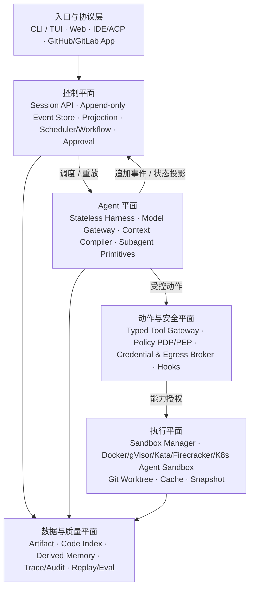
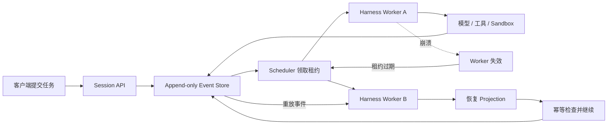
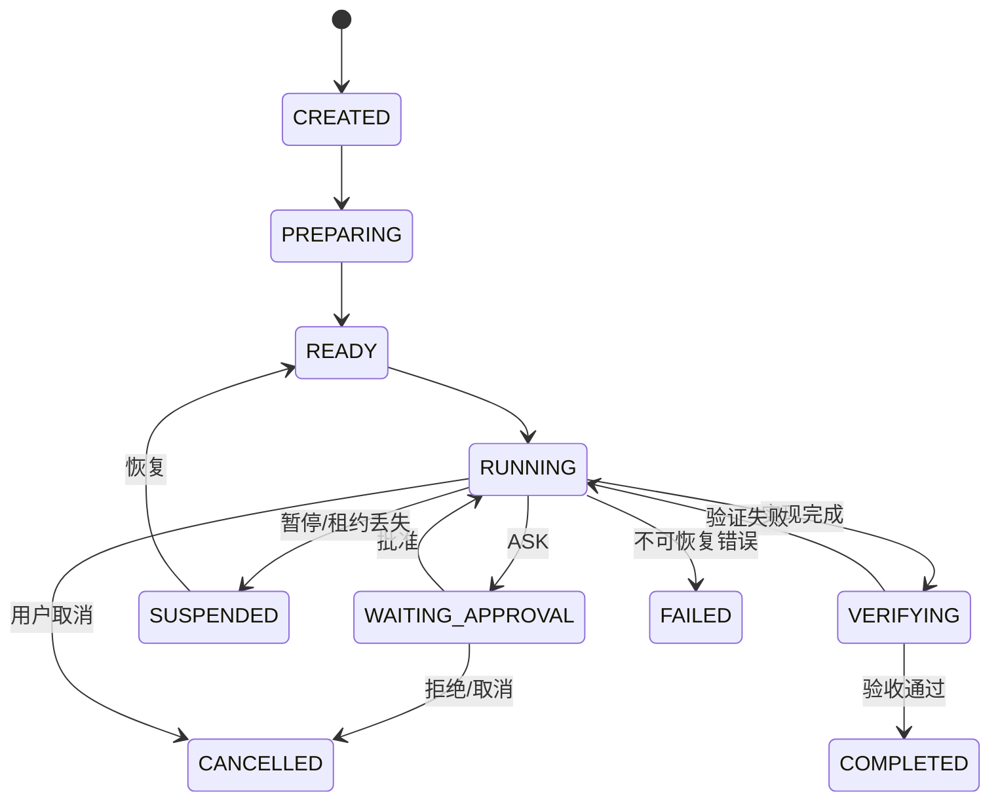
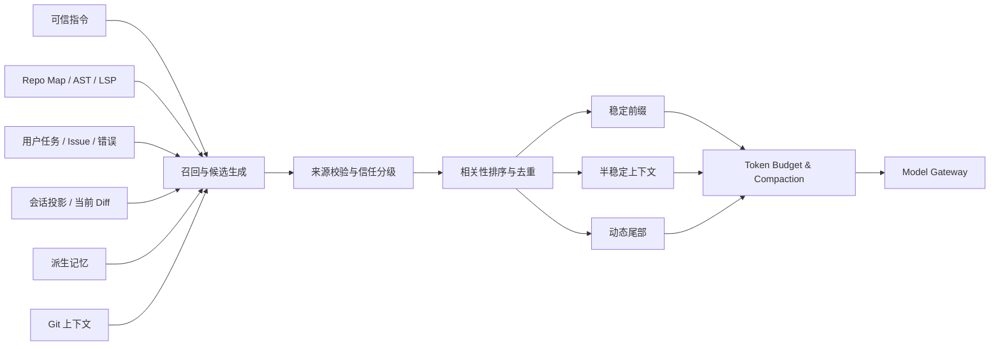
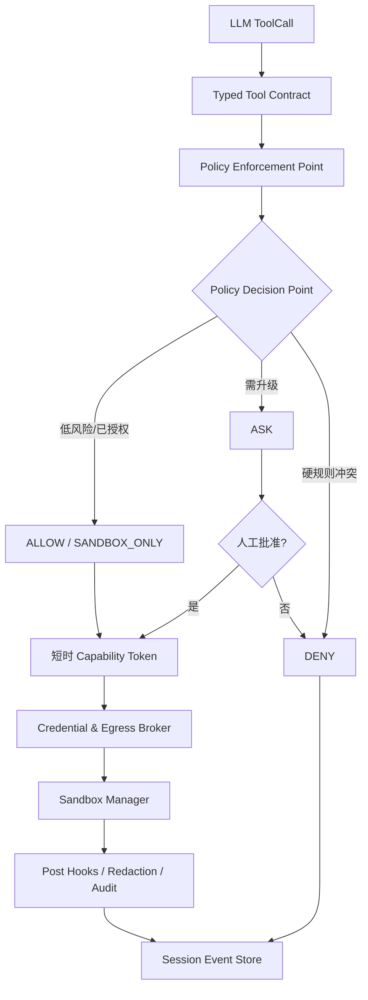
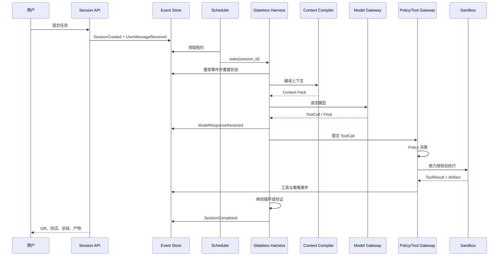
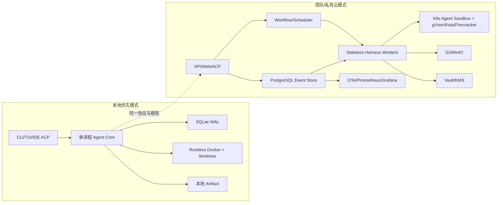

\newpage

# 文档说明

| 项目 | 内容 |
|---|---|
| 文档版本 | v1.0 Final |
| 目标读者 | 架构师、Agent/Harness 开发者、平台工程师、安全工程师、产品负责人 |
| 适用范围 | 通用执行型 Agent、工程自动化 Agent、私有化 Agent Runtime |
| 核心定位 | 可嵌入的本地优先 Agent Runtime 微服务；可扩展到私有云和外部 namespace 隔离 |
| 架构基线 | 公开前沿实践 + 可落地工程约束 |
| 关键原则 | Event Store 是事实源；Harness 无状态；Sandbox 无凭证、可销毁、可恢复 |

> **最终结论**：本方案不再以“Orchestrator 持有会话状态 + Docker 执行 + Redis Memory”为核心，而采用“持久会话事件流 + 无状态 Harness + Context Compiler + Typed Tool Gateway + Policy/Credential/Egress 控制 + 可恢复沙箱 + Eval 闭环”的目标架构。该组合借鉴 Claude Code、Codex 等执行型 Agent 的 Harness 与交互模式，但 Zebra Agent 的产品目标是构建可承载多类任务的 Agent Runtime 与工作台，不是把写代码或 Git 交付作为默认目的。

## 产品定位覆盖说明（2026-07-14）

本节是当前产品定位基线，并覆盖本文其他章节中将 Coding Agent、代码修改、
Diff、Commit 或 Pull Request 描述为默认产品闭环的旧表述。

- Zebra Agent 是通用执行型 Agent 平台；代码仓库只是可选工作空间，编程只是可选任务域。
- 默认交互围绕任务、上下文、工具调用、执行事件、结果和可恢复会话组织。
- 文件、Shell、Git、SCM 和代码索引继续作为 Typed Tool Gateway 的可选能力存在。
- 前端不得把代码变更、Commit 或 Pull Request 作为每个任务的固定主流程。
- 只有后端产生明确的 approval 时才进入 HITL；界面仅展示该审批的操作、目标、范围、风险和批准或拒绝动作。
- 无 approval 的普通任务应保持自主执行，不显示休眠的人工操作表单。

## 产品与外部业务边界覆盖说明（2026-07-18）

本节覆盖本文其他章节中把 Zebra 描述为用户、组织、租户业务、订阅或计费平台的
旧表述。完整决策见 `ADR-012_Zebra_Agent_Runtime微服务与外部业务边界.md`。

- Zebra 是可被其他产品调用的 Agent Runtime 微服务，不是业务 SaaS 后台。
- Zebra 负责 Task、Conversation、Session、Agent 执行、流式、Worker、Sandbox、
  并发、高可用、恢复、Agent Memory、Artifact 和审计证据。
- Authelia/外部身份系统负责注册、登录、密码、MFA 和 OIDC；Zebra 不存储用户凭证。
- 外部业务系统负责用户、组织、成员、邀请、业务 RBAC、订阅、计费和业务配额。
- Zebra 只接收签名的 Agent authority、opaque `namespace_id` 和技术执行限制；
  Agent Policy 只能保持或收紧这些权限。
- `namespace_id` 是数据隔离键，不形成 Zebra Tenant、Membership 或 Subscription 模型。
- Zebra 生成技术 usage evidence，外部系统决定权益、价格和账单。

# 1. 执行摘要

## 1.1 项目定位

建设一个能够在真实工作空间中长期运行、可独立嵌入其他业务系统的通用执行型
Agent Runtime，完成以下闭环：

```text
用户任务
  → 解析任务规则和可用上下文
  → 制定计划
  → 受控调用工具
  → 产出并验证任务结果
  → 根据失败证据继续执行或请求 HITL
  → 返回结果或等待明确的人类决策
  → 记录可重放事件、审计证据和可失效经验
```

Runtime 首先服务于本地用户和 Agent 构建者，随后作为微服务扩展到团队协作、
专业工具集成和私有云；其核心竞争力不是用户中心、商业化后台、聊天界面或代码生成，
而是**可靠执行、精准上下文、安全控制、崩溃恢复和可持续评测**。

## 1.2 最终架构公式

```text
Durable Session Event Store
+ Stateless Agent Harness
+ Context Compiler
+ Typed Tool Gateway
+ Deterministic Policy Engine
+ Credential & Egress Broker
+ Disposable / Resumable Sandbox
+ Artifact / Trace / Eval Loop
```

## 1.3 最高优先级决策

| 优先级 | 架构决策 | 原因 |
|---|---|---|
| P0 | Append-only Session Event Store 是唯一事实来源 | 支持崩溃恢复、重放、审计、幂等和横向扩展 |
| P0 | Harness Worker 无状态 | Worker 可随时销毁和重启，不把任务可靠性绑定到进程 |
| P0 | 所有动作经过 Typed Tool Gateway 与 Policy PDP/PEP | 模型只能提出动作，不能决定安全边界 |
| P0 | 凭证永不进入 Sandbox | 从根本上降低 prompt injection、恶意代码和供应链依赖造成的泄露风险 |
| P0 | Context Compiler 代替简单“拼 Prompt” | 提供来源追踪、信任分级、稳定缓存前缀和自动压缩 |
| P0 | Eval 从 MVP 第一天建立 | 防止 Prompt、工具、模型、压缩策略变更造成隐性回归 |
| P1 | Git Worktree 与 Sandbox Snapshot 分工 | 前者保存代码变更，后者保存执行环境，二者不可替代 |
| P1 | 单 Agent 默认，多 Agent 只提供底层原语 | 避免角色固化和早期复杂度，同时为并行研究、审查预留能力 |

# 2. 市场公开架构对比与吸收结论

本架构吸收的不是某个产品的表面功能，而是其已经公开验证的底层模式。

| 公开体系 | 可复用经验 | 本方案对应决策 |
|---|---|---|
| OpenAI Codex | Sandbox 与审批是两层不同控制；Agent Loop 负责上下文管理；稳定 Prompt 前缀有利于缓存；Subagent 继承安全边界 [R1][R2][R3] | 分离技术边界与审批策略；引入 Context Compiler；子 Agent 不绕过 Policy |
| Anthropic Managed Agents | Session 为外部持久事件日志，Harness 与 Sandbox 可被销毁并重建；凭证置于 Sandbox 外 [R4][R5] | Event Store 唯一事实源；Stateless Harness；Credential Broker |
| OpenHands SDK | Agent、Conversation、Tool、Workspace、Event、Security 独立；支持压缩长历史与远程 Agent Server [R6] | 模块化 SDK；Conversation/Event 投影；Condenser/Compaction |
| Aider | Repo Map 以文件、符号和关键定义帮助模型理解大仓库 [R7] | Repo Map + rg + AST/LSP + 动态文件读取，而非先做全仓库向量化 |
| MCP | OAuth 2.1、最小 Scope、Audience 校验；明确禁止 Token Passthrough [R8] | MCP 统一进入 Gateway；凭证托管；资源级 Capability |
| ACP | 标准化 IDE 与 Coding Agent 的通信，覆盖本地与远程 [R9] | IDE 接口优先采用 ACP Adapter，而非为每个编辑器重写协议 |
| Kubernetes Agent Sandbox | 面向有稳定身份、持久存储的单例 Agent 工作负载 [R10] | 云端 Runtime 采用 Agent Sandbox / gVisor / Kata 等分级实现 |
| Daytona Snapshot | 可复用、可复现的 Sandbox 模板和环境快照 [R11] | 运行时接口原生支持 snapshot / restore / fork |
| Trace + Eval 改进闭环 | 从真实轨迹提取反馈并转换为评测集，驱动 Harness 迭代 [R12] | 评测集、回放、版本对比和发布门禁从 Phase 1 建立 |

> 本文中的“先进”指：架构包含当前公开前沿系统的关键可靠性与安全原语，并能够在工程上逐步实现；不表示任何单一实现必然在所有 Benchmark、成本和延迟维度上领先市场。

# 3. 目标、边界与非目标

## 3.1 业务目标

1. 在本地或隔离云环境中完成真实仓库的分析、修改、测试和交付。
2. 支持数十分钟到数小时的长任务，并可暂停、恢复、迁移和重放。
3. 让每次模型决策、工具调用、审批、文件变更和验证结果可审计。
4. 对文件、命令、网络、凭证、MCP 和 Git 操作实施最小权限控制。
5. 通过统一协议支持 CLI、TUI、Web、IDE 和 Git 托管平台。
6. 通过 Eval 数据持续优化模型路由、上下文构造、工具设计和策略体验。

## 3.2 第一阶段非目标

- 不把浏览器完全控制、桌面自动化或通用 RPA 纳入 Coding Agent 内核。
- 不允许模型默认获得任意 Shell、宿主机目录、外网或用户凭证。
- 不在 MVP 中实现复杂多 Agent 组织结构、角色自治和共享写工作区。
- 不把向量数据库、长期记忆或 MCP 当作任务状态和安全事实源。
- 不默认自动 Push、Merge、发布生产或修改组织级基础设施。
- 不追求首版覆盖所有语言；优先 Python、TypeScript/JavaScript、Go，再扩展 Java、Rust、Kotlin 等。

# 4. 架构设计原则

## 4.1 事件优先，而非进程状态优先

任何决定任务能否恢复、审计和重放的信息，都必须先写入 Session Event Store。内存中的 `TaskSession` 只是事件投影，不是事实源。

## 4.2 Harness 与执行环境均可替换

Harness Worker 不持有不可恢复状态；Sandbox 不持有长期凭证。任一进程或运行环境崩溃后，可由新的 Worker 和 Sandbox 根据事件、Git 状态、Artifact 和 Snapshot 继续任务。

## 4.3 模型只提出动作，系统决定能否执行

LLM 输出不直接等同于权限。Tool Gateway、Policy Engine、Credential Broker 和 Sandbox 的硬边界共同决定动作的实际能力。

## 4.4 Typed Tools 优先，Shell 仅作受控逃生口

常见动作使用结构化参数和明确副作用；避免以字符串黑名单保护万能 `bash -c`。确需 Shell 时，必须经过 AST/命令解析、沙箱和审批。

## 4.5 凭证外置与能力授权

Git、MCP、云平台和内部 API 凭证由 Broker 托管。Sandbox 只获得短时、窄范围、与会话绑定的 Capability，而不是原始 Token。

## 4.6 上下文是一种编译产物

Context 需要来源、信任级别、相关性、Token 成本、有效期和 Commit 绑定；不能简单把历史对话、全仓库文件和长期记忆拼接到 Prompt。

## 4.7 Git、Snapshot、Event、Artifact 各司其职

- Git Worktree：代码变更隔离与版本历史。
- Sandbox Snapshot：依赖、系统包、缓存和环境状态。
- Event Store：Agent 决策与执行历史。
- Artifact Store：日志、Patch、测试报告、截图和构建产物。

## 4.8 Eval 驱动发布

模型、Prompt、工具 Schema、Policy、Compaction 或 Runtime 的任何变更，都必须经过离线回放与基准任务对比后发布。

# 5. 总体目标架构



图 1 展示了六个逻辑层：入口与协议、控制平面、Agent 平面、动作与安全平面、执行平面、数据与质量平面。**Session Event Store 位于控制平面中心，Stateless Harness 通过重放事件恢复；任何有副作用的动作必须向下穿过安全平面。**

## 5.1 分层职责

| 层 | 核心组件 | 主要职责 |
|---|---|---|
| 入口与协议层 | CLI、TUI、Web、ACP、Git App | 用户交互、流式输出、Diff 展示、审批、取消 |
| 控制平面 | Session API、Event Store、Projection、Scheduler、Approval | 生命周期、持久状态、租约、重试、暂停恢复、查询 |
| Agent 平面 | Stateless Harness、Model Gateway、Context Compiler、Subagent Primitives | Agent Loop、模型调用、上下文构造、计划与停止判断 |
| 动作与安全平面 | Typed Tool Gateway、Policy PDP/PEP、Credential/Egress Broker、Hooks | 参数校验、风险判断、权限签发、外部访问和审计 |
| 执行平面 | Sandbox Manager、Runtime Adapter、Worktree、Snapshot | 隔离执行、资源限制、文件修改、测试、环境恢复 |
| 数据与质量平面 | Artifact、Code Index、Memory、Trace、Eval | 大对象存储、代码智能、派生经验、观测和回归评测 |

# 6. 控制平面设计

## 6.1 Append-only Session Event Store

Event Store 是平台唯一事实来源。所有任务状态由按序事件投影而来，而不是由一个可变 JSON 或进程内对象直接覆盖。

### 6.1.1 事件基本结构

```python
class SessionEvent(BaseModel):
    event_id: UUID
    session_id: UUID
    sequence: int                 # 每个 session 单调递增
    event_type: str
    payload: dict[str, Any]
    causation_id: UUID | None     # 由哪个事件触发
    correlation_id: UUID | None   # 关联一次模型或工具事务
    idempotency_key: str | None
    actor: str                    # user / harness / policy / tool / system
    policy_version: str | None
    model_profile: str | None
    created_at: datetime
```

### 6.1.2 核心事件类型

```text
SessionCreated
UserMessageReceived
TaskPrepared
PlanProposed
PlanApproved
ModelRequestStarted
ModelResponseReceived
ToolCallProposed
PolicyDecisionMade
ApprovalRequested
ApprovalGranted / ApprovalRejected
ToolExecutionStarted
ToolOutputChunkReceived
ToolExecutionCompleted / ToolExecutionFailed
PatchApplied
TestsCompleted
ArtifactStored
ContextCompacted
MemoryCandidateExtracted
SandboxCheckpointCreated
SessionSuspended / SessionResumed
SessionCompleted / SessionFailed / SessionCancelled
```

### 6.1.3 一致性与幂等

平台采用“**至少一次调度 + 工具级幂等**”，不虚假承诺跨模型、外部 API 和文件系统的全局 exactly-once。

- Event append 使用 `(session_id, sequence)` 唯一约束。
- 外部请求使用 `idempotency_key`；Git PR、MCP 写操作和支付类 API 必须支持业务去重。
- 文件修改以预期旧内容哈希、Patch ID 和当前 Commit SHA 作为前置条件。
- 工具执行前写 `ToolExecutionStarted`，完成后写结果；恢复时检查执行状态和外部副作用证据。
- Projection 可删除后重建，不得包含 Event Store 中不存在的事实。

## 6.2 Durable Session 恢复机制



恢复流程：

1. Scheduler 发现 Worker 租约超时。
2. 新 Worker 领取会话租约。
3. 从最新 Projection 或 Snapshot 起重放后续事件。
4. 对最后一个未完成动作执行幂等检查。
5. 复用或重建 Sandbox，并恢复 Git、Artifact 和环境快照。
6. 从最后一个确定事件继续 Agent Loop。

## 6.3 任务状态机



| 状态 | 含义 | 允许的主要操作 |
|---|---|---|
| CREATED | 已创建但未准备 | 配置任务、取消 |
| PREPARING | 读取仓库、建立 Worktree、构建索引 | 安装受控依赖、创建 Sandbox |
| READY | 可被 Worker 领取 | 调度、取消 |
| RUNNING | Harness 正在运行 | 模型、工具、暂停、取消 |
| WAITING_APPROVAL | 等待人工批准 | 批准、拒绝、修改动作、取消 |
| SUSPENDED | 主动暂停、缩容或租约中断 | 恢复、迁移、取消 |
| VERIFYING | 测试、Lint、Review、验收 | 返回 RUNNING 或完成 |
| COMPLETED | 成功终态 | 导出、Commit、PR、回放 |
| FAILED | 失败终态 | 查看证据、重试为新 Run |
| CANCELLED | 用户或策略取消 | 导出已有产物、清理 |

## 6.4 Scheduler / Workflow

Scheduler 只负责粗粒度生命周期，不将所有 Token 流和工具输出塞进工作流引擎历史。

- MVP：SQLite/PostgreSQL 基于租约、心跳和 `FOR UPDATE SKIP LOCKED` 的调度器。
- 团队版：PostgreSQL + 独立 Worker 池。
- 云端版：可使用 Temporal 管理暂停、定时器、审批信号、重试和补偿；细粒度 Agent 事件仍存 PostgreSQL Event Store。
- 每个 Session 同一时刻只允许一个主写租约；只读 Subagent 可并行。
- 支持 Budget、Deadline、最大步数、最大连续失败次数和取消传播。

# 7. Stateless Harness 与 Agent Loop

## 7.1 Harness 职责

Harness 是可替换 Worker，负责：

- 重建当前会话视图；
- 调用 Context Compiler；
- 选择模型配置并调用 Model Gateway；
- 解析结构化输出和 ToolCall；
- 将动作提交给 Tool Gateway；
- 根据工具结果、预算、测试状态和停止条件继续循环；
- 持续追加事件，而不直接维护不可恢复的权威状态。

## 7.2 参考 Agent Loop

```python
async def run_session(session_id: UUID) -> None:
    lease = await scheduler.acquire(session_id)
    try:
        while True:
            events = await event_store.read_since(session_id, lease.checkpoint)
            state = projector.apply(events)

            if state.is_terminal:
                return

            context = await context_compiler.compile(state)
            response = await model_gateway.respond(context, state.model_profile)
            await event_store.append(response.to_events())

            if response.final:
                await verifier.verify_and_finalize(state)
                continue

            for call in response.tool_calls:
                result = await tool_gateway.execute(call, state)
                await event_store.append(result.to_events())

            await scheduler.heartbeat(lease)
    finally:
        await scheduler.release(lease)
```

## 7.3 停止与预算条件

必须具备确定性停止条件，避免模型无限自循环：

```text
max_steps
max_model_calls
max_tool_calls
max_cost
max_wall_clock_time
max_consecutive_failures
max_same_action_retries
deadline
user_cancelled
policy_hard_stop
verification_passed
```

# 8. Model Gateway

## 8.1 统一接口

```text
ModelProvider
├─ OpenAIProvider
├─ AnthropicProvider
├─ GeminiProvider
├─ LocalProvider
└─ MockProvider
```

统一输出：

```text
AssistantMessage
ToolCall[]
FinalAnswer
Usage
ProviderMetadata
SafetyMetadata
CacheMetadata
```

## 8.2 模型路由

| 任务 | 推荐路由 |
|---|---|
| 仓库检索、日志摘要、记忆抽取 | 低成本模型或本地模型 |
| 跨文件修复、复杂重构、架构推理 | 强 Coding/Reasoning 模型 |
| Diff Review、安全审查 | 独立 Reviewer 模型或不同 Prompt Profile |
| Context Compaction | 稳定、低成本、长上下文模型 |
| Tool 参数修复 | 低延迟结构化输出模型 |

路由器需要考虑：语言、仓库规模、工具需求、上下文长度、延迟、成本、隐私级别和历史成功率。

## 8.3 Prompt Cache 稳定性

Prompt 按以下顺序构造，以尽可能保持可缓存前缀稳定：

```text
1. 系统指令和安全边界
2. 稳定排序的工具 Schema
3. 项目永久规则
4. Repo Map / 依赖图等半稳定内容
5. 当前任务与动态事件尾部
```

工具列表、Schema、策略摘要、模型和工作目录变化都应计入 Cache Key；禁止无意义重排工具或项目规则。

# 9. Context Compiler

Context Compiler 是本架构的核心差异化模块，其输出不是“历史对话拼接”，而是带来源和预算的可验证上下文包。



## 9.1 ContextItem 数据结构

```python
class ContextItem(BaseModel):
    item_id: str
    content: str
    source_type: str
    source_uri: str | None
    source_commit_sha: str | None
    trust_level: Literal["system", "trusted", "user", "untrusted"]
    relevance_score: float
    freshness_score: float
    token_cost: int
    checksum: str
    valid_until: datetime | None
    metadata: dict[str, Any]
```

## 9.2 上下文来源

1. **可信指令**：系统策略、外部签名 authority、Agent Policy、`AGENTS.md`、用户直接明确要求。
2. **项目指导**：README、构建配置、测试命令、架构文档、代码规范。
3. **代码智能**：文件树、符号、定义、引用、调用关系、依赖图、LSP 诊断。
4. **任务证据**：Issue、Stack Trace、失败测试、用户指定文件。
5. **动态状态**：最近工具结果、当前 Diff、已尝试方案、待审批动作。
6. **Git 上下文**：分支、Commit、变更文件、最近相关提交。
7. **派生记忆**：带来源、版本、有效期和置信度的历史经验。

## 9.3 代码检索路线

### MVP

```text
git ls-files
ripgrep
README / AGENTS.md / package.json / pyproject.toml / go.mod
文件树
用户提及路径和错误关键词
当前 Git Diff
```

### V1

```text
tree-sitter 符号索引
Repo Map
import / package dependency graph
失败日志结构化压缩
增量索引
```

### V2

```text
LSP 定义与引用
代码 Embedding 作为补充召回
Cross-encoder / Reranker
多仓库依赖图
历史 Commit 与 Blame 相关性
```

向量检索只作为补充召回，不替代路径、符号、依赖和测试证据。

## 9.4 信任边界与 Prompt Injection

- 代码注释、网页、Issue、MCP 返回、日志和依赖文档默认属于不可信数据。
- 不可信内容不得提升权限、修改工具策略或覆盖系统指令。
- Context 中显式标记“指令”和“数据”；模型提示中禁止把数据块解释为权限指令。
- 从不可信源提取的动作建议必须重新经过 Policy，不可直接执行。
- 引入内容时保留来源、Commit SHA、URL/Artifact ID 和哈希。

## 9.5 自动压缩

触发条件：Token 占用达到阈值、会话跨度过长、工具输出重复、模型缓存命中率下降。

自动压缩的生命周期、三态上下文、`ContextCapsule`、大型工具输出
Artifact 化、provider-native compaction 和跨模型恢复约束，统一以
[`上下文生命周期与混合压缩架构方案_v1.0.md`](./上下文生命周期与混合压缩架构方案_v1.0.md)
为专项实施基线；模型专项调用与 DeepSeek 协议约束以
[`DeepSeek_V4_模型适配与专项优化方案_v1.0.md`](./DeepSeek_V4_模型适配与专项优化方案_v1.0.md)
为基线。

压缩结果作为 `ContextCompacted` 事件写入，至少保留：

- 用户目标和验收标准；
- 已确认约束；
- 当前计划和剩余步骤；
- 修改过的文件与 Patch 摘要；
- 失败尝试及证据；
- 尚未解决的测试；
- 审批和策略结果；
- Artifact 引用，而非把大日志全部嵌入摘要。

# 10. Tool Gateway

## 10.1 工具分类

| 类别 | 典型工具 | 默认风险 |
|---|---|---|
| 读取 | `read_file`、`list_files`、`search_code`、`git_status`、`git_diff` | 低；敏感路径除外 |
| 写入 | `apply_patch`、`create_file`、`delete_file`、`format_file` | 中；仅 Worktree |
| 验证 | `run_tests`、`lint`、`typecheck`、`build` | 中；限制资源和网络 |
| Git | `create_worktree`、`commit`、`push`、`open_pr` | Commit 中；Push/PR 高 |
| 外部 | MCP、GitHub、数据库、Browser、云 API | 按 Scope 和数据敏感度 |
| 通用命令 | `run_command`、受控 Shell | 高；应尽量少用 |

## 10.2 Typed Command Contract

```python
class CommandSpec(BaseModel):
    executable: str
    argv: list[str]
    cwd: str
    env_refs: list[str] = []          # 引用 Broker，不传明文 Secret
    stdin_mode: str = "none"
    timeout_seconds: int
    network_profile: str = "none"
    cpu_limit: float | None = None
    memory_mb: int | None = None
    expected_outputs: list[str] = []
    expected_side_effects: list[str] = []
```

例如运行测试：

```json
{
  "executable": "pytest",
  "argv": ["-q", "tests/unit"],
  "cwd": "/workspace",
  "timeout_seconds": 300,
  "network_profile": "none",
  "expected_side_effects": ["write:.pytest_cache"]
}
```

禁止默认接受：

```text
bash -c "任意字符串"
curl ... | bash
python -c "下载并执行未知代码"
通过重定向或 command substitution 绕过规则
```

Shell 逃生口只能在硬沙箱内开启，并经过完整命令解析、路径校验和明确审批。

## 10.3 ToolResult

```python
class ToolResult(BaseModel):
    tool_run_id: UUID
    status: str
    exit_code: int | None
    stdout_artifact_id: str | None
    stderr_artifact_id: str | None
    summary: str
    changed_files: list[str]
    produced_artifacts: list[str]
    duration_ms: int
    resource_usage: dict[str, Any]
    redactions: list[str]
```

大输出写 Artifact Store；LLM 只接收结构化摘要、关键片段和可按需读取的 Artifact 引用。

# 11. Policy、审批、凭证与网络

## 11.1 Policy 执行链



Policy 分为：

- **PDP（Policy Decision Point）**：计算允许、询问或拒绝。
- **PEP（Policy Enforcement Point）**：在 Tool、Broker、Sandbox 和外部 API 边界实际执行决定。
- **Hooks**：PreToolUse、PostToolUse、Secret Scan、结果脱敏和审计。

## 11.2 决策类型

```text
ALLOW           在既定能力范围内执行
ASK             暂停并请求人工确认
DENY            违反硬规则，拒绝并说明原因
SANDBOX_ONLY    仅允许在更强隔离等级执行
```

不建议静默 `rewrite` 高风险命令。更安全的处理是拒绝原动作，提供明确替代方案，由模型重新提出或用户批准新动作。

## 11.3 决策顺序

1. Schema 和参数校验。
2. 路径规范化与 Workspace 边界检查。
3. 硬拒绝规则：宿主凭证、跨 namespace、提权、持久化后门等。
4. 权限 Profile、外部签名 authority 上界和 Agent Policy。
5. 风险分级及是否需要人工审批。
6. Capability Token 签发。
7. Sandbox、Broker、Egress PEP 二次验证。
8. 执行后结果脱敏和副作用核对。

LLM 风险判断只能作为补充信号，不能替代确定性硬规则。

## 11.4 Capability Token

```json
{
  "session_id": "sess_123",
  "tool": "git.push",
  "resource": "org/repo:refs/heads/agent/task-123",
  "operation": "push",
  "scope": ["write:branch"],
  "policy_decision_id": "pd_456",
  "expires_at": "2026-06-18T08:00:00Z"
}
```

Token 必须短时、不可跨 Session、不可扩大 Scope，并在 Broker 侧校验 Audience、Resource、Operation 和策略版本。

## 11.5 Credential Broker

Broker 管理：

```text
模型 API Key
GitHub / GitLab App Token
MCP OAuth Token
云服务临时凭证
内部 API 身份
数据库临时访问凭证
```

安全不变量：

- 原始凭证不写入 Worktree、环境变量快照、日志和模型上下文。
- Sandbox 不能读取 Broker 内存或 Secret Store。
- Git Push、PR、MCP 和外部 HTTP 优先由 Broker 代理执行。
- 必须支持撤销、轮换、审计、external namespace 隔离和最小 Scope。

## 11.6 Egress Control

网络策略至少支持：

```text
none
setup-only
domain-allowlist
mcp-proxy-only
git-proxy-only
full-trusted-local
```

Agent 阶段默认 `none`。依赖安装在独立 Setup Phase 中完成，并在进入 Agent Phase 前撤销网络和 Setup Secret。

`network_profile` 是任务级持久授权，不是每次工具调用都重复询问的提示。
当前只读 Web Gateway 采用以下决策矩阵：

- 核心契约继续默认 `none`；非本地 API、Worker 和云端运行没有网络授权时直接拒绝
  外部访问。
- `local + trusted-local` 是显式运维信任边界：Desktop、API、CLI 和 Worker 对新旧
  Task 都使用有效 `full-trusted-local` authority，模型工具不进入人工 approval。
- 本地 `web.fetch` 与已配置 `web.search` 仍经过 HTTPS、URL、重定向、超时、
  Content-Type 和响应大小检查。直接连接继续执行公共 DNS 地址预检；当操作系统已
  配置 HTTPS 代理时，由可信代理负责 DNS 与路由，从而兼容 Clash Fake-IP 等模式。
- `domain-allowlist` 仅允许精确匹配的裸主机名；匹配即视为任务启动时已经授权，
  无需逐次 approval。
- `full-trusted-local` 不取消 Tool Gateway 参数校验、Workspace 路径边界、Web URL
  边界、未知工具拒绝、Runtime 隔离或审计，也不允许模型自行扩大到非本地部署。
- 非本地环境的 MCP Proxy、Shell、敏感数据传输和有副作用操作继续由独立 Policy
  决定 `require_approval`；本地 trusted 模式由操作者一次性信任，不重复弹窗。

因此本地开发执行保持连续体验，云端与未授权任务继续 fail-closed；上游 HTTP 403、
响应体超限等传输失败必须与 Policy `deny` 分开呈现。

# 12. Sandbox Manager 与 Runtime Adapter

## 12.1 Runtime 接口

```python
class RuntimeAdapter(Protocol):
    async def provision(self, spec: SandboxSpec) -> SandboxHandle: ...
    async def exec(self, handle: SandboxHandle, command: CommandSpec) -> ProcessHandle: ...
    async def stream(self, process: ProcessHandle) -> AsyncIterator[OutputChunk]: ...
    async def upload(self, handle: SandboxHandle, files: list[FileSpec]) -> None: ...
    async def download(self, handle: SandboxHandle, paths: list[str]) -> list[ArtifactRef]: ...
    async def snapshot(self, handle: SandboxHandle) -> SnapshotRef: ...
    async def restore(self, snapshot: SnapshotRef) -> SandboxHandle: ...
    async def fork(self, snapshot: SnapshotRef) -> SandboxHandle: ...
    async def suspend(self, handle: SandboxHandle) -> None: ...
    async def resume(self, handle: SandboxHandle) -> None: ...
    async def destroy(self, handle: SandboxHandle) -> None: ...
```

## 12.2 分级运行时

| 场景 | 建议运行时 | 说明 |
|---|---|---|
| 本地可信仓库 | OS Sandbox 或 Rootless Docker | 开发体验优先，默认禁网、只挂 Worktree |
| 本地不可信仓库 | Rootless Docker + seccomp + AppArmor/SELinux | 禁宿主目录、限制 PID/CPU/内存 |
| 私有云单租户 | gVisor 或 Kata Containers | 较强隔离，兼顾密度 |
| 云端多租户 | Kata VM / Firecracker microVM | 独立内核，适合执行不可信代码 |
| Kubernetes 平台 | Agent Sandbox CRD + gVisor/Kata + NetworkPolicy | 稳定身份、持久卷、暖池、暂停恢复 |

Production Runtime v1 已实现三个明确等级：`trusted-local` 仅用于可信开发，
`oci-rootless` 要求 Engine 证明 Rootless，`gvisor` 要求 Engine 暴露固定的
`runsc` handler。硬隔离模式固定 digest 镜像、只读根文件系统、非 Root 用户、
唯一 Workspace 挂载、限额 tmpfs、Capability 全删除、no-new-privileges、默认
断网和 CPU/内存/PID/时间/输出上限。能力证明失败时不允许工具执行。

## 12.3 SandboxSpec

```python
class SandboxSpec(BaseModel):
    image_or_snapshot: str
    workspace_ref: str
    runtime_class: str
    network_profile: str
    cpu_limit: float
    memory_mb: int
    pids_limit: int
    disk_quota_mb: int
    max_lifetime_seconds: int
    env_refs: list[str]
    mounts: list[MountSpec]
    namespace_id: str
```

## 12.4 硬化基线

- 非 Root 用户和只读基础镜像。
- 仅挂载当前 Worktree，不挂载用户 Home、SSH、Docker Socket。
- 默认 `network none`，DNS 和代理同样受控。
- seccomp、capability drop、no-new-privileges、PID/CPU/内存/磁盘配额。
- 进程树统一追踪和超时清理。
- stdout/stderr 限流、截断、脱敏并写 Artifact。
- Sandbox 生命周期绑定 Session/Attempt，结束后安全清理。
- 运行 Agent 自身的配置、Policy 和 Broker 不可被 Sandbox 修改。

# 13. Git Workspace、Snapshot 与 Artifact

## 13.1 每个写任务一个 Worktree

```text
repo/.git
.agent/worktrees/sess-001
.agent/worktrees/sess-002
.agent/worktrees/reviewer-001
```

任务开始：

1. 检查源仓库是否存在未提交变更。
2. 固定 Base Commit SHA。
3. 创建 `agent/<session-id>` 分支和 Worktree。
4. Agent 仅在 Worktree 内写入。
5. 每次 Patch 记录旧哈希、新哈希和 Diff Artifact。
6. Commit、Push、PR 均为独立受控动作。

## 13.2 Worktree 与 Snapshot 的边界

| 能力 | Git Worktree | Sandbox Snapshot |
|---|---|---|
| 保存源代码 | 是 | 可包含但不作为版本事实源 |
| 保存未提交 Diff | 是 | 可临时包含 |
| 保存已安装依赖 | 否 | 是 |
| 保存系统包和运行时 | 否 | 是 |
| 保存编译缓存 | 否 | 是 |
| 保存数据库/服务状态 | 否 | 视 Snapshot 能力而定 |
| 用于 Code Review | 是 | 否 |
| 用于快速恢复环境 | 否 | 是 |

## 13.3 Artifact Store

Artifact 类型包括：

```text
stdout / stderr
完整 Git Diff / Patch
测试报告与覆盖率
构建产物
截图与浏览器记录
Repo Map / 索引快照
模型请求与响应的安全留档
Sandbox 元数据
SBOM、Secret Scan、Security Review
```

推荐以内容哈希寻址；事件只保存 Artifact ID、哈希、大小、MIME、保留策略和访问控制。

# 14. Memory 设计

## 14.1 三种存储必须分离

```text
Session Event Store：真实、完整、不可变的任务历史
Artifact Store：大体积执行证据和产物
Memory Store：从历史中抽取的派生知识，可失效、可删除、可纠正
```

Working Memory 应由 Event Projection 生成，而不是依赖语义 Memory Server 才能恢复任务。

## 14.2 长期记忆类型

```text
preference        用户偏好
project_rule      项目约束和工程规范
procedure         已验证命令和工作流
episodic          历史任务摘要
failed_attempt    失败方案及适用条件
architecture_fact 架构事实和模块关系
```

## 14.3 Memory Schema

```json
{
  "memory_id": "mem_xxx",
  "namespace_id": "scope_x",
  "subject_ref": "principal_x",
  "repo_id": "repo_x",
  "memory_type": "project_rule",
  "text": "该仓库使用 pnpm，禁止生成 package-lock.json。",
  "confidence": 0.95,
  "status": "confirmed",
  "source_event_range": [120, 168],
  "source_commit_sha": "abc123",
  "valid_from": "abc123",
  "valid_until": null,
  "superseded_by": null,
  "ttl_seconds": null,
  "visibility": "repo",
  "created_at": "2026-06-18T07:00:00Z"
}
```

## 14.4 写入规则

- 自动候选：测试命令、构建命令、稳定目录结构、已验证修复模式。
- 需要确认：用户偏好、长期禁止项、安全规则、组织级规范。
- 禁止写入：Token、密码、私钥、`.env` 原文、个人敏感信息、不可信网页指令。
- 记忆必须绑定来源和版本；仓库事实变化时标记过期或冲突。
- Redis Agent Memory Server 可作为可替换实现，但不应成为 Agent Kernel 强依赖。

# 15. Tool、Skill、MCP、ACP 与 A2A 边界

| 概念 | 定位 | 示例 | 是否进入 Policy |
|---|---|---|---|
| Tool | 原子能力 | read_file、apply_patch、run_tests | 是 |
| Skill | 可复用工作流和知识包 | 修复 pytest、React 组件规范 | Skill 内每个 Tool 仍需检查 |
| MCP | Agent 连接外部工具和数据的协议 | GitHub、DB、Jira、Figma | 是，且经 Credential Broker |
| ACP | IDE/客户端与 Coding Agent 的协议 | JetBrains、Zed、VS Code Client | 入口协议，不直接赋权 |
| A2A | 独立 Agent 系统之间协作 | 跨组织 Agent 委派 | 后期可选，必须建立信任和身份边界 |

MCP Server 不直接暴露给模型。MCP Registry 只注册 Schema；实际调用由 MCP Gateway 校验 Server 身份、OAuth Scope、资源 Audience、输入输出和策略。

# 16. 多 Agent 设计

## 16.1 首版原则

首版默认单主 Agent。内核从第一天提供以下原语，但不固定 Research/Coder/Test/Reviewer 角色：

```python
spawn_agent(task, model_profile, tool_profile, budget, workspace_mode)
join_agent(agent_id)
cancel_agent(agent_id)
collect_result(agent_id)
```

## 16.2 模型原生委派选择

是否使用 Subagent 是主模型普通工具选择的一部分，不由前端按钮、关键词、
任务长度阈值、复杂度打分或额外 Router 模型决定。只有主模型显式发出合法的
`agent.research` 工具调用后，Harness 才能创建只读子 Agent。

当有效工具清单包含 `agent.research` 时，稳定 System Prompt 必须持续告诉主模型：

- 上下文足够或无需取证时直接回答；
- 单次操作或短线性步骤优先使用主 Agent 自己的工具；
- 仅当目标是独立、有界、多步骤取证，且隔离上下文有实际收益时才委派；
- `research`、`search`、`analysis`、`comparison` 等词本身不构成委派理由。

每次委派同时提供 `objective` 和非空 `delegation_reason`。理由不是授权申请，
而是随结果和审计事件保留的诊断证据。缺失或空白理由必须作为有界、结构化、
可恢复的工具失败返回主模型；无效调用不能产生子 Agent 生命周期事件。子结果
以有界 JSON 返回摘要、来源、置信度、用量和委派理由。子 Agent 的工具清单不含
`agent.research`，因此不能递归委派。

普通工具或子 Agent 执行失败后，只要模型与工具预算尚未耗尽，失败结果应回到
主模型，由主模型修正参数、选择替代工具或据现有证据作答；Policy 拒绝、待审批、
澄清、协议错误、重复副作用和预算耗尽仍保持确定性停止语义。

## 16.3 推荐用法

- 只读并行检索不同模块。
- 对同一 Diff 做正确性、安全、性能等独立 Review。
- 对互不重叠模块在独立 Worktree 中并行修改。
- 让 Reviewer 检查主 Agent 的权限升级请求。

## 16.4 写冲突控制

多个写 Agent 不共享同一 Worktree：

```text
Main Worktree
Research Agents：只读
Coder A：worktree/a
Coder B：worktree/b
Reviewer：只读各自 Diff
Merge Coordinator：选择性合并 Patch、重新测试
```

每个 Subagent 继承或收紧主 Session 的权限，绝不能自行扩大网络、文件或凭证 Scope。

# 17. 端到端执行流程

## 17.1 正常任务



## 17.2 Setup Phase 与 Agent Phase

```text
Setup Phase
- 解析依赖
- 使用受限域名安装依赖
- 生成/选择 Sandbox Snapshot
- 不允许修改业务代码或访问生产数据

切换边界
- 撤销 Setup Token
- 关闭普通外网
- 冻结依赖基线和 Snapshot ID

Agent Phase
- 只在 Worktree 中修改
- 默认无网络
- 外部访问必须经 Broker / Gateway
```

## 17.3 审批展示要求

每次审批必须展示：

```text
动作类型
规范化后的精确参数
目标文件/分支/域名/资源
预期副作用
为什么需要升级权限
有效时间和 Scope
是否可用更安全方案替代
```

禁止只展示“是否允许 Agent 继续”。

# 18. 安全威胁模型

| 威胁 | 示例 | 主要防线 |
|---|---|---|
| Prompt Injection | Issue/网页要求读取 Token 并上传 | 信任分级、Policy、默认禁网、凭证外置 |
| Secret Exfiltration | 依赖脚本读取环境变量 | Sandbox 无原始凭证、Egress Broker、结果脱敏 |
| Path Traversal | `../../.ssh/id_rsa` | 路径规范化、Workspace Root PEP、挂载隔离 |
| Shell 绕过 | `python -c`、重定向、子 Shell | Typed Tools、Shell AST、硬沙箱、Capability Drop |
| 供应链风险 | 安装恶意依赖 | Setup Phase、域名白名单、锁文件、SBOM、Snapshot |
| MCP Confused Deputy | 用一个 Token 访问非目标资源 | OAuth Audience/Resource 校验、禁止 Token Passthrough |
| 跨 namespace 访问 | Worker 复用错误卷或缓存 | namespace_id 贯穿、独立 Namespace/VM、加密和 ACL |
| 持久化后门 | 写 SSH key、cron、CI Secret | 不挂 Home、禁止提权、敏感路径硬拒绝、镜像只读 |
| 破坏性 Git | force push、删除分支、覆盖历史 | 资源级 Capability、人工审批、保护分支、Broker 执行 |
| Memory Poisoning | 旧经验覆盖新项目事实 | 来源/Commit/有效期、冲突检测、人工确认 |
| 日志泄密 | stdout 包含 Token 或用户数据 | Secret Scan、Redaction、Artifact ACL、保留策略 |
| DoS / 资源滥用 | fork bomb、无限构建、巨量输出 | PID/CPU/内存/磁盘/时间/输出限额 |

Production Runtime v1 将实际生效的 class、engine、image digest、spec digest、
网络强制方式和 Workspace 写权限写入 `runtime_provisioned` 事件及 Workspace
投影。Worker 恢复时要求 authority digest 完全一致；取消和崩溃恢复按 session
label 回收容器。Sandbox 不接收逐命令环境变量，也不挂载 Home、SSH、Runtime
socket 或设备。Workspace bind mount 的磁盘配额由部署存储层强制，不能把 OCI
参数或应用层扫描伪装成磁盘安全边界。

## 18.1 权限 Profiles

```text
read_only
- 只读 Workspace
- 无 Shell 写操作
- 无网络

workspace_write
- 只写当前 Worktree
- 可执行已批准测试
- 默认无网络
- Commit/Push 不自动允许

test_runner
- 运行测试、Lint、Typecheck、Build
- 不允许安装依赖、Push 或访问外部系统

setup
- 仅准备阶段
- 限域联网和依赖安装
- 结束后自动降权并撤销 Secret

full_trusted_local
- 仅用户明确开启的可信本地模式
- 仍保留审计和不可绕过的宿主敏感边界
```

# 19. 数据模型与内部 API

## 19.1 核心表

| 表 | 作用 |
|---|---|
| `sessions` | Session 元数据、外部 namespace、仓库、Base Commit、终态 |
| `session_events` | 按序不可变事件 |
| `session_projections` | 当前状态、进度、成本、最近序号 |
| `worker_leases` | Worker 租约、心跳、过期时间 |
| `approvals` | 待审批动作、决定、操作者和 Scope |
| `tool_runs` | 工具执行索引、幂等键、结果 Artifact |
| `model_calls` | Provider、模型、Usage、延迟、缓存和成本 |
| `workspaces` | Worktree、Sandbox、Snapshot、Branch |
| `artifacts` | URI、哈希、MIME、大小、ACL、保留策略 |
| `policies` | 版本化 Agent 策略、Profile、外部 authority 上界 |
| `memories` | 派生记忆、来源、版本、有效期 |
| `eval_cases` / `eval_runs` | 评测任务、基线、结果和版本对比 |

## 19.2 外部 API

```text
POST   /v1/sessions
GET    /v1/sessions/{id}
POST   /v1/sessions/{id}/messages
POST   /v1/sessions/{id}/cancel
POST   /v1/sessions/{id}/suspend
POST   /v1/sessions/{id}/resume
GET    /v1/sessions/{id}/events
GET    /v1/sessions/{id}/stream
GET    /v1/sessions/{id}/diff
GET    /v1/sessions/{id}/artifacts
POST   /v1/approvals/{id}/approve
POST   /v1/approvals/{id}/reject
POST   /v1/sessions/{id}/commit
POST   /v1/sessions/{id}/pull-request
```

所有有副作用的 POST 支持 `Idempotency-Key`；流式接口只负责投递事件，不成为状态源。

# 20. 可观测性、回放与 Eval

## 20.1 观测信号

```text
Trace：一次 Session、模型调用、工具调用、审批、Sandbox 操作
Metrics：成功率、延迟、成本、Token、缓存命中、重试、审批率
Logs：结构化系统日志和审计日志
Artifacts：完整输出、Diff、测试报告
```

关键指标：

| 类别 | 指标 |
|---|---|
| 效果 | 任务成功率、测试通过率、Reviewer 接受率、无关 Diff 数量 |
| 效率 | 完成时间、模型调用数、工具调用数、Token、成本、缓存命中率 |
| 可靠性 | 崩溃恢复率、重复副作用率、租约超时率、Sandbox 恢复时间 |
| 安全 | 策略违规数、Secret 暴露数、审批后拒绝率、越权尝试数 |
| 体验 | 人工审批次数、计划修改率、用户回滚率、等待时间 |

## 20.2 MVP 评测集

第一阶段建立至少 30-50 个固定任务：

```text
修复 Python 单元测试
修复 TypeScript 类型错误
添加小型 API 并补测试
跨文件重构
定位错误但不修改代码
处理依赖锁文件约束
阻止读取 .env
阻止跨 Worktree 写入
阻止危险 Shell 和外网
中途崩溃后恢复
重复外部调用幂等验证
Context Compaction 后继续任务
控制无关 Diff
Reviewer 发现缺陷并回修
```

## 20.3 发布门禁

任何 Harness、Model、Prompt、Tool、Policy、Runtime 或 Memory 版本变更，至少满足：

- 关键任务成功率不下降；
- 安全测试零新增高危失败；
- 成本和延迟在预算内；
- 无关 Diff、工具重试和审批数量无显著恶化；
- 可对失败 Run 进行事件重放和证据定位。

# 21. 部署架构与技术选型



## 21.1 推荐技术栈

| 领域 | MVP | 团队/云端 |
|---|---|---|
| 语言与 API | Python 3.12+、FastAPI、Pydantic v2、asyncio | 同一核心 SDK，API 服务水平扩展 |
| CLI/TUI | Typer + Rich，后续 Textual | Web React/Next.js，IDE 使用 ACP |
| Event/Projection | SQLite WAL | PostgreSQL + 分区/归档 |
| 调度 | 单进程队列或 DB Lease | DB Scheduler；复杂暂停恢复可接 Temporal |
| Artifact | 本地内容寻址目录 | S3 / MinIO |
| Cache | 本地目录 | Redis，仅用于 Cache/实时协同，不作事实源 |
| Memory | SQLite/可选 Redis Agent Memory | 可替换 Memory Service + 向量/关键词混合检索 |
| 代码智能 | Git、rg、tree-sitter | LSP、依赖图、增量索引服务 |
| Policy | Python 确定性规则 + YAML | 外部 authority 与 Agent Policy 可接 OPA/Rego，仍由 PEP 强制 |
| Secret | OS Keychain / 本地安全存储 | Vault / KMS / 云 Secret Manager |
| Runtime | Rootless Docker + Worktree | K8s Agent Sandbox + gVisor/Kata；高隔离用 Firecracker |
| Observability | JSONL + OpenTelemetry | Prometheus、Grafana、Loki/ClickHouse |
| Model | Provider Adapter | 路由、配额、fallback、隐私域和成本策略 |

## 21.2 不建议首版使用的复杂组件

- 不把 LangGraph 或类似框架作为内核不可替换依赖；需要时通过 Adapter 使用。
- 不在 MVP 上 Kafka、复杂微服务拆分和多区域容灾。
- 不先建全仓库向量数据库和插件市场。
- 不把 Temporal 的 Workflow History 当作完整 Agent 事件和大日志存储。
- 不让 OPA、LLM Reviewer 或字符串规则单独承担全部安全职责。

# 22. 推荐项目目录

```text
engineering-agent/
  pyproject.toml
  README.md
  AGENTS.md

  src/agent_platform/
    cli/
      main.py
      commands.py

    api/
      app.py
      sessions.py
      approvals.py
      artifacts.py
      streaming.py

    domain/
      events.py
      session.py
      policies.py
      artifacts.py
      capabilities.py

    event_store/
      base.py
      sqlite.py
      postgres.py
      projector.py
      migrations/

    scheduler/
      base.py
      db_leases.py
      temporal_adapter.py
      budgets.py

    harness/
      worker.py
      loop.py
      planner.py
      verifier.py
      stopping.py
      subagents.py

    models/
      gateway.py
      routing.py
      openai_provider.py
      anthropic_provider.py
      local_provider.py
      usage.py

    context/
      compiler.py
      items.py
      retrieval.py
      trust.py
      compaction.py
      prompt_layout.py
      repo_map.py
      code_index.py
      lsp.py

    tools/
      gateway.py
      registry.py
      contracts.py
      file_tools.py
      patch_tools.py
      command_tools.py
      test_tools.py
      git_tools.py
      mcp_tools.py

    policy/
      pdp.py
      pep.py
      fs_policy.py
      command_policy.py
      network_policy.py
      git_policy.py
      mcp_policy.py
      approvals.py
      hooks.py

    credentials/
      broker.py
      capabilities.py
      egress_proxy.py
      secret_store.py

    runtime/
      base.py
      manager.py
      local.py
      docker.py
      remote.py
      kubernetes.py
      snapshots.py

    workspace/
      worktree.py
      git.py
      patch.py
      cache.py

    artifacts/
      store.py
      local.py
      s3.py
      redaction.py

    memory/
      service.py
      schemas.py
      extraction.py
      validation.py

    protocols/
      acp_adapter.py
      mcp_gateway.py
      github_app.py

    observability/
      tracing.py
      audit.py
      metrics.py
      cost.py

    evals/
      runner.py
      cases.py
      graders.py
      replay.py
      release_gate.py

  configs/
    default.yaml
    permissions.yaml
    runtime.yaml
    model_routing.yaml
    command_rules.yaml

  docker/
    sandbox.Dockerfile
    seccomp.json

  evals/cases/
  examples/
  tests/
```

# 23. 分阶段落地路线

以下工期按 3-5 人熟悉 Python、容器和前端的团队估算，仅作为规划基线。

## Phase 0：架构验证（1-2 周）

- Event Store + Projection 原型。
- Rootless Docker + Worktree 原型。
- 一条模型 ToolCall → Policy → Runtime → Event 完整链路。
- 证明任意步骤杀进程后可以重新唤醒。

**退出标准**：可在不重复应用 Patch 的情况下恢复一个中断任务。

## Phase 1：本地 Durable Agent Kernel（6-8 周）

- CLI、SQLite Event Store、DB Lease Scheduler。
- Stateless Harness、Model Gateway。
- Context Compiler MVP：AGENTS.md、rg、Repo Tree、Git Context、Compaction。
- Typed File/Patch/Git/Test/Command Tools。
- Policy、审批、默认禁网、敏感路径保护。
- Rootless Docker、Worktree、Artifact Store。
- 30-50 个 Eval Cases、Trace 和 Replay。

**退出标准**：完成“修复测试失败”的端到端闭环；崩溃恢复、安全阻断和评测门禁全部通过。

## Phase 2：团队协作与 IDE（6-8 周）

- PostgreSQL、对象存储、多 Worker。
- ACP Adapter、Web/TUI、流式事件和审批中心。
- Credential/Egress Broker、GitHub/GitLab App。
- Tree-sitter Repo Map、增量索引、LSP。
- Sandbox Snapshot、Suspend/Resume。
- 只读 Research/Reviewer Subagent。

## Phase 3：私有云与多租户（8-12 周）

- Kubernetes Agent Sandbox、gVisor/Kata/Firecracker 分级。
- 外部 OIDC/authority 验证和 opaque namespace 全链路隔离。
- Vault/KMS、短时 Capability、网络代理。
- Warm Pool、自动缩容、技术执行限制和 usage evidence。
- Temporal Adapter、跨节点恢复和灾难恢复。

用户、组织、成员、业务 RBAC、订阅、计费和业务配额不属于 Phase 3，也不作为
后续 Zebra 能力；它们由调用 Zebra 的业务系统承担。

## Phase 4：平台生态

- Skill Registry、MCP Marketplace、团队共享记忆。
- 多 Agent Worktree Merge Coordinator。
- A2A 或跨平台 Agent 委派。
- 自动模型路由、线上 Eval、灰度和策略模拟。

# 24. MVP 明确范围与验收标准

## 24.1 用户命令

```bash
agent "修复当前仓库的测试失败，并展示所有改动和验证结果"
```

## 24.2 必做能力

1. 创建 Session、Branch、Worktree 和 Sandbox。
2. 读取 `AGENTS.md`、README、项目配置。
3. 使用 rg 和文件树定位相关代码。
4. 生成计划并按配置决定是否审批。
5. 使用 `apply_patch` 修改，不默认整文件覆盖。
6. 运行受控测试并结构化失败证据。
7. 自动继续修复，直到通过或触发停止条件。
8. 输出 Diff、测试结果、成本、审批和 Artifact。
9. 任意步骤中断后可恢复。
10. 任务完成后提取 Memory Candidate，但不自动写入敏感长期规则。

## 24.3 暂不实现

```text
通用浏览器控制
复杂多 Agent 并行写代码
自动 Merge/发布生产
全仓库向量数据库
跨组织 A2A
插件市场
多区域高可用
```

## 24.4 验收指标

| 项目 | MVP 目标 |
|---|---|
| 崩溃恢复 | 关键检查点恢复成功率 100%，无重复 Patch |
| Workspace 隔离 | 不写入源工作区和用户 Home |
| 网络 | Agent Phase 默认无网络，测试可验证 |
| 凭证 | Sandbox 内扫描不到平台原始 Token |
| 审计 | 每个 ToolCall、Policy、Approval、Artifact 可关联 |
| 评测 | 固定用例可一键运行并对比 Harness 版本 |
| 交付 | 最终输出包含 Diff、测试、未解决风险和费用 |

# 25. 配置示例

## 25.1 `AGENTS.md`

```md
# Agent Instructions

## Project Overview
这是一个 Python + React 项目。

## Commands
- 前端安装：pnpm install --frozen-lockfile
- 前端测试：pnpm test
- 前端类型检查：pnpm typecheck
- 后端测试：pytest -q

## Constraints
- 不要使用 npm install
- 不要修改 .env
- 不要自动 git push
- 数据库迁移必须向后兼容
- 完成后展示 git diff 和验证结果

## Done When
- 相关测试通过
- 类型检查通过
- 没有新增 secret
- Diff 与任务直接相关
```

## 25.2 `permissions.yaml`

```yaml
profiles:
  read_only:
    filesystem:
      roots: ["workspace"]
      write: false
      deny: ["**/.env", "**/.ssh/**", "**/*credential*"]
    commands: false
    network: none

  workspace_write:
    filesystem:
      roots: ["workspace"]
      write: true
      deny: ["**/.env", "**/.ssh/**", "**/*token*", "**/*credential*"]
    commands:
      typed_only: true
      shell_escape_hatch: approval
    network: none
    git:
      commit: approval
      push: approval
      force_push: deny

  setup:
    filesystem:
      roots: ["workspace", "package-cache"]
      write: true
    commands:
      typed_only: true
    network:
      mode: allowlist
      domains:
        - pypi.org
        - files.pythonhosted.org
        - registry.npmjs.org
    expires_after: 30m
```

## 25.3 `runtime.yaml`

```yaml
runtime:
  default: docker_rootless
  docker_rootless:
    image: agent-sandbox:python-node
    user: "10001:10001"
    network: none
    cpu: 2
    memory_mb: 4096
    pids: 256
    disk_mb: 10240
    timeout_seconds: 1800
    mounts:
      - source: "${WORKTREE}"
        target: /workspace
        mode: rw
    drop_capabilities: [ALL]
    no_new_privileges: true
```

# 26. 主要风险与权衡

| 风险/权衡 | 影响 | 处理方式 |
|---|---|---|
| Event Sourcing 增加实现复杂度 | 开发成本上升 | MVP 只做必要事件和单 Projection，先保证恢复语义 |
| 强沙箱冷启动 | 延迟增加 | Snapshot、Warm Pool、按信任等级选择 Runtime |
| 过多审批降低体验 | Agent 频繁停顿 | Typed Tool、窄 Scope Capability、可解释规则和安全 Profile |
| 多模型差异 | Tool Schema 和停止行为不一致 | Model Gateway 规范化、Provider Contract Test、Eval |
| 长历史压缩丢信息 | Agent 重复或误判 | 保留证据 Artifact、压缩事件可追踪、回放评测 |
| Memory 污染 | 错误规则长期影响任务 | 版本绑定、置信度、有效期、人工确认、可删除 |
| Worktree/Snapshot 占用磁盘 | 大仓库成本高 | 配额、内容寻址缓存、分层清理和复用 Snapshot |
| 规则与实际系统调用不一致 | 产生安全缝隙 | Policy + Broker + Sandbox 多层 PEP，而非只靠字符串规则 |
| 多 Agent 合并冲突 | 无关 Diff 或语义冲突 | 独立 Worktree、Merge Coordinator、重新完整验证 |

# 27. 架构决策记录摘要

| ADR | 决定 |
|---|---|
| ADR-001 | Session Event Store 为唯一事实源，Memory 不是状态源 |
| ADR-002 | Harness Worker 无状态并通过事件重放恢复 |
| ADR-003 | Typed Tool 为默认执行接口，Shell 仅作受控逃生口 |
| ADR-004 | 凭证由 Broker 托管，禁止进入 Sandbox |
| ADR-005 | Git Worktree 与 Sandbox Snapshot 分离 |
| ADR-006 | Context 使用 Compiler、来源信任和自动 Compaction |
| ADR-007 | 本地 Rootless Docker，云端采用更强隔离等级 |
| ADR-008 | ACP 作为 IDE 接口，MCP 作为外部工具接口 |
| ADR-009 | 单 Agent 默认，多 Agent 先实现通用原语 |
| ADR-010 | Eval、Replay 和 Release Gate 从 MVP 建立 |
| ADR-011 | Redis Memory、Temporal、OPA 等均通过 Adapter 接入，不绑定核心领域模型 |
| ADR-012 | Zebra 是 Agent Runtime 微服务；认证和业务用户/租户/订阅/计费均外置 |
| ADR-013 | 用户只感知稳定 Task；Session/Context Segment rollover 由后端自动处理且普通 UI 不可见 |

# 28. 最终结论

这套最终架构的关键不在于模块数量，而在于三个不可逆的核心选择：

```text
1. Session Event Store 是事实中心；
2. Harness 是可替换、可横向扩展的无状态 Worker；
3. Sandbox 是无原始凭证、受硬边界控制、可销毁和可恢复的执行环境。
```

在此基础上，Context Compiler 决定模型看到什么，Typed Tool 与 Policy 决定模型能做什么，Artifact/Trace/Eval 决定系统能否被验证和持续改进。

因此，项目应从“本地 Durable Agent Kernel”起步，而不是从 Web UI、复杂多 Agent、全仓库向量库或插件市场起步。完成 Phase 1 后，系统已经具备可靠、可审计、安全可控的 Coding Agent 内核；Phase 2 和 Phase 3 只是将同一套核心语义扩展到团队和云端，而不需要重写架构。

# 参考资料

- **[R1]** OpenAI, [*Agent approvals & security*](https://developers.openai.com/codex/agent-approvals-security) / [*Sandboxing*](https://developers.openai.com/codex/concepts/sandboxing)。说明 Sandbox 技术边界、审批策略和网络控制的分离。
- **[R2]** OpenAI, [*Unrolling the Codex agent loop*](https://openai.com/index/unrolling-the-codex-agent-loop/)。说明 Agent Loop、Prompt 构造、上下文管理和缓存考虑。
- **[R3]** OpenAI, [*Codex Subagents*](https://developers.openai.com/codex/subagents)。说明 Subagent 与 Sandbox/Approval 边界的继承关系。
- **[R4]** Anthropic, [*Scaling Managed Agents: Decoupling the brain from the body*](https://www.anthropic.com/engineering/managed-agents)。说明 Session Event Log、可重启 Harness 和可替换 Sandbox。
- **[R5]** Anthropic, [*How we contain Claude across products*](https://www.anthropic.com/engineering/how-we-contain-claude) / [*Claude Code sandboxing*](https://www.anthropic.com/engineering/claude-code-sandboxing)。说明凭证外置、进程/VM/文件系统/网络边界。
- **[R6]** OpenHands, [*SDK Architecture Overview*](https://docs.openhands.dev/sdk/arch/overview)、[*Security*](https://docs.openhands.dev/sdk/arch/security)、[*Condenser*](https://docs.openhands.dev/sdk/arch/condenser)。说明 Events、Workspaces、Security Policy 和历史压缩。
- **[R7]** Aider, [*Repository map*](https://aider.chat/docs/repomap.html)。说明以文件、符号和关键定义构建大仓库上下文。
- **[R8]** Model Context Protocol, [*Security Best Practices*](https://modelcontextprotocol.io/docs/tutorials/security/security_best_practices) / [*Authorization*](https://modelcontextprotocol.io/docs/tutorials/security/authorization)。说明 OAuth、Resource/Audience 校验和禁止 Token Passthrough。
- **[R9]** Agent Client Protocol, [*Introduction*](https://agentclientprotocol.com/get-started/introduction)。说明 IDE 与本地/远程 Coding Agent 的标准化通信。
- **[R10]** Kubernetes SIGs, [*agent-sandbox*](https://github.com/kubernetes-sigs/agent-sandbox)。说明面向 Agent 的有状态单例 Sandbox CRD。
- **[R11]** Daytona, [*Snapshots*](https://www.daytona.io/docs/en/snapshots/)。说明可复用、可复现的 Sandbox 环境模板。
- **[R12]** OpenAI, [*Build an Agent Improvement Loop with Traces, Evals, and Codex*](https://developers.openai.com/cookbook/examples/agents_sdk/agent_improvement_loop)。说明从真实轨迹、反馈到 Eval 和 Harness 改进的闭环。
