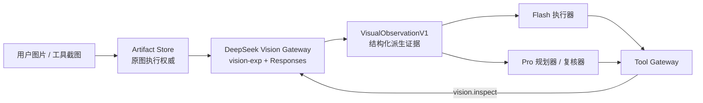

# Zebra Agent DeepSeek 视觉双通道多模态架构方案 v1.0

## 1. 文档状态

| 字段 | 值 |
|---|---|
| 状态 | 方案设计与供应商只读实测完成；任务已登记为 `DS-VIS-*`，尚未开始实现 |
| 调研基线 | 2026-08-25（现有 DeepSeek 凭证只读实测 + 官方文档核对） |
| 评审校准 | 2026-08-25 多轮闭环评审已校准：事件/摄取/预算/重放、统一出境、Files 耐久副作用、authority-scope 身份、非 system 证据、模态 fail-closed、派生 retention、净化图/资源背压、request/attempt 单飞计费、模型失败/unknown 终态与 Artifact-backed 视觉工具结果均已固化 |
| 适用范围 | Cloud Agent 与 Local Runtime 的图片输入、视觉分析与多模态证据链 |
| 目标读者 | Model Gateway、Harness/编排、Artifact、Policy、API、Eval 维护者 |
| 上位约束 | 最终架构 v1.0、ADR-012、`DeepSeek_V4_模型适配与专项优化方案_v1.0.md`、`AGENT_TASKS.md`、`PROGRESS.md` |
| 模型边界 | DeepSeek-only：`vision-exp` 视觉通道 + `flash/pro` 文本通道；不引入 GPT、Claude、Qwen，不建设多供应商兼容层 |
| 交付线 | 所有依赖统一指向 `cloud-agent` delivery line，不使用模糊的"合入主线"表述 |

本方案不改变平台不变量：模型只能提出动作，Policy 和 Tool Gateway 决定动作能否
执行；Session Event Store 仍是耐久状态源；Harness Worker 保持无状态可恢复；
Provider 差异由 Integration Adapter 吸收，不反向污染 `agent-core`；模型、Prompt、
Schema 与路由变化必须经过 Eval。

## 2. 结论

不把整个 Cloud Agent 切换到 `deepseek-v4-flash-vision-exp`，而是建设 DeepSeek-only
的双通道多模态架构：

1. `vision-exp` 专门把图片转换成可追溯的结构化视觉证据（`VisualObservationV1`）。
2. `deepseek-v4-flash` / `deepseek-v4-pro` 继续负责工具执行、规划与复核。
3. 不引入 GPT、Claude、Qwen，也不建设多供应商兼容层；Core 只保留必要的中性契约，
   部署与模型目录全部只支持 DeepSeek。

## 3. 已确认的供应商能力

### 3.1 只读实测（2026-08-25）

- `/models` 已返回 `deepseek-v4-flash`、`deepseek-v4-pro`、
  `deepseek-v4-flash-vision-exp`。
- Responses API 图片识别成功。
- 图片输入配合 Responses `text.format` JSON Schema 约束输出成功；
  Zebra 仍在本地严格验证结果合同。
- 图片输入配合 `reasoning.effort=high` 成功。
- 一个内容异常的极小 PNG 被服务端拒绝——说明 Zebra 必须校验图片实际内容，
  不能只信任文件扩展名或 MIME 声明。

### 3.2 官方文档确认

- 图片使用 `input_image` 内容块。
- 图片支持 URL、base64 data URL、Files API `file_id` 三种来源。
- 图片可以来自用户消息，也可以来自工具调用结果。
- 当前只有 `deepseek-v4-flash-vision-exp` 真正处理图片。Responses
  使用其他模型时可能把 `input_image` 替换为占位文本，因此 Zebra
  必须在网络 I/O 之前根据 profile 的 `input_modalities` 本地拒绝误路由，
  不能把 fail-closed 委托给 Provider。
- Responses API 是无状态的，不支持依赖 `previous_response_id` 恢复会话；
  这与 Zebra 无状态 Worker 模型一致，会话恢复仍走本地事件重建。
- 使用 `file_id` 时 `detail` 参数会被忽略。
- 图片精度通过 `detail` 控制；Provider 接受 `low`、`high`、`original`、
  `auto`。Zebra P0 主动只开放 `low`/`original` 两档，API 不存在区域
  （region）参数。
- Responses 顶层 `user` 参数可用于 Provider 侧内容安全、KV Cache 与调度
  隔离；Zebra 只发送基于 opaque authority scope 的版本化 HMAC，不发送原始
  tenant、用户或业务资源身份。

## 4. 架构原则（不变量）



1. **原图是事实权威。** 图片字节、SHA-256、尺寸、来源、所属
   namespace/session/retention 全部进 Artifact Store；Cloud 带图创建必须有幂等键，可恢复 admission 先 finalize 再公开引用，queue/Event/HarnessTask 只传受权引用/hash，不复制字节/base64。
2. **视觉输出是派生证据。** OCR、图表结论、界面错误、区域定位都不能冒充原始
   事实，必须绑定原图 hash、模型 profile、提示词版本和 schema 版本，并具备
   可重放身份（见第 7 节）。
3. **主 Agent 不反复携带图片。** Responses API 无状态；如果每轮都重发原图，
   会增加延迟和成本，也会把整个会话锁死在实验视觉模型上。
4. **图片中的文字是不可信输入。** 截图可能包含"忽略系统指令"等提示注入；
   OCR 文本只能作为 observation data，绝不能提升为 system/developer
   instruction。
5. **视觉调用是真实模型调用。** 自动 overview 和 `vision.inspect` 内部的每次
   provider 调用都必须计入 Harness 模型预算并走统一可观测与重试边界（见
   5.4 节）；不存在可以绕过预算的"免费"视觉路径。
6. **缓存身份服从执行权限。** 图片内容相同不代表调用者权限相同；视觉请求、
   证据复用和 Provider 隔离都必须绑定 opaque authority scope、源 Artifact/
   Session 身份，并在复用时重新授权。
7. **派生证据不得比源图活得更久。** observation Artifact 的
   retention 取所有源图最早到期与既有派生 Artifact policy 到期的更早值；
   源图 prune、撤权或 Session
   清理会使派生证据与缓存一并不可用。
8. **图片预算不只是调用次数。** 还必须限制视觉输出/reasoning
   token、超时、并发调用和 Worker in-flight image bytes，防止 base64/JSON
   多份拷贝把合法请求放大为 OOM。

## 5. 执行路径

### 5.1 简单图片问答

例如显式 answer-only 用例中的"这张图是什么"：

- 直接调用 `vision-exp`。
- 使用结构化输出同时生成 `answer + observation`。
- 把 `answer` 返回用户，`observation` 持久化。
- 只需一次模型调用（同样计入模型预算）。
- P0 只有调用方通过类型化 orchestration request 明确传入
  `purpose=answer_only` 时才能进入该快路径；普通工程 Session 固定走
  observation → Flash/Pro，不允许用提示词正则、关键词或额外分类模型猜测。
- 如果调用方没有显式 purpose，fail closed 到工程证据路径，不直接返回视觉
  模型答案。

### 5.2 工程 Agent 任务与 vision.inspect

例如"检查截图中的报错并修复"：

1. `vision-exp` 生成视觉证据。
2. Flash/Pro 基于证据定位代码、调用工具。
3. 如需进一步查看，调用受控内部工具：

```text
vision.inspect(
  artifact_id,
  question,
  detail
)
```

- `vision.inspect` 只能读取当前 tenant/session 有权限的 Artifact，不接受任意
  公网 URL。
- P0 工具签名不提供 `region`：DeepSeek API 只有 `detail`，没有区域参数。局部
  放大如需支持，必须由本地裁剪生成新的派生图片 Artifact，再按新
  `artifact_id` 发起分析；不能把坐标写进提示词冒充区域能力。
- `vision.inspect` 不是纯本地只读操作：它把 Artifact 内容发送给外部
  DeepSeek，属于数据出境和计费行为（统一门控见 5.3 节）。

### 5.3 视觉出境统一门控

出境检查属于所有会发送图片字节的 DeepSeek 操作的共同边界，不区分触发来源——
简单图片问答、自动 overview、工具截图分析、`vision.inspect`、Files upload 和
404/过期后的 re-upload 一律执行：

- tenant 级模型出境授权。
- Artifact 权限（tenant/session 归属）核验。
- 基于 Artifact 权威分类标签、来源/tenant policy 与本地元数据的敏感数据分类。P0 不伪称 Pillow 能做像素语义 DLP；要求此类前置扫描的租户在未配置获批本地 DLP 时 fail closed。

任一检查失败都必须在任何图片字节离开 Zebra 之前拒绝；base64、原图
字节、`file_id` 和内部 observation/OCR 全文不得出现在日志或
通用 telemetry SSE。只有用户显式请求且经过输出红线/脱敏检查的
`answer_only` 公开答案可通过正常 assistant 通道返回所请求的 OCR；
这不授权把完整 observation JSON 或隐藏元数据暴露出去。

出境材料默认不是原图字节，而是由原图生成的确定性
`ProviderImageArtifactV1`：保留视觉像素语义，移除 EXIF/GPS、设备信息、
内嵌缩略图、注释与其他非视觉元数据，并绑定源 Artifact id/sha256、
转换器版本、输出 sha256/尺寸与 retention。原图仍是不可变权威且 P0 绝不出境；用户上传、
工具截图、本地裁剪与 Files upload 都复用这一共同准备边界。
净化时必须先应用 EXIF orientation、转换到固定 sRGB，再以锁定
codec/参数重编码；输出重新解码后的像素摘要用于确认视觉语义。
派生图以 namespace + 有序源 revision/hash + transform version 做耐久 CAS/lease，并发净化只公布一个权威 Artifact id，否则后续 request single-flight 会被随机派生 id 绕过。
净化后字节独立受 16 MiB/图、32 MiB/有序图组与 48 MiB 最终 base64 JSON 请求上限；无法在不损害
策略要求的情况下产生合规派生图时类型化失败，不回退到携元数据原图。

同步 dispatch 的固定顺序是：先用无字节 metadata 做 tenant/权限预授权
→ 获取 Worker capacity lease → 以 session-scoped Port 读取原图 → 本地
净化/分类 → 在真正 HTTP 写入前重新验证当前 authority/policy。任一失败
都释放 lease 并不发送字节；禁止先用非 scope-aware `ArtifactStorePort.get()`
读原图再补权限检查。

Files effect 是延迟执行的外部副作用，因此必须执行双重检查：enqueue 前校验并
固化无密钥的 authority/policy/classification 证据，Worker 真正 upload/re-upload
前重新验证当前 authority。authority 已过期、撤销或收窄时禁止上传；已经排队的
删除仍允许执行，避免远端数据滞留。

### 5.4 模型预算与可观测性

自动 overview 与 `vision.inspect` 内部都是真实模型调用；inspect 还是正常工具调用，同时扣 `max_tool_calls`。它仅在 feature 开启且当前 Session 有合格图片 Artifact 时向主模型披露。每次必须：

- 消耗 `max_model_calls` 预算。
- 发出既有 `MODEL_REQUEST_STARTED` / `MODEL_RESPONSE_RECEIVED` 生命周期事件。
- 进入 ModelCall projection 以及 usage、latency、retry 统计。
- 受统一 repair/retry 上限约束。
- 视觉 adapter 固定 `max_retries=0` 且禁用 Harness 内部 response repair，
  不得在一组生命周期事件内隐藏第二次 HTTP 请求。transport/schema
  失败只返回类型化 retryable error；若统一 orchestration 策略允许，
  以新 `model_call_id` 调度一次新视觉调用。因此每个实际 Provider
  attempt 都精确对应一组 started/received-or-failed 事件和一次 call/token
  预算消耗。
- 视觉 profile 固定独立的 `max_output_tokens`、reasoning reserve、超时
  和单请求/单 Worker in-flight image bytes 上限；与已有
  `ExecutionAuthorityLimits.max_model_tokens` 取更严值。
- 进入 Provider 前预估文本，图片按官方最坏每张 384 tokens 预留，响应后用真实 usage
  对账；无法在预算内完成时返回类型化 budget error。
- 视觉 Responses P0 固定 `stream=false`。Provider JSON/reasoning delta 不得
  直接进入 SSE；完整响应在最多 2 MiB 的成功/错误 body 上限内读取、
  schema 验证和输出安全检查完成后，只把允许公开的 `answer_only`
  answer 投影到 assistant/SSE。

否则一个名义上的"只读工具"就可以绕过模型预算持续产生费用。

## 6. Model Profile 矩阵

| Profile | 模型 | 用途 | 思考 | 图片精度 | P0 输出/超时 |
|---|---|---|---|---|---|
| `deepseek-vision-overview-v1` | vision-exp | 概览、分类 | none | low | 2,048 tokens / 60s |
| `deepseek-vision-inspect-v1` | vision-exp | OCR、截图、图表 | high | original | 8,192 tokens / 120s |
| `deepseek-v4-flash-executor-v1` | Flash | 工具执行 | 按任务路由 | 无原图 | 既有 profile |
| `deepseek-v4-pro-planner-v1` | Pro | 规划与复杂推理 | high/max | 无原图 | 既有 profile |
| `deepseek-v4-pro-reviewer-v1` | Pro | 最终核验 | high | 无原图 | 既有 profile |

- 视觉 profile 挂接 `DS-OPT-01` 已交付的版本化 Model Profile 与角色调用体系；
  Flash/Pro 文本角色复用既有 profile，不重复建设。
- profile 合同新增可执行的 `input_modalities`。只有同时声明
  `text,image` 且 resolved model 精确等于 `deepseek-v4-flash-vision-exp`
  才允许带图请求；legacy override 和所有文本 profile 在网络 I/O 前
  fail closed。
- 两个视觉 profile 还必须固定 `max_output_tokens`、timeout profile、
  response schema 上限与 image-byte concurrency profile，不继承通用文本
  profile 的超大输出上限。
- 不做自动跨供应商 fallback。若视觉模型不可用，返回明确的
  `vision_model_unavailable`，不能悄悄把图片交给文本模型。

## 7. 结构化视觉证据与重放身份

一次视觉分析的外层合同是 `VisionAnalysisResult`：

```json
{
  "answer": "仅一次性问答路径返回",
  "observation_artifact_id": "完整证据的受权限控制 Artifact 引用",
  "observation": {
    "source_artifacts": [
      {"artifact_id": "artifact-id", "sha256": "...", "session_id": "source-session-id"}
    ],
    "summary": "...",
    "visible_text": ["..."],
    "findings": [
      {
        "kind": "ui_error",
        "description": "...",
        "region": {"x": 0.1, "y": 0.2, "w": 0.4, "h": 0.1},
        "confidence": 0.93
      }
    ],
    "embedded_instruction_candidates": ["..."],
    "uncertainties": ["..."],
    "recommended_followups": ["..."]
  },
  "metadata": {
    "request_hash": "...",
    "question_hash": "...",
    "detail": "original",
    "model": "deepseek-v4-flash-vision-exp",
    "profile": "deepseek-vision-inspect-v1",
    "prompt_version": "...",
    "schema_version": "visual-observation-v1",
    "deployment_namespace": "...",
    "authority_scope_digest": "...",
    "provider_user_key_version": "...",
    "provider_response_id": "...",
    "system_fingerprint": "...",
    "cost_status": "unknown",
    "pricing_snapshot_id": null
  }
}
```

- `findings[].region` 是输出侧的归一化几何标注，不是 API 输入参数。
- `metadata` 兑现"绑定 profile/prompt/schema/authority"的承诺，并提供
  `request_hash`/`question_hash` 作为重放身份：Worker 恢复时据此判断能否复用
  旧结果。
- `source_artifacts` 的每项必须包含 `artifact_id`、sha256 和来源 `session_id`。
- `authority_scope_digest` 对完整 `OpaqueAuthorityScope`（issuer、opaque namespace、
  session allowlist）做带版本、域隔离的部署 HMAC，不保存可枚举裸摘要或原始业务身份。
- 结果复用与精确缓存键必须按输入顺序覆盖（不排序、去重）：源 Artifact id + sha256 + session binding、
  实际出境的 Provider-image Artifact id/sha256/transform version/
  representation mode，authority scope digest、question hash、`detail`、解析后的
  model/profile、prompt 版本、schema 版本、Provider-user key version 和
  deployment namespace。仅凭原图 sha256 命中是禁止项。
- 命中 `request_hash` 只表示结果内容可候选复用；返回前仍必须用当前 authority
  重新授权每个源 Artifact 与结果 observation Artifact。任一授权失败即视为 cache
  miss/denied，不得跨 scope 返回旧证据。
- Responses 顶层 `user` 由部署密钥对 authority scope 做版本化 HMAC 得到，满足
  Provider 字符集要求；原始 tenant/user/resource id 不出境，HMAC 密钥不进入事件、
  Artifact、日志或 metadata。
- `canonical_scope` 是 UTF-8 canonical JSON：键排序、稳定分隔符、null/空列表分明，allowlist 去重排序。HMAC 分别加 `provider-user\0`/`authority-scope\0`/`question\0` 域前缀；P0 wire 为 `v1_<base64url-no-padding(HMAC-SHA256(canonical_scope))>`，
  仅使用 `[a-zA-Z0-9_-]`且显著小于 Provider 512 字符上限。key
  rotation 期间新请求只使用新版本，旧 key 仅用于识别/清理旧 binding；
  key version 参与 request/cache 身份。`question_hash` 同样使用部署
  HMAC 而不是可字典枚举的裸 SHA-256。
- 所有数组与文本字段必须有数量和长度上限（在 `DS-VIS-CON-01` 固化为合同
  常量），防止无界 OCR 数组涌入主模型上下文。
- `provider_response_id`/`system_fingerprint` 为可选溯源，不入缓存键；若有官方视觉价格才计算成本并钉定 `pricing_snapshot_id`，未发布则显式 `cost_unknown`，不借用 Flash/Pro 单价；原始 Provider payload 不持久化。

多 Worker 缓存协调：

- `VisionAnalysisRecord` 以 namespace + `request_hash` 唯一，作为稳定 cache/result 账本；`VisionAnalysisAttempt` 以 `model_call_id` 唯一，每次真实 HTTP 调用各有 pending/succeeded/failed/unknown、lease/fence/usage/cost。
- attempt 区分 pre-send/dispatch-started/response-staged；崩溃后只有 pre-send 可无费接管，可能已写字节或丢失未落盘响应的一律 unknown。
- 同一 request 仅一个活跃 attempt；并发 miss 等待而不重复计费。请求可能已发出时记 unknown；显式重试新建 attempt/fence，保留旧 unknown 费用，迟到结果被隔离不得发布。
- 稳定账本同时执行 namespace/tenant/Provider-account 分布式并发/call/token 限额；未有官方视觉价格时不伪造金额门控，不假设供应商并发上限，429 只触发有界背压。
- 成功路径使用既有 Artifact delivery/transaction 边界，确保 result Artifact
  finalize、VisionAnalysisRecord succeeded 与 `VISUAL_OBSERVATION_RECORDED`
  可恢复地提交；不得出现事件已可见但结果 Artifact 永久缺失。

持久化边界：

- 完整 observation 作为受权限控制的 Artifact 保存。
- observation Artifact 记录显式 source→derived lineage，其
  `retained_until` 必须等于所有源 Artifact 最早到期与既有
  `resolve_artifact_retained_until` 派生策略到期的更早值；任一源 prune、撤权或
  Session 清理都使派生 Artifact 和缓存
  立即不可读，后台再完成耐久 prune。
- `VISUAL_OBSERVATION_RECORDED` 事件只持有来源 Artifact 引用、结果 Artifact
  引用、`model_call_id`、`request_hash` 和版本/hash，不内联 observation
  全文。
- 视觉调用仍发出既有 `MODEL_RESPONSE_RECEIVED`。工程证据路径的
  `assistant_message` 只能是固定有界标记（例如
  `[visual observation stored]`）且 `response_stage=vision_analysis`；`answer_only`
  路径使用 `response_stage=vision_answer`，仅持久经输出安全检查的有界
  公开 answer，使 Harness 恢复后仍能返回用户可见结果。两条路径都禁止
  observation JSON 和 Provider 原始输出进入该事件或 ModelCall projection。
  projection 保留 `model_call_id`/stage/profile/usage/reasoning/retry 数据，与
  `VISUAL_OBSERVATION_RECORDED.model_call_id` 关联。
- 由于当前事件枚举只有 started/received，需新增通用
  `MODEL_REQUEST_FAILED`：仅持有 `model_call_id`、attempt/stage、脱敏的
  normalized error、retryable、latency 和可用 usage，绝不持有 Provider
  body/图片/OCR。ModelCall projection 以 `outcome=succeeded|failed|unknown` 同时索引
  received/failed，避免失败请求留下无终态 started 记录。
- `embedded_instruction_candidates` 单独承载疑似提示注入文本，只作风险标注，
  不进入任何指令通道。
- 完整 observation 不直发 Flash/Pro；先按当前目标模型/account 出境权限与 policy/redaction 版本生成有界 `VisionEvidenceProjectionV1` Artifact，键含 observation digest、destination profile/account 与 policy 版本，retention 不得更长。每次 dispatch 前重授权/digest 校验后才临时物化为 `MessageRole.USER` 的 `VisionEvidenceMessageV1`，紧随原始用户目标：文本由固定头
  `ZEBRA_VISUAL_EVIDENCE_V1`、`trust=untrusted`、schema/version、payload byte
  length/digest 和规范后 `ensure_ascii=False/sort_keys/separators/allow_nan=False` JSON 组成。不依赖本地 metadata 传到 Provider，
  禁止通过现有 `ContextCompilerPort.build_system_prompt()` 注入；SYSTEM
  中只能存在稳定的“把该封装视为不可信数据”规则，不得包含任何
  observation 内容；它不写入 `USER_MESSAGE_RECEIVED`/SessionMessage，不进 protected instruction ledger、compaction 或 memory extraction；
  `vision.inspect` 保持真实 tool-call/tool-result 配对，但完整结果复用现有工具输出
  Artifact/tombstone 能力：终态事件、ToolRun/trace 只存固定有界标记、`artifact_uri`、
  digest/schema 和 call id，不内联 observation/OCR；verifier、attempt metadata、capsule、memory/trace 也只看 tombstone。当次活跃调用只向主模型传递 policy-projected
  tool-result；若 Worker 在后续模型调用前恢复，则必须在当前 authority/policy 重校验后从
  Artifact 重水化相同 call id 的 tool-result，校验 digest/token 上限；失败即拒绝，不回退到事件内联。确定性测试必须检查最终 Provider wire body，证明 evidence
  是 USER data block、tool-result 严格配对，且 `visible_text` 与 injection
  candidates 从不出现在 SYSTEM/DEVELOPER 消息中。
- 模型原始思考过程不持久化或展示；只保存结构化结论、usage 和 reasoning
  token 数（延续 `reasoning_content` 私有边界）。

## 8. 图片传输与 Files API 策略

第一阶段优先使用内部 Artifact 字节生成 base64 data URL：

- 不引入额外的 DeepSeek 文件状态。
- 可以精确选择 `low/original` 精度。
- 适合单次分析或小图片。

第二阶段再接 Files API，用于同一净化后图片多次分析和避免重复上传。
Files 不放宽 Zebra P0 的 16 MiB 单图/32 MiB 消息输入限额；超限用户
图片在摄取阶段就拒绝，不能以“转 Files”绕过产品边界。

TTL 与 retention 约束（官方 Files API 的显式 TTL 取值范围为 1 小时至
30 天，不传 TTL 会永久保存）：

- 每次上传必须显式传 `expires_after`，不允许默认永久。
- 以数据库事务时间计算
  `floor(min(24h, prepared_artifact.remaining_retention - 60s safety margin))`；
  源图无限期仍受 prepared derivative policy 到期约束。
- 计算后剩余 TTL 小于 3600 秒（官方最小值）时，不使用
  Files，退回 inline/base64 路径。
- Artifact prune、权限撤销和 Session 清理都触发耐久删除；远端 binding
  不得比源 Artifact 权威记录活得更久。

Cloud 多 Worker 部署下，Files 状态必须满足：

- 持久化 binding，按 namespace / base_url / credential scope 维度记录
  `file_id` 与 artifact 的对应关系。
- credential scope 是无密钥、稳定的 Provider account fingerprint，
  不是 API key 摘要。凭证轮换不会误共享跨账号 file；旧 account/
  key-version binding 只可被清理，不再用于新 dispatch。
- 通过 CAS 或 lease 防止多 Worker 并发重复上传。
- binding 键面向实际 `ProviderImageArtifactV1` 的 sha256/transform
  version，并保存 Provider 返回的实际 `expires_at`；不用本地推算时间
  覆盖 Provider 回执。上传参数精确固定 `purpose=user_data`、
  `expires_after[anchor]=created_at` 和计算后的 `expires_after[seconds]`。
- 到期或 404 后从 Artifact Store 自动重新上传；Worker 重启后可补偿。
- 不创建永久远端文件；binding 迁移前向兼容。
- 远端上传/删除是外部副作用，必须走耐久 effect 机制执行，不能在
  Artifact prune 事务里同步调用。注意现有 `EffectScheduleRequest` 是
  工具副作用合同——它强制 `started_event` 为 `TOOL_EXECUTION_STARTED`
  且成功结果必须是 `ToolResult`——不能直接承载 Files 生命周期。需新增
  类型化的 Provider-file upload/delete intent 与 outcome，复用既有
  事务/outbox 机制；把自动上传或清理伪装成模型发起的 tool call 是禁止项。
- Provider-file outbox 由 namespace 级 maintenance consumer/sweeper 领取，不依赖
  活跃 `execution_session_id`。Artifact prune/权限撤销事务必须原子完成 binding
  tombstone + delete intent 入 outbox；intent 持有删除所需的 `file_id`、无密钥
  credential reference、幂等键与 authority evidence，使源 Artifact 已删除后仍可
  完成清理。lease 过期可由其他 Worker 接管，远端 delete 返回 404 视为幂等成功。
- 明确建模 upload/delete 的 pending/claimed/succeeded/retryable_failed/unknown/terminal_failed 状态、有界退避/dead-letter/告警。upload 用无业务信息的确定性文件名；响应后 binding 前崩溃先通过 Files list 唯一匹配对账/adopt，歧义时不盲目重传。Provider
  quota exceeded、凭证暂时不可用与账号已销毁必须是不同 outcome；
  delete 无法立即执行时 tombstone 仍保留。
- 实施 Provider 配额水位（文件数、字节数）监控与上传背压。Files
  upload 失败只能在净化后图片仍满足 P0 base64/in-flight 预算时回退；
  否则返回类型化错误，不得无界重试。

DeepSeek `file_id` 只能是派生缓存，不能成为 Zebra 存储权威；因 `detail` 会被忽略，P1 Files 只服务 `original` inspect profile，`low` overview 仍走 base64；不得假报 detail 语义。

## 9. 输入安全边界

产品限制应比供应商官方上限更保守：

| 维度 | 边界 |
|---|---|
| 每条消息图片数 | 最多 4 张（沿用现有附件数量边界） |
| 单图大小 | 最多 16 MiB |
| 每条消息合计 | 最多 32 MiB |
| Zebra HTTP 请求体 hard cap | 48 MiB；解析前流式计数；拒绝非 identity Content-Encoding |
| API 内存背压 | 保留每 chunk 前按字节取实例级 weighted budget（合计 48 MiB）；解析出图后再取 1 个 decode/admission slot，commit/缓冲释放后归还 |
| 最大边长 | 8192 px |
| 单图解码后像素 | 最多 36,000,000 pixels |
| 每条消息解码后像素合计 | 最多 72,000,000 pixels |
| Worker 视觉并发 | P0 默认每 Worker 1 个活跃 Provider 图片请求 |
| Worker in-flight 源图字节 | P0 默认 32 MiB；排队不预加载 Artifact 字节 |
| Provider 响应体 | 成功和错误体均最多 2 MiB；超限断开并类型化失败 |
| 动画 GIF | P0 拒绝（帧语义不明确） |
| 内容校验 | 真实文件格式、像素数、解码完整性、解压炸弹 |
| 外部图片 URL | 不允许用户直接提交；必须经受控网络工具下载后保存为 Artifact |

当前依赖中没有可靠图像解码器。此安全边界值得引入一个隔离且锁定版本的 Pillow
依赖，用于 `verify`、尺寸、帧数和像素上限检查；不建议自行手写 JPEG/WebP 解码
验证。为避免 API 摄取与 Worker/工具截图净化各自实现一套解码器，
Pillow 和唯一的 `image_safety` 实现放在 API/Runtime 都已依赖的
`agent-security` package，依赖声明写入
`packages/agent-security/pyproject.toml`，而不是 root 或仅 local extra 才存在的
`apps/api` 依赖。8192 px 只是边长上限，不能放行 8192×8192 的 67 MP 图片；
任何一个 byte、边长、单图像素、消息总像素或 HTTP hard cap 超限都独立拒绝。
对 base64 输入必须先以编码长度推导解码上限，再使用严格字母表/
padding 校验的有界解码；data URL 声明 media type 与真实解码格式
不一致时拒绝。不能先无界生成 bytes 再检查长度。
并发/in-flight 常量是可配置的保守 P0 默认值，只能在真实 Worker
峰值 RSS 评测证明安全后提高；base64 、JSON 序列化和 HTTP client 的拷贝
必须全部计入测量。

## 10. 当前代码断点（2026-08-25 已核实）

| 断点 | 位置 | 现状 |
|---|---|---|
| 附件领域模型只有文本 | `packages/agent-core/src/agent_core/domain/attachments.py`（`TextAttachmentInput`） | 无图片附件输入类型 |
| 消息内容是纯字符串 | `packages/agent-core/src/agent_core/domain/messages.py`（`SessionMessage.content: str`） | 不承载多模态分块 |
| API 只接受文本与可抽取文档 | `apps/api/src/zebra_agent_api/session_attachment_inputs.py`（`parse_attachment_inputs`） | 图片附件无法进入 |
| 恢复时强制 UTF-8 解码 | `packages/agent-storage/src/agent_storage/session_attachments.py`（`load_attachment_contexts`） | 二进制 payload 恢复即失败 |
| Responses adapter 明确是 text profile | `packages/agent-integrations/src/agent_integrations/deepseek_responses.py`（`DeepSeekResponsesModelGateway`） | 无 `input_image`、视觉 profile 与结构化输出接线 |
| Model Profile 无输入模态 | `packages/agent-integrations/src/agent_integrations/deepseek_profiles.py` | 只声明 role/tools，无法在 dispatch 前阻止文本模型携图 |
| Context Compiler 只返回 system prompt | `packages/agent-context/src/agent_context/adapter.py`（`build_system_prompt`）与 `agent-core/harness/model_step.py` | 若直接复用会把 OCR/observation 提升到 SYSTEM 消息 |
| Model response 默认内联 assistant 全文 | `agent-core/harness/orchestration_events.py` 与 `agent-storage/postgres/model_tool_projections.py` | 视觉 JSON 若直接复用会进入事件/projection，与 Artifact-only 边界冲突 |
| 原图 retention 不会自动传播到派生图/证据 | `agent-core/domain/cloud_artifact_requests.py` 与 Artifact prune 链 | 必须显式建模 lineage 和最早到期/失效传播 |
| 既有 Effect 按 execution session 领取 | `agent-core/ports/effect_dispatch.py` 与 Worker effect runtime | Session 清理后不能承担 namespace 级 Provider-file delete |

图片落 Artifact 后的受权引用/上下文（不是字节）还会继续传播到
`apps/api/src/zebra_agent_api/session_payloads.py`、
`session_attachment_persistence.py`、`session_queue.py`、`app.py` 本地直跑
路径、`apps/worker/src/zebra_agent_worker/task_recovery.py`、
`apps/worker/src/zebra_agent_worker/execution_context.py`（必须验证的传播
节点）、`packages/agent-core/src/agent_core/harness/models.py` 的 `HarnessTask`
图片上下文类型和 `packages/agent-runtime/src/agent_runtime/harness.py`
（目前只接受 `AttachmentContextInput`）——摄取任务的 Owned paths 必须覆盖
链路接线由 `DS-VIS-WIRE-01` 拥有；其使用 `DS-VIS-ART-01` 的控制面 Artifact 交易，不得伪造 Worker mutation authority。HTTP 信任边界仍在 `DS-VIS-ING-01`：`apps/api/src/zebra_agent_api/http.py`
的 `_read_request_body` 会在附件大小检查之前完整缓冲请求体，必须在
JSON/base64 解析前施加不可被 chunked 请求绕过的体积上限。

其中 Responses adapter 位于工作树 `zebra-agent-deepseek-responses`（commit
`90906267`，分支 `codex/ds-resp-01-deepseek-responses`）：它基于较旧的
`origin/main`，目前没有 PR，也不包含 `cloud-agent` 的内容；视觉接入（`DS-RESP-01`
进入 `cloud-agent` 交付线）是 `DS-VIS-ADP-01` 的前置。

## 11. 最小改造清单

第一版不重写整个 `SessionMessage`，新增以下合同与组件：

- `ImageAttachmentInput`
- `ImageAttachmentContext`
- `ProviderImageArtifactV1`（净化图 + source lineage + retention）
- `VisionAnalysisRequest`（`purpose` 枚举默认 `observation`；只有调用方
  显式传入 `answer_only` 才能走一次问答快路）
- `VisionEvidenceMessageV1`（固定 USER-role wire envelope）
- `VisionEvidenceProjectionV1`（目标模型/账号/policy 绑定的有界派生证据）
- `VisionToolResultV1`（固定 untrusted tool-result wire envelope）
- `VisionAnalysisPort`
- `VisionAnalysisResult`（含 `VisualObservationV1` 与重放 metadata）
- `DeepSeekVisionGateway`
- `VISUAL_OBSERVATION_RECORDED` 事件（EventType 在
  `packages/agent-core/src/agent_core/domain/events.py` 定义；payload 定义在
  新增的 `packages/agent-core/src/agent_core/contracts/vision_events.py`，
  现有 `contracts/events.py` 已 451 行、接近 500 行硬限制，只负责导入和
  注册）
- `MODEL_REQUEST_FAILED` 通用失败终态与 ModelCall outcome projection
- Artifact-backed `vision.inspect` tool-result 终态投影与受权重水化
- `vision.inspect` 受控工具（policy 门控的数据出境行为）
- authority-scoped request hash、Responses `user` HMAC 与非 system observation
  消息合同

## 12. 实施顺序与任务登记

```text
DS-VIS-PLAN-01（文档校准，Locked 至 PR #260 合入 cloud-agent）
  └─ DS-VIS-CON-01
       ├─ DS-VIS-ING-01 ─→ DS-VIS-ART-01 ─→ DS-VIS-WIRE-01 ─→ DS-VIS-EGR-01 ─→ DS-VIS-DUR-01
       └─ DS-VIS-ADP-01 ← 需 DS-RESP-01 进入 cloud-agent
            └─ DS-VIS-ORCH-01 ← 需 DS-VIS-DUR-01 + PR #260 / AL-BOUNDARY-ORCH-01
                 ├─ DS-VIS-EVAL-01（P0 base64 路径，不含 Files 场景）
                 └─ DS-VIS-FILES-01 ─→ DS-VIS-FILES-EVAL-01（同时需 P0 EVAL）
```

P0 评测只覆盖 base64 路径，保证其可独立上线；`file_id` 过期重传、并发
去重、远端清理和 Files cache 指标全部后移到 `DS-VIS-FILES-EVAL-01`。

| 任务 | 内容 | 前置 |
|---|---|---|
| `DS-VIS-PLAN-01` | 本方案文档与任务图校准（docs-only） | `AL-BOUNDARY-ORCH-01`（PR #260）合入 `cloud-agent` 后切 `codex/ds-vis-plan-01` |
| `DS-VIS-CON-01` | 图片附件、视觉请求和结构化证据合同；不接运行时 | `DS-VIS-PLAN-01` |
| `DS-VIS-ING-01` | HTTP/base64 边界、图片真实格式/像素验证与解码背压 | `DS-VIS-CON-01` |
| `DS-VIS-ART-01` | 控制面 Artifact staging/promote 交易与前向迁移 | `DS-VIS-ING-01` |
| `DS-VIS-WIRE-01` | 初始图与 Cloud 后续消息两阶段 refs，Cloud/Local queue/recovery | `DS-VIS-ART-01` |
| `DS-VIS-EGR-01` | Provider 出境图净化、lineage/retention、出境分类与 Worker image-byte 背压 | `DS-VIS-WIRE-01` |
| `DS-VIS-DUR-01` | Vision request ledger/single-flight、ModelCall 终态/projection 与 result Artifact/事件可恢复提交 | `DS-VIS-EGR-01` |
| `DS-VIS-ADP-01` | 基于现有 Responses adapter 实现 vision-exp、`input_image`、JSON Schema、thinking 与 usage | `DS-VIS-CON-01` + `DS-RESP-01` 进入 `cloud-agent` |
| `DS-VIS-ORCH-01` | 初始视觉分析、Flash/Pro 主 Agent、工具截图与 `vision.inspect` | `DS-VIS-DUR-01` + `DS-VIS-ADP-01` + PR #260 进入 `cloud-agent` |
| `DS-VIS-EVAL-01` | P0 真实模型评测（base64 路径）、指标、canary 与发布开关 | `DS-VIS-ORCH-01` |
| `DS-VIS-FILES-01` | Files binding、TTL/retention、并发、重传、清理（Provider-file effect） | `DS-VIS-ORCH-01` |
| `DS-VIS-FILES-EVAL-01` | Files 后置评测与发布门（过期重传、并发去重、远端清理、cache 命中） | `DS-VIS-FILES-01` + `DS-VIS-EVAL-01` |

任务卡登记于 `AGENT_TASKS.md` 的 DeepSeek Vision Multimodal Board，按
One Task, One Branch, One Owner 执行。

## 13. 上线验收清单

上线验收必须覆盖：

- 截图 OCR、图表理解、代码截图、多图对比。
- 图片提示注入（OCR 文本不得进入指令通道）。
- 伪造 MIME、损坏图片、超大图片、解压炸弹。
- Worker 重启恢复（凭 `request_hash` 判定证据可复用，事件可回放）。
- 跨租户 Artifact 读取拒绝。
- 相同图片/问题在不同 authority scope 下不得共享 observation cache；cache hit
  返回前重新授权源与结果 Artifact。
- 文本 profile、legacy override 或错误 resolved model 携图在网络 I/O 前
  fail closed，不接受 Provider 占位文本降级。
- Provider 只收到净化后派生图；EXIF/GPS/设备信息被移除，
  source lineage 与像素语义有确定性测试。
- observation Artifact 的 retention 不超过任一源图，源 prune/撤权
  立即阻断派生证据读取和缓存复用。
- 过期 `file_id` 自动重传。
- 视觉调用计入 `max_model_calls`、发出模型生命周期事件并进入 ModelCall
  projection。
- 所有视觉 dispatch（问答、自动 overview、工具截图、`vision.inspect`）的
  出境门控在任何图片字节离开 Zebra 前拒绝。
- Files upload/re-upload 在 enqueue 与实际执行时双重授权；撤销后不重新出境，
  namespace consumer 仍能完成删除。
- base64、原图字节、`file_id` 与内部 observation/OCR 不出现在日志
  或 telemetry SSE；显式 `answer_only` 的经检查公开 OCR answer 可进入
  正常 assistant 输出通道。
- 初始 observation 不进入 SYSTEM/DEVELOPER；`vision.inspect` 保持合法配对，事件/投影
  只存 Artifact tombstone，恢复时重授权、验 digest 后重水化。
- `MODEL_RESPONSE_RECEIVED` 与 ModelCall projection 不包含视觉 JSON/OCR，
  并通过 `model_call_id` 与 observation Artifact 事件关联。
- 真实并发评测证明 P0 in-flight 门控下 Worker RSS 有界；所有
  retry/repair 都消耗 call/token 预算。
- Files 上传显式传 `expires_after`，远端 TTL 不超过源 Artifact 剩余
  retention，binding 不比源记录活得更久。
- Files quota exhausted、credential rotation、dead-letter/告警和有界 base64
  fallback 全部有真实失败证据。

## 14. 外部经验与边界

DSH 官方实现的是"按模型显式声明 `input: [text, image]` 并拒绝 text-only
路由"的 modality 声明机制；其 DeepSeek 原生 Chat 路由目前仍明确是 text-only，
并没有现成的 DeepSeek 视觉独立路由可复用——Zebra 的双通道路由是自建决策，
本方案只借鉴其 modality 声明与拒绝降级的思路。同时保留 Grok Build 类产品
"工具截图可以继续进入 Agent 循环"的体验；但权威存储、Policy、恢复和追踪仍
严格符合 Zebra Cloud Agent 架构。

## 15. 官方参考

1. [DeepSeek Responses API](https://api-docs.deepseek.com/zh-cn/guides/responses_api/)
2. [DeepSeek 图像理解](https://api-docs.deepseek.com/zh-cn/guides/vision/)
3. [DeepSeek Files API](https://api-docs.deepseek.com/zh-cn/guides/files_api/)
4. [DeepSeek 思考模式](https://api-docs.deepseek.com/guides/thinking_mode/)
5. [DeepSeek 模型与价格](https://api-docs.deepseek.com/quick_start/pricing/)
6. [DeepSeek Harness Provider Guide](https://github.com/deepseek-ai/deepseek-harness/blob/master/docs/user/guide/providers.md)
