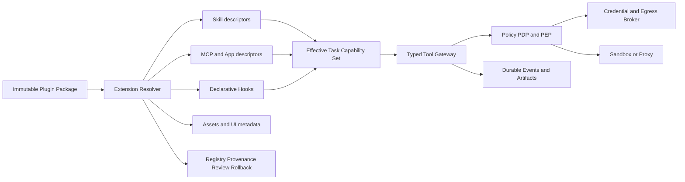

# Zebra Agent Skill、MCP 与 Plugin 扩展体系优化升级方案 v1.0

> 状态：架构与实施规划，不代表产品能力已实现
> 日期：2026-07-20
> 任务：`EXT-PLAN-01`
> 适用范围：Zebra Agent 的 Skill、MCP、Plugin、Hook、Registry 与扩展治理

## 1. 文档目的

本文基于 Zebra 当前架构、代码和验收记录，对比 Claude Code、Codex、
Hermes、Agent Skills 与 MCP 的公开设计，定义 Zebra 扩展体系的目标边界、
实施顺序、风险和验收标准。

本方案不是重写 Tool Gateway，也不把其他 Agent 的运行时直接移植到 Zebra。
Zebra 已有的 durable Session/Event、无状态 Harness、Typed Tool Gateway、
Policy/HITL、Credential/Egress、Artifact、Sandbox 和恢复链继续作为唯一执行
与安全底座。

## 2. 结论

Zebra 当前缺的不是“更多工具调用代码”，而是扩展控制平面：

1. Skill 已能安全地发现和读取，但缺少标准兼容、作用域、版本、来源、启停、
   任务选择和评测治理。
2. MCP 已覆盖本地 stdio、任务 allowlist、渐进披露、Resource 与 Prompt，
   但缺少 Streamable HTTP、OAuth、连接生命周期、动态刷新和协议演进。
3. Plugin 尚未形成包格式、命名空间、安装状态、信任链、升级回滚和能力编排。
4. Skill、MCP 和未来 Hook 必须统一进入“可用、已安装、已启用、任务授权、
   单次审批”五层状态，而不能互相隐式赋权。
5. 第一阶段应先完成扩展身份、版本、digest、provenance 和 Skill v2；公共
   Marketplace 继续依赖私有云 GA、安全、隔离、审计与运维门禁。

## 3. 调研范围与证据基线

### 3.1 Zebra

- 架构源：`docs/Codex-like工程Agent平台最终架构设计_v1.0.md`
- 阶段源：`docs/实施任务拆解与阶段验收.md`
- 任务源：`docs/AGENT_TASKS.md`
- 当前状态：`PROGRESS.md`
- Skill 实现：`packages/agent-tools/src/agent_tools/skills_catalog.py`、
  `packages/agent-tools/src/agent_tools/skills.py`
- MCP 实现：`packages/agent-runtime/src/agent_runtime/mcp_protocol.py`、
  `mcp_stdio.py`、`mcp_resources.py`、`mcp_prompts.py`
- MCP 渐进披露：`packages/agent-tools/src/agent_tools/mcp_disclosure.py`
- 统一组合：`packages/agent-runtime/src/agent_runtime/harness.py`

### 3.2 外部参考

参考 Claude Code 的扩展组合与 MCP，Codex 的 Agent Skills、Plugin、Hook
trust 和分层权限，Agent Skills 与 MCP 官方规范，以及本地 Hermes
`main@659d1123c49ee6828627d07432ed8cf62578434a` 的 Plugin 发现、Skill
provenance、Tool Search 和 MCP 生命周期实现。

外部行为会随版本变化。实现任务激活前必须重新固定参考版本和兼容矩阵。

## 4. 概念边界

| 概念 | Zebra 定位 | 是否直接赋权 |
|---|---|---|
| Project Guidance | 每次任务稳定加载的仓库规则 | 否 |
| Skill | 可复用知识、流程、模板和可选脚本包 | 否 |
| Tool | 一个有类型的原子动作 | 否，仍需 Policy |
| MCP | 连接外部 Tool、Resource、Prompt 的协议 | 否 |
| Plugin | 可安装、版本化的扩展分发单元 | 否 |
| Hook | 生命周期观察、阻断或有界建议 | 否 |
| Connector/App | 带身份和外部数据/动作的 MCP 能力 | 否 |
| Registry | 扩展元数据、版本和信任记录 | 否 |
| Marketplace | 经治理的发现和分发视图 | 否 |

任何 Skill、Plugin、MCP metadata、网页、Resource、Prompt、Hook 输出和
Marketplace 描述都属于不可信输入。它们不能修改 Policy、Task authority、
Credential、Workspace、Runtime 或 Approval 事实。

## 5. Zebra 当前能力审计

### 5.1 Skill 已实现

- 显式 `ZEBRA_SKILL_ROOTS`，默认无 Skill。
- 递归发现 `SKILL.md`，稳定排序和数量上限。
- 只先暴露 name/description，正文通过 `skills.read` 按需加载。
- 多 root 同名 Skill 不按扫描顺序覆盖，而是整体不可用。
- 限制文件大小、编码、隐藏/敏感文件、二进制和支持目录。
- 阻止绝对路径、遍历和软链接逃逸。
- Skill 正文明确标记为不可信指导。
- Skill 不执行脚本、不扩展环境变量、不调用网络、不自动授予工具。
- API、CLI、Worker 和恢复使用同一显式配置。

### 5.2 MCP 已实现

- 最多三个显式本地 stdio server。
- 绝对可执行路径、无 shell 解析、受限参数和净化环境。
- 固定 initialize、分页、帧、Schema、工具数、输出和超时上限。
- Tools、Resources 和 Prompts 按 capability 发现。
- 工具规范名为 `mcp.<server>.<tool>`。
- 新 Task 默认无 MCP Tool，必须持久化精确 allowlist。
- 大目录只对已授权 MCP Tool 启用 search/describe/call 渐进披露。
- Bridge 在 Policy 前还原为真实 MCP 调用，不产生伪审批或重复计费。
- Resource 由用户/应用选择，一次读取并保存不可变 payload。
- Prompt 由用户显式选择，一次解析并作为不可信上下文保存。
- 审批、取消、重启和 Worker 恢复保持确切 server/tool/arguments。
- Research child 不继承 MCP Tool、Resource 或 Prompt 权限。

### 5.3 真实缺口

| 范围 | 缺口 |
|---|---|
| Skill | Agent Skills 完整校验、scope、namespace、enable/disable、版本和 digest |
| Skill | 显式/隐式调用策略、依赖预检、Task 固定快照和安全管理面 |
| MCP | Streamable HTTP、OAuth、Scope/Audience、连接池、健康和重连 |
| MCP | 协议协商、list_changed、server instructions、更多结构化内容 |
| Plugin | manifest、component resolver、安装、锁版本、启停、回滚、审计 |
| Hook | 声明式事件契约、hash trust、确定性顺序和 durable evidence |
| Supply Chain | publisher、签名、SBOM、License、扫描、撤销和 kill switch |
| Eval | Skill/Plugin/MCP 版本级离线对比、canary、归因和回退 |

## 6. 对比结论

### 6.1 Claude Code

值得吸收：

- Skill 按需加载，支持显式和隐式调用。
- Skill、MCP、Subagent、Hook 各自解决不同问题。
- Plugin 组合 Skill、Agent、Hook、MCP、LSP 和 Monitor。
- Plugin namespace 避免组件重名。
- MCP 支持 HTTP、OAuth、动态能力更新、Resource、Prompt 和 Tool Search。
- 项目、用户和组织作用域明确。

不直接复制：

- Skill 内 Shell 预处理。
- Skill frontmatter 临时预授权工具。
- Plugin `bin/` 自动加入宿主 PATH。
- 没有 Zebra durable Task authority 参与的热重载。

Zebra 可兼容这些 metadata，但必须把 `allowed-tools` 解释成依赖或预检请求，
而不是授权事实。

### 6.2 Codex

值得吸收：

- 以 Agent Skills 开放格式作为 Skill 基础。
- Skill 的 metadata、正文、support resources 三级渐进披露。
- Plugin 是安装与分发单元，不等于运行时权限。
- Plugin 可以打包 Skills、MCP/App、Hooks 和 Assets。
- Marketplace 支持 repo、个人和组织来源及版本固定。
- Hook 信任绑定内容 hash，变更后重新审核。
- Plugin、Connector、外部系统身份和 Runtime Policy 分层管理。

不直接复制：

- ChatGPT workspace、订阅、商业 RBAC 和业务用户管理。
- 与 Zebra 外部身份/业务系统职责冲突的控制面。
- 未经 Zebra Task authority 投影的客户端本地状态。

### 6.3 Hermes

值得吸收：

- bundled/user/project/package 多来源发现经验。
- Skill 安装扫描、来源分级、内容 digest 和 provenance。
- 每次从当前 registry 重建 Tool Search catalog，避免陈旧目录。
- MCP 长连接、空闲回收、退避重连、OAuth 和输出保护经验。
- Provider、平台和可选能力的真实故障处理经验。

不直接复制：

- `__init__.py/register(ctx)` 形式的进程内任意 Python Plugin。
- 后来源覆盖先来源的隐式冲突规则。
- Plugin 直接访问宿主 LLM、Registry、Provider 或 Middleware 对象。
- 用户/项目 Plugin 替换内置 Tool。
- 多套独立 discovery system 和进程全局可变 registry。

Hermes 适合用作行为和故障参考，不作为 Zebra 扩展权限模型。

## 7. 目标架构



### 7.1 五层状态

| 状态 | 含义 | Durable |
|---|---|---|
| Available | Catalog 中可发现 | Registry |
| Installed | 固定版本和 digest 已校验并落盘 | Install record |
| Enabled | user/repo/namespace 可选择 | Enablement policy |
| Granted | Task 获得确切组件和能力 | Task authority |
| Approved | 某次有副作用调用获批 | Approval event |

规则：前一状态不自动推导后一状态。

例如，安装 Gmail Plugin 不等于完成 Gmail OAuth；完成 OAuth 不等于某个 Task
可以看到发送邮件工具；Task 能看到工具也不等于本次发送已获批。

### 7.2 稳定身份

所有组件使用
`publisher/plugin@version#digest/component-type/component-name`：包 ID、发布版本、
安装内容 digest、组件类型与命名空间内唯一名称共同构成稳定身份。

Task 只保存解析后的精确 component identity，不保存“最新版”或模糊范围。

## 8. Skill v2

### 8.1 格式

基础兼容 Agent Skills：

- `name`
- `description`
- `license`
- `compatibility`
- `metadata`
- `SKILL.md`
- `scripts/`
- `references/`
- `assets/`

Zebra 扩展 metadata：

```yaml
interface:
  display_name: Example
  short_description: Example workflow
invocation:
  implicit: false
applies_to:
  profiles: [general, coding]
dependencies:
  tools: [files.read]
  mcp: [mcp.docs.search]
evaluation:
  suite: skill-example-v1
```

### 8.2 权限规则

- `dependencies` 只用于安装预览、Task 配置和启动预检。
- `allowed-tools` 若兼容读取，也不得授予权限。
- `scripts/` 不会被 Skill loader 自动执行。
- 执行脚本必须形成普通 `command.run` 或专用 typed Tool 调用。
- Skill 不得改变 model、effort、network、runtime、credential 或 approval。
- Skill 内容继续标为不可信 procedural guidance。

### 8.3 Scope 与冲突

支持 `system`、`admin`、`user`、`repo` 四种来源，但不采用静默覆盖：

- 完整名称始终可用。
- 裸名称只有在当前 effective catalog 唯一时才可用。
- 重名时要求显式 namespace。
- Admin 可以禁用低作用域组件，但不替换其内容。

### 8.4 生命周期

- 安装产生不可变包记录和 digest。
- 启停只影响新 Task 的选择。
- Task 启动保存精确 Skill 快照身份。
- 运行中 Task 不静默换版本。
- 被撤销的 Skill：新 Task 不可用；旧 Task 按撤销策略暂停或仅允许读取已捕获内容。
- 更新失败必须保留旧版本并可原子回滚。

## 9. MCP v2

### 9.1 协议与传输

- 保留 stdio。
- 增加 Streamable HTTP。
- SSE 只作为迁移兼容，不作为新配置首选。
- 从固定 `2025-06-18` 改为有界协议协商。
- 首先兼容 `2025-06-18`，再增加 `2025-11-25` 矩阵。
- 未识别 capability 不自动启用。

### 9.2 连接管理

- 每个 effective server 使用独立连接状态。
- startup、request、idle、lifetime、shutdown 分别设限。
- 有界退避重连，不无限后台重试。
- 健康状态区分配置、传输、协议、认证、上游和 Policy 故障。
- `list_changed` 重新发现后仍必须重新应用 Task allowlist。
- 运行中的审批 continuation 使用持久化真实 target，不重新搜索替换。

### 9.3 OAuth 与凭证

- HTTP OAuth 由 Credential Broker 管理。
- 支持 Protected Resource Metadata、Authorization Server Metadata、PKCE。
- 校验 token audience/resource，禁止 token passthrough。
- Token 不进入 Sandbox、Plugin、事件、日志、Artifact 或前端存储。
- 每个 server/tool 记录所需 Scope。
- Scope 扩大必须显式确认并生成新 capability。
- 撤销后所有未开始调用 fail closed。

### 9.4 Egress

- HTTPS 默认。
- DNS、私网地址、重定向、端口和 TLS 按 Egress Policy 校验。
- Header 值来自 Broker，不存入 Plugin manifest 或 Task event。
- Plugin 不能通过自定义 URL 绕过 server allowlist。
- 远程 MCP 在非本地环境只通过代理路径执行。

### 9.5 MCP primitives

- Tools：模型控制，但必须是 Task 已授权目录并经过 Policy/Approval。
- Resources：应用控制，继续显式选择和一次性快照。
- Prompts：用户控制，继续显式选择并保存不可信渲染结果。
- Roots：只暴露 Task workspace 的 opaque root capability。
- Elicitation：映射到 durable clarification/HITL。
- Sampling：默认关闭，后续独立任务处理模型预算、Prompt 展示和递归限制。
- MCP Tasks：实验能力，不能替代 Zebra Task/Event authority。

## 10. Plugin v1

### 10.1 包结构

```text
plugin-root/
├── .zebra-plugin/
│   └── plugin.json
├── skills/
├── mcp.json
├── hooks/
│   └── hooks.json
├── assets/
├── LICENSE
└── README.md
```

### 10.2 Manifest

Manifest 至少包含稳定 `id`、`version`、`publisher`、`license`、Skills/MCP/Hooks
组件路径、`requested_capabilities`、Zebra 兼容范围和 SHA-256 integrity。

`requested_capabilities` 只用于安装预览，绝不形成 Task grant。

### 10.3 第一版允许范围

- 声明式 Skill。
- 已验证的 MCP server descriptor。
- UI 展示资产。
- 后续阶段引入的声明式 Hook。

### 10.4 第一版禁止范围

- API/Worker 进程内动态 import Python、Node 或共享库。
- Plugin 覆盖内置 Tool。
- Plugin 获得 Model Gateway、Credential Store、Event Store 或数据库对象。
- npm/pip lifecycle script。
- 安装时任意命令执行。
- 自动修改 PATH、环境变量或项目文件。
- Plugin 自行扩大网络、Workspace、Runtime 或子 Agent 权限。

若未来必须支持原生扩展，使用独立 sidecar、OCI 或 WASM runtime，通过版本化
RPC 和最小 capability 连接；扩展崩溃不得破坏 Harness Worker。

## 11. Hook v1

首版只支持声明式和确定性行为：

| Hook | 允许行为 | 禁止行为 |
|---|---|---|
| PreToolUse | deny 或 require-approval | allow、执行工具、修改参数 |
| PostToolUse | 添加审计标签、提出验证建议 | 修改结果事实、补造成功 |
| Stop | 返回一次有界继续建议 | 无限循环、提交外部副作用 |
| SessionStart | 添加有界不可信材料 | 修改 System/Policy |
| ArtifactCreated | 排队独立处理请求 | 在事务内同步外调 |

所有 Hook：

- 绑定 package digest。
- 变更后重新审核。
- 使用稳定排序。
- 有独立 timeout 和 fail-open/fail-closed 分类。
- 输入、输出、异常和决定写入 durable event。
- 不在数据库事务、lease 或关键清理区执行外部逻辑。

## 12. Registry、供应链与 Marketplace

### 12.1 Registry 负责

- Catalog metadata。
- 不可变版本和 digest。
- publisher 身份与签名。
- SBOM、License 和依赖。
- 自动扫描与人工 review 结论。
- compatible、deprecated、yanked、revoked 状态。
- 安装、启停和回滚记录。
- 版本级 Eval 报告。

### 12.2 信任等级

| 等级 | 来源 | 默认行为 |
|---|---|---|
| system | Zebra 随版本发布 | 按发行策略可用 |
| organization | 组织签名和审核 | 组织策略决定 |
| verified | 发布者和自动检查通过 | 可安装，仍需授权 |
| community | 未验证发布者 | 默认不可自动安装 |
| local-dev | 本地开发目录 | 仅 trusted-local |

### 12.3 Marketplace Gate

公共 Marketplace 必须依赖：

- 私有云 GA Gate。
- Namespace、Credential、Egress 和 Sandbox 隔离完成。
- 签名、SBOM、扫描、撤销和应急 kill switch。
- 安装和更新原子性。
- Canary、Eval、版本归因和回滚。
- 运维告警、审计保留和事故 runbook。

在这些条件完成前，只实现本地 Catalog/Registry 契约，不实现公共分发。

## 13. 事件与持久化

建议新增或扩展的领域事实：

- `extension_installed`
- `extension_enabled`
- `extension_disabled`
- `extension_upgrade_requested`
- `extension_upgraded`
- `extension_rollback_completed`
- `extension_revoked`
- `task_extensions_granted`
- `mcp_authorization_required`
- `mcp_authorization_completed`
- `mcp_capabilities_refreshed`
- `hook_evaluated`

事件只保存安全 metadata、identity、version、digest、scope 名称和结果状态；不保存
Token、Authorization header、原始敏感 Resource URI 或私密 payload。

Task projection 至少保存：

- exact Skill component identities。
- exact MCP server/tool allowlist。
- selected Resource/Prompt snapshot provenance。
- Plugin/version/digest。
- effective network/runtime profile。
- approval target fingerprint。

## 14. 可观测性与 Eval

### 14.1 指标

- Skill 匹配、读取、实际使用和误触发率。
- MCP discovery、连接、认证、调用、重试和故障分类。
- Plugin 安装、启停、升级、回滚和撤销。
- Hook 延迟、阻断率、异常和继续次数。
- 每个扩展版本的 token、延迟、成功率和副作用失败率。

### 14.2 Eval

每个 Skill/Plugin/MCP 版本至少包含：

- 该触发时触发。
- 不该触发时不触发。
- 缺少依赖时给出正确预检结果。
- 不扩大 Task authority。
- 恶意 metadata/正文/结果不能改变 Policy。
- 重启后恢复精确版本和 target。
- 新旧版本效果、成本和延迟对比。

版本发布 Gate 不以单次成功 Demo 代替确定性测试和 Eval。

## 15. 分阶段实施计划

### EXT-0：扩展契约与威胁模型

交付：

- 本文档。
- Plugin manifest schema 草案。
- 五层状态机和权限矩阵。
- 供应链、Prompt Injection、OAuth 和 Hook 威胁模型。
- 后续任务卡与 Owned paths。

退出标准：现有 Tool Gateway、Policy、Task authority、Event、Artifact 和恢复
边界没有被新扩展模型绕过；Marketplace 保持 Locked。

### EXT-1：Skill v2

- `EXT-SKILL-01`：Agent Skills metadata 和校验。
- `EXT-SKILL-02`：scope、namespace、enable/disable 和 digest。
- `EXT-SKILL-03`：Task 级选择、快照和恢复。
- `EXT-SKILL-04`：安全 inventory、API、CLI 和 Desktop 管理面。
- `EXT-SKILL-05`：provenance、Eval 和回滚证据。

退出标准：Skill 更新不改变运行中 Task；依赖不授予权限；API、CLI、Worker 和
恢复使用同一 effective catalog；恶意 Skill 无法读秘密或扩大权限。

### EXT-2：Remote MCP 与 OAuth

- `EXT-MCP-01`：协议协商与 Streamable HTTP。
- `EXT-MCP-02`：连接生命周期、健康、刷新和重连。
- `EXT-MCP-03`：Credential Broker-backed OAuth。
- `EXT-MCP-04`：Egress、SSRF、Audience 和 Scope Policy。
- `EXT-MCP-05`：structured content 与 Artifact 投影。
- `EXT-MCP-06`：Elicitation 到 durable HITL。

退出标准：Token 全链路不可见；刷新不能扩大 Task allowlist；重启恢复确切
target；配置、传输、协议、认证、上游和 Policy 故障可区分。

### EXT-3：Declarative Plugin

- `EXT-PLUG-01`：manifest 和 package validator。
- `EXT-PLUG-02`：本地不可变安装、启停和 lockfile。
- `EXT-PLUG-03`：Skill/MCP component resolver。
- `EXT-PLUG-04`：namespace 和冲突规则。
- `EXT-PLUG-05`：安装预览、权限差异和回滚 UI。
- `EXT-PLUG-06`：Plugin 事件、审计和 Eval。

退出标准：安装不执行包内代码；Plugin 不覆盖内置 Tool；升级失败原子回滚；
每次使用可追溯到 plugin/version/component/digest。

### EXT-4：Hook 与隔离原生扩展

- 声明式 Hook。
- Sidecar/WASM 原生组件契约。
- 受限 Plugin UI。
- 组织 Registry 和灰度撤销。

退出标准：扩展故障不破坏 Worker；Hook 不绕过 Policy；撤销在规定时间内影响
所有新调用；历史任务和审计仍可重放。

### EXT-5：Marketplace

依赖私有云 GA、安全、DR、审计和运维 Gate，交付发布者验证、签名、SBOM、
审核、组织策略、撤销、kill switch、canary 和版本回滚。

## 16. 最小优先切片

第一个实现任务应是 `EXT-SKILL-01`，而不是 Marketplace 或 Remote MCP：

1. 复用现有 `LocalSkillCatalog` 和 `skills.list/read`。
2. 补齐 Agent Skills name/description/license/compatibility/metadata 校验。
3. 增加稳定 component identity、source 和 content digest。
4. `dependencies` 仅做可用性预检。
5. 保持无自动执行、无权限提升、无产品 UI 变更。
6. 用一个集中测试矩阵锁定旧 Skill 兼容和恶意输入拒绝。

这一切片不需要新网络能力、数据库迁移、公共 Registry 或新依赖，能为后续
Plugin 和 MCP 组件身份提供共同基础。

## 17. 明确不做

- 不建立进程内任意 Python/Node Plugin 平台。
- 不让 Skill、Plugin 或 MCP metadata 授权工具。
- 不让 Plugin 替换内置 Tool 或 Policy。
- 不在安装时执行 npm/pip/uvx lifecycle。
- 不默认启用 remote MCP、Sampling、MCP Tasks 或自动 OAuth Scope 扩大。
- 不把 MCP Resource/Prompt 变成隐藏的模型控制工具。
- 不以向量搜索替代精确 Task allowlist。
- 不在私有云 GA Gate 前建设公共 Marketplace。
- 不把用户、组织、业务 RBAC、订阅或计费放入 Zebra。

## 18. 决策摘要

| 决策 | 结果 |
|---|---|
| 是否重写 Tool Gateway | 否，复用现有执行链 |
| Skill 标准 | 兼容 Agent Skills，Zebra metadata 只做收窄 |
| Skill 是否能预授权 | 否 |
| Plugin 是否可进程内执行代码 | v1 否 |
| Plugin 是否可覆盖内置 Tool | 否 |
| MCP 下一传输 | Streamable HTTP |
| MCP OAuth 所有者 | Credential Broker |
| Resource/Prompt 控制模型 | 保持应用/用户显式控制 |
| Task 是否固定扩展版本 | 是，精确 version + digest |
| Marketplace 是否立即建设 | 否，保持 Locked |

## 19. 参考资料

- Claude Code：`https://code.claude.com/docs/en/features-overview`、
  `https://code.claude.com/docs/en/slash-commands`、
  `https://code.claude.com/docs/en/plugins-reference`、
  `https://code.claude.com/docs/en/mcp`
- Codex：`https://learn.chatgpt.com/docs/build-skills`、
  `https://learn.chatgpt.com/docs/build-plugins`、
  `https://learn.chatgpt.com/docs/hooks`、`https://learn.chatgpt.com/docs/extend/mcp`
- 标准：`https://agentskills.io/specification`、
  `https://modelcontextprotocol.io/specification/2025-06-18`、
  `https://modelcontextprotocol.io/specification/2025-11-25`
