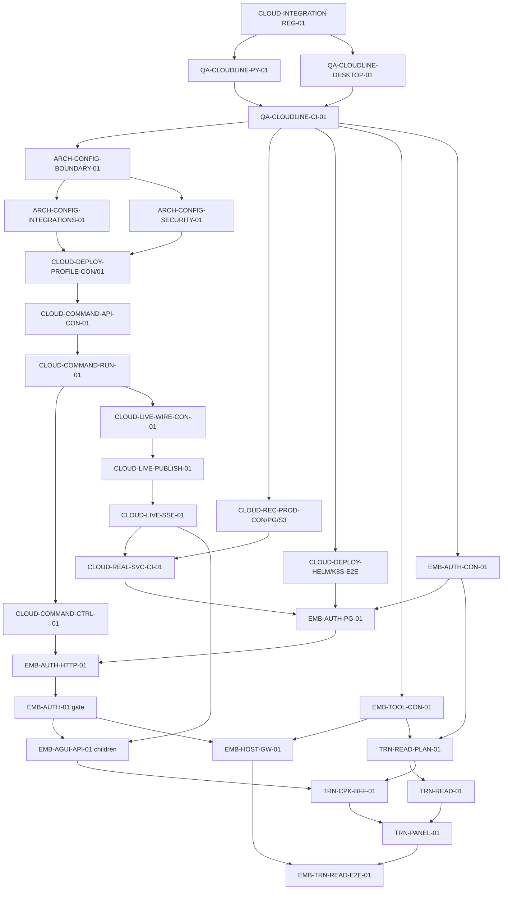

# Zebra Cloud 与 Trench 下一阶段执行计划 v1.0

> 状态：`Review`
>
> 基线：`zebra-cloud-trench@978e02de`，叠加
> `CLOUD-INTEGRATION-REG-01@8bbdf5b5`
>
> 目标：先恢复可发布的云主线，再交付第一个生产级 Trench 只读闭环。
> 本计划不授权任何 `Locked` 实现任务。

## 1. 结论

下一阶段不应直接继续堆 Trench UI、Memory 或 Agent Definition。正确顺序是：

1. 合并 Lease checkpoint 与 API eager-store 回归修复。
2. 清零当前云主线的 Python、Desktop 和 CI 质量债。
3. 修复生产 Profile、包层依赖和 API/Worker 执行边界。
4. 接通 PostgreSQL Event、Redis 实时流、SSE 重放与降级。
5. 补齐真实服务 CI、PITR、对象存储恢复、Helm/gVisor 证据。
6. 完成 Host Grant、AG-UI 和 Host Tool Gateway。
7. 最后接入 Trench read-only Tool、BFF、面板和跨服务 E2E。

P3 的完成定义是：Trench 用户在 Event Detail 中发起只读分析，Zebra API
只提交命令和读取投影，Worker 在 PostgreSQL Lease/Fence 下执行，通过受控
Host Tool 读取 Trench，AG-UI 可断线重放，整个链路不产生 Trench 业务写入。

### 2026-08-11 执行审计更新

当前整合验证线已把 Gate 0–3 的实现卡和 Trench 的三个实现卡推进到
`Review`；`EMB-TRN-READ-E2E-01` 保持 `In Progress`，因为它仍需要真实部署
输入。原文中 Gate 0–4 任务表的 `Locked` 是计划冻结时的历史状态，实际状态以
`docs/AGENT_TASKS.md`、`PROGRESS.md` 和各隔离分支的提交/验证证据为准。

已确认的代码前提包括：Worker 的 Host manifest/typed gateway 组合、Trench
签名 service-to-service read auth，以及 BFF/验收 runner 对 `agent.run` 加上
五个 read scope（`event.read`、`evidence.read`、`entity.read`、`topic.read`）
的请求。Trench 生产 Compose 的 OpenHarness 镜像打包和 Host read auth 环境
接线也已补齐；真实 PG/Redis/API/Worker/frontend Compose 已启动，签名 manifest
和 read invoke 已返回成功。未完成项只剩两类外部验收：带 `runsc` RuntimeClass 的 Kubernetes
集群，以及同时提供 Zebra/Trench HTTP、PG、Redis、object store、Grant
exchange 和 Worker restart hook 的隔离环境；缺少这些输入时必须保留
`BLOCKED`，不能用 Compose 或 focused tests 替代。

## 2. 当前质量与进度判断

### 2.1 已经成立的基础

- Core、Context、Tools、Security、Runtime、Storage、Integrations 已形成明确包层。
- PostgreSQL Event/Projection、Lease/Fence、Artifact、Effect、Handoff、Context、
  Provider Continuation 等权威存储和原子性证据已覆盖主要云聚合边界。
- Redis Streams live adapter、S3/MinIO Artifact adapter、应用 Compose、迁移与本地
  备份/恢复 runner 已存在。
- Host authority 和 AG-UI pure projection 合同已经完成，Trench 的 CopilotKit
  兼容性 spike 已完成。
- 回归分支已修复 recovered Lease checkpoint 和 local API eager-store 两个阻断，
  并增加长任务与零写入原子性回归。

这些证据说明项目的“合同和适配器基础”质量较好，但不能据此声称生产链路完成。

### 2.2 已验证的阻断

| 阻断 | 当前证据 | 影响 |
| --- | --- | --- |
| 云主线质量门未在目标主线复跑 | 整合线 `make check` 与 `make test` 已绿；canonical workflow 尚未在合并后的目标主线复跑 | 不能把整合线当作已合并发布基线 |
| Profile 轴冲突已修复，待主线复核 | 配置矩阵已拒绝 `cloud + trusted-local` 与 `production + SQLite`，并在整合线通过 | 合并后需重跑组合矩阵 |
| 包层反向依赖已清零 | 依赖边界测试通过，Integrations/Security 已改用 typed provider settings | 合并后需重跑依赖门 |
| API/Worker 执行边界已接通 | cloud command-only route 与 Worker wake-up 已通过整合线测试，API 不构造 Harness | 真实部署仍需验证进程重启/恢复 |
| Redis 实时主链路已接通 | commit 后 publisher、Redis live tail 和 PG polling fallback 已通过本地 Cloudline | 生产 Redis 故障与重放仍需真实环境复核 |
| AG-UI 生产 route 已接通 | command endpoint、durable replay/live tail 和 Host auth 已通过整合矩阵 | 不能用 focused route 测试替代跨服务验收 |
| 真实服务证据尚未在合并主线运行 | application/Redis/PITR/S3/restore 五个本地 Cloudline runner 绿；workflow 已有受控 jobs | 仍缺合并后 CI artifact 与失败归因证据 |
| 恢复证据仍是本地级 | 无生产 PITR、对象存储备份恢复、RPO/RTO 和灾备演练 | 不满足生产恢复门 |
| 部署证据不完整 | 无 Helm/Kubernetes 应用部署与 gVisor 端到端证据 | 不能声称生产部署完成 |

### 2.3 阶段判断

- Phase 0-2 与云权威存储基础：主体完成，当前处于集成回归收口。
- Embedded P0/P1 合同与 Gate 3 实现：已在整合线进入 Review，Host runtime 与 Trench service auth 已补齐。
- 生产基础设施闭环：仍未完成；Compose evidence 不能替代 Kubernetes/gVisor、生产 PITR 和合并后 CI。
- P3 Trench read-only：Tool、BFF、Panel 与 fail-closed E2E runner 已形成代码纵切，真实跨服务执行仍阻断。
- P4 以后协作、分析、写回、Memory runtime、Agent Definition runtime：继续延期。

因此项目当前更准确的描述是“云基础与生产边界代码已基本形成，外部部署验收尚未闭环”，
而不是“Trench 产品已经接近发布”。

## 3. 执行原则

- 所有新任务默认 `Locked`；只有依赖合并且维护者明确激活后才能变为 `Ready`。
- 一个任务一个 owner、branch、worktree 和 PR；激活时冻结 Owned paths。
- 先合同、再 adapter/composition、再 app route、最后 real-service E2E。
- PostgreSQL Event Store 始终是 durable authority；Redis 只做可丢失、可重建 fan-out。
- 非本地 API 不运行 Harness，不直接领取 Lease，不持有 Sandbox 生命周期。
- 本地 Profile 继续 lazy SQLite 且兼容；生产 Profile 必须 fail closed。
- Trench P3 只读，不借机实现 P4 shared state、P5 analysis 或 P6 writeback。
- 既有 `EMB-AUTH-01` 与 `EMB-AGUI-API-01` 保留为父验收门，具体实现拆到
  path-bounded 子任务；本计划细化而不绕过既有 Embedded 路线图。
- 当前原工作树的并发修改必须先由其 owner 交接或拆分，不能被后续任务覆盖。

## 4. 依赖图

## 5. 任务清单

工时是单 owner 的计划区间，只用于切片，不是交付承诺。

### Gate 0 — 回归与质量基线

#### CLOUD-INTEGRATION-REG-01 — Lease 与 API composition 回归

- 状态：`Review`；分支：`codex/cloud-integration-regressions-01`。
- 依赖：`zebra-cloud-trench@978e02de`。
- 交付：recovery-renewed checkpoint heartbeat、local lazy-store、长任务和零写入回归。
- 验收：聚焦矩阵、完整 backend、changed-path static、Eval；已完成，等待审阅合并。

#### QA-CLOUDLINE-PY-01 — Python 主线收口

- 状态：`Review`；预计：6-10h；依赖：回归修复合并、当前并发改动交接。
- Reserved paths：当前 Python size/Ruff/Mypy 失败文件及其最小回归；激活前列出精确文件。
- 交付：消除后端文件大小、Ruff、Mypy 失败，并保留 eager-store 原子性合同。
- 验收：`make test`、文件大小门、全量 Ruff、全量 Mypy、Eval 全绿。
- 非目标：借静态清理重构业务行为或覆盖当前未交接工作树。

#### QA-CLOUDLINE-DESKTOP-01 — Desktop 确定性回归收口

- 状态：`Review`；预计：6-10h；依赖：回归修复合并。
- Reserved paths：`UI/desktop/src/components/CodexConversationPane.styles.ts`、失败的
  Playwright/Packaged Tauri specs 与直接相关测试 helper。
- 交付：拆分超长样式；把多匹配 locator、过短 negative timing 断言改为事件驱动等待。
- 验收：Desktop checks/build、8 个 Playwright 场景和 packaged Tauri gate 全绿。
- 非目标：修改 UI 设计、掩盖真实 Lease/transport 错误或扩大超时。

#### QA-CLOUDLINE-CI-01 — PR #194 基线关闭

- 状态：`Review`；预计：2-4h；依赖：两个 QA 子任务合并。
- Reserved paths：`.github/workflows/quality.yml` 仅在发现 CI 合同缺陷时；否则 docs/PR 元数据。
- 交付：基于新提交重跑 canonical workflow，校正 PR 标题与真实范围。
- 验收：Backend、Desktop、Tauri、gVisor、quota、OS sandbox 等现有 jobs 全绿。

### Gate 1 — 生产组合与进程边界

#### ARCH-CONFIG-BOUNDARY-01 — packages/apps 配置边界合同

- 状态：`Review`；预计：4-6h；依赖：Gate 0。
- Reserved paths：新 ADR/contract doc、依赖图测试、本卡治理记录。
- 交付：枚举所有 package -> `zebra_agent_config` 反向依赖，冻结最小 provider-neutral
  输入与 app composition mapping；不得新建第二套总配置对象。
- 验收：依赖测试能阻止 packages 导入 apps；方案覆盖 Integrations 与 Security。

#### ARCH-CONFIG-INTEGRATIONS-01 — Integrations 配置解耦

- 状态：`Review`；预计：6-10h；依赖：配置边界合同。
- Reserved paths：`packages/agent-integrations/`、其 tests/pyproject，以及 app 侧最小 mapping。
- 交付：Model/SCM/Mem0 integrations 只接收其所需的 typed provider settings。
- 验收：包测试、Mypy、依赖边界测试通过；行为和环境变量兼容。

#### ARCH-CONFIG-SECURITY-01 — Security 配置解耦

- 状态：`Review`；预计：4-6h；依赖：配置边界合同。
- Reserved paths：`packages/agent-security/`、其 tests/pyproject，以及 app 侧最小 mapping。
- 交付：Credential/Security 代码不导入 apps/config。
- 验收：Security 测试、Mypy、依赖边界测试通过；secret/redaction 合同不变。

#### CLOUD-DEPLOY-PROFILE-CON-01 — 生产 Profile 矩阵合同

- 状态：`Review`；预计：4-6h；依赖：两个配置解耦任务。
- Reserved paths：focused config contract doc、`tests/config/`、composition matrix tests。
- 交付：把 deployment、storage authority、runtime isolation 三个轴显式化，或冻结一组
  无歧义的组合 Profile；`cloud + trusted-local` 与 `production + SQLite` 均须被拒绝。
- 验收：测试证明本地 lazy SQLite 兼容，生产为 PG + gVisor + quota 且 fail closed。

#### CLOUD-DEPLOY-PROFILE-01 — Profile 实现与应用组合

- 状态：`Review`；预计：8-12h；依赖：Profile 合同。
- Reserved paths：`apps/config/`、API/Worker composition roots、Compose env、直接测试。
- 交付：API、Worker、migration、Compose 使用同一解析结果，不再用字符串分支推断权威层。
- 验收：local/cloud-production 组合矩阵、real PostgreSQL composition、gVisor/quota 检查通过。

#### CLOUD-COMMAND-API-CON-01 — Stateless API command 合同

- 状态：`Review`；预计：4-6h；依赖：Profile 实现。
- Reserved paths：Core command/event contract、focused docs/tests。
- 交付：run/resume/message/stop/cancel/suspend 命令、幂等键、expected revision、状态映射。
- 验收：合同证明非本地 API 只提交命令/读投影；local execute compatibility 明确隔离。

#### CLOUD-COMMAND-RUN-01 — Run/Resume command 与 Worker wake-up

- 状态：`Review`；预计：8-12h；依赖：command 合同。
- Reserved paths：新 API command service/route、Worker command claim/loop、focused tests。
- 交付：run/resume/message 通过 durable Event/command 触发 Worker，不在 API 创建 Harness。
- 验收：重复命令幂等、并发 revision 冲突明确、Worker 重启后可继续、local 行为兼容。

#### CLOUD-COMMAND-CTRL-01 — Stop/Cancel/Suspend 控制命令

- 状态：`Review`；预计：6-10h；依赖：Run command。
- Reserved paths：focused session control command、Worker control consumer、tests。
- 交付：stop/cancel/suspend/resume 使用同一 durable command seam。
- 验收：API 无 Runtime side effect；跨进程控制、重复提交和竞态由 Event/Fence 决定。

### Gate 2 — 实时、恢复、CI 与部署证据

#### CLOUD-LIVE-WIRE-CON-01 — Event commit 后实时发布合同

- 状态：`Review`；预计：4-6h；依赖：Run command。
- Reserved paths：Event transaction seam inventory、focused contract/doc/tests。
- 交付：定义 commit-success 后的 duplicate-tolerant publish、replay barrier 和降级规则。
- 验收：发布失败不回滚已提交 Event；未提交 Event 永不发布；不得逐 caller 打补丁。

#### CLOUD-LIVE-PUBLISH-01 — Redis publisher 接线

- 状态：`Review`；预计：6-10h；依赖：live wiring 合同。
- Reserved paths：共享 Event commit hook/adapter composition、API/Worker roots、tests。
- 交付：PostgreSQL authoritative append 成功后发布 Redis envelope，重复可去重。
- 验收：real PostgreSQL + Redis 下证明 commit/publish ordering、重复和 Redis 故障降级。

#### CLOUD-LIVE-SSE-01 — Durable replay + live tail

- 状态：`Review`；预计：8-12h；依赖：Redis publisher。
- Reserved paths：API streaming service/route、AG-UI projection composition、tests。
- 交付：先从 PostgreSQL 按 cursor 重放，再跨 barrier tail Redis；Redis 缺失时回退 PG polling。
- 验收：断线、重复、乱序、trim、API 重启不丢 durable Event，且 cursor 单调。

#### CLOUD-REC-PROD-CON-01 — 生产恢复合同

- 状态：`Review`；预计：4-6h；依赖：Gate 0，可与 Gate 1 并行。
- Reserved paths：生产 recovery ADR/runbook、evidence schema、drill checklist。
- 交付：冻结 PG PITR、S3 backup/restore、RPO/RTO、credential/epoch rotation 和演练责任。
- 验收：不能用本地 logical dump 或重新上传本地文件替代对象存储恢复声明。

#### CLOUD-REC-PG-PITR-01 — PostgreSQL PITR 演练

- 状态：`Review`；预计：8-12h；依赖：生产恢复合同和可用测试基础设施。
- Reserved paths：production-like PG backup/restore scripts、runner、runbook evidence。
- 交付：base backup/WAL 或托管等价机制，恢复到明确时间点并重建 projections。
- 验收：Event count/revision/namespace/lease epoch 校验，记录实测 RPO/RTO 和清理证据。

#### CLOUD-REC-S3-01 — Artifact object backup/restore 演练

- 状态：`Review`；预计：6-10h；依赖：生产恢复合同和可用对象存储。
- Reserved paths：S3/MinIO backup/restore runner、manifest verifier、runbook evidence。
- 交付：独立 backup copy/version restore，而不是依赖 Worker 本地 payload。
- 验收：随机删除对象后从备份恢复，checksum、metadata、PG Artifact ref 全部一致。

#### CLOUD-DEPLOY-HELM-01 — Kubernetes/Helm 应用部署

- 状态：`Review`；预计：8-12h；依赖：生产 Profile。
- Reserved paths：新 `deploy/helm/zebra-agent/`、schema/docs、render tests。
- 交付：migration job、API、Worker、service、probes、resources、PDB、secrets refs。
- 验收：`helm lint/template`、non-root、immutable image、profile fail-closed；不内置数据库密码。

#### CLOUD-K8S-GVISOR-E2E-01 — Kubernetes gVisor 端到端证据

- 状态：`Review`；预计：8-12h；依赖：Helm 与测试集群。
- Reserved paths：cluster runner、gVisor RuntimeClass values、deployment evidence docs。
- 交付：真实 Pod 中的 API/Worker、workspace quota、network policy、restart/resume 验证。
- 验收：长任务跨 Worker restart 恢复，隔离与配额 fail closed，资源全部清理。

#### CLOUD-REAL-SVC-CI-01 — Canonical real-service CI

- 状态：`Review`；预计：6-10h；依赖：live 与 PG/S3 recovery runners 稳定。
- Reserved paths：`.github/workflows/quality.yml`、runner aggregation、CI docs。
- 交付：将 canonical PostgreSQL/Redis/MinIO application/recovery 证据纳入受控 CI jobs。
- 验收：固定镜像、超时、artifact logs、always-cleanup；失败能定位到具体 contract runner。

### Gate 3 — Zebra Embedded 生产边界

#### EMB-TOOL-CON-01 — Host Tool contract extension

- 状态：`Review`；分支：`codex/cloud-real-svc-ci-01`；预计：6-10h。
- Reserved paths：focused `agent-tools` contracts/tests。
- 交付：在现有 ToolDefinition/ToolResult 上增加 execution location、scope、risk、timeout、
  size、idempotency 和 receipt；不建立平行 Tool 模型。

#### EMB-AUTH-CON-01 — Host Grant/JWT 安全合同

- 状态：`Review`；分支：`codex/cloud-real-svc-ci-01`；预计：6-10h。
- Reserved paths：focused Security contract/ADR/tests。
- 交付：alg pin、issuer/JWKS、aud/jti、clock skew、origin、namespace/resource/scope、
  RFC 9457 错误和 JWT library 决策。
- 验收：伪造、过期、重放、跨 namespace、错误 origin 全部 fail closed。

#### EMB-AUTH-PG-01 — Host registry 与 replay ledger

- 状态：`Review`；分支：`codex/cloud-real-svc-ci-01`；预计：8-12h。
- Reserved paths：下一可用 migration、focused PostgreSQL registry/grant audit adapter/tests。
- 交付：Host issuer/tenant registry、grant audit、jti replay ledger；激活时再分配迁移号。
- 验收：真实 PG 下原子 replay reject、审计完整、namespace 隔离。

#### EMB-AUTH-HTTP-01 — API auth middleware 与 exact CORS

- 状态：`Review`；分支：`codex/cloud-real-svc-ci-01`；预计：6-10h。
- Reserved paths：API auth middleware/http composition、config mapping、tests。
- 交付：非本地路由强制 Grant，CORS 使用 registry exact origin，不反射任意 origin。
- 验收：本地兼容；云端无 grant、错误 scope/origin 均在业务处理前拒绝。

#### EMB-AUTH-01 — Production Host auth gate

- 状态：`Review`；分支：`codex/cloud-real-svc-ci-01`；预计：2-4h。
- Reserved paths：integration evidence doc、registry/progress closeout。
- 交付：关闭既有 P3 auth parent gate，不再混合合同、migration 和 middleware 代码。
- 验收：真实服务上的签名、重放、scope、origin、审计和本地兼容矩阵全部通过。

#### EMB-AGUI-CMD-01 — AG-UI command endpoint

- 状态：`Review`；分支：`codex/cloud-real-svc-ci-01`；预计：6-10h。
- Reserved paths：AG-UI API command route/composition、tests。
- 交付：`POST /agui/commands`（及其 thread/run 资源别名）承载
  `run`/`resume`/`stop` 与 RFC 9457 mapping；只调用 durable command service。
- 验收：API 进程中不导入或构造 Worker Harness execution service。

#### EMB-AGUI-STREAM-01 — AG-UI replay/stream endpoint

- 状态：`Review`；分支：`codex/cloud-real-svc-ci-01`；预计：6-10h。
- Reserved paths：AG-UI streaming route/projection composition、golden fixtures/tests。
- 交付：durable replay、live tail、cursor、interrupt/resume/error 投影。
- 验收：断线重连无消息丢失或重复业务动作，未知事件向前兼容。

#### EMB-AGUI-API-01 — Production AG-UI gate

- 状态：`Review`；分支：`codex/cloud-real-svc-ci-01`；预计：2-4h。
- Reserved paths：integration evidence doc、registry/progress closeout。
- 交付：关闭既有 P3 parent gate，不再混合实现代码。
- 验收：command-only API、durable replay、auth、real-service evidence 全部通过。

#### EMB-HOST-GW-01 — Typed Host Tool Gateway

- 状态：`Review`；分支：`codex/cloud-real-svc-ci-01`；预计：8-12h。
- Reserved paths：新 `agent-integrations/.../host_tools/`、Security transport seam、tests。
- 交付：manifest discovery/invoke、workload identity、scope intersection、SSRF、receipt。
- 验收：timeout/4xx/5xx/invalid body 为结构化 recoverable result；secret 不进 model/Sandbox。

### Gate 4 — Trench read-only vertical slice

#### TRN-READ-PLAN-01 — Trench 仓库实施冻结

- 状态：`Review`；预计：4-6h；依赖：Gate 0、Host Tool/Auth contracts 和既有 AG-UI contract。
- Owned repo：Trench；Reserved paths：仅 Trench 计划/任务注册文档。
- 交付：在 Trench 当前 main 上重新核对架构、路由、OIDC/RBAC、测试命令和精确 Owned paths。
- 验收：三个 Trench 实现卡在其仓库注册；本 Zebra 计划不能替代实时 Trench 检查。

#### TRN-READ-01 — Trench read Tool API

- 状态：`Review`；预计：8-12h；依赖：Trench plan、Host Tool contract。
- Owned repo：Trench。
- 交付：get_event/evidence/related_events/entity_timeline/topic，只读且 payload 有界。
- 验收：Trench 自身 OIDC/RBAC/resource scope 是权威；重复 read 幂等，无业务写入。

#### TRN-CPK-BFF-01 — Trench Copilot Runtime/BFF

- 状态：`Review`；预计：8-12h；依赖：Trench plan、Auth/AG-UI production endpoints。
- Owned repo：Trench。
- 交付：Runtime v2 handler、Zebra HttpAgent、server-side header allowlist 和 Grant exchange。
- 验收：浏览器无 service secret/agent direct access；refresh/expiry/origin policy 通过。

#### TRN-PANEL-01 — Event Detail read-only Copilot panel

- 状态：`Review`；预计：8-12h；依赖：Trench Tool 与 BFF。
- Owned repo：Trench。
- 交付：current event context、streamed messages、tool/result、Artifact refs。
- 验收：使用 CopilotKit，不引入 Zebra React SDK；reload 恢复同一 Task 且不重复消息。

#### EMB-TRN-READ-E2E-01 — 跨服务只读验收

- 状态：`In Progress`；预计：8-12h；依赖：全部 P3 实现卡（含
  `EMB-HOST-RUNTIME-01` 与 `TRN-HOST-READ-AUTH-01`）。
- Owned repo：Zebra；Reserved paths：新跨服务 runner/evidence doc 和治理 closeout。
- 交付：real PG/Redis/object store + Zebra API/Worker + Trench BFF/panel 的完整场景。
- 验收：读任务、长任务、断线、Worker restart、stop/resume、Grant expiry/replay、
  Host Tool failure 均有确定结果；Trench 业务表零写入；本卡不再修改 Trench 实现。

## 6. 可并行工作线

Gate 0 完成后，最多开启三条不重叠工作线：

| 工作线 | 顺序 | 主要边界 |
| --- | --- | --- |
| A 组合与命令 | Config boundary -> Profile -> Command API | apps/config、API/Worker composition、Core command |
| B 恢复与部署 | Recovery contract -> PG/S3 -> Helm/gVisor | recovery runners、deploy/、CI evidence |
| C Embedded 合同 | Tool contract -> Auth contract | agent-tools、agent-security contract |

三线在 `CLOUD-REAL-SVC-CI-01`、`EMB-AGUI-API-01` 和
`EMB-HOST-GW-01` 汇合。任何共享文件冲突都通过先合并依赖任务解决，不允许临时共享所有权。

## 7. 计划区间与里程碑

| 里程碑 | 完成条件 | 单线工作量 |
| --- | --- | --- |
| M0 可审基线 | 回归合并，Backend/Desktop/Tauri/CI 全绿 | 1-2 天 |
| M1 生产执行边界 | coherent Profile，packages 不依赖 apps，API command-only | 4-7 天 |
| M2 云运行证据 | live/replay、real-service CI、PITR/S3、Helm/gVisor | 6-10 天 |
| M3 Embedded API | Auth、AG-UI、Host Tool Gateway | 5-8 天 |
| M4 Trench P3 | Tool/BFF/panel/cross-service E2E | 5-8 天，需先检查 Trench |

完全串行约 4-7 周；三个 owner 在依赖允许处并行约 2-4 个日历周。测试集群、
凭据或外部基础设施不可用会延长 M2/M4，不应通过降低验收标准压缩时间。

## 8. 明确延期

以下内容在 P3 read-only E2E 之前不激活：

- `EMB-SURFACE-CON-01` 与 P4 frontend collaboration。
- P5 analysis、P6 business writeback 和任何 destructive Trench Tool。
- Mem0 runtime admission；Memory 仍是可选 provider，不能阻断 Run。
- Agent Definition registry/runtime、ACP、marketplace、multi-tenant monetization。
- 为 CopilotKit 再造 Zebra React SDK。

## 9. 下一步激活顺序

1. 审阅并合并当前整合线上的 Gate 0–3 实现卡，先在干净的目标主线重跑
   `make check`、`make test` 和 canonical CI；不要把整合 worktree 直接当作
   mainline 已合并。
2. 在 Linux Kubernetes 集群提供 `runsc` RuntimeClass，执行
   `CLOUD-K8S-GVISOR-E2E-01`；当前 OrbStack 证据明确为 `BLOCKED`。
3. 为 `EMB-TRN-READ-E2E-01` 配置一次性 Grant exchange、Trench/Zebra
   HTTP、两侧 PG/Redis/object-store health、业务快照和受保护的 Worker
   restart hook；运行完整九场景并审阅零写入快照。
4. 只有步骤 2、3 都得到真实 `PASS`，才关闭 Gate 2/Gate 4 并推进 P3
   closeout；P4 collaboration、P5 analysis、P6 writeback、Memory runtime
   和 Agent Definition runtime 继续保持延期。
