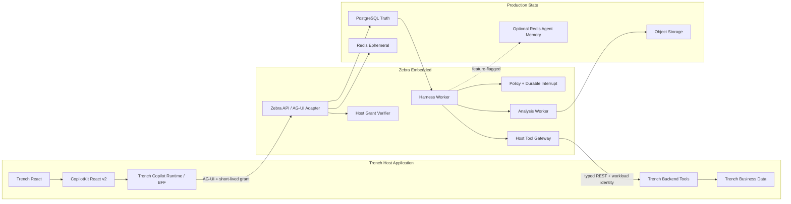

# Zebra Embedded 生产级目标架构

| 字段 | 值 |
|---|---|
| 版本 | v1.1 |
| 日期 | 2026-07-23 |
| 状态 | 架构基线；实现任务尚未激活 |
| 首个 Host Application | Trench |
| 上游边界 | ADR-012、ADR-013、单机与云平台 Runtime 目标架构 |
| 集成决策 | Trench 采用 CopilotKit React v2；Zebra 不建设 React SDK |

本文取代此前拼接在同一文件中的两套冲突草案。它定义目标态和实施顺序，
不代表当前仓库已经具备私有云、多租户或 Trench 生产能力。实际状态以
`PROGRESS.md` 和 `docs/AGENT_TASKS.md` 为准。

## 1. 产品定义与边界

> **Zebra Embedded 是可嵌入业务系统的 Headless Agent Runtime。Trench 是首个 Host Application。**

### 1.1 Zebra 拥有

- 稳定 Task、内部 Execution Segment、Conversation 和 Session Event；
- Harness、Model Gateway、Context Compiler、Tool Gateway 和 Policy；
- durable approval、clarification、interrupt、replay 和 recovery；
- Artifact、Snapshot、技术配额、Sandbox、审计和可观测证据；
- Host authority 的验证、收窄和 namespace 隔离；
- AG-UI 的服务端适配和 Zebra Domain Event 的外部投影。

### 1.2 Trench 拥有

- 用户、组织、成员、登录、MFA、业务 RBAC、订阅、计费和商业配额；
- 事件、实体、证据、专题、文档、Watch、Report 等业务事实；
- Trench 页面、CopilotKit React v2、Copilot Runtime/BFF 和业务 UI；
- 业务查询与写入接口的最终授权；
- HostSessionGrant 的签发和业务资源映射。

### 1.3 永久边界

- Zebra 不复制 Trench 用户、组织、成员或业务权限数据库。
- Zebra 只接收不透明 `namespace_id`，不建立第二套 Tenant 领域。
- Zebra 永不扩大 Host 授予的权限；有效权限是 Host Grant、Zebra Policy、
  Tool Definition 和 Runtime Capability 的交集。
- CopilotKit 不是持久状态权威源。Task、Event、Approval、Receipt 和 Artifact
  始终以 Zebra durable state 为准。

## 2. 最终技术决策

| 领域 | 决策 |
|---|---|
| Agent 内核 | 复用现有 Zebra Harness 和稳定 Task/Segment 模型 |
| Host 前端 | Trench 直接使用 `@copilotkit/react-core/v2` |
| Host BFF | Trench 部署 Copilot Runtime v2 handler |
| Agent 传输 | Zebra 暴露 AG-UI 兼容端点 |
| 浏览器直连 | 仅允许本地 Spike；生产禁止 `agents__unsafe_dev_only` |
| Host 接入 | 首版类型化 REST；MCP 作为后续 Adapter |
| 身份授权 | Trench 签发短期 HostSessionGrant，Zebra 独立验证 |
| Durable State | PostgreSQL Event Store、Projection、Lease、Fencing、Outbox |
| Live State | Redis 只做 fan-out、短期 cache 和通知，不做事实源 |
| Artifact | S3 Compatible Object Storage，PostgreSQL 保存 metadata/manifest |
| Runtime | Kubernetes + Linux gVisor，Sandbox 无业务凭证 |
| 数据分析 | 首版 DuckDB + Polars + PyArrow 批准算子 |
| Agent Memory | 后续可选 Redis Agent Memory Adapter，故障可降级 |
| 可观测性 | OpenTelemetry + 可关联 Task/Run/Tool/Receipt 证据 |
| 部署交付 | Helm；Terraform/GitOps 在 GA 阶段进入门禁 |

明确取消：

- `@zebra-agent/core`、`@zebra-agent/react`、`@zebra-agent/ag-ui`；
- `ZebraProvider` 和 `useZebra*` hooks；
- Embedded 自研长期记忆抽取、pgvector 记忆索引和 Graphiti 图谱；
- 首版 Spark、Iceberg、多区域、任意 Python 和复杂微服务拆分。

## 3. 总体架构



### 3.1 生产请求链路

1. 用户在 Trench 页面发起消息或恢复审批。
2. CopilotKit React v2 请求 Trench 自己的 Copilot Runtime/BFF。
3. BFF 验证 Trench 登录态，计算业务权限并签发短期 HostSessionGrant。
4. BFF 以服务端配置连接 Zebra AG-UI，不信任浏览器传入的 namespace、scope
   或服务凭证。
5. Zebra 验证 Grant，创建或定位稳定 Task，并把命令写入 durable state。
6. Worker 获取 fenced lease，通过 Harness 执行模型、Policy 和工具步骤。
7. Zebra 将 Domain Event 投影为 AG-UI live stream；断线后从 PostgreSQL
   replay，再接 Redis live tail。
8. Trench 后端对每次业务工具调用再次授权并返回可审计 Business Receipt。

## 4. CopilotKit 与 AG-UI 边界

CopilotKit 的正式拓扑是 React frontend、Host application server 中的 Runtime、
以及 AG-UI-compatible agent backend。Trench 使用该拓扑，Zebra 不复制它的
React SDK。参考：

- [CopilotKit v2 API](https://docs.copilotkit.ai/reference/v2)
- [CopilotKit Architecture](https://docs.copilotkit.ai/concepts/architecture)
- [Copilot Runtime](https://docs.copilotkit.ai/a2a/backend/copilot-runtime)

### 4.1 Trench 侧映射

| 原 Zebra SDK 设想 | 最终实现 |
|---|---|
| `ZebraProvider` | `<CopilotKit runtimeUrl="/api/copilotkit">` |
| `useZebraRun` | `useAgent` 和 CopilotKit run controls |
| `useZebraContext` | `useAgentContext` |
| `useZebraSharedState` | `useAgent` state + AG-UI snapshot/delta |
| `useZebraFrontendTool` | `useFrontendTool` |
| `useZebraApproval` | AG-UI interrupt + `useInterrupt` |
| `useZebraArtifact` | Zebra signed Artifact API + Trench renderer |
| `useZebraPresence` | Zebra/Trench Surface Lease；CopilotKit 不替代 |

限制：

- 不用 `useHumanInTheLoop` 代替 Zebra deterministic Policy；它只能渲染交互。
- 不用 CopilotKit Threads/Persistence 代替 Zebra Task/Event Store。
- 浏览器不得通过 `agents__unsafe_dev_only` 直连生产 Zebra。
- Runtime 转发 Header 使用 allowlist；服务端配置的 Host Grant 必须覆盖同名
  浏览器 Header。
- CopilotKit 版本、许可证能力和协议兼容性先由 Spike 固定，再进入生产依赖。

### 4.2 标识映射

| AG-UI | Zebra |
|---|---|
| `threadId` | 稳定 Task ID |
| `runId` | 对外不透明的 Execution Segment attempt ID |
| `parentRunId` | 仅用于显式分支/时间旅行；不暴露普通内部 rollover |
| `messageId` | durable Message/Event correlation ID |
| `toolCallId` | Zebra Tool Call ID 和 Effect Ledger key |
| `interruptId` | durable Approval/Clarification ID |

同一 Task 的自动 Segment rollover 不改变 `threadId`。所有外部 ID 必须在
Host Grant 指定的 `namespace_id` 内解析。

### 4.3 Event 映射

架构和契约测试同时记录 Python SDK class 与 wire `EventType`，避免命名漂移。

| Zebra Domain 事实 | AG-UI SDK class | Wire value |
|---|---|---|
| Run 开始 | `RunStartedEvent` | `RUN_STARTED` |
| Assistant 消息开始 | `TextMessageStartEvent` | `TEXT_MESSAGE_START` |
| Assistant 文本增量 | `TextMessageContentEvent` | `TEXT_MESSAGE_CONTENT` |
| Assistant 消息结束 | `TextMessageEndEvent` | `TEXT_MESSAGE_END` |
| Tool Call 开始 | `ToolCallStartEvent` | `TOOL_CALL_START` |
| Tool 参数增量 | `ToolCallArgsEvent` | `TOOL_CALL_ARGS` |
| Tool Call 结束 | `ToolCallEndEvent` | `TOOL_CALL_END` |
| Tool Result | `ToolCallResultEvent` | `TOOL_CALL_RESULT` |
| 完整状态 | `StateSnapshotEvent` | `STATE_SNAPSHOT` |
| 状态 Patch | `StateDeltaEvent` | `STATE_DELTA` |
| 消息快照 | `MessagesSnapshotEvent` | `MESSAGES_SNAPSHOT` |
| Run 完成/暂停 | `RunFinishedEvent` | `RUN_FINISHED` |
| Run 失败 | `RunErrorEvent` | `RUN_ERROR` |

映射必须为纯投影：AG-UI 事件丢失或客户端断线不能改变 Zebra durable state。

### 4.4 Durable interrupt

审批和澄清采用 [AG-UI Interrupt](https://docs.ag-ui.com/concepts/interrupts)：

1. Zebra 先持久化 Approval/Clarification 事实。
2. 在 `RUN_FINISHED` interrupt outcome 前发送恢复所需的 State 和 Messages
   snapshots。
3. Trench 在同一 `threadId` 提交 `resume[]`，覆盖全部 open interrupts。
4. Zebra 校验 `interruptId`、expiry、response schema、Policy 和 authority。
5. 相同 `(threadId, interruptId, status, payload)` 重放必须幂等。
6. 拒绝是 payload 中的业务答案，不是绕过 Policy 的独立状态。

## 5. Host authority

### 5.1 HostSessionGrant

Trench 后端签发短期 JWT。示例只表达契约，不固定具体 IdP：

```json
{
  "iss": "https://api.trench.example.com",
  "aud": "zebra-embedded",
  "sub": "opaque-subject-ref",
  "jti": "grant_01",
  "iat": 1784808000,
  "nbf": 1784808000,
  "exp": 1784808300,
  "host_app_id": "trench",
  "namespace_id": "opaque-namespace-ref",
  "workspace_ref": "opaque-workspace-ref",
  "resource_refs": [{"type": "trench.event", "id": "evt_123"}],
  "scopes": ["agent.run", "trench.event.read"],
  "limits": {
    "max_runtime_seconds": 300,
    "max_model_tokens": 100000,
    "max_artifact_bytes": 104857600
  },
  "origin": "https://trench.example.com",
  "policy_version": "trench-policy-v1"
}
```

验证规则：

- 固定 issuer registry、audience、JWKS algorithm 和 key rotation policy；
- 校验 `exp/nbf/iat/jti`、允许 origin、host app、namespace、resource 和 scopes；
- 防止 `jti` 重放；Redis 可加速，PostgreSQL 保留审计证据；
- 原始 Token、业务用户资料和服务凭证不得进入 Event Store 或日志；
- 只持久化 token digest、issuer、jti、namespace、scope 摘要和验证结果；
- local profile 可保留现有静态 token，但 Embedded production profile 禁止回退。

### 5.2 有效权限

```text
effective_authority =
  host_grant_scopes
  ∩ zebra_policy
  ∩ tool_definition_scopes
  ∩ runtime_capabilities
  ∩ current_resource_binding
```

Trench 对 Backend Tool 再执行一次业务授权。Zebra 的允许不等于 Trench 的允许。

## 6. Tool 与前端协同

### 6.1 Trench Backend Tools

首个只读切片：

```text
trench.query.get_event
trench.query.get_evidence
trench.query.get_related_events
trench.query.get_entity_timeline
trench.query.get_topic
```

受控写回阶段才增加：

```text
trench.command.save_report
trench.command.create_watch
```

每个 Tool Definition 必须声明 version、JSON Schema、required scopes、risk、
timeout、size limit、idempotency、execution location 和 receipt schema。Trench
返回的数据是 untrusted business content，不能被当作系统指令。

Tool Gateway 必须具备：

- workload identity 和 exact destination allowlist；
- DNS/redirect/SSRF 防护、连接和整体超时、响应大小限制；
- circuit breaker、bounded retry、idempotency key；
- scope intersection、resource binding 和 Business Receipt；
- 结构化普通失败返回 Agent，自主决定修正、替代或结束；
- 不把 Trench service token 暴露给模型或 Sandbox。

### 6.2 Frontend Tools

允许语义动作：

```text
trench.ui.open_event
trench.ui.highlight_evidence
trench.ui.select_timeline_range
trench.ui.open_compare_panel
trench.ui.show_analysis_panel
trench.ui.open_watch_form
```

禁止 `eval`、任意 JavaScript、DOM selector、HTML/JSX 注入和无限制导航。

每个 Frontend Tool 必须有 capability version、input/output schema、presence
要求、Surface Lease、idempotency key 和 Action Receipt。页面卸载或 lease 过期
后，Zebra 不得继续向旧 surface 派发动作。

### 6.3 Shared State

- `/agent`：Zebra 写，Trench 读；
- `/host`：Trench 写，Zebra 读；
- `/shared`：通过版本化协调器写；
- Patch 使用 JSON Patch，并携带 `base_version` 和 `state_version`；
- 版本冲突触发 snapshot/resync，不做 last-write-wins 猜测；
- 大对象只通过 `ResourceRef` 或 `ArtifactRef` 引用。

## 7. Durable state 与实时传输

### 7.1 PostgreSQL 事实源

PostgreSQL 保存：

- Task、Segment、Session Event 和 monotonic sequence；
- Projection、active Segment、Approval、Clarification；
- Worker Lease、fencing token、Effect Ledger、Outbox/Inbox；
- Artifact metadata、Snapshot manifest、Callback/Delivery ledger；
- Host registry、Grant audit 和 namespace binding。

追加 Event、更新 Projection、写 Effect/Outbox 必须在明确事务边界内完成。
所有异步消费者至少一次执行，因此外部副作用必须幂等。

### 7.1.1 当前 authoritative composition 边界

在选择 PostgreSQL Adapter 之前，Zebra API、SSE 与 Worker 必须接收同一个平坦的
`ControlPlaneStores`。这个组合根覆盖所有会推进 Session、约束副作用或治理记忆的
durable collaborator：Event/Projection、Workspace/Task/Lease、context lifecycle、
handoff/dispatch、idempotency、effect ledger、governed memory、Artifact payload 与
索引、provider continuation、session history 和 delivery audit。

当前 local profile 仍由唯一 SQLite builder 构造这组 Ports；注入完成后，业务流不得
再把 `database_path` 当作权威事实定位器或临时重建 Store。Context lifecycle 与
handoff 继续作为聚合事务 Port，未来 PostgreSQL Adapter 必须在各自边界内保证 Event、
Projection、dispatch/effect 等协调写入的原子性。Memory review 当前仅保证所有事实写入
同一 backend，跨 Store call 的原子性由后续 PostgreSQL/Outbox 设计补齐。

这条边界不选择 PostgreSQL、Redis、Object Storage 或远程语义记忆 provider，也不改变
Zebra `MemoryStorePort` 的治理权威；Mem0 等候选服务只能通过单独门禁的、可降级的派生
Gateway 接入。

### 7.2 Redis 临时职责

Redis 只承担：

- live event fan-out；
- command notification 和短期 routing hint；
- bounded cache、rate limit 和短期 jti replay acceleration。

Redis 丢失不得丢 Task 或改变业务事实。任何 live stream 缺口都从 PostgreSQL
cursor replay；禁止把 Redis lease 当成唯一 fencing authority。

### 7.3 Object Storage

S3-compatible storage 保存大型 Artifact、Dataset Snapshot、分析中间结果和
Sandbox Snapshot payload。PostgreSQL 保存 checksum、size、content type、
namespace、retention、manifest 和 lineage。下载使用短期签名 URL，并在读取时
校验 namespace、资源绑定和文件存在性。

## 8. 数据分析

首版只支持可预测、可复现的批准算子：

- Trench 生成 immutable DatasetRef 或签名 snapshot；
- Zebra 以 DuckDB、Polars、PyArrow 执行白名单查询、聚合和窗口计算；
- AnalysisManifest 固定输入版本、算子、参数、资源预算和输出 schema；
- Finding 引用 DatasetRef、metric、evidence、counter-evidence 和算法版本；
- 所有结果进入 Artifact/lineage，不把大数据直接塞入 Prompt；
- Phase Detection 是确定性分析结果，不依赖模型自由猜测。

首版不引入 Spark、Iceberg、任意 Python 或用户自定义包。只有真实数据量、SLO
和成本证据证明单机算子不足时，才单独激活扩展任务。

## 9. Agent Memory

Zebra durable foundation 的当前调度优先于 Trench read-only，但首个只读切片仍不
把远程长期记忆设为运行时依赖。现有 local profile 的本地 Memory 保持兼容；
Embedded production profile 通过独立 `AgentMemoryGateway` 接入 Redis Agent
Memory，而不是把远程服务强塞进现有本地 Store Port。

约束：

- feature flag 默认关闭；
- owner/session/namespace/topic 全部使用不透明 Host 映射；
- 写入通过 delivery ledger/outbox 保证幂等和可对账；
- timeout、rate limit、schema drift 或服务不可用时降级，不使 Run 失败；
- 删除、保留期、redaction 和 audit 独立验证；
- 每日 contract test 检测 Preview API 漂移；
- 不建设 Embedded pgvector 或 Graphiti 备用事实源。

Redis Agent Memory 当前仍标注为 Public Preview，必须保持可替换边界：
[Redis Agent Memory service](https://redis.io/docs/latest/operate/rc/context-engine/agent-memory/create-service/)。

## 10. 生产部署单元

### 10.1 首个生产形态

```text
Trench deployment
├── Trench Web
├── Copilot Runtime / BFF
└── Trench Backend Tool API

Zebra deployment
├── zebra-api
├── zebra-worker
├── zebra-analysis-worker       # 分析阶段再启用
├── PostgreSQL
├── Redis
├── S3-compatible Object Storage
└── OpenTelemetry Collector
```

`zebra-worker` 初期组合 orchestrator、projection、outbox 和 retention。只有满足
以下任一条件才拆服务：独立伸缩、独立故障域、独立安全边界或明确 SLO 冲突。
Host Gateway 和 Memory Gateway 首先是 package/adapter 边界，不预先创建网络
微服务。

### 10.2 Runtime

- Linux Kubernetes 节点运行 gVisor；production 缺失能力时 fail closed；
- image digest 固定，read-only root、non-root、drop capabilities；
- Setup 与 Agent 阶段分离；Agent 默认无网络；
- Credential/Egress Broker 在多租户前完成；
- Workspace 使用受限 volume，Snapshot/restore 以 durable manifest 为准；
- Kata 只在多租户威胁模型证明 gVisor 不足后引入。

## 11. 仓库落点

当前 Zebra monorepo 不增加 TypeScript SDK workspace。实现按现有层次落位：

```text
packages/agent-core/          # generic Host/AG-UI-facing domain contracts only
packages/agent-integrations/  # AG-UI, Host REST, later Memory adapters
packages/agent-storage/       # PostgreSQL and object-storage adapters
packages/agent-runtime/       # Kubernetes/gVisor runtime adapters
packages/agent-security/      # Grant, Policy, credential and egress boundaries
apps/api/                     # composition + HTTP/AG-UI adapter
apps/worker/                  # composition + worker loops
tests/                        # contract, replay, failure and real-cluster gates
```

Trench 的 CopilotKit、BFF、页面组件和业务 Tools 只进入 Trench 仓库。只有模块规模、
所有权或独立发布证据成立时，才新增 `agent-host` 或 `agent-data` package。

## 12. 安全基线

- CORS 使用 exact origin allowlist，生产禁止 `*`；
- 所有 Host URL、redirect 和 DNS resolution 通过 SSRF/egress policy；
- Prompt、Host 数据、Tool Result 和 Artifact 默认低信任；
- Artifact URI 只从结构化 provenance 进入 Context；
- Side-effect Tool 先经过 Zebra Policy/Approval，再由 Trench 重新授权；
- callback 使用签名、timestamp、nonce、idempotency 和 reconciliation；
- namespace 必须贯穿 PostgreSQL、Redis key、S3 prefix、log、trace 和 metric；
- secrets 不进入模型、事件、日志、前端 storage、Sandbox 或 Artifact；
- 错误使用 RFC 9457 problem details，并区分普通工具失败、授权拒绝、协议错误
  和系统不可恢复错误。

## 13. 可观测性与 SLO

每条链路至少关联：

```text
namespace_id
task_id
segment_id
run_id
event_sequence
tool_call_id
approval_id
artifact_id
receipt_id
trace_id
```

核心指标：run latency、first-token latency、replay lag、worker lease conflict、
duplicate effect suppression、tool error class、interrupt age、callback lag、
artifact failure、namespace denial、memory degraded rate、token/cost evidence。

上线前必须定义并压测 availability、P95/P99 latency、RPO、RTO、最大 replay
时间、最大并发 Task 和 namespace noisy-neighbor 门槛。

## 14. 实施顺序与门禁

完整任务卡、依赖、Owned paths 和验收见
[`Zebra Embedded与Trench实施任务拆解_v1.0.md`](./Zebra%20Embedded与Trench实施任务拆解_v1.0.md)。

两条基础 lane 与当前调度顺序：

```text
架构收敛
→ CopilotKit/AG-UI Spike
→ Zebra Storage composition seam
→ Zebra authoritative Store composition completion
→ Cloud durable foundation
→ Redis Agent Memory Gateway / Preview gate（可降级增强）
→ Host/AG-UI/Surface 协议
→ Trench 只读链路
→ 生产只读 E2E 汇合
→ 前端协同
→ 数据分析
→ 受控写回
→ 多租户 GA
```

任何实现卡开始前必须满足：

1. 上游卡已合并到最新 `main`；显式批准的 stacked local task 必须记录硬性合并顺序；
2. 卡在 `docs/AGENT_TASKS.md` 中为 `Ready`；
3. 一个 owner、一个 branch、一个 worktree、一个主 PR；
4. Owned paths 和验证命令已固定；
5. 跨 Zebra/Trench 仓库工作拆成各自独立任务；
6. PostgreSQL Adapter 开始前，Cloud Phase B 的迁移、备份、恢复和回滚模型已评审；
   纯 composition seam 不以该评审为前置条件。

## 15. 阶段验收

### 15.1 Read-only production slice

- Trench Event Detail 通过 Copilot Runtime/BFF 调用 Zebra AG-UI；
- stream、reload、cancel、resume、replay 均保持同一 Task；
- 五个只读 Tool 通过真实 Trench 权限和 typed receipt；
- forged/expired Grant、错误 origin、越权 scope 和跨 namespace 全部拒绝；
- Redis 重启不丢 Task，Worker crash 不重复副作用；
- PostgreSQL restore 和 S3 Artifact restore 有演练证据。

### 15.2 Frontend collaboration

- Surface Lease 过期后不派发动作；
- Shared State 冲突可检测并 resync；
- Frontend Tool 只有语义动作、schema 和 receipt；
- 页面刷新或离开不会执行旧 capability。

### 15.3 Analysis

- DatasetRef immutable、checksum 可验证；
- AnalysisManifest 可重放，同输入同版本产生同结果；
- Finding 包含证据、反证、metric 和 lineage；
- 资源超限可取消且不污染 durable truth。

### 15.4 Controlled writeback

- `save_report/create_watch` 经过 durable interrupt；
- Trench 在写入时重新授权；
- duplicate resume、callback retry 和 Worker crash 不产生双写；
- 每次写入均有 Zebra Effect Receipt 和 Trench Business Receipt。

### 15.5 GA

- namespace 隔离覆盖数据库、cache、object、logs、metrics 和 backups；
- Credential/Egress Broker、quota、SLO、load、chaos、PITR、DR 完成；
- Helm/Terraform、canary、rollback、runbook 和 on-call evidence 完成；
- 未通过真实集群 E2E 前不得宣称 private-cloud 或 multi-tenant ready。

## 16. 架构决策索引

- ADR-012：Zebra Runtime 与外部业务边界；
- ADR-013：稳定 Task 与内部 Execution Segment；
- ADR-014：Skill、MCP、Plugin 扩展体系；
- ADR-015：Zebra Embedded 使用 CopilotKit/AG-UI，取消 Zebra React SDK。

ADR-015 见
[`ADR-015_Zebra_Embedded与CopilotKit_AGUI边界.md`](./ADR-015_Zebra_Embedded与CopilotKit_AGUI边界.md)。

## 17. 明确非目标

- 不在本任务实现任何生产代码；
- 不把当前 SQLite local profile 描述成 cloud-ready；
- 不由 Zebra 承担 Trench 身份、业务 RBAC 或计费；
- 不为了目标图提前拆分微服务或新 package；
- 不在第一条链路加入 Spark、Graphiti、pgvector、动态 Python、A2A 或 A2UI；
- 不允许 CopilotKit UI 状态覆盖 Zebra durable truth；
- 不在未完成迁移和恢复验证前激活私有云生产声明。
