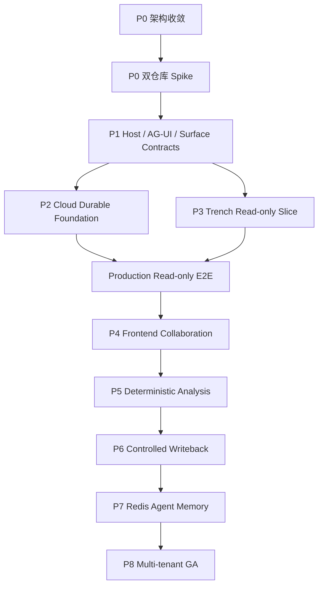

# Zebra Embedded 与 Trench 实施任务拆解 v1.0

| 字段 | 值 |
|---|---|
| 日期 | 2026-07-23 |
| 架构基线 | `Zebra Embedded 生产级目标架构.md`、ADR-015 |
| 当前可执行任务 | `EMB-PLAN-01`（Review）、`EMB-AGUI-SPIKE-01`（In Progress） |
| 其他任务 | `Locked`，等待 maintainer 逐卡激活 |
| 第一业务验收 | Trench Event Detail 的生产只读链路 |

## 1. 执行规则

1. 一个任务、一个 owner、一个 branch、一个 worktree、一个主 PR。
2. Zebra 与 Trench 的修改必须拆成不同仓库任务，不创建跨仓库巨型 PR。
3. 合并顺序固定为 ADR/Contract → Domain/Ports → Adapter → App Wiring → E2E。
4. 下列 Owned paths 是锁定前的候选边界；任务变为 `Ready` 前必须在对应仓库
   的任务注册表中落实到精确文件或子目录。
5. Shared files、root config、`PROGRESS.md` 和 contracts 是协调热点，不与功能
   Adapter 混入同一 PR，除非任务明确拥有。
6. 所有 Zebra 实现任务先运行 `make sync`，完成 focused tests，并以
   `make check` 收口。Trench 命令在该仓库任务卡激活时固定。
7. `Locked` 不代表可以提前编码；依赖必须已经合并到最新 `main`。

## 2. 总依赖

Cloud foundation 和 read-only feature 可以在协议冻结后并行，但只有两条线在
真实环境汇合并通过恢复/安全门禁后，才可称为 production read-only。

## 3. P0：架构与兼容性

### EMB-PLAN-01 — Embedded architecture consolidation

- Status/branch: `Review` / `zebra-cloud-trench`；Zebra repo。
- Depends on: ADR-012、ADR-013、Runtime blueprint、maintainer 的 CopilotKit 决策。
- Owned paths: 目标架构、ADR-015、本任务拆解、任务注册表和治理记录。
- Deliverable: 一份无冲突目标架构，删除 React SDK 和 pgvector/Graphiti 方案。
- Acceptance: 文档、链接、任务依赖和项目状态一致；不修改生产代码。

### EMB-AGUI-SPIKE-01 — Zebra AG-UI protocol spike

- Status: `In Progress`；branch `codex/emb-agui-spike-01`；Zebra repo。
- Depends on: `EMB-PLAN-01`；maintainer 已明确激活 stacked local branch，合并仍等待依赖进入 `main`。
- Owned paths: `pyproject.toml`, `uv.lock`, `tests/spikes/ag_ui/`, focused compatibility note and governance records。
- Deliverable: pin `ag-ui-protocol`；验证 encoding、SSE、interrupt/resume、unknown event。
- Acceptance: golden stream 可被官方 Python client decode；不接入 API/Worker production wiring。

### TRN-CPK-SPIKE-01 — Trench CopilotKit v2 runtime spike

- Status: `Locked`；Trench repo only。
- Depends on: `EMB-PLAN-01` merged。
- Candidate paths: Trench isolated spike route/page/test fixture；精确路径由 Trench 注册。
- Deliverable: `<CopilotKit>` → Runtime v2 handler → `HttpAgent` → fake Zebra AG-UI。
- Acceptance: text、tool、interrupt、resume、reload、Header policy 全通过；记录版本和许可证边界。

### P0 gate

- 两个 Spike 固定同一协议版本矩阵和升级策略。
- 生产不使用 `agents__unsafe_dev_only`。
- 未确认 OSS/Enterprise 边界的功能不得成为 required dependency。

## 4. P1：协议冻结

### EMB-HOST-CON-01 — Generic Host authority contracts

- Status: `Locked`；Zebra repo；depends on both P0 Spikes。
- Candidate paths: `packages/agent-core/src/agent_core/domain/host_authority.py`, contract tests。
- Deliverable: HostSessionGrant claims、HostContextEnvelope、ResourceRef、namespace、scope、limits、errors。
- Acceptance: no Trench imports；invalid issuer/origin/expiry/scope/resource fixtures fail closed。

### EMB-AGUI-CON-01 — Durable AG-UI projection contract

- Status: `Locked`；Zebra repo；depends on `EMB-HOST-CON-01`。
- Candidate paths: `packages/agent-integrations/src/agent_integrations/ag_ui/`, contract tests。
- Deliverable: Task/thread、Segment attempt/run、event、cursor、interrupt/resume mapping。
- Acceptance: golden fixtures cover text/tool/state/error/reconnect；mapping is a pure projection。

### EMB-SURFACE-CON-01 — Frontend surface and shared-state contracts

- Status: `Locked`；Zebra repo；depends on `EMB-AGUI-CON-01`。
- Candidate paths: focused `agent-core` domain/port modules and contract tests。
- Deliverable: FrontendCapability、SurfaceLease、ActionReceipt、state partition/version/patch。
- Acceptance: expiry、unmount、duplicate action、version conflict and resync are deterministic。

### EMB-TOOL-CON-01 — Host tool contract extension

- Status: `Locked`；Zebra repo；depends on `EMB-HOST-CON-01`。
- Candidate paths: focused modules under `packages/agent-tools/`, contract tests。
- Deliverable: execution location、scope、risk、timeout、size、idempotency、receipt schema。
- Acceptance: reuses existing ToolDefinition/Result contracts; no parallel tool model。

### P1 gate

- Python/JSON/TypeScript fixtures share versioned schemas and canonical examples。
- Unknown fields/events have explicit forward-compatibility behavior。
- Contract PRs merge before any storage, transport or UI adapter PR。

## 5. P2：Cloud durable foundation

### CLOUD-STO-SEAM-01 — Storage composition seam

- Status: `Locked`；Zebra repo；depends on P1 contracts and explicit Phase B activation。
- Candidate paths: API/Worker composition modules, config settings, focused tests。
- Deliverable: inject existing Store Ports instead of constructing SQLite throughout request/worker flows。
- Acceptance: local SQLite behavior and full suite remain unchanged; no PostgreSQL code yet。

### CLOUD-PG-01 — PostgreSQL event and projection storage

- Status: `Locked`；depends on `CLOUD-STO-SEAM-01`。
- Candidate paths: `packages/agent-storage/.../postgres/`, migrations, storage tests。
- Deliverable: Event Store、Projection、monotonic sequence、expected-version CAS、replay。
- Acceptance: concurrent append/idempotency/rebuild tests plus real PostgreSQL CI pass。

### CLOUD-LEASE-01 — Lease, fencing and outbox/inbox

- Status: `Locked`；depends on `CLOUD-PG-01`。
- Candidate paths: isolated PostgreSQL lease/outbox modules and worker integration tests。
- Deliverable: fenced worker ownership、atomic effect/outbox、at-least-once consumers。
- Acceptance: two-worker race, crash after commit and duplicate delivery never duplicate effects。

### CLOUD-ART-01 — Object storage

- Status: `Locked`；depends on `CLOUD-PG-01`；may parallel `CLOUD-LEASE-01` by subpath。
- Candidate paths: `agent-storage` object adapter, Artifact/Snapshot composition, tests。
- Deliverable: S3/MinIO payload、PostgreSQL manifest、checksum、signed access、retention。
- Acceptance: missing/deleted object, cross-namespace access and restore are covered。

### CLOUD-LIVE-01 — Redis live fan-out

- Status: `Locked`；depends on `CLOUD-PG-01` and `CLOUD-LEASE-01`。
- Candidate paths: Redis adapter, outbox publisher, API stream composition, integration tests。
- Deliverable: replay-plus-tail without per-client SQLite polling；Redis remains ephemeral。
- Acceptance: Redis restart/gap falls back to PostgreSQL cursor with no lost/duplicated public event。

### CLOUD-RT-01 — Kubernetes gVisor profile

- Status: `Locked`；depends on `CLOUD-ART-01` and existing Phase A Runtime。
- Candidate paths: runtime Kubernetes adapter, Helm manifests, real-cluster CI fixtures。
- Deliverable: gVisor RuntimeClass、bounded volume、Snapshot restore、default-deny network。
- Acceptance: real cluster executes/cancels/restores and fails closed without gVisor。

### CLOUD-REC-01 — Migration, backup and recovery gate

- Status: `Locked`；depends on all prior P2 cards。
- Candidate paths: migration/recovery tests, runbook, acceptance evidence only。
- Deliverable: SQLite export/import policy、PostgreSQL PITR、S3 restore、rollback and failover drill。
- Acceptance: measured RPO/RTO and repeatable commands; no production claim without evidence。

### P2 gate

- PostgreSQL and S3 are truth; Redis can be erased without Task loss。
- Multi-worker fencing and duplicate suppression are proven on real services。
- Migration/backup/rollback review is signed before production traffic。

## 6. P3：Trench read-only vertical slice

### EMB-AUTH-01 — Host registry and Grant verifier

- Status: `Locked`；Zebra repo；depends on `EMB-HOST-CON-01` and `CLOUD-PG-01`。
- Candidate paths: `agent-security` verifier/registry, config, API auth middleware, tests。
- Deliverable: issuer/JWKS/aud/jti/origin/namespace/resource/scope validation and exact CORS。
- Acceptance: forged, expired, replayed and cross-namespace grants fail closed; local profile remains compatible。

### EMB-AGUI-API-01 — Production AG-UI endpoint

- Status: `Locked`；Zebra repo；depends on `EMB-AGUI-CON-01`, `EMB-AUTH-01`, `CLOUD-LIVE-01`。
- Candidate paths: AG-UI integration package, API route/composition, focused tests。
- Deliverable: run、stream、stop、resume、replay-tail and RFC 9457 failures。
- Acceptance: API only writes commands/reads projections; Harness never executes in API process。

### EMB-HOST-GW-01 — Typed Host Tool Gateway

- Status: `Locked`；Zebra repo；depends on `EMB-TOOL-CON-01` and `EMB-AUTH-01`。
- Candidate paths: `agent-integrations/.../host_tools/`, security transport helpers, tests。
- Deliverable: manifest discovery/invoke、workload identity、scope intersection、SSRF、receipt。
- Acceptance: timeout/4xx/5xx/invalid body are structured recoverable results; secrets never reach model/Sandbox。

### TRN-READ-01 — Trench read Tool API

- Status: `Locked`；Trench repo only；depends on P1 contracts。
- Candidate paths: Trench internal Zebra tool controller/service/schema/tests。
- Deliverable: get_event/evidence/related_events/entity_timeline/topic。
- Acceptance: authoritative Trench RBAC/resource checks, bounded payloads and idempotent reads。

### TRN-CPK-BFF-01 — Trench production Copilot Runtime/BFF

- Status: `Locked`；Trench repo only；depends on `TRN-CPK-SPIKE-01` and `EMB-AUTH-01` contract。
- Candidate paths: Trench server runtime route, auth/grant exchange and tests。
- Deliverable: Runtime v2 handler registers Zebra HttpAgent and server-side Header allowlist。
- Acceptance: no browser service secret/direct agent; refresh/expiry and origin policy tested。

### TRN-PANEL-01 — Read-only Copilot panel

- Status: `Locked`；Trench repo only；depends on `TRN-CPK-BFF-01` and `TRN-READ-01`。
- Candidate paths: Event Detail panel, CopilotKit hooks/renderers, frontend tests。
- Deliverable: current event context、streamed messages、tool/result and Artifact references。
- Acceptance: no Zebra SDK package; reload resumes same thread/Task without duplicating message。

### EMB-TRN-READ-E2E-01 — Production read-only acceptance

- Status: `Locked`；Zebra acceptance repo paths only；depends on all P2/P3 cards。
- Candidate paths: root cross-service integration tests and focused acceptance record。
- Deliverable: real Trench Event Detail → BFF → Zebra → Trench Tool chain。
- Acceptance: stream/reload/cancel/resume, forged grant, namespace denial, worker/Redis restart all pass。

### P3 gate

- This is the first production business milestone。
- No analysis, frontend mutation, writeback or remote memory is required for exit。
- Failures report truthful structured evidence; no silent fallback to unauthenticated/local behavior。

## 7. P4：Frontend collaboration

### EMB-SURFACE-01 — Surface lease and action dispatch

- Status: `Locked`；Zebra repo；depends on `EMB-SURFACE-CON-01` and P3 gate。
- Candidate paths: focused core/storage/API modules and tests。
- Deliverable: register/renew/revoke surface、presence、capability snapshot、Action Receipt。
- Acceptance: expired/unmounted surface rejects dispatch; retries are idempotent and auditable。

### TRN-STATE-01 — CopilotKit shared state integration

- Status: `Locked`；Trench repo only；depends on `EMB-SURFACE-01` contract。
- Candidate paths: Trench panel state bridge and tests。
- Deliverable: `/agent` `/host` `/shared` ownership, versioned patch and resync UI。
- Acceptance: stale base version cannot overwrite newer state; large data remains referenced。

### TRN-FRONTEND-TOOLS-01 — Semantic frontend tools

- Status: `Locked`；Trench repo only；depends on `TRN-STATE-01`。
- Candidate paths: Event Detail capability registry/handlers/renderers/tests。
- Deliverable: highlight/select/open/compare/show-analysis actions via `useFrontendTool`。
- Acceptance: no DOM/eval/arbitrary navigation; presence/schema/receipt enforced。

### EMB-TRN-FRONTEND-E2E-01 — Collaboration failure matrix

- Status: `Locked`；depends on all P4 cards。
- Candidate paths: Zebra integration/E2E fixtures and acceptance record。
- Deliverable: disconnect、unmount、duplicate action、state conflict and reconnect scenarios。
- Acceptance: no stale action and deterministic snapshot/resync across browser/API restart。

## 8. P5：Deterministic analysis

### DATA-CON-01 — Analysis contracts

- Status: `Locked`；Zebra repo；depends on P3 gate。
- Candidate paths: focused `agent-core` analysis domain/port modules and tests。
- Deliverable: DatasetRef、AnalysisManifest、JobRef、Metric、Finding、lineage schemas。
- Acceptance: immutable IDs/checksum/version/resource limits and serialization fixtures pass。

### TRN-DATASET-01 — Trench dataset snapshot API

- Status: `Locked`；Trench repo only；depends on `DATA-CON-01` fixtures。
- Candidate paths: Trench snapshot service/object writer/auth/tests。
- Deliverable: authorized immutable dataset snapshot or signed reference。
- Acceptance: exact query/time range/version/checksum recorded; expiry and revocation tested。

### DATA-RUNTIME-01 — Approved DuckDB/Polars runtime

- Status: `Locked`；Zebra repo；depends on `DATA-CON-01`, `TRN-DATASET-01`, `CLOUD-ART-01`。
- Candidate paths: focused data runtime adapter under `agent-runtime`, tool wiring, tests。
- Deliverable: inspect/estimate/submit/cancel approved operators with CPU/memory/time limits。
- Acceptance: no arbitrary Python/package/network; deterministic replay and cancellation pass。

### DATA-PHASE-01 — Event propagation phase detection

- Status: `Locked`；Zebra repo；depends on `DATA-RUNTIME-01`。
- Candidate paths: focused deterministic analysis module and tests/fixtures。
- Deliverable: versioned phase algorithm with evidence, counter-evidence and confidence inputs。
- Acceptance: same manifest/data/version yields same Finding; model prose cannot alter fact fields。

### TRN-ANALYSIS-UI-01 — Analysis rendering

- Status: `Locked`；Trench repo only；depends on `DATA-PHASE-01` output contract。
- Candidate paths: CopilotKit renderers, PhaseTimeline/cards and frontend tests。
- Deliverable: metric/finding/lineage rendering and semantic panel actions。
- Acceptance: every claim links to DatasetRef/evidence/algorithm version; no raw large data in chat state。

### EMB-TRN-ANALYSIS-E2E-01 — Reproducible analysis gate

- Status: `Locked`；depends on all P5 cards and `CLOUD-RT-01`。
- Candidate paths: Zebra real-service E2E and acceptance evidence。
- Deliverable: snapshot → compute → Finding → UI trace with retry/cancel/restart。
- Acceptance: output is reproducible, bounded, lineage-complete and recoverable after worker loss。

## 9. P6：Controlled writeback

### EMB-APPROVAL-01 — AG-UI durable approval adapter

- Status: `Locked`；Zebra repo；depends on P4 gate and existing durable Policy/Approval。
- Candidate paths: AG-UI adapter projection/resume modules and regression tests。
- Deliverable: persisted approval → interrupt outcome → same-thread idempotent resume。
- Acceptance: expiry/deny/cancel/reload/crash never bypass Policy or lose pending state。

### TRN-WRITE-01 — Trench save_report/create_watch tools

- Status: `Locked`；Trench repo only；depends on `EMB-APPROVAL-01` contract。
- Candidate paths: Trench command controllers/services/idempotency/RBAC/tests。
- Deliverable: only save_report and create_watch with Business Receipt。
- Acceptance: re-authorize at execution time; duplicate idempotency key returns same outcome。

### EMB-CALLBACK-01 — Signed callback and reconciliation

- Status: `Locked`；Zebra repo；depends on `TRN-WRITE-01` and `CLOUD-LEASE-01`。
- Candidate paths: host callback adapter, delivery ledger/storage, worker wiring, tests。
- Deliverable: signed callback、outbox retry、receipt correlation、reconciliation。
- Acceptance: crash/retry/out-of-order callback is auditable and cannot create double write。

### EMB-TRN-WRITE-E2E-01 — Writeback safety gate

- Status: `Locked`；depends on all P6 cards。
- Candidate paths: Zebra cross-service E2E and acceptance record。
- Deliverable: approve/deny/expire/duplicate/crash/reconcile matrix on real services。
- Acceptance: each success has Zebra Effect Receipt + Trench Business Receipt; zero double writes。

## 10. P7：Redis Agent Memory

### MEM-RAM-CON-01 — AgentMemoryGateway contract

- Status: `Locked`；Zebra repo；depends on P6 gate and explicit Preview-risk acceptance。
- Candidate paths: new focused core Port/domain models and contract tests。
- Deliverable: session event、long-term write/search/delete、snapshot/degraded responses。
- Acceptance: distinct from local MemoryStorePort; no Redis SDK in core and no Trench identity domain。

### MEM-RAM-ADP-01 — Redis Agent Memory adapter

- Status: `Locked`；depends on `MEM-RAM-CON-01`。
- Candidate paths: `agent-integrations/.../redis_agent_memory/`, config, tests。
- Deliverable: feature flag、opaque mapping、redaction、timeout、rate limit、circuit breaker。
- Acceptance: Embedded profile disables duplicate self-extraction; local profile remains compatible。

### MEM-RAM-DEL-01 — Memory delivery and deletion ledger

- Status: `Locked`；depends on `MEM-RAM-ADP-01` and `CLOUD-LEASE-01`。
- Candidate paths: delivery storage/worker adapter, delete audit and tests。
- Deliverable: outbox/idempotency/reconciliation/retention/deletion evidence。
- Acceptance: retry cannot duplicate memory; delete outcome is traceable without retaining deleted content。

### MEM-RAM-GATE-01 — Preview drift and fault gate

- Status: `Locked`；depends on all P7 cards。
- Candidate paths: daily contract tests, fault injection and acceptance record。
- Deliverable: schema/version drift detection, outage/rate-limit/timeout/deletion scenarios。
- Acceptance: Memory outage never fails Run; no pgvector/Graphiti fallback fact source appears。

## 11. P8：Namespace isolation and GA

### CLOUD-NS-01 — Opaque namespace isolation

- Status: `Locked`；Zebra repo；depends on P3 gate and production storage adapters。
- Candidate paths: storage/security filters, Redis/S3 conventions, isolation tests。
- Deliverable: namespace propagation and deny-by-default across data/log/trace/metric/backup。
- Acceptance: zero cross-namespace reads/writes under API, worker, tool, artifact and recovery paths。

### CLOUD-BROKER-01 — Credential and Egress Brokers

- Status: `Locked`；depends on `CLOUD-NS-01`。
- Candidate paths: `agent-security`, `agent-integrations`, runtime wiring and security tests。
- Deliverable: Vault/KMS-backed short credentials, exact destination egress and revocation。
- Acceptance: no long-lived secret enters model/Sandbox; rotation/revoke/crash behavior proven。

### CLOUD-KATA-01 — Optional stronger tenant isolation

- Status: `Locked`；depends on multi-tenant threat model and `CLOUD-BROKER-01`。
- Candidate paths: runtime/admission/Helm/real-cluster tests only。
- Deliverable: Kata/node-pool profile only if documented threats exceed gVisor boundary。
- Acceptance: explicit go/no-go decision; no mandatory Kata complexity without evidence。

### CLOUD-GA-01 — Production GA evidence

- Status: `Locked`；depends on every required prior gate。
- Candidate paths: Helm/Terraform/GitOps, load/chaos/DR tests, runbooks and evidence。
- Deliverable: quotas、SLO、PITR、DR、canary、rollback、on-call and capacity plan。
- Acceptance: real cluster passes load/chaos/security/recovery; maintainer explicitly declares GA。

## 12. Activation order

`EMB-PLAN-01` 完成后仍不自动激活代码。建议下一步只在两个仓库分别激活：

1. Zebra：`EMB-AGUI-SPIKE-01`；
2. Trench：`TRN-CPK-SPIKE-01`。

两张 Spike 合并后再激活 P1 协议卡。P2 与 P3 可以按 Owned paths 并行；P3 的
production E2E 必须等待 P2 gate。后续阶段严格按 P4 → P5 → P6 → P7 → P8。

## 13. Global release blockers

任一条件成立时不得宣称完成：

- 只有 mock，没有真实 PostgreSQL/Redis/S3/Kubernetes/Trench 链路；
- migration、backup、restore 或 rollback 未演练；
- auth failure 被误报为零数据、空结果或成功；
- CopilotKit UI state 被当作 durable Task/Approval truth；
- Redis 丢失会丢 Task、Effect 或 Artifact metadata；
- Tool、callback 或 resume 重试会重复业务写入；
- namespace 未贯穿 storage/cache/object/log/trace；
- Memory Preview 故障会使 Run 失败；
- 跨仓库任务没有各自 owner、branch、validation 和 version evidence。
