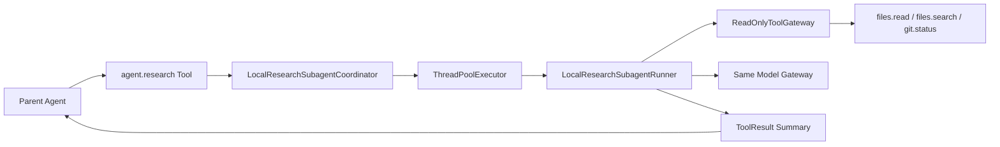
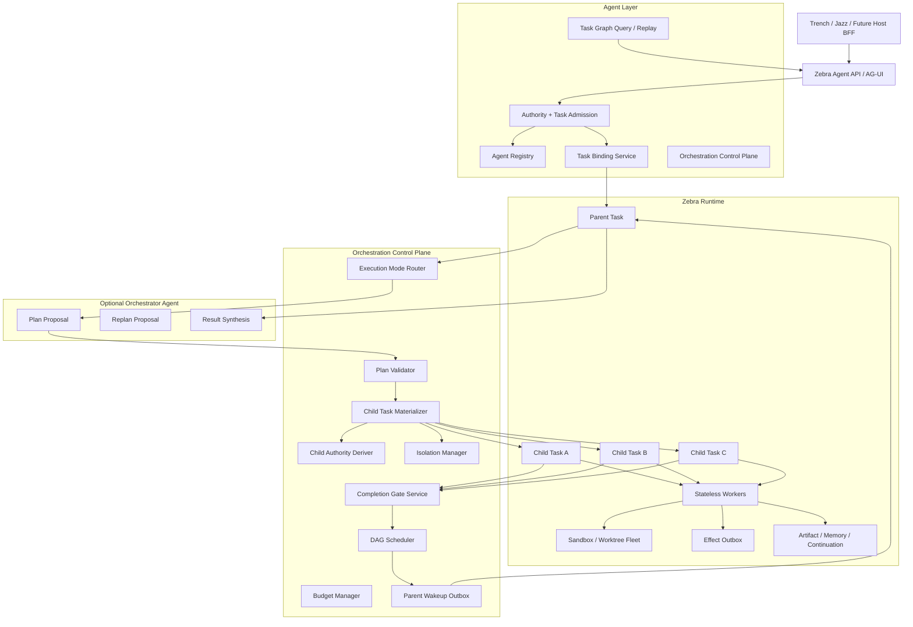
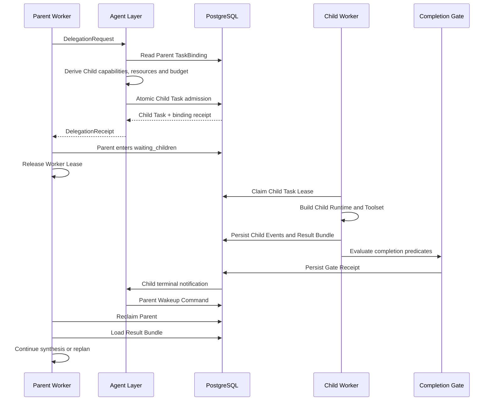
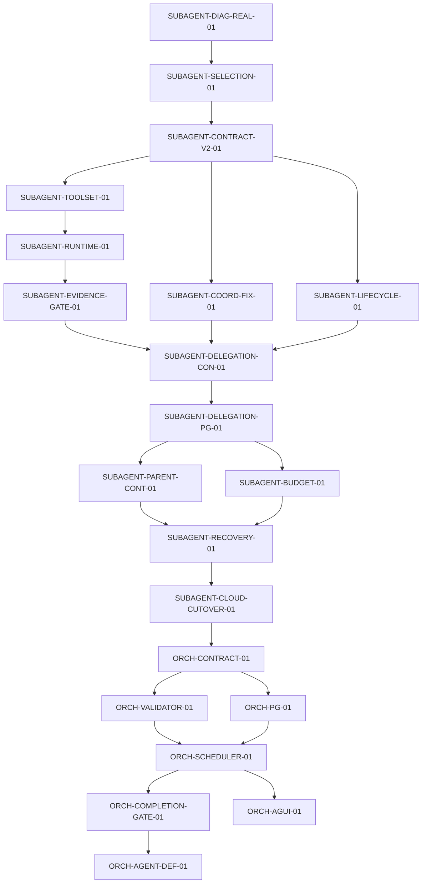

# Zebra Agent Orchestrator 与 Subagent 重构实施方案 v1.0

> 基线：`LogicStormINC/zebra@9758bbdf9c64bca648b542be5c64a022bc7a7507`  
> 日期：2026-08-18  
> 目标：修复当前 Subagent 实际不可用的问题，并在 Zebra Agent Layer 上引入可治理、可恢复、可扩展的 Orchestrator Agent

## 0. 文档说明

本文中的“Cloud Code”按 **Claude Code** 理解。

“DeepSeek Harness”目前没有一个由 DeepSeek 官方发布、且名称唯一对应的完整开源 Agent 产品。本文将两类公开材料结合使用：

1. DeepSeek 官方 API 的 Context Caching、Thinking Mode、Tool Calls 与严格工具协议。
2. 当前较有代表性的 DeepSeek 原生开源 Harness，包括 Zagens 与 `tylerbuilds/deepseek-harness`。

引用这些项目的目的在于提炼 Harness 设计模式，不代表 Zebra 需要复制其实现。

---

# 一、最终结论

Zebra 应采用以下总体路线：

```text
第一步：修复当前 Subagent
第二步：将 Cloud Subagent 升级为 Durable Child Task
第三步：建立确定性的 Orchestration Control Plane
第四步：将 Orchestrator Agent 作为普通 AgentDefinition 发布
第五步：按真实业务需求增加 Agent Team 和跨 Agent Mailbox
```

正式定义：

> **Orchestrator Agent 负责语义规划、任务分解、角色选择、结果综合和重规划建议。**
>
> **Orchestration Control Plane 负责任务物化、权限收窄、预算、依赖、调度、取消、恢复与完成门。**

Zebra 不需要增加第二套 Agent Runtime。现有 Task、Segment、Attempt、Event Store、Lease、Fencing、Effect Outbox、Artifact、Memory、Continuation、TaskBinding 与 Worker 继续作为执行底座。

## 1.1 三种多 Agent 模式

Zebra 后续需要明确区分三种模式：

| 模式 | 协调者 | 适用场景 | 典型隔离方式 |
|---|---|---|---|
| Focused Subagent | Parent Agent | 独立研究、代码检索、测试、Review | 独立上下文，只读快照或 Worktree |
| Orchestrated Team | Orchestrator Agent + Control Plane | 多角色、依赖图、动态重规划、跨层协作 | 每个 Child Task 独立绑定与运行时 |
| Parallel Sessions | 人类操作者 | 多个互不依赖的项目或实现方案 | 独立 Thread、Worktree 或 Cloud Environment |

默认执行策略应为：

```text
Single Agent 优先
→ 存在明确的上下文隔离或并行收益时使用 Subagent
→ 子任务需要互相通信、共享任务图或动态重规划时使用 Orchestrated Team
→ 人类希望同时监督多个独立目标时使用 Parallel Sessions
```

---

# 二、近期主流 Harness 的关键设计

## 2.1 Grok Build

Grok Build 的 Subagent 设计提供了较完整的产品化参考：

1. Child 是独立 Session，拥有自己的上下文窗口。
2. Child 通过 Agent Type 与 Persona 决定模型、工具、提示词、行为与输入输出契约。
3. `spawn_subagent` 支持前台和后台运行。
4. Capability Mode 支持 `read-only`、`read-write`、`execute`、`all`。
5. Workspace 支持共享目录或独立 Git Worktree。
6. `resume_from` 可以从已完成 Child 的 transcript、tool state 与 model 继续。
7. MCP 可以按 all、none、named、except 规则继承。
8. Dedicated Coordinator Actor 持有 pending、active、completed、waiter、deadline 与 completion disposition。
9. 并发达到上限时可以排队或拒绝，并记录 telemetry。
10. TUI 能显示实时 Child 状态、活动、耗时和完整 transcript。
11. `/goal` 将长任务表示为可暂停、可恢复、有检查清单的持续目标。

Zebra 最值得吸收的部分：

```text
Agent Type 与 Persona 分离
Child 独立上下文
Capability Mode 与精细能力绑定并存
Foreground / Background 两种运行方式
Worktree Isolation
Coordinator 持有真实生命周期
Resume 与实时可观测性
```

## 2.2 OpenAI Codex

Codex 同时呈现了两个不同层次的多 Agent 模式。

### Codex App

Codex App 更像人类的 Agent Command Center：

1. 多个 Agent 在不同 Thread 中运行。
2. 每个 Agent 可以在独立 Worktree 中修改同一个仓库。
3. 人类可以切换 Thread、Review Diff、评论和接管。
4. Cloud Environment 与本地 Worktree 都是隔离单元。
5. 长任务可以持续运行，人类只在需要时干预。

### Codex CLI Multi-Agent

当前开源代码中的 Multi-Agent V2 更强调 Agent Team：

1. `spawn_agent` 创建独立 Agent Thread。
2. 支持选择 Role、Model、Reasoning Effort 与 Context Fork 范围。
3. 支持 `send_message`、`followup_task`、`wait_agent`、`interrupt_agent` 与 `list_agents`。
4. Parent Thread、Parent Turn、Root Turn 与 Child Depth 都有明确身份。
5. Child 可以继续创建 Child，深度由配置限制。
6. Agent 之间可以发送消息和最终结果。
7. CLI V2 当前默认共享同一目录与文件系统，因此需要通过任务划分防止写冲突。
8. 是否主动创建 Agent 可以按 Explicit Request 或 Proactive 策略控制。

Zebra 最值得吸收的部分：

```text
Agent Thread 是第一类身份
Context Fork 可以选择 full、tail、none
Agent 间消息是显式协议
多 Agent 模式支持 explicit 与 proactive 策略
Parent、Child、Root 的 lineage 必须持久化
人类 Command Center 与 LLM Orchestrator 分层
```

## 2.3 Claude Code

Claude Code 对多 Agent 产品形态的分类最清晰。

### Subagent

1. 每个 Subagent 拥有独立上下文。
2. 可以指定 System Prompt、Tools、Disallowed Tools、Model、Permission Mode、MCP、Hooks、Memory、Effort 和 Worktree Isolation。
3. Subagent 可以在前台阻塞执行，也可以在后台并发执行。
4. 完成后返回摘要到 Parent。
5. 可以恢复已有 Subagent，并保留完整历史和 Tool Result。
6. Subagent 更适合只需返回结果的聚焦任务。

### Agent Team

1. 一个 Session 作为 Team Lead。
2. 每个 Teammate 拥有独立上下文。
3. 共享 Task List。
4. Teammate 之间可以直接发送消息。
5. Team Lead 负责分工和结果综合。
6. 适合 competing hypotheses、跨层功能和独立模块。
7. 需要更高 Token 成本和更多协调开销。
8. 同文件修改、强顺序依赖的任务收益较低。

Zebra 最值得吸收的部分：

```text
Subagent 与 Agent Team 是两类产品能力
Subagent 只向 Parent 汇报
Agent Team 使用共享任务表和直接消息
Tools 与 Permission 按 Child Definition 控制
Hooks 覆盖 Start、Stop、Tool、Task 与 Teammate 生命周期
```

## 2.4 DeepSeek 原生 Harness

DeepSeek 官方 API 对 Harness 有几个重要约束：

1. Context Cache 依赖完整前缀匹配。
2. 稳定 System Prompt、Tool Schema 和 Policy Prefix 能显著提高缓存命中。
3. Thinking Mode 进行 Tool Call 后，后续请求必须完整回传 `reasoning_content`。
4. Strict Tool Mode 可以让服务端校验 Function JSON Schema。
5. Tool Call 与推理协议错误需要 Harness 层修复和重试。

近期 DeepSeek 原生开源 Harness 进一步强化了：

```text
Flash / Pro 模型路由
任务队列与 Checkpoint
SQLite 或 Event Log 恢复
Approval Receipt
Cost Ledger 与 Budget Ceiling
Trace 与 Replay
Completion Gate
Evidence Envelope
Subagent Dispatch
```

其中最重要的经验是：

> **Agent 是否完成应由 Completion Gate 判断，模型输出“完成”只能作为一个候选信号。**

---

# 三、Zebra 的差异化优势

Zebra 已经拥有很多多 Agent 系统最难补齐的基础设施：

1. Task、Segment、Attempt 与连续 Task Event Stream。
2. PostgreSQL Event Store 与 Projection。
3. Lease、Heartbeat、Epoch 与 Fencing。
4. Effect Outbox、Unknown/Uncertain 状态与 Reconciliation。
5. Artifact、Memory 与 Provider Continuation。
6. AgentDefinition Version、Release 与不可变 Snapshot。
7. Host Authority、Connector、Capability Manifest。
8. `TaskBindingSnapshot` 冻结 Definition、Host Manifest、Connector、Grant 与 Effective Capabilities。
9. `BoundHostExecutionAuthorityResolver` 从 Task Binding 派生 Attempt Authority，并保证同一 Attempt 只能收窄。
10. AG-UI Task 级 Cursor 可以跨 Segment Rollover。

因此 Zebra 的多 Agent 方案应直接构建在这些事实源之上。

Zebra 还需要保留自己的核心特征：

```text
多租户 Namespace
Host 业务权限
Host Connector 固定版本
Effect 确定性
Durable Recovery
Cloud Worker 横向扩展
Trench、Jazz 与未来 Host 的统一接入
```

---

# 四、当前 Subagent 为什么实际不可用

## 4.1 当前真实链路



当前实现本质上是进程内 Research Tool，Cloud Worker、Host Capability 与 Durable Task 尚未进入 Child 链路。

## 4.2 P0 问题

### P0.1 创建 Child 完全依赖模型自由选择

系统提示只建议模型在适合时调用 `agent.research`。用户明确要求使用 Subagent 时，模型仍可能直接回答。

修复要求：

```python
class DelegationMode(StrEnum):
    DISABLED = "disabled"
    AUTO = "auto"
    REQUIRED_ONCE = "required_once"
    ORCHESTRATED = "orchestrated"
```

`REQUIRED_ONCE` 用于真实 Provider 验收、明确用户要求和特定 AgentDefinition。

### P0.2 Child 工具只有三个本地工具

Child 当前只拥有：

```text
files.read
files.search
git.status
```

它无法访问 Parent 已绑定的：

```text
Trench Host Tools
Jazz Host Tools
Web Read Tools
MCP Read Tools
Session History
Artifact Read
Governed Memory Read
```

Trench 分析任务交给 Child 后，Child 经常没有任何可用业务证据。

### P0.3 Child 绕开 Cloud Runtime

Child 创建自己的 `LocalRuntime()`，没有使用 Parent Worker 已建立的 RuntimePort、RuntimeHandle、Workspace Authority 与 Network Policy。

Cloud 环境中可能产生：

```text
读取错误目录
Git 不存在
Workspace 挂载不可见
权限与 Parent 不一致
绕开 gVisor 或 OCI 隔离
```

### P0.4 零证据也会成功

当前只检查 Harness final outcome。只要模型输出一段文字，就可能得到：

```json
{
  "status": "completed",
  "sources": [],
  "confidence": 0.5
}
```

Research Child 的完成门应至少满足：

```text
Harness Completed
AND Successful Tool Calls >= 1
AND Evidence Refs >= 1
```

### P0.5 Cloud Parent 通过同步 join 等待 Child

当前调用顺序：

```python
subagent_id = coordinator.spawn(task)
result = coordinator.join(subagent_id)
```

Parent Worker 在 Child 的所有模型调用和工具调用期间持续阻塞，无法释放 Lease，也无法进行 Durable Recovery。

## 4.3 P1 问题

1. Coordinator 全部状态保存在内存。
2. Worker 重启后 Child 身份和结果丢失。
3. `SUBAGENT_STARTED` 与 terminal event 都在 Child 完成后补写。
4. AG-UI 没有 Subagent 状态投影。
5. 取消信号没有贯穿模型和工具调用边界。
6. 异常只留下异常类型，缺少安全的 stage 与 reason code。
7. 已完成记录不移除，默认累计三个 Child 后继续创建会失败。
8. Parent 与 Child 共用 Model Gateway，但没有 Role 与 Invocation Policy。
9. Child 没有独立 Budget Receipt。
10. Child Result 只有 summary，没有稳定 Artifact、Evidence 与 Gate Receipt。

---

# 五、目标架构



## 5.1 责任边界

| 组件 | 拥有 | 禁止拥有 |
|---|---|---|
| Orchestrator Agent | Plan Proposal、Role Selection、Result Synthesis、Replan Proposal | 直接写数据库、签发权限、分配 Worker、扩大能力、跳过 Gate |
| Orchestration Control Plane | DAG、Child 物化、预算、Authority 派生、调度、取消、恢复、Gate | 业务语义推理、模型 Prompt 决策 |
| Runtime | Attempt、Worker、Sandbox、Tool、Effect、Artifact、Memory | Host 用户体系、Host 业务规则、Connector 管理 |
| Host | 业务用户、资源、权限、业务写入最终鉴权 | Zebra 执行状态、Lease、Attempt、Agent Event |

---

# 六、Orchestrator Agent 设计

## 6.1 作为普通 AgentDefinition 发布

建议增加：

```text
system/orchestrator@1
```

Orchestrator Agent 必须经过正常的：

```text
AgentDefinitionVersion
AgentRelease
AgentDefinitionSnapshot
TaskBindingSnapshot
ExecutionAuthoritySnapshot
```

它不拥有特殊旁路权限。

## 6.2 Capability Ceiling

第一版允许：

```text
orchestration.plan.propose
orchestration.plan.read
orchestration.task.request
orchestration.task.read
orchestration.task.cancel
orchestration.result.read
orchestration.result.synthesize
orchestration.replan.propose
```

第一版禁止：

```text
host.business.write
connector.modify
authority.issue
agent_definition.publish
worker.assign
lease.override
effect.force_retry
workspace.force_merge
```

## 6.3 工具表面

```text
orchestration.plan.submit
orchestration.plan.inspect
orchestration.task.spawn
orchestration.task.list
orchestration.task.wait
orchestration.task.cancel
orchestration.result.read
orchestration.replan.submit
```

后续 Agent Team 才增加：

```text
orchestration.message.send
orchestration.message.list
orchestration.task.claim
orchestration.task.release
```

所有工具都调用 Agent Layer Application Service，不直接访问数据库。

## 6.4 结构化计划协议

```python
class OrchestrationPlanProposal(BaseModel):
    schema_version: Literal["zebra.orchestration-plan/1"]
    objective: str
    nodes: tuple[OrchestrationNodeProposal, ...]
    dependencies: tuple[OrchestrationDependency, ...]
    max_parallelism: int
    completion_strategy: Literal[
        "all_success",
        "all_terminal",
        "any_success",
    ]
    synthesis_instruction: str


class OrchestrationNodeProposal(BaseModel):
    node_key: str
    objective: str
    preferred_agent_role: str
    required_capabilities: tuple[str, ...]
    resource_refs: tuple[HostResourceRef, ...]
    isolation_mode: Literal[
        "shared_readonly",
        "worktree",
        "snapshot",
        "none",
    ]
    max_model_tokens: int
    max_model_calls: int
    max_tool_calls: int
    max_runtime_seconds: int
    failure_policy: Literal[
        "fail_plan",
        "continue",
        "retry_once",
        "require_human",
    ]
```

Orchestrator Agent 只能声明目标、角色、所需能力、资源、隔离和预算。

以下字段由 Control Plane 决定：

```text
具体 AgentDefinition Version
具体 Connector Revision
具体 Worker
具体 Sandbox
具体 Secret
具体 Credential
具体 Lease
具体数据库事务
```

## 6.5 Plan Validator

Plan Validator 必须执行：

```text
DAG 无环
Node Key 唯一
依赖存在
Depth 未超限
并发未超限
Agent Role 已发布
Definition 未撤销
Requested Capability 属于 Parent Capability
Resource Ref 属于 Parent Resource Ref
Budget 不超过 Parent Remaining Budget
Connector 与 Manifest 保持固定
Workspace Isolation 合法
Write Node 有 Effect 与 Approval 策略
```

Plan Validator 输出不可变：

```python
class OrchestrationPlanSnapshot(BaseModel):
    run_id: OrchestrationRunId
    plan_revision: int
    parent_task_id: TaskId
    parent_binding_digest: str
    nodes: tuple[BoundOrchestrationNode, ...]
    dependencies: tuple[OrchestrationDependency, ...]
    reserved_budget: BudgetSnapshot
    plan_digest: str
    validated_at: datetime
```

## 6.6 Replan

Replan 只允许发生在 Safe Boundary：

```text
没有正在提交的 Effect
没有 Uncertain Effect
没有进行中的 Workspace Merge
没有未决的 Authority Mutation
```

每次 Replan 创建新 Revision：

```text
Plan v1 保留
Plan v2 追加
运行中和已完成 Node 不被改写
只允许添加、取消或收窄未开始 Node
```

---

# 七、Subagent v2 契约

## 7.1 SubagentDefinition

建议将当前单一 `ResearchSubagentTask` 升级为通用定义：

```python
class SubagentRole(StrEnum):
    RESEARCHER = "researcher"
    EXPLORER = "explorer"
    PLANNER = "planner"
    IMPLEMENTER = "implementer"
    TESTER = "tester"
    REVIEWER = "reviewer"
    SYNTHESIZER = "synthesizer"


class SubagentExecutionRequest(BaseModel):
    parent_task_id: TaskId
    parent_attempt_id: str
    delegation_id: str
    role: SubagentRole
    objective: str
    context_mode: Literal["fresh", "capsule", "fork_tail", "resume"]
    isolation_mode: Literal["shared_readonly", "worktree", "snapshot", "none"]
    requested_capabilities: frozenset[Capability]
    resource_refs: tuple[HostResourceRef, ...]
    limits: ExecutionAuthorityLimits
    expected_parent_binding_digest: str
```

## 7.2 Child Binding 派生

```text
Child Effective Capabilities
= Parent Effective Capabilities
∩ Child Definition Ceiling
∩ Requested Capabilities
∩ Zebra Child Policy
```

```text
Child Resource Refs
⊆ Parent Resource Refs
```

```text
Child Limits
= min(
    Parent Remaining Limits,
    Child Definition Limits,
    Requested Limits,
    Zebra Child Policy Limits
  )
```

Child 必须固定：

```text
Parent Task ID
Root Task ID
Parent Binding Digest
Child Definition Snapshot
Connector Profile Revision
Manifest Digest
Host Grant Digest
Namespace
Resource Binding Digest
```

## 7.3 Child Toolset Factory

新增 Port：

```python
class ChildToolsetFactoryPort(Protocol):
    def build(
        self,
        *,
        child_binding: TaskBindingSnapshot,
        role: SubagentRole,
        runtime: RuntimePort,
        runtime_handle: RuntimeHandle,
        host_context: HostContextEnvelope | None,
        host_manifest: HostCapabilityManifestV1 | None,
    ) -> ToolGatewayPort:
        ...
```

### Researcher

允许：

```text
Parent 本地只读工具
Parent 已授权 Host Read Tools
Web Read Tools
MCP Read Tools
Session History Read
Artifact Read
Governed Memory Read
```

禁止：

```text
agent.research
所有写工具
所有未绑定资源
所有未固定 Manifest 工具
```

### Implementer

允许：

```text
Worktree 文件读写
Patch
受控命令
受控测试
```

禁止：

```text
直接修改 Parent Workspace
跨 Worktree 写入
未经批准的 Host Write
```

### Tester

允许：

```text
Read
Execute
Test Artifact Publish
```

禁止：

```text
Source Edit
业务写入
```

## 7.4 Evidence Contract

```python
class EvidenceRef(BaseModel):
    evidence_id: str
    uri: str
    kind: str
    tool_name: str
    digest: str | None
    resource_ref: HostResourceRef | None
    observed_at: datetime


class SubagentResultBundle(BaseModel):
    child_task_id: TaskId
    status: Literal["completed", "failed", "cancelled", "timed_out"]
    summary: str
    evidence: tuple[EvidenceRef, ...]
    artifact_refs: tuple[str, ...]
    usage: UsageReceipt
    gate_receipt: CompletionGateReceipt
    result_digest: str
```

Researcher 的 Gate：

```text
至少一个成功只读 Tool
至少一个 EvidenceRef
Evidence Resource 属于 Child Binding
无 Tool Contract 违规
无 Namespace 漂移
```

Implementer 的 Gate：

```text
Worktree Diff 存在或明确 no_change
测试与静态检查达到 Definition 要求
无未决 Approval
无 Uncertain Effect
Merge 还未自动执行
```

Reviewer 的 Gate：

```text
输出结构满足 Review Schema
所有 Claim 都有 Evidence 或标注 Uncertainty
无直接修改行为
```

---

# 八、Cloud Durable Child Task

## 8.1 正确执行链



## 8.2 Cloud 路径禁止同步 join

Cloud 中删除：

```python
spawn()
join()
```

替换为：

```text
submit delegation
→ persist Child Task
→ suspend Parent
→ release Parent Lease
→ Child terminal event
→ durable Parent resume command
```

Local profile 可以继续保留进程内 fast path，但必须实现同一个 `SubagentRuntimePort`，行为和 Result Bundle 与 Cloud 保持一致。

## 8.3 Idempotency

Child 物化幂等键：

```text
parent_task_id
+ parent_attempt_number
+ parent_tool_call_id
+ delegation_index
```

同一请求重放必须返回相同 Child Task。

## 8.4 Parent Continuation

Parent 等待状态建议增加：

```text
waiting_children
```

Continuation 保存：

```text
parent_task_id
plan_revision
required_child_ids
completion_strategy
result_bundle_digests
resume_command_key
```

---

# 九、Workspace 与 Worktree 策略

## 9.1 隔离矩阵

| Child Role | 推荐 Isolation | Workspace 权限 | 合并行为 |
|---|---|---|---|
| Researcher | shared_readonly 或 snapshot | 只读 | 无 |
| Explorer | shared_readonly | 只读，可执行受控查询 | 无 |
| Planner | snapshot | 只读 | 无 |
| Implementer | worktree | 读写 | 显式 Merge Gate |
| Tester | snapshot 或 worktree | 只读源码，可执行 | 只发布测试结果 |
| Reviewer | snapshot | 只读 Diff | 无 |

## 9.2 Worktree Ownership

每个写 Child 固定：

```text
worktree_id
base_revision
branch_ref
owned_paths
workspace_quota
runtime_spec_digest
```

不同 Child 修改相同 Owned Path 时，Control Plane 应在 Plan Validation 阶段拒绝并行执行，或者将它们改成顺序依赖。

## 9.3 Merge Gate

合并前检查：

```text
Base Revision 未漂移
Child Tests 通过
Reviewer Gate 通过
无敏感文件
无未决 Effect
无 Conflict
Human Approval 满足策略
```

Orchestrator Agent只能请求 Merge，不能直接执行 Merge。

---

# 十、模型路由与 DeepSeek 专项设计

## 10.1 Role-Based Routing

建议模型角色：

| Role | 目标 | 推荐模型策略 |
|---|---|---|
| Router / Classifier | 选择 single、subagent、team | 快速、低成本 |
| Orchestrator Planner | DAG 与依赖设计 | 高推理模型 |
| Researcher / Explorer | 检索、搜索、工具循环 | 快速 Tool Model |
| Implementer | 修改与工具循环 | 强 Tool Model |
| Reviewer | 反例、风险、Diff Review | 高推理模型 |
| Synthesizer | 压缩多 Child Result | 快速长上下文模型 |

DeepSeek 示例：

```text
Flash：Router、Researcher、Explorer、Summarizer
Pro：Orchestrator Planner、Reviewer、复杂 Implementer
```

模型选择必须写入 AgentDefinitionSnapshot 和 Child Binding，不允许 Worker 临时自由切换。

## 10.2 Stable Prefix

为了提高 Context Cache 命中：

```text
固定 Agent Definition System Prompt
固定 Policy Snapshot
固定 Tool Schema
固定 Host Manifest Tool Projection
固定 Role Instructions
固定 Output Schema
动态 Objective 与 Evidence 放在固定前缀之后
```

需要记录：

```text
prompt_version
tool_schema_hash
stable_prefix_hash
prompt_cache_hit_tokens
prompt_cache_miss_tokens
```

## 10.3 Thinking Tool Calls

DeepSeek Thinking Mode 中，带 Tool Call 的后续请求必须保留对应 `reasoning_content`。

要求：

1. Parent 和每个 Child 拥有独立 Provider Continuation。
2. Provider Continuation 不能跨 Agent 共享。
3. Child Resume 继续使用自己的 continuation snapshot。
4. Compaction 后保留协议需要的 reasoning evidence 或使用 provider reference。
5. Provider 400、Tool JSON 错误和 reasoning 缺失产生明确 reason code。

## 10.4 Strict Tool Schema

对于以下工具建议启用 strict schema：

```text
orchestration.plan.submit
orchestration.task.spawn
orchestration.replan.submit
agent.delegate
completion_gate.report
```

Harness 仍需要保留本地 schema validation，因为 Provider strict mode 只能覆盖模型输出格式。

---

# 十一、Completion Gate

## 11.1 完成权归属

```text
模型：提出已完成
Child Runtime：提交 Result Bundle
Verifier：生成验证证据
Control Plane：做最终状态转换
```

## 11.2 Gate 分层

```text
Layer 1：Domain Predicate
Layer 2：Toolchain Verification
Layer 3：Policy and Authority
Layer 4：Optional Reviewer Agent
Layer 5：Human Approval
```

### Domain Predicate

```text
必要 Artifact 是否存在
必要 Evidence 数量是否满足
依赖 Node 是否完成
输出 Schema 是否有效
```

### Toolchain Verification

```text
Tests
Lint
Type Check
Build
Diff Policy
Business Read Snapshot
```

### Policy and Authority

```text
Binding Digest 未漂移
Grant 未过期
Namespace 匹配
Capabilities 未扩张
无 Uncertain Effect
```

### Reviewer Agent

Reviewer 输出：

```python
class ReviewerVerdict(BaseModel):
    decision: Literal["pass", "fail", "needs_human"]
    findings: tuple[Finding, ...]
    evidence_refs: tuple[str, ...]
    confidence: float
```

Reviewer Verdict 只是 Gate 输入，Control Plane 仍负责状态转换。

---

# 十二、状态机

## 12.1 Orchestration Run

```text
PROPOSED
→ VALIDATED
→ MATERIALIZING
→ RUNNING
→ WAITING
→ SYNTHESIZING
→ COMPLETED
```

终止和异常状态：

```text
FAILED
CANCELLED
SUSPENDED
BLOCKED
UNCERTAIN
```

## 12.2 Node

```text
BLOCKED
READY
QUEUED
RUNNING
WAITING_APPROVAL
WAITING_CHILDREN
VERIFYING
COMPLETED
FAILED
CANCELLED
SKIPPED
UNCERTAIN
```

## 12.3 Child Task

Child 继续复用 Zebra Task 和 Segment 状态，不增加第二套执行状态机。Orchestration Node 只保存 Child Task 的引用和图状态。

---

# 十三、持久化设计

建议增加以下 PostgreSQL Projection 和 Ledger。具体 Migration Version 在任务激活时按主线最新版本确定。

## 13.1 表

```text
orchestration_runs
orchestration_plan_revisions
orchestration_nodes
orchestration_dependencies
parent_child_task_links
orchestration_budget_ledger
orchestration_result_bundles
completion_gate_receipts
orchestration_wakeup_outbox
orchestration_messages      # Agent Team 阶段
```

## 13.2 parent_child_task_links

```text
deployment_namespace
root_task_id
parent_task_id
child_task_id
delegation_id
plan_revision
node_key
parent_binding_digest
child_binding_digest
created_at
terminal_at
```

唯一约束：

```text
(deployment_namespace, parent_task_id, delegation_id)
(deployment_namespace, child_task_id)
```

## 13.3 budget_ledger

```text
reserved_model_tokens
used_model_tokens
reserved_tool_calls
used_tool_calls
reserved_runtime_seconds
used_runtime_seconds
reserved_cost
used_cost
revision
```

预算通过 Reservation 与 Receipt 记账，禁止只在 Prompt 中提醒模型节省成本。

## 13.4 Result Bundle

大型结果写 Artifact Object Store，PostgreSQL 保存：

```text
result_digest
summary
artifact_refs
evidence_index
usage_receipt
gate_receipt_id
```

---

# 十四、事件与 AG-UI

## 14.1 Durable Events

建议增加：

```text
orchestration_plan_proposed
orchestration_plan_validated
orchestration_plan_rejected
child_task_requested
child_task_materialized
child_task_started
child_task_progressed
child_task_completed
child_task_failed
child_task_cancelled
orchestration_replan_proposed
orchestration_replan_applied
result_bundle_published
completion_gate_evaluated
orchestration_completed
orchestration_failed
```

当前 Subagent 事件需要改为实时产生：

```text
spawn 成功后立即提交 started
运行期间提交 progress
结束后提交 terminal
```

禁止在 ToolResult 返回后一次性补写 started 和 terminal。

## 14.2 AG-UI State

建议投影：

```json
{
  "orchestration": {
    "runId": "...",
    "status": "running",
    "planRevision": 1,
    "nodes": {
      "research-a": {
        "childTaskId": "...",
        "role": "researcher",
        "status": "running",
        "activity": "Reading event evidence",
        "modelCallsUsed": 1,
        "toolCallsUsed": 2,
        "evidenceCount": 1
      }
    }
  }
}
```

UI 至少提供：

```text
Task Tree
Child Status
Live Activity
Elapsed Time
Budget Usage
Evidence Count
Gate Status
Open Transcript
Pause
Resume
Cancel
Approve
Request Replan
```

---

# 十五、失败语义

| 场景 | 确定行为 |
|---|---|
| Parent 重复提交 Delegation | 返回原 Child Task Receipt |
| Parent 在 Child 创建后崩溃 | Child 继续运行，Parent 后续从 Event Store 恢复 |
| Child Worker 崩溃 | Lease 过期后由其他 Worker 恢复 |
| Parent 等待 Child | Parent 释放 Worker Lease |
| Child 无证据 | Gate 失败，reason=`no_evidence_collected` |
| Child 超时 | terminal=`timed_out`，Parent 按 Node Policy 处理 |
| Child 取消 | 停止新 Model/Tool Call，提交 cancelled receipt |
| Host Grant 过期 | 下一个安全边界 fail closed |
| Connector 或 Manifest 漂移 | Child 继续使用 Snapshot；撤销时 fail closed |
| Namespace 不匹配 | 零业务写入，记录审计 |
| Child 请求更高权限 | Admission 拒绝，零 Child Task 写入 |
| Workspace 写冲突 | Plan Validation 转为顺序依赖或拒绝 |
| Host Write 结果未知 | Effect=`uncertain`，Node 不能 completed |
| Model Tool JSON 错误 | 有界 repair，失败后记录 typed reason |
| Budget 耗尽 | 停止创建新 Node，进入 blocked 或 partial synthesis |
| Reviewer fail | Node 回到 failed 或生成受控 fix-loop |
| Redis 故障 | PostgreSQL Task Graph Replay 降级 |

---

# 十六、实施计划

## Phase A：修复当前 Subagent

### `SUBAGENT-DIAG-REAL-01`

目标：建立真实 Provider 诊断闭环。

Owned Paths：

```text
tests/provider/
tests/worker/
agent-observability
provider metadata projection
```

验收：

```text
真实模型能在 REQUIRED_ONCE 中调用 agent.research
记录 advertised tools、selected tool、reason code、child stage
零敏感字段
```

### `SUBAGENT-SELECTION-01`

目标：增加 `disabled / auto / required_once / orchestrated`。

Owned Paths：

```text
agent-core/modeling
agent-core/harness/model_request
agent-core/harness/model_step
provider adapters
focused tests
```

验收：

```text
required_once 必须创建 Child 或明确失败
简单任务 auto 模式保持单 Agent
Provider 不支持精确 tool_choice 时使用受限 tool surface
```

### `SUBAGENT-CONTRACT-V2-01`

目标：定义通用 Role、Execution Request、Result Bundle 与 EvidenceRef。

Owned Paths：

```text
agent-core/domain/subagents.py
agent-core/ports/subagents.py
agent-core/contracts
```

验收：

```text
模型无关
Host 无关
Secret 无法进入模型
Digest 确定性
```

### `SUBAGENT-TOOLSET-01`

目标：从 Parent TaskBinding 派生 Child Toolset。

Owned Paths：

```text
agent-core ports
agent-runtime toolset factories
worker tool composition
host tool adapter tests
```

验收：

```text
Trench Research Child 能看到授权 read tools
看不到 write tools
看不到未授权 resource
看不到 agent.research
```

### `SUBAGENT-RUNTIME-01`

目标：Cloud Child 使用 RuntimePort 与受控 Workspace。

Owned Paths：

```text
agent-runtime
worker runtime composition
workspace resolver
focused isolation tests
```

验收：

```text
Cloud Child 不创建 LocalRuntime
read-only mount 有效
网络权限为 Parent 子集
Runtime Authority 持久化
```

### `SUBAGENT-EVIDENCE-GATE-01`

目标：Research Child 零证据失败。

Owned Paths：

```text
agent-core evidence contracts
agent-runtime research
host tool receipts
completion gate tests
```

验收：

```text
source_count=0 无法 completed
所有 EvidenceRef 通过 Binding revalidation
Result Bundle 有 digest
```

### `SUBAGENT-COORD-FIX-01`

目标：修复内存 Coordinator 的 active count、timeout、cancel 和错误。

Owned Paths：

```text
agent-runtime/subagents.py
focused tests
```

验收：

```text
完成记录不占 active slot
第四个顺序 Child 可创建
join 有 deadline
cancel 在模型与工具边界生效
错误包含 stage 和 safe reason
```

### `SUBAGENT-LIFECYCLE-01`

目标：实时 Event 与 AG-UI。

Owned Paths：

```text
agent-core events
harness event hooks
agent-integrations/ag_ui
api stream tests
```

验收：

```text
Child 运行期间可查询 started/progress
AG-UI 显示 running/completed/failed
Cursor reconnect 不重复事件
```

## Phase B：Durable Child Task

### `SUBAGENT-DELEGATION-CON-01`

目标：ParentChildLink、DelegationRequest、DelegationReceipt、Child Binding Deriver。

### `SUBAGENT-DELEGATION-PG-01`

目标：原子创建 Child Task、Binding、Parent Link 与 Idempotency Receipt。

### `SUBAGENT-PARENT-CONT-01`

目标：Parent `waiting_children` Continuation 与 durable wakeup。

### `SUBAGENT-BUDGET-01`

目标：Parent Budget Reservation、Child Usage Receipt 和成本聚合。

### `SUBAGENT-RECOVERY-01`

目标：Parent/Child Worker Crash、Lease Recovery、Cancel Propagation。

### `SUBAGENT-CLOUD-CUTOVER-01`

目标：Cloud profile 删除 ThreadPool Child 路径，Local profile 保留兼容 fast path。

## Phase C：Orchestration Control Plane

### `ORCH-CONTRACT-01`

目标：Plan Proposal、Plan Snapshot、Node、Dependency、Run State。

### `ORCH-VALIDATOR-01`

目标：DAG、Authority、Resource、Budget、Isolation 与 Definition Validation。

### `ORCH-PG-01`

目标：Run、Plan Revision、Node、Dependency、Result 与 Gate Projection。

### `ORCH-SCHEDULER-01`

目标：Ready Node Selection、Parallelism、Failure Policy、Retry 与 Cancellation。

### `ORCH-COMPLETION-GATE-01`

目标：Predicate、Toolchain、Policy、Reviewer 与 Human Gate。

### `ORCH-AGENT-DEF-01`

目标：发布 `system/orchestrator@1` 和受限工具表面。

### `ORCH-AGUI-01`

目标：Task Graph、Child Transcript、Budget、Gate 与人类控制。

## Phase D：Coding Multi-Agent

### `ORCH-WORKTREE-01`

目标：Worktree Provision、Owned Paths、Diff Artifact、Merge Gate。

### `ORCH-REVIEW-FIXLOOP-01`

目标：Implementer → Tester → Reviewer → bounded fix-loop。

### `ORCH-CODE-CONFORMANCE-01`

目标：代码修改、冲突、Worker 重启、测试失败和 Merge 冲突矩阵。

## Phase E：Agent Team

### `ORCH-MAILBOX-CON-01`

目标：Agent Message、Task Assignment、Direct Message 与 Final Answer。

### `ORCH-MAILBOX-PG-01`

目标：Durable Mailbox、Replay、Dedup 和 Permission。

### `ORCH-TEAM-01`

目标：Team Lead、Teammate、Shared Task List 与自协调。

第一版 Agent Team 应继续限制：

```text
同 Namespace
最多 4 个 Agent
最大 Depth 1
写任务必须拥有互斥 Owned Paths
Direct Message 有大小与频率限制
```

---

# 十七、依赖顺序



---

# 十八、首个可交付版本的严格边界

首个 Orchestrator 版本建议只支持：

```text
Read-Only Orchestration
max_depth = 1
max_children = 4
max_parallelism = 2
single_primary_host = true
same_namespace = true
no_child_host_write = true
no_child_workspace_write = true
no_direct_child_messages = true
```

支持场景：

```text
Trench 多证据研究
时间线与实体关系并行分析
代码仓库只读架构分析
多文档分析
独立测试日志分析
多 Reviewer 交叉验证
```

下一版本再开放：

```text
Worktree Implementer
Tester
Reviewer
Merge Gate
Bounded Fix Loop
```

Agent Team 与直接 Mailbox 最后开放。

---

# 十九、验收矩阵

## 19.1 Subagent

1. 真实 Provider 在 `required_once` 中生成 Child。
2. Auto 模式简单任务保持单 Agent。
3. Trench Child 能调用授权 Host Read Tool。
4. Child 无法调用 Host Write Tool。
5. Child 无法读取 Parent 未授权资源。
6. Child 无法跨 Namespace。
7. Child 无成功工具结果时 Gate 失败。
8. 第四个顺序 Child 可以创建。
9. 并发上限按 active count 控制。
10. Child 超时可终止。
11. Parent Cancel 传播到 Child。
12. Child 使用 Cloud Runtime。
13. Worker Crash 后 Child 可恢复。
14. Parent 等待期间不占 Worker。
15. AG-UI 可以实时查看 Child。
16. Result Bundle 与 Evidence Digest 可重放。

## 19.2 Orchestrator

1. DAG 环被拒绝。
2. 不存在的 Agent Role 被拒绝。
3. Child Capability 无法超过 Parent。
4. Child Resource 无法超过 Parent。
5. Child Budget 总和无法超过 Parent。
6. 同 Owned Path 的写 Node 不能并行。
7. 同一 Plan Proposal 重放不重复创建 Child。
8. Worker 重启后 Scheduler 恢复。
9. Replan 保留旧 Revision。
10. 已完成 Node 不会被 Replan 改写。
11. Uncertain Effect 阻止 Plan 完成。
12. Completion Gate 失败时 Orchestrator 无法强制完成。
13. Host Grant 撤销后新 Node fail closed。
14. Redis 清空后 PostgreSQL Replay 可恢复 UI。
15. 新增第二个 Host 不修改 Orchestrator Core 和 Worker Host 分支。

## 19.3 Coding Multi-Agent

1. 每个写 Child 使用独立 Worktree。
2. Parent Workspace 在 Child 执行期间保持不变。
3. Merge 前必须通过 Tests、Review 和 Diff Gate。
4. Base Revision 漂移时 Merge fail closed。
5. Merge Conflict 生成 Artifact 和 Human Gate。
6. Reviewer 无写权限。
7. Tester 无源码写权限。
8. Child Worker Crash 不丢失 Worktree Binding。

---

# 二十、关键指标

```text
subagent_selection_rate
subagent_spawn_success_rate
subagent_no_evidence_rate
subagent_queue_wait_ms
subagent_execution_ms
subagent_cancel_latency_ms
subagent_recovery_count
subagent_model_tokens
subagent_tool_calls
subagent_cost
subagent_cache_hit_ratio
orchestration_plan_validation_failure_rate
orchestration_node_retry_count
orchestration_gate_failure_rate
orchestration_replan_count
orchestration_uncertain_effect_count
workspace_merge_conflict_rate
parent_worker_blocked_seconds
```

Trace 必须包含：

```text
root_task_id
parent_task_id
child_task_id
orchestration_run_id
plan_revision
node_key
attempt_number
binding_digest
lease_fence
model_call_id
tool_call_id
effect_dispatch_id
```

---

# 二十一、明确禁止的实现方式

1. 让 Orchestrator Agent 直接写 Control Plane 表。
2. Cloud Child 继续使用 `ThreadPoolExecutor + join()`。
3. Child 重新发现 Host Manifest。
4. Child 获得 Parent 全部工具后只依赖 Prompt 自律。
5. 多个写 Agent 默认共享同一个可写 Workspace。
6. 只凭模型文本判断任务完成。
7. 把 Child transcript 全量塞回 Parent Context。
8. Child 与 Parent 共享同一个 Provider Continuation。
9. 把 Credential、JWT 或 Secret 写入 Event、Snapshot 或 Result Bundle。
10. 在 Agent Layer 尚未稳定时拆出独立 Orchestrator 微服务。

---

# 二十二、最终推荐实施顺序

```text
1. SUBAGENT-DIAG-REAL-01
2. SUBAGENT-SELECTION-01
3. SUBAGENT-CONTRACT-V2-01
4. SUBAGENT-TOOLSET-01
5. SUBAGENT-RUNTIME-01
6. SUBAGENT-EVIDENCE-GATE-01
7. SUBAGENT-COORD-FIX-01
8. SUBAGENT-LIFECYCLE-01
9. SUBAGENT-DELEGATION-CON-01
10. SUBAGENT-DELEGATION-PG-01
11. SUBAGENT-PARENT-CONT-01
12. SUBAGENT-BUDGET-01
13. SUBAGENT-RECOVERY-01
14. SUBAGENT-CLOUD-CUTOVER-01
15. ORCH-CONTRACT-01
16. ORCH-VALIDATOR-01
17. ORCH-PG-01
18. ORCH-SCHEDULER-01
19. ORCH-COMPLETION-GATE-01
20. ORCH-AGENT-DEF-01
21. ORCH-AGUI-01
22. ORCH-WORKTREE-01
23. ORCH-REVIEW-FIXLOOP-01
24. ORCH-MAILBOX-CON-01
25. ORCH-TEAM-01
```

完成第 14 项后，Zebra 将拥有可用的 Cloud Subagent。

完成第 21 项后，Zebra 将拥有第一版可治理的 Orchestrator Agent。

完成第 23 项后，Zebra 可以支持 Worktree 隔离的 Coding Multi-Agent。

完成第 25 项后，Zebra 才进入可通信 Agent Team 阶段。

---

# 二十三、参考资料

## Grok Build

- [Introducing Grok Build](https://x.ai/news/grok-build-cli)
- [Introducing /goal](https://x.ai/news/introducing-goal)
- [Agent Dashboard in Grok Build](https://x.ai/news/agent-dashboard)
- [Grok Build Subagents and Personas](https://github.com/xai-org/grok-build/blob/main/crates/codegen/xai-grok-pager/docs/user-guide/16-subagents.md)
- [Grok Build Subagent Coordinator](https://github.com/xai-org/grok-build/blob/main/crates/codegen/xai-grok-shell/src/agent/mvp_agent/subagent_coordinator.rs)

## OpenAI Codex

- [Introducing the Codex app](https://openai.com/index/introducing-the-codex-app/)
- [Codex Product](https://openai.com/codex/)
- [Codex Multi-Agent Spawn](https://github.com/openai/codex/blob/main/codex-rs/core/src/tools/handlers/multi_agents/spawn.rs)
- [Codex Multi-Agent V2 Session](https://github.com/openai/codex/blob/main/codex-rs/core/src/session/multi_agents.rs)

## Claude Code

- [Create custom subagents](https://code.claude.com/docs/en/subagents)
- [Orchestrate agent teams](https://code.claude.com/docs/en/agent-teams)
- [Run agents in parallel](https://code.claude.com/docs/en/agents)

## DeepSeek 与 DeepSeek 原生 Harness

- [DeepSeek Context Caching](https://api-docs.deepseek.com/guides/kv_cache)
- [DeepSeek Thinking Mode](https://api-docs.deepseek.com/guides/thinking_mode)
- [DeepSeek Tool Calls](https://api-docs.deepseek.com/guides/tool_calls)
- [Zagens](https://github.com/didclawapp-ai/zagens)
- [DeepSeek Harness](https://github.com/tylerbuilds/deepseek-harness)

## Zebra 当前基线

- [Current main](https://github.com/LogicStormINC/zebra/tree/9758bbdf9c64bca648b542be5c64a022bc7a7507)
- [Current Research Subagent](https://github.com/LogicStormINC/zebra/blob/9758bbdf9c64bca648b542be5c64a022bc7a7507/packages/agent-runtime/src/agent_runtime/research.py)
- [Task Binding Snapshot](https://github.com/LogicStormINC/zebra/blob/9758bbdf9c64bca648b542be5c64a022bc7a7507/packages/agent-core/src/agent_core/domain/task_bindings.py)
- [Bound Execution Authority](https://github.com/LogicStormINC/zebra/blob/9758bbdf9c64bca648b542be5c64a022bc7a7507/apps/worker/src/zebra_agent_worker/bound_execution_authority.py)

