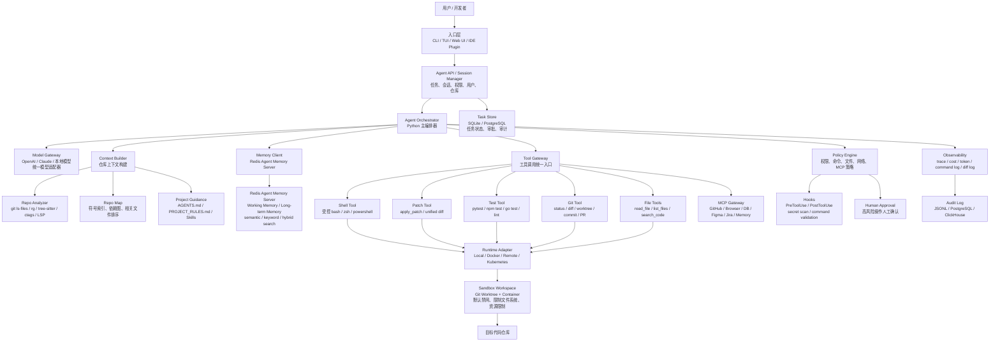
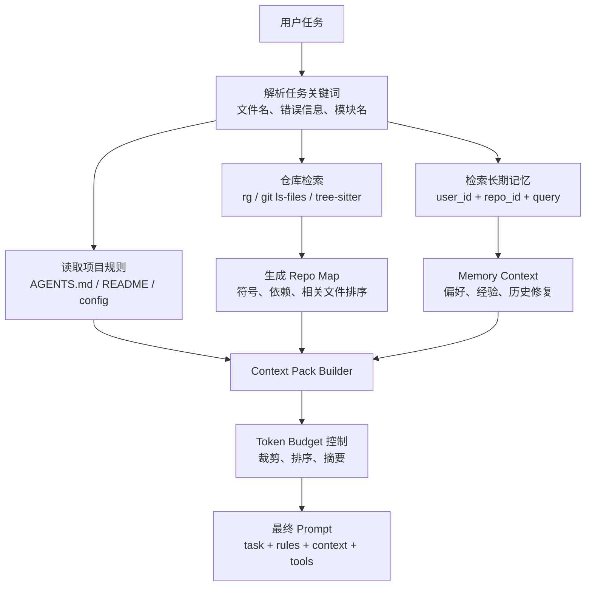
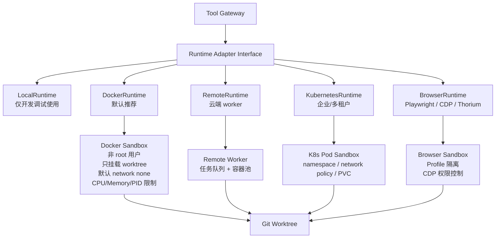
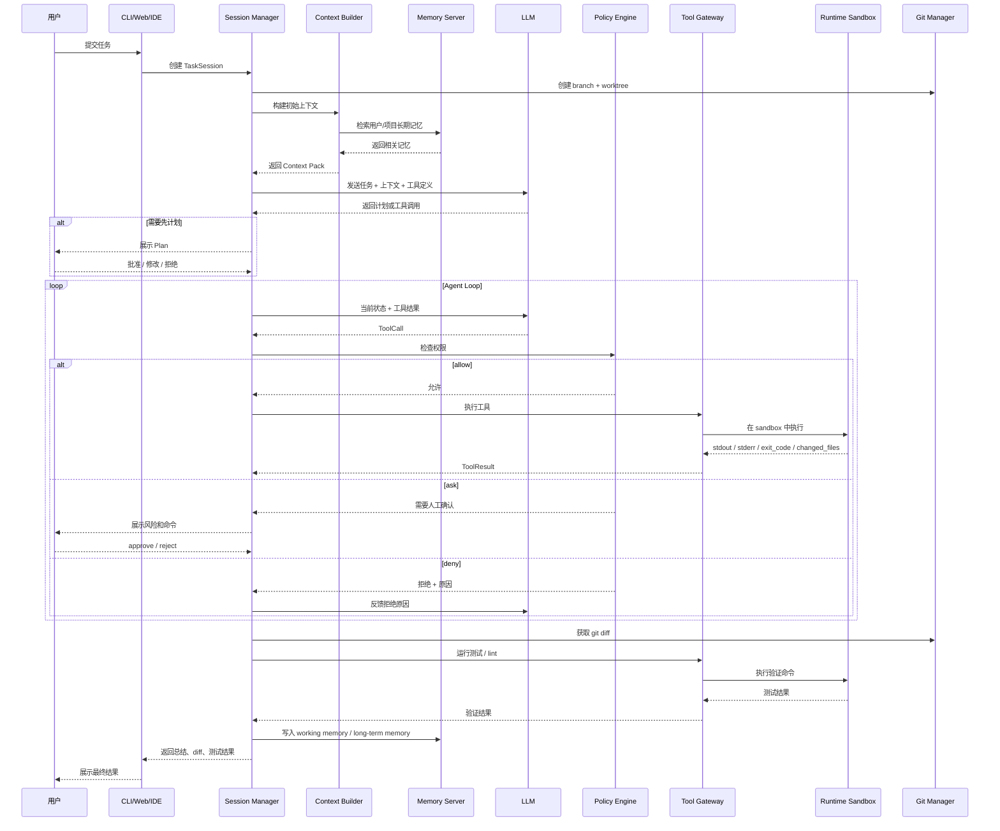
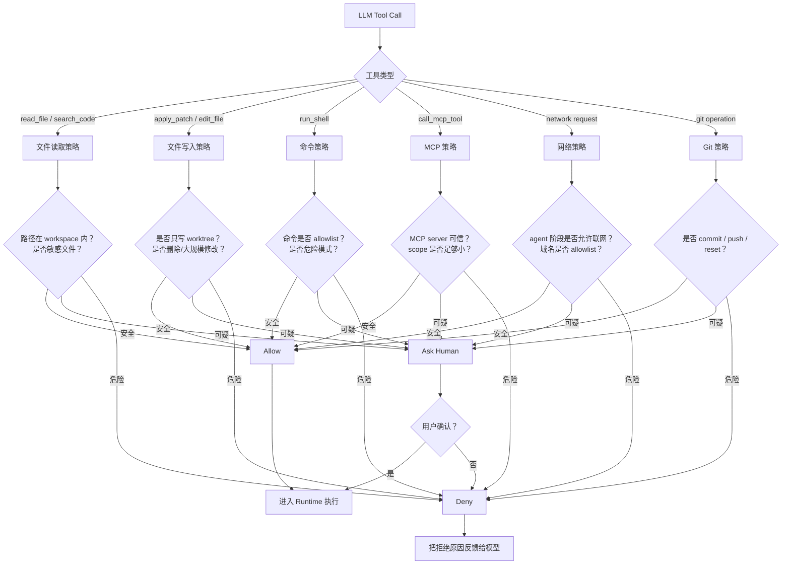
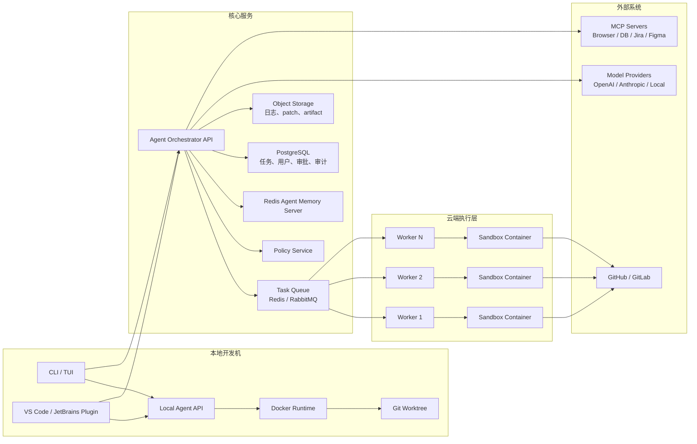
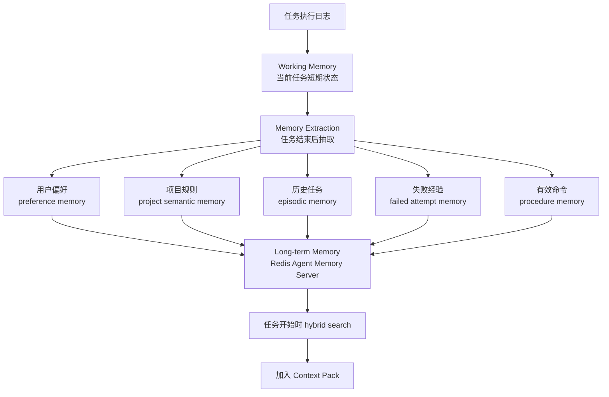
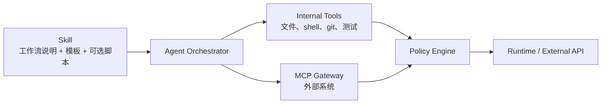
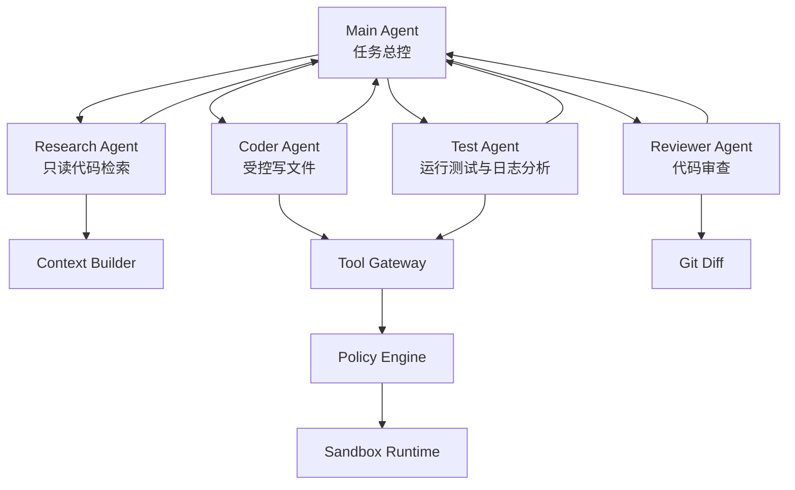

------

# **一、网络对比后的核心经验**

我搜索并对比了 Codex、Claude Code、Aider、SWE-agent/SWE-ReX、OpenHands、Redis Agent Memory Server、MCP 的公开资料，结论如下。

## **1. Codex 的经验：权限、上下文、AGENTS.md、网络隔离是核心**

Codex 官方最佳实践强调，复杂仓库里最大的提升来自**给对任务目标、上下文、约束、完成标准**，并建议复杂任务先计划后实现；它还建议用 `AGENTS.md` 固化仓库结构、测试命令、工程规范、限制规则和验收标准。 

Codex 权限体系里有类似 `read-only`、`workspace`、`danger-full-access` 的权限档位，用来控制 agent 对本机和网络的访问范围；Codex Cloud 也采用“setup 阶段可联网安装依赖，agent 阶段默认关闭互联网”的模式。 

**对你的启发：**

```text
1. 项目必须有 AGENTS.md / PROJECT_RULES.md。
2. agent 必须分权限模式：read-only、workspace-write、full-access。
3. setup 阶段和 agent 执行阶段要分开。
4. agent 阶段默认禁网，除非明确放行。
5. 复杂任务要先 plan，再 edit，再 test，再 diff。
```

------

## **2. Claude Code 的经验：Hooks、Subagents、Memory、MCP 都要有权限边界**

Claude Code 官方安全文档建议用户审批命令、避免把不可信内容直接 pipe 给 Claude、核查关键文件修改，并建议用 VM 运行脚本和工具调用；它的云端执行使用隔离 VM、默认受限网络、凭证代理、分支限制、审计日志和自动清理。 

Claude Code Agent SDK 已经把“读文件、运行命令、编辑代码”等作为内置能力暴露给 Python/TypeScript 使用。 同时，Claude Code 的 subagent 支持工具 allowlist/denylist、MCP server 作用域和持久 memory；它也明确说明 memory 是上下文，不是强制安全配置，真正要拦截操作应使用 PreToolUse hook。 

**对你的启发：**

```text
1. Memory 不能当安全规则，只能当上下文。
2. 真正的安全控制必须在 Tool Gateway / Policy Engine 层。
3. Hooks 很重要，适合做命令审计、secret 扫描、危险操作拦截。
4. Subagent 要受工具权限限制，不能所有 agent 都拥有写文件和 shell 权限。
```

------

## **3. Aider 的经验：Repo Map 是大仓库上下文的关键**

Aider 会把仓库文件、关键符号和定义位置组成 repo map，并根据依赖图和 token budget 选择最相关的部分发送给模型。 它还支持 git 集成、自动 lint/test、失败后让模型修复。 

**对你的启发：**

```text
不要一上来做复杂向量数据库。
第一阶段最重要的是：
- git ls-files
- ripgrep
- tree-sitter / ctags
- import dependency graph
- relevant repo map
- 最近 diff
- 测试失败日志摘要
```

也就是说，**代码上下文的最优解不是“全仓库 embedding”，而是 repo map + grep + AST + 动态读取文件。**

------

## **4. SWE-agent / SWE-ReX 的经验：Agent 和 Runtime 必须解耦**

SWE-ReX 是一个沙箱化 shell runtime 接口，可以让 agent 在本地、Docker、云机器、Modal 等环境里运行命令，而 agent 代码不需要关心底层执行在哪里。 SWE-agent 1.0 也把代码执行后端切到 SWE-ReX，agent 类变得更简单，工具和执行逻辑交给 runtime/backend。 

**对你的启发：**

```text
Python Agent Runtime 不应该直接 subprocess.run。
应该抽象出 RuntimeAdapter：
- LocalRuntime
- DockerRuntime
- RemoteDockerRuntime
- KubernetesRuntime
- BrowserRuntime
```

这会让你以后从本地 CLI 平滑升级到云端任务系统。

------

## **5. OpenHands 的经验：Python SDK + CLI + GUI + Cloud 是渐进式路线**

OpenHands 明确把核心做成 composable Python SDK，并在其上提供 CLI、Local GUI、Cloud 和 Enterprise 形态；它强调可以本地运行，也可以扩展到云端大量 agent。 

**对你的启发：**

```text
不要先做大而全 Web 产品。
正确顺序是：
1. Python SDK / Runtime 核心
2. CLI
3. 本地 Web UI
4. IDE 插件
5. 云端任务系统
6. 多 agent 平台
```

------

## **6. Redis Agent Memory Server 的经验：记忆层要独立**

Redis Agent Memory Server 提供 working memory、long-term memory、语义/关键词/混合搜索、`memory_prompt`、MCP 工具等能力。 

**对你的启发：**

```text
Memory 不要写死在 agent 主循环里。
应该作为独立服务：
- 当前任务会话：working memory
- 用户偏好：long-term memory
- 项目经验：long-term memory
- 历史修复方案：episodic memory
- 常见错误：semantic memory
```

------

## **7. MCP 的经验：MCP 是工具生态层，不是 agent 内核**

MCP 官方定义是连接 AI 应用和外部系统的开放标准，可以接入数据源、工具和工作流。 MCP tools 是模型可调用的外部能力，官方也建议对工具调用保留人类确认和清晰 UI。 MCP 安全文档还专门列出 confused deputy、SSRF、session hijacking、local MCP server compromise、scope minimization 等风险。 

**对你的启发：**

```text
MCP 适合做插件系统：
- GitHub
- 浏览器
- 数据库
- Redis Memory
- Jira / Linear
- Figma
- 文档系统

但 MCP 工具必须经过你的 Policy Engine。
不能让模型直接自由调用所有 MCP server。
```

------

# **二、最终推荐架构：Hybrid Local-First Agent Platform**

我建议你的项目采用这个定位：

**一个本地优先、可私有化、可扩展到云端的工程 agent runtime。**

它的核心不是“聊天”，而是下面这个闭环：

```text
用户任务
  ↓
理解仓库上下文
  ↓
制定计划
  ↓
受控调用工具
  ↓
修改文件
  ↓
运行测试
  ↓
读取失败
  ↓
继续修复
  ↓
输出 diff / commit / PR
  ↓
沉淀项目记忆
```

------

# **三、整体架构 Mermaid 图**



------

# **四、推荐分层设计**

## **1. 入口层：CLI 优先，Web/IDE 后置**

第一阶段不要先做复杂 Web UI，先做 CLI。

```text
第一阶段：
myagent "修复当前仓库 pytest 失败"

第二阶段：
myagent tui

第三阶段：
本地 Web UI

第四阶段：
VS Code / JetBrains 插件

第五阶段：
GitHub Issue / PR Bot
```

原因很简单：Codex、Claude Code、Aider、SWE-agent 这类工具的核心能力都不在 UI，而在 **agent loop + runtime + context + safety**。

------

## **2. Agent Orchestrator：Python 主内核**

这是你的核心。

职责：

```text
1. 管理任务生命周期
2. 构建 prompt
3. 调用模型
4. 解析工具调用
5. 调用 Policy Engine
6. 执行工具
7. 读取工具结果
8. 判断是否继续循环
9. 触发测试
10. 生成最终 diff 和总结
11. 写入记忆
```

建议内部状态：

```python
TaskSession:
  task_id
  user_id
  repo_id
  repo_path
  worktree_path
  permission_profile
  network_policy
  model_profile
  max_steps
  max_cost
  status
  messages
  tool_events
  approvals
  final_diff
```

------

## **3. Model Gateway：模型适配层**

不要在业务代码里直接写死 OpenAI 或 Claude。

建议抽象：

```text
ModelProvider
├─ OpenAIProvider
├─ AnthropicProvider
├─ GeminiProvider
├─ LocalModelProvider
└─ MockProvider
```

模型输出统一成：

```text
AssistantMessage
ToolCall
FinalAnswer
ReasoningSummary
Usage
```

这样未来你可以做：

```text
简单任务：便宜模型
复杂任务：强 coding model
代码审查：专门 review model
上下文压缩：小模型
memory extraction：小模型
```

------

## **4. Context Builder：决定 agent 上限的关键模块**

这是你区别于普通 “LLM + shell” 的核心竞争力。

Context Builder 应该分 6 类上下文：

```text
1. Project Guidance
   - AGENTS.md
   - PROJECT_RULES.md
   - README
   - package.json / pyproject.toml / go.mod
   - 测试和构建命令

2. Repo Map
   - 文件树
   - 符号表
   - class/function/interface
   - import dependency
   - 关键定义位置

3. Task Context
   - 用户提到的文件
   - issue 内容
   - 报错日志
   - stack trace
   - 最近失败测试

4. Dynamic Context
   - 已执行命令
   - shell 输出摘要
   - patch 结果
   - test result

5. Memory Context
   - 用户偏好
   - 项目经验
   - 历史修复记录
   - 常见坑

6. Git Context
   - git status
   - current diff
   - branch
   - recent commits
```

Context 构建流程：



我的建议是：

```text
MVP：
- git ls-files
- rg
- 读取 README / AGENTS.md
- 读取 package.json / pyproject.toml
- 简单文件树
- 手动相关文件选择

V1：
- tree-sitter 符号索引
- repo map
- import dependency graph
- 测试失败日志压缩

V2：
- 代码 embedding
- LSP
- reranker
- 多仓库上下文
```

------

## **5. Tool Gateway：所有工具必须统一入口**

不要让模型直接操作文件系统和 shell。

正确结构：

```text
LLM 只提出 tool call
  ↓
Tool Gateway 接收
  ↓
Policy Engine 判断
  ↓
Runtime Adapter 执行
  ↓
结果结构化返回给 LLM
```

工具建议分为三类：

### **A. 安全读工具**

```text
read_file
list_files
search_code
get_repo_tree
git_status
git_diff
```

### **B. 受控写工具**

```text
apply_patch
create_file
edit_file
delete_file
format_file
```

### **C. 高风险执行工具**

```text
run_shell
install_dependency
run_tests
git_commit
git_push
open_pr
call_mcp_tool
browser_action
```

`run_shell` 一定不要是万能入口。即使保留 shell，也要加命令解析、审批和沙箱。

------

## **6. Policy Engine：整个系统的安全中枢**

这是你项目能不能长期用的关键。

建议权限分 5 档：

```text
read-only：
- 只能读当前 workspace
- 禁止写文件
- 禁止 shell 执行高风险命令
- 禁止网络

workspace-write：
- 允许写当前 git worktree
- 允许运行测试
- 默认禁网
- 高风险命令审批

test-runner：
- 允许运行测试、lint、typecheck
- 不允许安装依赖
- 不允许 git push

dependency-setup：
- setup 阶段使用
- 允许 npm install / pip install / pnpm install
- 可短暂联网
- agent 阶段自动降权

full-access：
- 仅本地可信仓库手动打开
- 强审计
- 不作为默认模式
```

Policy Engine 需要判断：

```text
1. 文件路径是否在 workspace 内
2. 是否访问 .env / ssh key / token / credentials
3. 是否修改 lockfile
4. 是否删除大量文件
5. 是否运行 rm / sudo / chmod / curl | bash
6. 是否调用网络
7. 是否调用未知 MCP server
8. 是否 git push / commit / reset
9. 是否读取用户 home 目录
10. 是否执行长时间命令
```

Policy 决策：

```text
allow：直接执行
ask：请求人工确认
deny：拒绝，并把原因反馈给模型
rewrite：把危险命令改写成安全命令
sandbox-only：只允许在容器中执行
```

------

## **7. Runtime Adapter：不要直接 subprocess 裸跑**

这是我强烈建议你采用的设计。



第一阶段推荐：

```text
默认执行环境：
DockerRuntime + Git Worktree

本地调试：
LocalRuntime 只给你自己用

未来云端：
RemoteRuntime / KubernetesRuntime
```

Docker sandbox 建议：

```text
- 非 root 用户
- 只挂载当前 worktree
- 不挂载 ~/.ssh
- 不挂载用户 home
- 默认 --network none
- 限制 CPU / memory / pids
- 设置 timeout
- stdout/stderr 截断
- 容器执行完清理
```

------

## **8. Git Worktree：每个任务一个隔离工作区**

这是必须做的。

```text
repo/
  .git/

.agent-worktrees/
  task-001/
  task-002/
  task-003/
```

任务开始：

```text
1. 检查当前仓库状态
2. 创建新 branch
3. 创建 git worktree
4. agent 只在 worktree 内操作
5. 所有 diff 都可追踪
6. 任务结束后输出 patch / commit / PR
```

这样即使 agent 改坏，也不会污染主工作区。

------

# **五、Agent 执行流程 Mermaid 图**



------

# **六、模块职责清单**

## **Agent Orchestrator**

```text
职责：
- 任务生命周期管理
- agent loop
- 上下文注入
- 工具调用调度
- 测试闭环
- 最终总结
- memory 写入

不负责：
- 直接执行 shell
- 直接读写任意文件
- 直接访问外网
```

------

## **Context Builder**

```text
职责：
- 项目规则加载
- repo map 生成
- 相关文件召回
- 错误日志压缩
- token budget 管理
- memory context 合并

核心原则：
- 先精确检索，再读取文件
- 先 repo map，再全文内容
- 永远不要把全仓库无脑塞给模型
```

------

## **Policy Engine**

```text
职责：
- 文件权限判断
- shell 命令风险判断
- 网络访问判断
- MCP 工具权限判断
- secret 保护
- 人工审批
- audit log

核心原则：
- 模型只能建议，不能决定安全边界
```

------

## **Runtime Adapter**

```text
职责：
- 创建执行环境
- 执行 shell
- 管理持久 terminal session
- 限制资源
- 收集输出
- 超时终止
- 清理环境

核心原则：
- agent 看到的是统一 runtime interface
- 底层可以是 local、Docker、remote、K8s
```

------

## **Memory Service**

```text
职责：
- working memory：当前任务状态
- long-term memory：用户偏好、项目经验、历史修复
- memory_prompt：生成记忆增强上下文
- memory extraction：任务完成后沉淀经验

核心原则：
- 记忆是上下文，不是安全规则
- 长期记忆写入要可审计、可删除、可修正
```

------

## **MCP Gateway**

```text
职责：
- 接入外部工具
- 管理 MCP server
- 工具 schema 注册
- OAuth / token scope 控制
- MCP tool 调用审计

核心原则：
- MCP server 不直接暴露给 LLM
- 所有 MCP tool call 先过 Policy Engine
```

------

# **七、权限决策 Mermaid 图**



------

# **八、部署架构：本地优先 + 可云端扩展**



推荐落地顺序：

```text
Phase 1：
本地 CLI + Local API + Docker Runtime + SQLite + Redis Memory

Phase 2：
Web UI + PostgreSQL + Task Queue + 多 worker

Phase 3：
GitHub App + PR Bot + IDE 插件

Phase 4：
Kubernetes Sandbox Fleet + 多租户 + RBAC + 企业审计
```

------

# **九、我认为的“最优技术选型”**

## **第一阶段 MVP**

```text
语言：
- Python 3.12+

CLI：
- Typer + Rich
- 后续可加 Textual

Agent 编排：
- 自研轻量 Orchestrator
- 不建议第一版直接上 LangGraph，除非你要复杂状态图

模型：
- OpenAI Responses API / Anthropic SDK 抽象适配
- 内部统一 ModelProvider 接口

代码搜索：
- ripgrep
- git ls-files
- tree-sitter 可后置
- ctags 可选

文件编辑：
- apply_patch / unified diff
- 禁止直接整文件覆盖作为默认策略

执行：
- Docker sandbox
- Python asyncio subprocess
- timeout / output truncation

Git：
- git worktree
- git diff
- git status
- commit/PR 人工确认

记忆：
- redis/agent-memory-server
- working memory + long-term memory

存储：
- MVP 用 SQLite
- 正式版用 PostgreSQL

日志：
- JSONL trace
- 后续接 OpenTelemetry / ClickHouse
```

------

## **第二阶段增强**

```text
- Repo Map
- tree-sitter symbol index
- import dependency graph
- Context reranker
- Agent skills
- MCP Gateway
- Hook system
- secret scanner
- GitHub App
- Web UI
```

------

## **第三阶段平台化**

```text
- 多 agent 并行
- 任务队列
- 云端 container pool
- K8s Runtime
- RBAC
- 团队配置
- 审计后台
- eval benchmark
- 插件市场
```

------

# **十、推荐项目目录结构**

```text
ai-coding-agent/
  pyproject.toml
  README.md

  agent_core/
    __init__.py

    cli/
      main.py
      commands.py

    api/
      server.py
      routes_tasks.py
      routes_memory.py
      routes_approvals.py

    session/
      manager.py
      models.py
      state.py

    orchestrator/
      loop.py
      planner.py
      reviewer.py
      summarizer.py

    models/
      base.py
      openai_provider.py
      anthropic_provider.py
      local_provider.py

    context/
      builder.py
      repo_map.py
      repo_scan.py
      code_search.py
      tree_sitter_index.py
      token_budget.py
      log_compactor.py

    tools/
      registry.py
      fs_tools.py
      patch_tool.py
      shell_tool.py
      git_tool.py
      test_tool.py
      mcp_tool.py

    policy/
      engine.py
      command_policy.py
      fs_policy.py
      network_policy.py
      mcp_policy.py
      approval.py
      secret_filter.py

    runtime/
      base.py
      local_runtime.py
      docker_runtime.py
      remote_runtime.py
      k8s_runtime.py

    memory/
      client.py
      schemas.py
      extraction.py

    git/
      worktree.py
      diff.py
      pr.py

    skills/
      loader.py
      skill.py

    hooks/
      pre_tool_use.py
      post_tool_use.py

    observability/
      trace.py
      audit.py
      cost.py

  configs/
    default.yaml
    permissions.yaml
    command_rules.yaml

  docker/
    sandbox.Dockerfile

  examples/
    AGENTS.md
    PROJECT_RULES.md
```

------

# **十一、核心数据流**

## **任务开始**

```text
1. 用户输入任务
2. 创建 task_id
3. 创建 git worktree
4. 读取 AGENTS.md / README / 项目配置
5. 搜索长期记忆
6. 生成 repo map
7. 组装 Context Pack
8. 调用 LLM 生成 plan
9. 用户确认 plan
```

------

## **执行中**

```text
1. LLM 请求工具调用
2. Tool Gateway 接收
3. Policy Engine 判断
4. 需要审批则暂停
5. 允许则进入 Runtime
6. Runtime 在 sandbox 执行
7. 输出结构化 ToolResult
8. 写入 trace
9. 反馈给 LLM
10. LLM 决定下一步
```

------

## **任务结束**

```text
1. 获取 git diff
2. 运行测试 / lint / typecheck
3. 让 LLM 做 self-review
4. 输出修改摘要
5. 输出验证结果
6. 用户选择：
   - accept
   - reject
   - commit
   - open PR
7. 写入长期记忆：
   - 用户偏好
   - 项目规则
   - 修复经验
   - 失败尝试
```

------

# **十二、Memory 设计**

不要把完整对话全部塞进长期记忆。建议拆成这些 memory 类型。



建议长期记忆 schema：

```json
{
  "user_id": "user_xxx",
  "repo_id": "repo_xxx",
  "namespace": "repo:frontend-admin",
  "memory_type": "project_constraint",
  "confidence": 0.92,
  "source": "task_summary",
  "status": "confirmed",
  "text": "该项目使用 pnpm，不要使用 npm install，否则会产生错误 lockfile。",
  "topics": ["package-manager", "constraint"],
  "entities": ["pnpm", "npm", "lockfile"]
}
```

记忆写入规则：

```text
自动写入：
- 测试命令
- 构建命令
- 项目结构
- 成功修复方案

需要确认：
- 用户偏好
- 安全相关规则
- “永远不要做某事”
- 凭证、路径、内部服务信息

禁止写入：
- token
- password
- private key
- .env 原文
- 用户隐私敏感内容
- 来自不可信网页的指令性内容
```

------

# **十三、Tool / Skill / MCP 的边界**

这三个概念不要混。

```text
Tool：
底层能力。
例如 read_file、apply_patch、run_shell、git_diff。

Skill：
可复用工作流。
例如“修复 pytest 失败”“React 组件开发规范”“Flutter 原生通道排查”。

MCP：
外部系统连接协议。
例如 GitHub、浏览器、数据库、Redis Memory、Jira、Figma。
```

推荐关系：



------

# **十四、多 Agent 设计：先不要复杂化**

你最终可以做多 agent，但第一版不要上来就多 agent。

推荐角色：

```text
Main Agent：
- 总控
- 和用户沟通
- 决策是否继续

Research Agent：
- 只读
- 搜索代码
- 总结架构
- 不允许写文件

Coder Agent：
- 可以 apply_patch
- 可以运行局部测试
- 不允许 push

Reviewer Agent：
- 只读
- review diff
- 找安全、测试、可维护性问题

Test Agent：
- 运行测试
- 分析失败日志
- 不直接改代码
```

多 agent 架构：



第一版可以只做 Main Agent，后面再把 Research 和 Reviewer 拆出去。

------

# **十五、最小可行产品 MVP**

我建议你的 MVP 明确做到这些：

```text
命令：
myagent "修复当前仓库的测试失败"

能力：
1. 读取 AGENTS.md / README
2. git worktree 创建任务目录
3. rg 搜索相关代码
4. 读取相关文件
5. 生成修改计划
6. 用户确认计划
7. apply_patch 修改文件
8. run_shell 执行测试
9. 读取失败日志
10. 自动二次修复
11. 输出 git diff
12. 任务总结写入 memory
```

MVP 不做：

```text
1. 不做浏览器控制
2. 不做多 agent 并行
3. 不做 IDE 插件
4. 不做云端任务系统
5. 不做自动 push
6. 不做全自动长期记忆写入
7. 不做全仓库向量库
```

------

# **十六、关键配置文件设计**

## **`AGENTS.md`**

```md
# Agent Instructions

## Project Overview
这是一个 Python + React 项目。

## Commands
- 安装依赖：pnpm install
- 前端测试：pnpm test
- 后端测试：pytest -q
- 类型检查：pnpm typecheck

## Constraints
- 不要使用 npm install
- 不要修改 .env
- 不要自动 git push
- 修改前先给计划
- 任务完成必须展示 git diff

## Done When
- 相关测试通过
- lint 通过
- diff 可解释
- 没有新增 secret
```

------

## **`permissions.yaml`**

```yaml
profiles:
  read_only:
    fs:
      read_workspace: true
      write_workspace: false
      read_home: false
    shell:
      enabled: false
    network:
      enabled: false

  workspace_write:
    fs:
      read_workspace: true
      write_workspace: true
      read_home: false
      deny:
        - ".env"
        - "**/id_rsa"
        - "**/*token*"
    shell:
      enabled: true
      require_approval:
        - "rm"
        - "sudo"
        - "chmod"
        - "curl"
        - "wget"
        - "npm install"
        - "pip install"
    network:
      enabled: false

  setup:
    fs:
      read_workspace: true
      write_workspace: true
    shell:
      enabled: true
    network:
      enabled: true
      allow_domains:
        - "pypi.org"
        - "registry.npmjs.org"
```

------

## **`command_rules.yaml`**

```yaml
allow:
  - ["pwd"]
  - ["ls"]
  - ["git", "status"]
  - ["git", "diff"]
  - ["git", "log"]
  - ["rg"]
  - ["pytest"]
  - ["pnpm", "test"]
  - ["pnpm", "typecheck"]

ask:
  - ["git", "commit"]
  - ["git", "checkout"]
  - ["git", "reset"]
  - ["pnpm", "install"]
  - ["pip", "install"]
  - ["docker"]
  - ["rm"]

deny:
  - ["sudo"]
  - ["su"]
  - ["chmod", "-R", "777"]
  - ["curl", "|", "bash"]
  - ["wget", "|", "sh"]
  - ["ssh"]
  - ["scp"]
```

------

# **十七、最终最优架构总结**

你现在最应该做的是这个版本：

```text
本地优先 Codex-like Agent
├─ Python Agent Orchestrator
├─ Model Gateway
├─ Context Builder
│  ├─ AGENTS.md
│  ├─ Repo Map
│  ├─ rg / tree-sitter
│  └─ Memory Context
├─ Tool Gateway
│  ├─ File Tools
│  ├─ Patch Tool
│  ├─ Shell Tool
│  ├─ Git Tool
│  ├─ Test Tool
│  └─ MCP Tool
├─ Policy Engine
│  ├─ File Policy
│  ├─ Command Policy
│  ├─ Network Policy
│  ├─ MCP Policy
│  └─ Approval System
├─ Runtime Adapter
│  ├─ Docker Runtime
│  ├─ Local Runtime
│  └─ Future Remote Runtime
├─ Git Worktree Isolation
├─ Redis Agent Memory Server
└─ Audit / Trace / Cost Log
```

一句话：

**最优解是“Codex 的权限和 AGENTS.md 思路 + Claude Code 的 hooks/subagent/memory 边界 + Aider 的 repo map + SWE-ReX 的 runtime 解耦 + Redis Agent Memory 的独立记忆层 + MCP 的插件生态”，但第一阶段只实现本地 CLI、Docker sandbox、git worktree、context builder、policy engine 和 patch/test 闭环。**

这套架构既不会太轻导致不可控，也不会太重导致一开始做不出来。