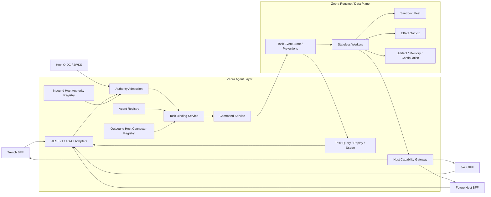
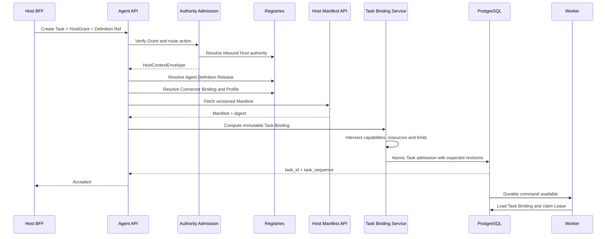
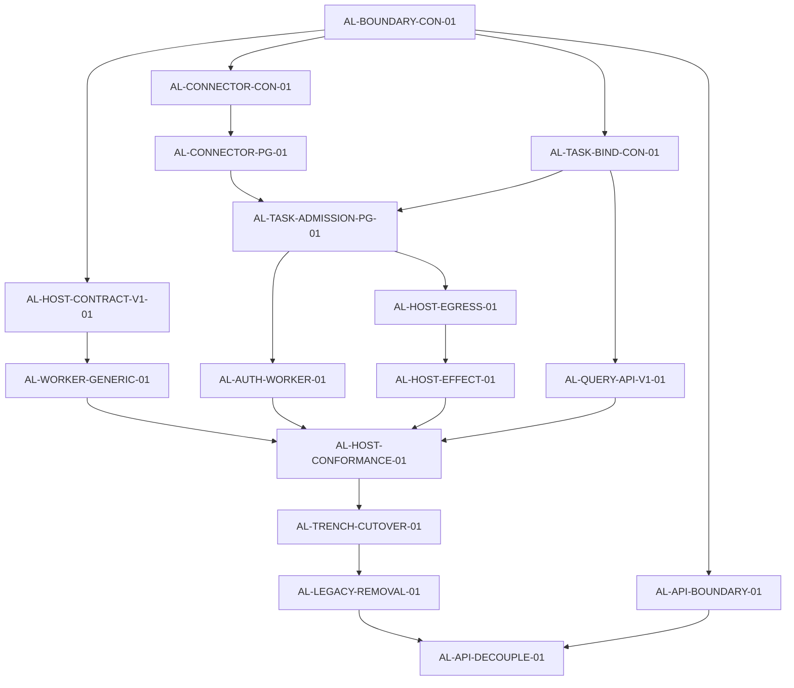

# Cloud Agent 构建实施方案

> 状态：`Accepted`（maintainer 批准，2026-08-18）
>
> 审查基线：`main@bb3a1bce`。关键事实断言已于批准当日复核：
> Worker 的 `_required_resource()` 硬编码 `trench.*` 资源映射、API 静态依赖
> `zebra-agent-worker`、迁移头为 v23、AG-UI stream 以 `active_segment_id`
> 为边界、`host_tool_*` 仍为部署级全局配置，均属实。
>
> 架构决策已登记为 `docs/ADR-017_Agent_Layer边界与多Host接入.md`；
> 实施卡以 `AL-PLAN-01` 预留表登记于 `docs/AGENT_TASKS.md`，全部 `Locked`，
> 激活前必须按仓库规则冻结 owner、branch 与 Owned paths。

当前代码已经具备构建 Agent Layer 的大部分底座。

建议正式确定：

Zebra Agent Layer = Agent Control Plane + Host Integration Plane

它负责统一 Agent 接入、权限准入、AgentDefinition 解析、Host 能力绑定、命令接收、查询重放和协议投影。现有 Zebra Runtime 继续承担 Worker、Sandbox、Effect、Artifact、Memory、Lease、恢复等执行职责。

现阶段应先完成逻辑边界、包边界和持久化边界，继续由 apps/api 作为部署入口。暂时无需新增独立 Agent Layer 微服务，也无需复制 Agent Runtime。

## 审查基线

原 `zebra-cloud-trench`（现名 `cloud-agent`）分支已经通过 PR #194 合入 `main`。该 PR 的 head 为 `zebra-cloud-trench@b0464f9e`，包含 362 个提交和 751 个变更文件。当前审查基线采用：

LogicStormINC/zebra
main@bb3a1bcef86082605acec9cbc54f328f055b8148

这样可以覆盖原分支代码和合并后的修复。

基于当前代码，我的工程评估是：

| 评估项 | 当前程度 |
| --- | --- |
| 可直接复用的 Agent Layer 基础资产 | 70% 至 75% |
| 真正完成多 Host 接入闭环 | 35% 至 45% |
| 仍需完成的实施卡 | 16 张 |
| 是否需要重写 Runtime | 不需要 |
| 是否需要立即拆分新微服务 | 不需要 |

剩余工作主要集中在 Connector Registry、不可变 Task Binding、权限链路统一、Worker 去 Host 语义化、Task 级查询重放和多 Host 一致性验证。

## 一、当前代码已经具备的 Agent Layer 基础

### 1. 入站 Host Authority 已经接近可复用状态

当前 HostContextEnvelope、HostSessionGrant、HostResourceRef 和 HostTechnicalLimits 都是通用领域模型：

HostContextEnvelope
├── host_app_id
├── namespace_id
├── workspace_ref
├── resource_refs
├── scopes
├── limits
├── origin
├── policy_version
└── expires_at

这些模型没有依赖 Trench 的业务对象，可以继续作为 Host 到 Zebra 的 Published Language。

PostgreSQL HostAuthorityRegistry 也已经支持：

deployment_namespace

- host_app_id
- namespace_id
- issuer
- audience
- jwks_uri
- allowed_origins
- algorithms
- policy_version
- active

同时包含 Grant JTI replay ledger 和安全审计记录。这一部分应继续只负责 Host → Zebra 的入站信任。

API 侧已经具备 JWT、JWKS、精确 Origin、Host App、namespace、scope 和 JTI replay 校验。当前主要缺口是所有接口统一要求 agent.run，尚未根据具体动作实施细粒度权限。

### 2. Agent Registry 和 Definition Snapshot 已经成熟

当前 AgentDefinitionVersion 已实现：

不可变版本
Definition digest
model policy ref
tool profile ref
skill snapshot digest
memory policy ref
security policy ref
evaluation profile ref
runtime profile ref

生产发布又通过 AgentRelease 管理 published、deprecated、revoked 生命周期。

AgentDefinitionSnapshot 已经能够把生产 Release、版本、策略引用和 digest 固化到 Task 级快照中。

API 创建任务时也已经根据 Host namespace 和 publisher ceiling 解析正式 Definition Release。

因此 Agent Registry 无需重建，下一步只需要补充能力上限定义。

### 3. AG-UI 已经具备正确的 Adapter 方向

当前 AG-UI projector 是纯函数式投影：

Zebra SessionEvent
→ AgUiProjector
→ AG-UI Event

它不依赖 HTTP、Host、Trench 或 Worker，边界设计正确。

AG-UI Command Adapter 也已经把：

run
resume
stop

转换为 Zebra 内部 durable command，并要求：

Idempotency-Key
expectedRevision
threadId
runId

这条路径可以直接作为 Agent Layer 的协议 Adapter。

### 4. Runtime 和 Cloud Data Plane 可以原样复用

当前 CloudControlPlane 已经覆盖：

Event
Session Projection
Workspace Projection
Task
Lease
Context
Handoff
Idempotency
Effect
Memory
Artifact
Provider Continuation
History
Delivery Audit

这些都属于 Runtime 和 Data Plane，不应迁移到新的 Agent Layer 实现中。

PostgreSQL composition 已经完成这些 Store 的集中组合。

Effectful Tool 也已经经过 FencedEffectToolGateway 和 Effect Outbox，具备 fenced lease、durable intent、uncertain state 和 reconciliation 基础。Host 写工具后续应直接复用这条链路。

## 二、当前阻碍多 Host 的关键代码耦合

### P0.1 Worker 仍然认识 Trench 业务词汇

当前最大的多 Host 障碍位于：

apps/worker/src/zebra_agent_worker/tool_gateway_runtime.py

其中 `_required_resource()` 直接识别：

events.get_event
events.get_evidence
events.get_related_events
events.get_entity_timeline
events.get_topic

并直接构造：

trench.resource
trench.event
trench.entity
trench.topic

这使 Worker 承担了 Trench Resource Adapter 的职责。接入 Jazz 或第三个 Host 时，开发者几乎必然继续添加新的工具名分支。

这部分应当优先消除。

Worker 最终只需要理解：

参数选择规则
资源类型
必需权限
资源匹配方式
工具风险
幂等语义
Effect receipt 语义

至于 event_id、topic、entity 属于 Host Manifest 声明的内容。

### P0.2 出站 Host 连接仍是部署级单例

当前配置仍然只有：

host_tool_endpoint
host_tool_workload_identity
host_tool_shared_secret

这些值来自全局部署配置。

Worker 恢复 Task 后直接读取这组全局值，创建一个 HostToolGateway，然后在运行时调用 /manifest。这意味着：

1. 一个 Zebra deployment 默认只能连接一个 Host endpoint。
2. Endpoint、身份和 Secret 无法按 host_app_id + namespace_id 解析。
3. Task 没有固定连接配置版本。
4. Worker 恢复时重新发现 Manifest，可能获得不同工具集合。
5. Credential 生命周期与 Deployment 生命周期耦合。

需要新增独立的 Outbound Connector Registry。

### P0.3 当前 Host Manifest 还不足以驱动通用资源绑定

现有 HostToolManifest 已经很接近通用协议，包含：

name
description
required_arguments
argument_properties
parallel_safe
capability_version
scopes
risk
timeout
max_output
idempotency
receipt_schema_version

但当前协议没有声明：

semantic capabilities
required grant scopes
resource binding rules
resource argument selector
output schema
effect reconciliation capability
per-tool contract digest
protocol version
connector profile revision

因此 Worker 只能自行猜测工具参数与 Resource Ref 的关系。

### P0.4 Definition、Host 和 Execution Authority 尚未形成同一条链

当前 Execution Authority 领域模型其实已经支持所需的求交逻辑：

ExternalAuthorityGrant
capability_ceiling
policy_authorities
runtime_authorities
effective limits

ExecutionAuthoritySnapshot.from_request() 会求交能力并收窄 limits，ensure_not_expanded() 会阻止同一 Attempt 扩权。

但 Worker 的 persist_attempt_authority() 当前只传入：

session_id
attempt_number
scope
validated_at

没有传入：

Host authority grant
Agent Definition snapshot digest
Task capability ceiling
Host capability binding

Cloud composition 当前使用 TenantScopedAuthorityResolver 构造 deployment 级合成权限，默认能力只有 agent.execute。它还没有从 Task 中的 HostGrant 和 Definition 得出真正的执行权限。

所以当前存在两条相互分离的权限链：

HTTP HostGrant
→ HostContextEnvelope
→ Task
Cloud Worker
→ TenantScopedAuthorityResolver
→ synthetic agent.execute

Agent Layer 的核心任务之一，就是把它们合成一条完整权限链。

### P0.5 Task Binding 目前埋在 `TASK_PREPARED` 事件中

创建 Session 时，host_context 和 definition_snapshot 会直接序列化进 TASK_PREPARED payload。

但 AgentTask 本身只保存：

task_id
title
status
active_segment_id
current_sequence
namespace

没有独立的 Definition、Host Connector、Manifest 或 Capability Binding。

这样虽然可以通过 Event Recovery 找回信息，但会产生几个问题：

1. Agent Layer 无法直接按 Task 查询控制面绑定结果。
2. Connector 和 Manifest 漂移检测需要重复解析 Session Event。
3. Task rollover 后需要沿 Segment 历史恢复绑定。
4. 管理端无法高效查询某个 Connector revision 关联的 Task。
5. 执行权限和 Task Binding 之间缺乏数据库级引用关系。

应新增第一类领域对象：

TaskBindingSnapshot

### P1.1 API 与 Worker 仍存在静态依赖

apps/api/pyproject.toml 当前直接依赖：

agent-runtime
zebra-agent-worker

apps/api/app.py 也直接导入：

run_local_harness
SessionClaimService
SessionExecutionService
SessionResumeService

当前 cloud create 路径已经改成 queue command，这是正确进展；local profile 仍通过 API 进程执行 harness。问题在于 local 与 cloud composition 仍集中在同一个 API application 类中。

Agent Layer 稳定后，云端 API 模块应只依赖 Control Plane application services。Local inline execution 可以放入独立 local adapter 或 local composition。

### P1.2 AG-UI Stream 仍以活动 Segment 为边界

当前 AG-UI Stream 先把 TaskId 解析为 active_segment_id，然后只读取该 Session 的 Event。

但现有 AgentTaskPort.read_events() 和 PostgreSQL task_event_index 已经能够提供跨 Segment 的 Task Sequence。

Agent Layer 应发布 Task 级事件流：

Task
├── Segment 0
├── Segment 1
├── Segment 2
└── one continuous task_sequence

否则 rollover 后，Host 端可能在同一个 thread 中丢失事件连续性。

### P1.3 Task Admission 尚未完全原子化

当前 create_queued_session() 的写入顺序是：

保存 attachments
逐条 append events
保存 session projection
保存 workspace projection

Agent Layer 引入 Task Binding 后，需要把以下内容放入同一 PostgreSQL 事务：

Root Session
Bootstrap Events
Session Projection
Workspace Projection
Agent Task
Task Binding Snapshot
Idempotency Receipt
Task Event Index

Manifest 获取属于网络操作，应在事务外完成。事务提交时通过 expected revision 校验 Definition Release 和 Connector Binding 未发生变化。

## 三、推荐的最终架构



### 责任边界

| 组件 | 拥有 | 禁止拥有 |
| --- | --- | --- |
| Host | 用户、组织、业务授权、业务数据、HostGrant、Tool API、业务写入最终鉴权 | Worker Lease、Attempt 状态、Agent Event Store |
| Agent Layer | AgentDefinition、Host 接入注册、权限准入、Task Binding、Command、Query、Replay、Usage、协议 Adapter | Host 业务数据库、Host 业务实体模型、Sandbox 运行 |
| Runtime | Task、Segment、Attempt、Worker、Lease、Sandbox、Effect、Artifact、Memory、Continuation、恢复 | Host 用户体系、Host 业务权限规则、Host endpoint 配置管理 |

## 四、最重要的领域模型调整

### 1. 将 Capability 和 Scope 分开

当前 ToolContract.scopes 同时承担工具能力和 Host 授权范围，长期会造成不同 Host 的权限词汇污染 Zebra Definition。

建议定义两个独立概念：

Capability
Zebra 使用的稳定语义能力
例如 evidence.read、timeline.read、report.write
Grant Scope
某个 Host 自己定义的授权声明
例如 trench:event:read、jazz:project:write

能力计算建议调整为：

HostGrantedCapabilities =
{
capability |
存在 ToolContract
capability 属于 ToolContract.capabilities
ToolContract.required_grant_scopes 包含于 HostGrant.scopes
ToolContract.resource_bindings 已满足
}
EffectiveCapabilities =
AgentDefinitionCapabilityCeiling
∩ ManifestDeclaredCapabilities
∩ HostGrantedCapabilities
∩ ZebraPolicyCapabilities

工具最终能否调用：

ToolExecutable =
Tool.capabilities 包含于 EffectiveCapabilities
且 required_grant_scopes 包含于 HostGrant.scopes
且 required resources 已绑定
且 limits 未超出

这样 Trench、Jazz 可以使用不同的授权 scope，同时都映射到 Zebra 稳定的 evidence.read 等 Capability。

### 2. AgentDefinition 增加 v2 Capability Profile

现有 agent-definition/1 已经形成 digest 语义，建议保持原模型和 digest 算法不变。

新增：

agent-definition/2

增加字段：

capability_profile_ref: str

也可以使用：

capability_ceiling_ref: str

推荐 capability_profile_ref，因为后续可能同时包含：

capabilities
required capability groups
optional capability groups
tool visibility policy
effect risk ceiling
technical limit ceiling

解析 Release 时生成：

AgentCapabilityCeilingSnapshot

随后写入 TaskBindingSnapshot。

Definition 中继续禁止保存：

Host URL
Credential
Secret
Host 用户权限
某个租户的资源引用

### 3. 入站 Registry 与出站 Connector Registry 分离

保留现有：

HostAuthorityRegistry

职责：

Host → Zebra
JWT issuer
JWKS
audience
allowed origins
algorithms
Grant replay

新增：

HostConnectorProfileVersion
HostConnectorBinding

HostConnectorProfileVersion

host_app_id
connector_id
profile_revision
base_uri
manifest_path
invoke_path_template
reconcile_path_template
supported_protocol_versions
workload_identity_ref
credential_ref
network_policy_ref
timeout_policy
retry_policy
profile_digest
status
created_at

建议只存一个经过约束的 HTTPS base_uri，路径使用独立字段。这样更容易控制 SSRF 和 redirect。

HostConnectorBinding

host_app_id
namespace_id
connector_id
profile_revision
binding_revision
active
updated_at

它负责把：

host_app_id + namespace_id

解析到一个固定 Connector Profile revision。

#### 生命周期语义

| 状态 | 新 Task | 已绑定 Task |
| --- | --- | --- |
| `published` | 允许 | 允许 |
| `deprecated` | 拒绝新绑定 | 可以按策略继续 |
| `revoked` | 拒绝 | 下次调用或重校验时 fail closed |

Profile Version 必须不可变。更新 endpoint、credential reference 或 protocol version 时创建新 revision。

### 4. Host Capability Manifest v1

建议新协议：

zebra.host-capability-manifest/1

Manifest 顶层至少包含：

schema_version
protocol_version
host_app_id
connector_profile_revision
workload_identity
tools
manifest_digest
generated_at

每个工具使用 Host 专用 Wrapper：

```python
class HostToolContractV1:
    tool: ToolContract
    capabilities: tuple[str, ...]
    required_grant_scopes: tuple[str, ...]
    resource_bindings: tuple[ResourceBindingRule, ...]
    effect_semantics: HostEffectSemantics
    input_schema_digest: str
    output_schema_digest: str
    contract_digest: str
```

资源规则建议：

```python
class ResourceBindingRule:
    argument_pointer: str
    resource_type: str
    required: bool
    match_mode: Literal["exact"]
```

示例：

```json
{
  "argumentPointer": "/event_id",
  "resourceType": "trench.event",
  "required": true,
  "matchMode": "exact"
}
```

Worker 只执行通用步骤：

从参数提取值
→ 构造 HostResourceRef
→ 在 Task Binding 的 resource_refs 中精确匹配
→ 只把匹配到的资源发送给 Host

选择器初期只支持受限 JSON Pointer。不要支持 JSONPath 表达式、脚本、Python、模板求值或任意代码。

### 5. 建立不可变 Task Binding

建议新增两个快照。

HostCapabilitySnapshot

host_app_id
authority_issuer
namespace_id
grant_digest
grant_expires_at
connector_id
connector_profile_revision
connector_profile_digest
protocol_version
manifest_digest
effective_tool_contracts
effective_tool_digests
effective_capabilities
resource_refs
resource_binding_digest
effective_limits
bound_at
snapshot_digest

TaskBindingSnapshot

task_id
agent_definition_snapshot
agent_capability_ceiling_snapshot
host_capability_snapshot
zebra_policy_snapshot
effective_capabilities
effective_limits
binding_revision
binding_digest
bound_at

Task projection 只需要保存：

binding_digest
binding_revision

完整快照保存在专用 TaskBindingStore。

Session Event 中增加：

TASK_BOUND

事件 payload 保存：

task_id
binding_digest
definition_snapshot_digest
host_capability_snapshot_digest
connector_profile_revision
manifest_digest

事件中不保存 raw JWT、Secret 或短期 Credential。

### 6. 一个 Task 绑定一个 Primary Host

第一版应明确：

one Task
→ one primary host_app_id
→ one namespace_id
→ one connector profile revision
→ one immutable Host capability snapshot

跨 Host 工作流可以通过：

Subtask
Handoff
Parent Task orchestration

来实现。

一个 Attempt 同时携带多个 Host 凭据和多套资源权限，会显著提高 Effect、审计、撤权和重放复杂度。等业务真实出现后，再扩展为 host_bindings[]。

## 五、Agent Layer 的完整 Admission 流程



### 具体步骤

1. 根据 HTTP 动作确定 AgentAction。
2. 校验 HostGrant 的 issuer、audience、origin、host_app_id、namespace、JTI 和 required scopes。
3. 解析 AgentDefinition Release。
4. 根据 host_app_id + namespace_id 解析 Connector Binding。
5. 获取固定 Connector Profile revision。
6. 在数据库事务外获取并验证 Host Manifest。
7. 计算 Capability、Resource、Limits 的交集。
8. 构造 HostCapabilitySnapshot 和 TaskBindingSnapshot。
9. 使用一个 PostgreSQL 事务写入 Task、Session、Events、Projections、Binding 和 Idempotency。
10. 事务提交时校验 Definition Release revision 和 Connector Binding revision。
11. 返回 task_id 和 Task cursor。
12. Worker 只消费 durable command。

Manifest 网络调用不能放入数据库事务。发生并发更新时，应终止提交并重新执行绑定过程。

## 六、Worker 的目标执行流程

Claim Task / Segment Lease
→ Load TaskBindingSnapshot
→ Verify binding digest
→ Resolve pinned Connector Profile
→ Revalidate Connector status
→ Resolve ExecutionAuthoritySnapshot
→ Build tools from pinned Manifest snapshot
→ Expose only effective tools to model
→ Resolve resource bindings generically
→ Run read tools or Effect Outbox
→ Persist ToolReceipt / EffectReceipt
→ Revalidate authority at safe boundaries
→ Commit events and projections

### 关键要求

#### 1. Worker 不再实时发现 Manifest

当前 Worker 在构造 Tool Gateway 时调用 host.discover()。

目标行为：

Admission 时发现并固化
Worker 按 Task Binding 使用快照
Recovery 继续使用同一个 Manifest digest

Host 后续增加工具时，运行中的 Task 不会获得新能力。

#### 2. Worker 使用真实 Host Execution Authority

新增：

BoundHostExecutionAuthorityResolver

它从 TaskBindingSnapshot 构造：

ExternalAuthorityGrant
Agent Definition capability ceiling
Host effective capability set
Host limits
Zebra policy
Runtime limits

然后复用当前 ExecutionAuthoritySnapshot.from_request()。

内部 Operator Task 可以继续使用 deployment authority resolver。外部 Host Task 必须使用 Bound Host resolver。

#### 3. Host 写工具继续经过 Effect Outbox

现有 Fenced Effect 体系已经支持：

pending
claimed
succeeded
failed_no_effect
uncertain
dead_letter

Host Tool 协议只需要补充：

HostEffectReceipt
reconcile endpoint
provider operation id
business revision
effect status
reconciliation evidence

超时或连接断开后，只要 Host 端可能已经写入，Zebra 就记录：

uncertain

随后通过 provider_operation_id 或 idempotency key 对账，禁止直接盲重试。

## 七、建议的代码和包结构

建议新增逻辑 application package：

```text
packages/
agent-core/
src/agent_core/
domain/
agent_capabilities.py
host_connectors.py
host_capability_manifests.py
task_bindings.py
host_effect_receipts.py
ports/
host_connector_registry.py
task_binding_store.py
task_admission_transaction.py
host_credential_resolver.py
agent-control-plane/
pyproject.toml
src/agent_control_plane/
admission.py
capability_binding.py
task_binding.py
command_service.py
query_replay.py
usage_query.py
host_registry_service.py
agent-integrations/
src/agent_integrations/
host_protocol/
v1/
contracts.py
manifest_client.py
invocation_client.py
reconciliation_client.py
ag_ui/
projection.py
commands.py
agent-storage/
src/agent_storage/
postgres/
host_connectors.py
host_connector_migration.py
task_bindings.py
task_binding_migration.py
task_admission.py
agent_layer_composition.py
apps/
api/
src/zebra_agent_api/
composition/
agent_layer.py
local_mode.py
routes/
v1/
tasks.py
commands.py
events.py
artifacts.py
approvals.py
usage.py
adapters/
ag_ui.py
worker/
src/zebra_agent_worker/
bound_execution_authority.py
bound_host_gateway.py
resource_binding.py
contracts/
agent-api/
v1/
openapi.yaml
host-integration/
v1/
capability-manifest.schema.json
tool-invocation.schema.json
effect-receipt.schema.json
```

### 推荐依赖方向

apps/api
→ agent-control-plane
→ agent-core
apps/api composition
→ agent-storage
→ agent-integrations
apps/worker
→ agent-runtime
→ agent-core
→ agent-integrations
→ agent-storage

### 依赖规则

1. agent-control-plane 不导入 Worker、Runtime、FastAPI 或 PostgreSQL adapter。
2. agent-core 不导入应用层、HTTP 或数据库。
3. Cloud API route 不导入 zebra_agent_worker。
4. Worker 不导入 API。
5. Worker 生产代码不得出现 trench、jazz 等 Host 名称。
6. Storage adapter 不执行 Host HTTP 请求。
7. Manifest 只承载数据，不承载可执行代码。

当前依赖测试已经禁止 reusable packages 导入 API 和 Worker，但尚未禁止 Cloud API 导入 Worker。可以在现有架构测试基础上继续扩展。

## 八、版本化 API 建议

### 1. Canonical REST API

```http
POST /v1/tasks
GET /v1/tasks/{task_id}
POST /v1/tasks/{task_id}/commands
GET /v1/tasks/{task_id}/events
GET /v1/tasks/{task_id}/attempts
GET /v1/tasks/{task_id}/usage
GET /v1/artifacts/{artifact_id}
GET /v1/approvals
POST /v1/approvals/{approval_id}/decisions
GET /v1/clarifications
POST /v1/clarifications/{clarification_id}/responses
```

### 2. Command Envelope

```json
{
  "schema_version": "zebra.agent-command/1",
  "command_id": "opaque-id",
  "task_id": "uuid",
  "kind": "run",
  "expected_revision": 12,
  "payload": {},
  "idempotency_key": "host-command-key"
}
```

### 3. Task 级 Cursor

建议 Cursor 绑定：

task_id
task_sequence
event_id

不要向 Host 暴露 Segment 作为主要 thread 边界。

AG-UI Adapter 的：

threadId

继续映射为：

TaskId

runId 可以映射到 Host Run identity 或 Zebra Command execution identity。

### 4. Route 级 Host 权限

当前统一的 `agent.run` 应逐步拆分为：

| AgentAction | Host Grant scope |
| --- | --- |
| Create Task | `agent.task.create` |
| Submit Command | `agent.task.command` |
| Read Task | `agent.task.read` |
| Read Events | `agent.event.read` |
| Read Artifact | `agent.artifact.read` |
| Decide Approval | `agent.approval.decide` |
| Respond Clarification | `agent.clarification.respond` |
| Read Usage | `agent.usage.read` |

Host 可以在一个 Grant 中签发多个 scope，Agent Layer 根据 Route 动作精确校验。

## 九、详细实施计划

### 阶段 A：建立边界和通用协议

| 任务 | 目标 | 主要 Owned Paths | 验收门 |
| --- | --- | --- | --- |
| AL-BOUNDARY-CON-01 | 建立 `agent-control-plane` 包和依赖规则 | 新 package、workspace `pyproject`、架构测试 | Control Plane 无 Worker、Runtime、FastAPI、Storage 依赖 |
| AL-HOST-CONTRACT-V1-01 | 定义 Capability Manifest、Resource Binding、Effect Receipt | `agent-core/domain`、`agent-integrations/host_protocol`、schema | Canonical digest、bounded payload、无可执行 selector |
| AL-WORKER-GENERIC-01 | 移除 Worker 中的 Trench 工具和 Resource 分支 | `tool_gateway_runtime.py`、新 `resource_binding.py`、Worker tests | Worker 生产代码中无 `trench.*` 和 Host 工具名 |
| AL-API-BOUNDARY-01 | 将 cloud command/query application service 从 `app.py` 分离 | `agent-control-plane`、API composition、API tests | Cloud route 不导入 Worker；local path 保持兼容 |

### 阶段 B：Connector 和 Task Binding

| 任务 | 目标 | 主要 Owned Paths | 验收门 |
| --- | --- | --- | --- |
| AL-CONNECTOR-CON-01 | 定义 Connector Profile、Binding、状态和 Port | `agent-core/domain/host_connectors.py`、ports、Core tests | revision 不可变、Secret 禁入模型、状态转换受控 |
| AL-CONNECTOR-PG-01 | 实现 PostgreSQL Registry | PostgreSQL adapter、migration、focused tests | namespace 隔离、CAS、审计、并发更新测试 |
| AL-TASK-BIND-CON-01 | 定义 Capability Ceiling、Host Snapshot、Task Binding | `agent-core/domain/task_bindings.py`、binding service tests | digest 确定性、能力交集正确、快照无 Secret |
| AL-TASK-ADMISSION-PG-01 | 原子写入 Task、Session、Binding 和 Idempotency | PostgreSQL transaction adapter、API admission seam、Compose tests | 任一注入崩溃点都不会留下已接受的半成品 Task |

按当前 migration catalog，最新迁移为 v23。若实施时没有并行 migration，AL-CONNECTOR-PG-01 可以从 v24 开始；正式激活任务时需要重新确认迁移头。

### 阶段 C：执行权限和 Host Egress

| 任务 | 目标 | 主要 Owned Paths | 验收门 |
| --- | --- | --- | --- |
| AL-AUTH-WORKER-01 | 将 Host、Definition、Policy、Runtime 权限合并为 Attempt Snapshot | `bound_execution_authority.py`、authority application seam、tests | 同一 Attempt 只能收窄；过期、撤权、namespace 漂移 fail closed |
| AL-HOST-EGRESS-01 | Worker 根据 pinned Connector Profile 建立 Host Gateway | connector resolver、credential resolver、Host client factory | Worker 不实时发现 Manifest；Profile revision 固定 |
| AL-HOST-EFFECT-01 | Host 写工具接入 Effect Receipt 和 reconcile | Host protocol、effect adapter、PostgreSQL effect tests | 未知写入结果进入 uncertain；无盲重试；对账后收敛 |

当前 CredentialBroker 主要面向 SCM credential。Host Egress 建议新增独立 HostWorkloadCredentialResolverPort，避免把 Host workload identity 强行塞入 SCM 抽象。

接口可以是：

```python
class HostWorkloadCredentialResolverPort(Protocol):
    def issue(
        self,
        *,
        credential_ref: str,
        workload_identity_ref: str,
        audience: str,
        scopes: tuple[str, ...],
        ttl_seconds: int,
    ) -> EphemeralHostCredential:
        ...
```

生产 Adapter 可以支持：

OAuth workload identity
mTLS
Cloud secret manager exchange
短期 HMAC compatibility

Credential 返回后只存在内存中，不持久化、不写 Event、不进入日志。

### 阶段 D：Published API、Conformance 和迁移

| 任务 | 目标 | 主要 Owned Paths | 验收门 |
| --- | --- | --- | --- |
| AL-QUERY-API-V1-01 | 发布 versioned command/query API 和 Task replay | `agent-control-plane/query_replay.py`、API v1 routes、AG-UI adapter | rollover 前后保持连续 Task cursor |
| AL-HOST-CONFORMANCE-01 | 建立 Host Conformance Kit | `tests/conformance/host_v1`、fake hosts、schema fixtures | 两个完全不同的 Host 通过同一测试套件 |
| AL-TRENCH-CUTOVER-01 | 将 Trench 切换到 Connector Registry 和 Task Binding | Trench fixture、operator config、Compose acceptance | 新 Task 无全局 Host env 依赖；旧 Task 受控 drain |
| AL-LEGACY-REMOVAL-01 | 删除旧单 Host 配置和 Worker 特例 | settings、Worker gateway、API compatibility、tests | 删除 `ZEBRA_HOST_TOOL_*` 和 Trench 资源映射 |
| AL-API-DECOUPLE-01 | 清理 API 对 Worker 和 Runtime 的静态依赖 | API `pyproject`、local composition、dependency tests | Cloud API artifact 不再打包 Worker execution 实现 |

依赖顺序建议：



## 十、Host Conformance Kit 设计

当前 Trench E2E 已经覆盖：

基础设施
Read Task
长任务
断线重放
Worker 重启
Stop / Resume
Grant replay
Host Tool failure
业务零写入

这些场景很有价值，应当保留。

当前 runner 仍包含 Trench 专用环境变量、Header 和工具名称。

建议抽象为参数化 Conformance Runner：

Host fixture
├── registration
├── grant issuer
├── connector profile
├── capability manifest
├── resource fixture
├── read tool
├── write tool
├── reconcile endpoint
└── business snapshot endpoint

然后建立两个测试 Host：

fake-host-a

模拟当前 Trench read-only 场景：

evidence.read
timeline.read

fake-host-b

采用完全不同的业务词汇：

catalog.item.read
workflow.note.write

对应资源：

catalog.item
workflow.note

最终 CI 门禁：

1. 新增 fake-host-b 时，agent-core 生产代码不增加 Host 名称分支。
2. Worker 生产代码不增加 Host 名称分支。
3. 只允许增加 Host 注册 fixture、Manifest fixture 和 Host Adapter。
4. 两个 Host 使用相同 Contract Test。
5. namespace mismatch 时 Host 业务快照保持不变。
6. write timeout 进入 uncertain。
7. reconciliation 后 Effect 收敛。
8. Task rollover 后 cursor 连续。
9. Redis 清空后仍能从 PostgreSQL replay。
10. Manifest 增加工具后，旧 Task 的可见工具集合不变。

这就是 Agent Layer 是否真正成立的核心门禁。

## 十一、失败模式和确定行为

| 场景 | Agent Layer 行为 | Runtime 行为 |
| --- | --- | --- |
| HostGrant 过期 | 拒绝新命令 | Active Attempt 在安全边界重校验并暂停或失败 |
| HostGrant 撤销 | Admission fail closed | 下一次 revalidation fail closed |
| Manifest 增加工具 | 新 Task 可重新绑定 | 已运行 Task 继续使用旧快照 |
| Manifest 删除工具 | 新 Task 不可使用 | 已绑定 Task 调用时 fail closed 或进入受控暂停 |
| Manifest digest 漂移 | 拒绝静默更新 | Worker 不重新发现 Manifest |
| Connector deprecated | 阻止新 Task 绑定 | 已有 Task 按策略继续 |
| Connector revoked | 拒绝所有新调用 | 已有 Attempt 在调用前终止 |
| Credential resolver 不可用 | Admission 或调用失败并记录审计 | 不发送 Host 请求 |
| namespace 不匹配 | 拒绝命令 | 零业务写入 |
| 重复命令 | Idempotency replay | 不产生第二次执行 |
| expected revision 过期 | 返回 conflict | 不调度 Worker |
| Host read timeout | 根据 bounded retry policy 重试 | 超过预算后返回失败 |
| Host write timeout | 记录 uncertain receipt | 进入 Effect reconciliation |
| Worker 崩溃 | Command 和 Binding 保持 durable | 通过 Lease、Event replay 和 Effect fencing 恢复 |
| Redis 故障 | Query 降级到 PostgreSQL replay | durable execution 不受影响 |
| Task rollover | Host 继续使用同一个 Task cursor | Segment 仍为内部执行单元 |

## 十二、迁移现有 Trench 的方式

建议采用渐进式切换。

### 第一步：保留当前 Trench 链路

先完成通用 Contract、Connector Registry 和 Task Binding，不立即删除：

ZEBRA_HOST_TOOL_ENDPOINT
ZEBRA_HOST_TOOL_WORKLOAD_IDENTITY
ZEBRA_HOST_TOOL_SHARED_SECRET

这三项只作为 legacy compatibility。

### 第二步：通过 Operator 操作注册 Trench

提供受控 CLI 或管理端命令：

```text
zebra host register-authority
zebra host publish-connector
zebra host bind-connector
zebra host inspect
zebra host revoke
```

不要由 Worker 启动时自动把环境变量写入数据库。Connector Registry 的写权限只能属于 Zebra Operator，普通 HostGrant 无权修改。

### 第三步：新 Task 使用 Binding 模式

新创建的 Trench Task 固定：

AgentDefinitionSnapshot
Connector Profile revision
Manifest digest
HostCapabilitySnapshot
TaskBindingSnapshot

旧 Task 继续走 legacy 路径，直到完成、取消或 drain。

### 第四步：关闭 Worker live discovery

所有新 Task 均从 Task Binding 读取 Manifest Snapshot。

### 第五步：运行 fake-host-b

确保新增第二个 Host 时：

agent-core production code diff = 0
Worker host-specific branch diff = 0

### 第六步：删除 Legacy 配置

确认无存量 legacy Task 后，删除全局 Host endpoint、workload identity、shared secret 和 `_required_resource()` 中的 Trench 映射。

## 十三、何时再拆 Host Egress Gateway 微服务

现阶段建议保留进程内 Adapter：

Worker
→ HostGatewayPort
→ HTTP Host Gateway Adapter

接口和凭据 Resolver 要提前设计成可提取形式。

出现以下任一真实需求后，再拆独立 Host Egress Gateway：

1. Worker 进程不得接触出站 Credential。
2. 不同 Host 需要独立网络 trust zone。
3. Host 调用和 reconciliation 需要独立扩缩容。
4. 合规要求独立审计边界。
5. Host Egress 有独立 SLO。
6. Worker Sandbox 网络和 Host 网络必须彻底隔离。
7. 多语言 Host protocol client 需要统一代理。

此时拆分过程只需要把 HostGatewayPort 的进程内 Adapter 替换为内部 RPC Adapter，领域模型和 Task Binding 无需变化。

## 最终建议

我建议正式批准 Agent Layer 方向，并确定以下五条架构决策：

1. Agent Layer 先作为逻辑 application boundary 落地，继续复用 apps/api 进程。
2. 一个 Task 在 v1 中只绑定一个 Primary Host。
3. Capability 使用 Zebra 稳定语义，HostGrant Scope 保留 Host 自己的权限词汇。
4. 所有运行能力在 Admission 时固化为不可变 TaskBindingSnapshot，Worker 不重新发现 Manifest。
5. 第二个 Host 接入不得修改 agent-core 和 Worker 的 Host 专用分支。

### 实施优先级

1. AL-BOUNDARY-CON-01
2. AL-HOST-CONTRACT-V1-01
3. AL-WORKER-GENERIC-01
4. AL-API-BOUNDARY-01
5. AL-CONNECTOR-CON-01
6. AL-CONNECTOR-PG-01
7. AL-TASK-BIND-CON-01
8. AL-TASK-ADMISSION-PG-01
9. AL-AUTH-WORKER-01
10. AL-HOST-EGRESS-01
11. AL-HOST-EFFECT-01
12. AL-QUERY-API-V1-01
13. AL-HOST-CONFORMANCE-01
14. AL-TRENCH-CUTOVER-01
15. AL-LEGACY-REMOVAL-01
16. AL-API-DECOUPLE-01

其中最先产生架构收益的三个任务是：

- `AL-HOST-CONTRACT-V1-01`
- `AL-WORKER-GENERIC-01`
- `AL-CONNECTOR-CON-01`

它们完成后，Zebra 的 Worker 就可以彻底摆脱 Trench 工具名和资源类型依赖，后续 Jazz、1Link 或其他业务系统都能通过注册、Manifest、Grant 和 Host Adapter 接入。

本方案的工程结论来自 `main@bb3a1bce` 的静态代码路径审查。形成结论时，未重跑完整的 PostgreSQL、Redis、Object Store、Worker 和 Trench Compose 测试。
