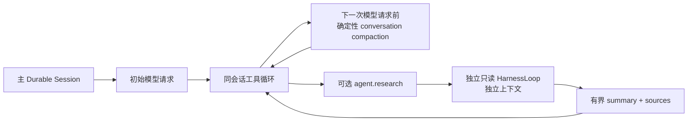
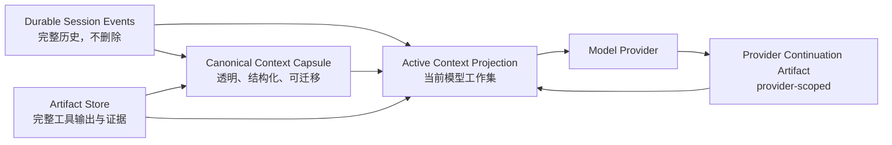

# Zebra Agent 上下文生命周期与混合压缩架构方案 v1.0

## 0. 文档状态

| 项目 | 值 |
|---|---|
| 状态 | Implemented；`CTX-LC-01` 已完成并进入 Review |
| 设计日期 | 2026-07-17 |
| 外部资料核验日期 | 2026-07-17 |
| 目标读者 | Harness、Context、Storage、Integrations、Tools、Eval 维护者 |
| 上位约束 | 最终架构、实施阶段基线、任务登记、Policy 与 Durable Event Store 边界 |
| 关联方案 | `DeepSeek_V4_模型适配与专项优化方案_v1.0.md` |

本文定义 Zebra Agent 处理超长会话、重复工具调用、大型工具输出和跨模型恢复时的目标方案。它借鉴 Claude Code 的渐进式上下文防御和 Anthropic 服务端 Compaction，也借鉴 Codex / OpenAI Responses API 的 provider-native compaction，但不把任何厂商私有状态作为 Zebra 的唯一会话真相。

本文既是专项架构约束，也是 `CTX-LC-01` 的实现基线。provider-neutral
生命周期已经落地；OpenAI、Anthropic、DeepSeek 的具体协议参数和真实
provider 验收仍由各模型专项任务负责，不能反向污染核心契约。

### 0.1 实施完成度（2026-07-17）

| 层级 | 已落地能力 | 主要可执行证据 |
|---|---|---|
| L0 | 统一初始/续轮/审批/澄清/恢复/最终综合 planner，逐类 reserve 与 typed hard failure | Context Window Gate、Harness 与 Worker 测试 |
| L1 | command/test/file/search/list/Web/MCP 统一 Artifact-backed head/tail envelope | Tool output projection 与 runtime 回归测试 |
| L2/L3 | typed tombstone、assistant/tool 成对投影、2～4 个近期精确交换、Protected Ledger、受控重水合 | Projection 与 50/100/200 轮长循环测试 |
| L4 | 版本化 Capsule、validator、不可变 Artifact、创建事件、来源范围、原子 active pointer | Context lifecycle storage/worker 测试 |
| L5 | capability-driven continuation、provider/model/version/TTL/hash 隔离与确定性 fallback | Provider continuation storage/core 测试 |
| L6 | inspect、focus、preview、through-sequence、历史恢复、Pre/Post hook、占用分类 | API/CLI context 测试 |

完整验证结果为 `1379 passed, 1 skipped`；文件大小、Ruff、严格 Mypy
（`379` 个 source files）和 `8` 个 release Evals 全部通过。唯一 skip 是
非 Linux 环境下的平台门控 gVisor smoke，与上下文生命周期无关。

## 1. 决策摘要

Zebra 采用以下混合方案：

1. 完整 Session Event Store 在数据保留期内始终作为权威历史，不因压缩而删除事件。
2. Zebra 维护透明、版本化、可验证的 `ContextCapsule`，支持崩溃恢复和跨模型迁移。
3. 当前模型真正看到的是可重建的 `ActiveContextProjection`，不是完整事件历史。
4. 大型工具输出进入 Artifact Store；上下文只携带有界预览、摘要、哈希和引用。
5. OpenAI 或 Anthropic 的原生压缩只作为 provider-scoped continuation 优化。
6. DeepSeek 或不支持原生压缩的 provider 使用 Zebra Capsule 重建消息。
7. 请求发送前必须经过模型感知的硬预算门禁；`within_budget=false` 时禁止调用模型。
8. 阈值由 `ModelProfile + TaskProfile + Eval` 决定，不写死“83%”或“90%”。
9. 主任务默认在同一 Durable Session 内压缩并继续，不因上下文高水位自动创建后台会话。
10. Research Subagent 只用于隔离高噪音、可并行、边界明确的证据采集，并向主会话返回有界结果。
11. 新线程或阶段性 handoff 属于显式产品操作，不作为自动 compaction 的替代路径。
12. 阶段性 handoff 的 lineage、Envelope、事务和恢复边界以
    [`阶段性Session_Handoff与短线程链架构方案_v1.0.md`](./阶段性Session_Handoff与短线程链架构方案_v1.0.md)
    为专项设计基线；当前仍未激活实现。

最终形态是“渐进式清理 + 结构化胶囊 + 原生压缩加速 + 事件流兜底”，而不是单一摘要器。

## 2. 实施前基线与已关闭缺口

### 2.1 已有能力

任务启动前主线已具备：

- 确定性的 workspace 扫描、排序、预算裁剪和来源信息；
- conversation compaction 与 tool-output compaction；
- system prefix、原始用户目标和近期 assistant/tool 交互保留；
- unresolved、approval-pending 工具调用保护；
- `ContextCompacted` 事件中的前后估算、计数和 provenance；
- approval / clarification continuation 与压缩历史兼容；
- Durable Session Event Store、Artifact 和 replay 基础设施。

Phase 117 的目标是“有界、确定性的会话压缩”。其显式非目标包括语义摘要、provider tokenizer 保证和 provider-native compaction；这些 provider-neutral 契约已由 `CTX-LC-01` 补齐，provider 专项实现继续由独立任务负责。

当前运行拓扑如下：



| 路径 | 当前行为 | 边界 |
|---|---|---|
| 主会话 | 在同一消息列表和 Session 内压缩旧的已完成交换后继续 | 默认 conversation budget 为固定 800；初始请求不经过该 compactor |
| 跨 attempt | 把上次结果降维成 conversation、planner、verifier 和 tool-output evidence，再编译进下一次请求 | 使用固定小预算，不是完整会话迁移 |
| Research Subagent | 通过 `agent.research` 启动独立只读 HarnessLoop，只返回 summary、sources、confidence 和 usage | 默认最多 3 个 children 并发；单 child 最多 3 次模型调用、2 次工具调用；深度固定为 1 |
| 阶段性新线程 | 当前没有自动 handoff 机制 | 不参与窗口溢出处理 |

Research Subagent 当前是进程内有界执行单元，不是 UI 中长期挂载的后台会话；父模型一次提出多个安全 research call 时可以并行，但父工具调用最终等待有界结果回填。

### 2.2 已关闭缺口

1. 固定预算已替换为 `ModelContextWindow` profile 和逐类 reserve。
2. token counting 已抽象为 provider Port，fallback 会显式记录估算方法。
3. 初始与续轮请求已统一进入同一 planning/hard-gate 路径。
4. 超限请求会抛出 typed failure，无法进入 provider。
5. 已提供透明、版本化、可验证、可恢复的 `ContextCapsule`。
6. Capsule 内容、来源范围和 active pointer 已与事件原子持久化。
7. 大输出已统一经过 Artifact-backed `ToolOutputEnvelope`。
8. Protected Ledger 与近期成对精确尾部不参与普通 greedy 丢弃。
9. provider-native continuation 已形成可选能力和生命周期契约。
10. API/CLI 已提供 inspect、focus、preview、through-sequence 和历史恢复。

### 2.3 2026-07-17 实施前审计证据

- 当前代码对仅含超大 system 和首个 user message 的 800-token 压缩请求返回：
  `before=2016`、`after=2016`、`compacted=false`、`within_budget=false`；Harness 仍缺少统一硬阻断。
- `tests/agent_context/test_conversation_history.py` 证明旧的已完成交换会被压缩，最新 assistant/tool pair 和 unresolved call 会被保留。
- `tests/integration/test_compacted_approval_continuation.py` 证明审批暂停后可从压缩 conversation 精确继续且不重放已完成工具。
- `tests/integration/test_readonly_research_delegation.py` 证明 parent 能使用 child 的有来源摘要，并可对多个只读 research call 有界并行。
- 上述路径与 `tests/agent_runtime/test_research_subagent.py` 在审计时共计 12 项测试通过。

## 3. 外部方案中可采纳与不可固化的部分

### 3.1 Anthropic / Claude 可采纳能力

- server-side compaction 生成可继续使用的 compaction block；
- `pause_after_compaction` 允许在摘要后重新注入近期消息或受保护指令；
- tool-result clearing 以占位符替换旧结果；
- thinking-block clearing 与 tool-result clearing 可独立配置；
- 客户端仍可保存完整原始历史；
- prompt caching 与 context editing 分开配置。

### 3.2 OpenAI / Codex 可采纳能力

- Responses API 在请求链中通过 `compact_threshold` 触发服务端压缩；
- `/responses/compact` 可独立产生 canonical compacted input；
- compaction item 可以携带 opaque / encrypted continuation state；
- Codex 允许配置自动压缩 token limit 和 context window；
- 压缩项与其它输出项一起参与后续请求，而不是由客户端擅自解析私有内容。

### 3.3 不作为 Zebra 固定契约的社区观测

以下信息可能有参考价值，但不得写入实现常量或验收标准：

- Claude Code 永久固定在 83% 触发或永远预留同一个缓冲区；
- Claude 摘要永远由固定九段组成；
- Codex 永久固定在 90% 触发；
- 某个 provider 永远使用固定上下文窗口、输出上限或计费区间；
- Claude 与 Codex 之间存在恒定的 token 消耗倍数；
- prompt caching 可以替代上下文裁剪或压缩。

这些值都必须来自版本化 `ModelProfile`、运行时 provider 能力探测和最新官方资料。

## 4. 三态上下文架构



### 4.1 Durable Session Events

- 是用户消息、工具调用、审批、策略判断、模型结果和恢复状态的权威记录；
- 会话存续期间 append-only，压缩不得重写或删除原始事件；到期删除按独立的数据保留策略处理；
- 压缩只是生成新的投影和 Artifact；
- replay 必须能够在 provider 私有状态不可用时重建有效工作集。

### 4.2 Canonical Context Capsule

- Zebra 自己定义并版本化；
- 可读、可审计、可验证、可跨模型；
- 保存任务状态和证据引用，不复制大日志和秘密；
- 每次生成都绑定来源事件范围、哈希和 schema 版本；
- 不是授权或 Policy 的替代品。

### 4.3 Active Context Projection

- 是某次模型调用的真实输入投影；
- 由 stable prefix、受保护约束、Capsule、近期精确交互、按需项目证据和工具 schema 组成；
- 可从事件、Artifact、项目文件和 Capsule 重建；
- 根据 ModelProfile 和 TaskProfile 使用不同预算。

### 4.4 Provider Continuation Artifact

- 保存 OpenAI opaque compaction item、Anthropic compaction block 或同类能力；
- 绑定 provider、model、API capability version、session、tenant、TTL 和加密策略；
- 不可跨 provider 迁移；
- 失效时回退到 Zebra Capsule，不阻塞会话恢复；
- 不得单独决定权限、审批、工具幂等或完成状态。

### 4.5 主会话、子代理与新线程的职责边界

| 执行单元 | 适用条件 | 返回主路径的内容 | 不承担的责任 |
|---|---|---|---|
| 同一主 Session | 默认任务推进、工具循环、审批、恢复、上下文高水位 | 原地更新 Active Context Projection | 不因窗口高水位自动分裂会话 |
| Research Subagent | 大范围搜索、只读文件探索、证据对照等高噪音任务 | 有界 evidence capsule、来源、置信度、usage | 不写文件、不继承主会话全部历史、不决定最终答案或 Policy |
| 并行 Research fan-out | 多个目标互不依赖且都满足 read-only / parallel-safe | 按 provider call 顺序回填多个有界结果 | 不并行写入、不绕过 child/concurrency budget |
| 阶段性新线程 | 用户明确切换阶段、长期维护 handoff 或上下文质量已经退化 | 显式 Context Capsule 和 Artifact 引用 | 不作为自动超限 fallback，不隐式丢弃主 Session |

Subagent 的触发应由任务性质决定，而不是仅由 token 占用决定。Context Window Planner 可以建议把可隔离的证据采集改写为 research objective，但不得为了绕过 `within_budget=false` 自动 spawn child；不能压缩的主请求仍必须失败并给出可操作诊断。

阶段性新线程目前只有设计，不存在自动创建路径。后续实现必须使用显式
`SessionHandoffEnvelope` 和耐久 lineage，不能把 Research Subagent 或普通 Session
创建包装成伪 handoff。

## 5. 六层上下文生命周期

### L0：Context Window Planner 与硬门禁

每次初始调用、tool follow-up、approval continuation 和 recovery 调用都必须经过同一个 planner。

```text
hard_input_limit =
    model_context_window
  - requested_output_reserve
  - reasoning_reserve
  - compaction_work_reserve
  - protocol_and_emergency_margin

predicted_input =
    stable_prefix
  + protected_instructions
  + tool_schemas
  + active_messages
  + attachments
  + context_items
  + provider_continuation_overhead
```

约束：

- `predicted_input > hard_input_limit` 时禁止发送请求；
- 先执行确定性裁剪，再执行语义 Capsule，再重新计算；
- 仍无法满足预算时返回 typed context-budget failure；
- 失败必须说明最大项、已尝试策略和可恢复建议；
- 实际 provider usage 回填估算误差，用于校准 profile。

建议触发逻辑：

```text
compact_at = min(
    profile.auto_compact_token_limit,
    hard_input_limit - compaction_trigger_reserve
)
```

触发点应有 hysteresis：压缩后目标回落到有效窗口的约 35%～50%，避免每轮反复压缩。具体比例由 Eval 校准，不是架构常量。

### L1：增长源治理

所有可能产生大输出的工具使用统一信封：

```yaml
ToolOutputEnvelope:
  content_type: text/plain
  preview_head: "..."
  preview_tail: "..."
  digest: "..."
  artifact_uri: "artifact://..."
  original_bytes: 0
  retained_bytes: 0
  truncated: false
  checksum: "..."
  provenance: {}
```

要求：

- command、test、build、HTTP、MCP、文件读取和搜索都使用统一上限；
- 完整内容先写 Artifact，再把有界预览送入上下文；
- 预览默认保留 head + tail，避免只保留开头丢失最终错误；
- 支持分页、游标、按行段读取和结构化提取；
- 工具 schema 按需披露，禁止每轮注入全部工具；
- 子任务使用隔离上下文，只返回证据 Capsule；
- 缓存只优化稳定前缀的成本和延迟，不改变硬预算计算。

### L2：每轮 Micro-compaction

无需模型、低成本、确定性执行：

- 已完成的旧 tool result 替换为 typed tombstone；
- 同一文件的旧读取被新版读取、内容 hash 或 Patch 摘要取代；
- 重复规则、重复 repo map 和无信息成功日志去重；
- 保留最近 2～4 个完整工作交换，数量由 TaskProfile 决定；
- 未完成、失败待处理、approval-pending、clarification-pending 调用不得折叠；
- assistant tool call 和对应 tool result 必须成对保留或成对投影；
- tombstone 始终带 artifact、checksum、tool name、call id 和结果状态。

### L3：Projection Folding 与按需重水合

把可重建材料从活跃窗口移出：

- `AGENTS.md`、README、配置和项目规则保留路径、作用域和 hash，需要时重读；
- 代码保留最新行段、符号锚点、commit/worktree hash 和 Patch；
- 测试日志保留命令、退出码、关键错误、摘要和 Artifact；
- 网页与 MCP 数据保留来源、获取时间、信任等级和 Artifact；
- 被重新读取的同版本内容不得重复占用窗口；
- 重水合操作必须受 token budget、Policy 和 provenance 校验约束。

用户目标、验收标准、明确约束和审批结果进入 `ProtectedInstructionLedger`，不得作为普通不可信数据折叠。

### L4：Canonical Context Capsule

建议 schema：

```yaml
ContextCapsule:
  capsule_id: "..."
  schema_version: "1.0"
  objective: "..."
  scope: []
  acceptance_criteria: []
  protected_user_constraints: []
  decisions_and_rationale: []
  current_plan_and_status: []
  modified_files_and_symbol_anchors: []
  tests_and_command_results: []
  unresolved_errors: []
  approvals_and_policy_state: []
  artifact_and_evidence_refs: []
  open_questions: []
  immediate_next_action: "..."
  recent_exact_tail_refs: []
  source_event_range: {}
  source_hash: "..."
  model_profile: "..."
  generator: "deterministic|model-assisted|provider-native-import"
  confidence: "..."
  known_omissions: []
```

生成流程：

1. 从完整事件投影构建候选事实，而不是直接让模型阅读拼接字符串。
2. 模型可辅助生成结构化 Capsule，但输出必须通过 schema 校验。
3. Validator 检查未完成调用、审批状态、用户约束、文件 hash、事件范围和 Artifact 可读性。
4. 验证失败时回退到确定性 Capsule；不得替换当前可用投影。
5. Capsule 写入不可变 Artifact，并追加 `ContextCapsuleCreated` 事件。
6. 原子更新 Active Context Projection；崩溃恢复不得出现“事件已压缩但 Capsule 未落盘”的中间状态。

### L5：Provider-native Compaction

| Provider | 使用方式 | Zebra 约束 |
|---|---|---|
| OpenAI Responses | `context_management.compact_threshold` 或 `/responses/compact` | 保存完整返回的 canonical compacted input；opaque item 仅在同 provider 延续 |
| Anthropic Messages | `compact_20260112` | 优先使用 `pause_after_compaction`，持久化 block 后重新注入 Protected Ledger 和近期尾部 |
| Anthropic context editing | tool-result / thinking clearing | 作为 L2/L3 的 provider 加速，不替代 Zebra Artifact 和事件历史 |
| DeepSeek | Zebra Capsule fallback | 未验证到稳定原生 compaction 能力前，不声明支持；按 OpenAI-compatible 消息重建 |
| 其它 provider | capability-driven | 没有明确能力时默认走透明 Capsule，不猜测协议 |

provider adapter 必须报告：

- tokenizer 或 count-tokens 能力；
- context window、最大输出和 reasoning 行为；
- native compaction 类型和 capability version；
- opaque state 的持久化与 ZDR 限制；
- 压缩后 usage、stop reason 和恢复错误；
- 不支持能力时的 typed fallback 原因。

### L6：人工控制和可观测性

产品层已经提供：

- `/context`：按 stable prefix、tools、messages、artifacts、Capsule、reserve 显示占用；
- `/compact [focus]`：要求 Capsule 特别保留某类证据；
- “压缩到此处”：保留近期工作原文；
- 压缩预览：展示将保留、折叠和 artifact 化的项目；
- 从历史 Capsule 恢复；
- PreCompact / PostCompact hooks；
- 压缩原因、版本、来源范围和已知遗漏的审计视图。

## 6. 模型和任务专项预算

物理窗口不等于默认有效窗口。超大窗口会增加成本、延迟和注意力稀释风险，因此使用 `TaskProfile` 限制日常工作集。

建议初始实验值：

| TaskProfile | 初始有效窗口 | 适用任务 |
|---|---:|---|
| `interactive-fast` | 64K～96K | 短反馈、工具执行、局部修改 |
| `planner-reviewer` | 128K～192K | 规划、审查、跨文件推理 |
| `long-research` | 256K～512K | 显式开启的大仓库研究和长材料分析 |

DeepSeek 即使提供 1M 物理上下文，默认也不应把 1M 全部视为活跃工作集。DeepSeek Profile 应继承本文的 planner、Artifact、Capsule 和 Eval 约束；thinking/tool 协议安全继续以 DeepSeek 专项方案为准。

这些数字仅是基线实验参数，必须通过成本、延迟、恢复质量和完成率 Eval 调整。

## 7. 一致性、恢复与安全不变量

### 7.1 事务顺序

```text
plan compaction
  -> persist large outputs as artifacts
  -> build capsule candidate
  -> validate candidate
  -> persist immutable capsule artifact
  -> append ContextCapsuleCreated event
  -> atomically advance active projection
  -> optionally invoke provider-native compaction
  -> persist provider continuation artifact
  -> send next model request
```

如果 provider-native compaction 失败，已生成的 Zebra Capsule 仍然有效；如果 Capsule 持久化失败，不得删除或替换原始活跃历史。

### 7.2 安全不变量

- tool output、网页、Issue、MCP 内容和生成摘要默认是数据，不是授权指令；
- Capsule 不保存原始 credential、token、secret 或完整敏感日志；
- provider opaque state 按租户隔离、加密、设置 TTL，并支持删除；
- 摘要器不得改变 Policy、approval、egress 和 sandbox 决策；
- 任何“继续执行”建议仍需经过当前 Policy；
- 用户逐字内容仅在保持约束或审计确有必要时保留，避免无差别永久复制；
- provider 切换时丢弃不可迁移私有状态，使用 Zebra Capsule 重建。

## 8. 观测指标

每次模型调用和压缩至少记录：

- 按类别拆分的 predicted / actual tokens；
- ModelProfile、TaskProfile 和有效窗口；
- 压缩触发原因与使用层级；
- 压缩前后 token、消息和 tool-result 数；
- artifact 字节数、预览字节数和重水合次数；
- Capsule schema、validator 结果、来源事件范围和 known omissions；
- provider-native compaction 类型、版本、stop reason 和错误；
- prompt cache hit/miss，但不把 cache hit 当作压缩成功；
- 压缩后任务完成率、重复工具调用率和人工纠正率；
- 估算 token 与 provider actual usage 的误差。

禁止把原始秘密或完整敏感工具输出写入指标和事件。

## 9. Eval 与验收矩阵

### 9.1 硬不变量

- 所有 outbound model request 均满足硬输入预算和输出预留；
- 任何 `within_budget=false` 请求都不会到达 provider；
- pending tool call、approval、clarification 和用户验收标准零丢失；
- assistant/tool pairing、call id 和幂等语义压缩后仍有效；
- 被截断工具输出可从 Artifact 完整恢复；
- 崩溃可从 Event Store + Capsule 恢复，不依赖 provider 私有状态；
- provider-native artifact 失效时自动回退到 Zebra Capsule；
- 跨 OpenAI、Anthropic、DeepSeek 切换后能够继续同一任务；
- 压缩摘要中的 prompt injection 不得提升权限。

### 9.2 测试场景

1. 50、100、200 次工具调用并多次压缩的长会话。
2. 单条超大 stdout、stderr、测试日志、MCP 和 HTTP 输出。
3. 初始请求即超过预算。
4. system + 首个 user message 本身超过有效预算。
5. pending approval 前后发生压缩与 worker crash。
6. Capsule 已落盘、provider-native compaction 尚未完成时崩溃。
7. provider opaque state 损坏、过期或模型版本不兼容。
8. 同一文件反复读取、修改、回退和重新读取。
9. 早期用户约束与晚期冲突指令。
10. 跨 provider continuation 和模型降级。
11. 大窗口但低收益上下文对质量、延迟和成本的影响。
12. prompt caching 与 context editing 同时启用时的收益和失效行为。

质量门槛不能只看压缩率；必须同时比较任务完成率、证据保留率、重复调用率、延迟和成本。

## 10. 分阶段实施记录

### CTX-LC-01A：预算正确性与输出 Artifact 化（完成）

- 统一初始请求和 follow-up 的 Context Window Planner；
- 引入 provider-aware token estimate/count；
- 强制 hard gate；
- 为 command/test/build 等实现统一 `ToolOutputEnvelope`；
- 覆盖当前 `within_budget=false` 漏洞。

最小验收：

- 初始请求、tool follow-up、approval、clarification 和 recovery 全部经过同一个 planner；
- 任何超出 `hard_input_limit` 的请求都不会到达 provider；
- system + 首个 user message 无法压缩时返回 typed failure，而不是继续请求；
- command/test/build 的完整 stdout/stderr 可从 Artifact 恢复，活跃上下文只保留有界 head/tail；
- provider actual usage 与估算误差可观测。

### CTX-LC-01B：渐进式 Active Projection（完成）

- typed tombstone；
- Micro-compaction；
- Projection Folding；
- Protected Instruction Ledger；
- 按需重水合。
- 保持“主会话 compaction 为主、Research Subagent 隔离噪音为辅”；不根据 token 水位自动创建 child。

### CTX-LC-01C：Durable Context Capsule（完成）

- `ContextCapsule` schema、builder、validator；
- Artifact 和 `ContextCapsuleCreated` 事件；
- 原子投影推进；
- 崩溃恢复与跨模型重建。

### CTX-LC-01D：Provider-native 契约与 fallback（核心完成）

- OpenAI Responses compaction capability Port；
- Anthropic compaction 与 context editing capability Port；
- DeepSeek / generic Capsule fallback；
- provider continuation artifact 生命周期。

具体 OpenAI、Anthropic、DeepSeek adapter 的线上协议适配、模型参数和
真实 provider Eval 不属于 provider-neutral 核心；它们按 owned paths 进入
独立模型专项任务。核心已经能够安全接入这些实现，也能在实现缺失或状态
不兼容时确定性回退。

### CTX-LC-01E：控制面与自适应策略（完成）

- `/context`、`/compact`、预览和恢复；
- 观测看板；
- Eval 驱动的 ModelProfile / TaskProfile 阈值调节。

上述依赖顺序已经执行：先完成 Zebra Capsule 和恢复边界，再开放 opaque
provider continuation Port。未来模型专项不得绕过这一顺序。

## 11. 包边界建议

| 包 | 责任 |
|---|---|
| `agent-core` | `ContextWindowPlan`、`ContextCapsule`、事件和 Port；不包含厂商 SDK |
| `agent-context` | planner、micro-compaction、Capsule builder/validator、projection、rehydration |
| `agent-tools` | `ToolOutputEnvelope`、预览和 artifact 引用契约 |
| `agent-storage` | Capsule Artifact、Active Projection、provider continuation persistence |
| `agent-integrations` | tokenizer、count-tokens、OpenAI/Anthropic native compaction adapter |
| `agent-runtime` | command/test/build 输出采集和有界交付 |
| `agent-observability` | token、压缩、恢复、质量和成本指标 |
| `apps/*` | 配置装配、CLI/API/UI 控制；不承载压缩规则 |

保持 `agent-core` 不依赖其它 `agent-*` 包；provider capability 通过 Port 输入，不把厂商字段泄漏进核心状态机。

## 12. 明确非目标

- 不追求把物理上下文窗口填满；
- 不把向量数据库作为首个压缩依赖；
- 不要求所有 provider 使用相同压缩格式；
- 不解析 OpenAI encrypted compaction content；
- 不持久化隐藏 reasoning 作为 Zebra 的跨模型记忆；
- 不让摘要替代 Event Store、Artifact、Policy 或审批；
- 不把上下文高水位直接映射为自动 Subagent 或后台会话创建；
- 不在第一阶段实现 nested subagents、Agent Teams 或隐式短线程链；
- 不在 `CTX-HO-01` 激活前实现或暴露阶段性 Session handoff；
- 不因本实现自动激活新的 provider 专项或修改当前 Beta 产品边界。

## 13. 参考资料

以下链接在 2026-07-17 重新核验；厂商参数可能变化，实施时必须再次确认：

- Anthropic, [Compaction](https://platform.claude.com/docs/en/build-with-claude/compaction)
- Anthropic, [Context editing](https://platform.claude.com/docs/en/build-with-claude/context-editing)
- Anthropic, [Manage tool context](https://platform.claude.com/docs/en/agents-and-tools/tool-use/manage-tool-context)
- Anthropic, [Claude Code context window](https://code.claude.com/docs/en/context-window)
- OpenAI, [Compaction guide](https://developers.openai.com/api/docs/guides/compaction)
- OpenAI, [Compact a response](https://developers.openai.com/api/reference/resources/responses/methods/compact)
- OpenAI, [Codex configuration reference](https://developers.openai.com/codex/config-reference)
