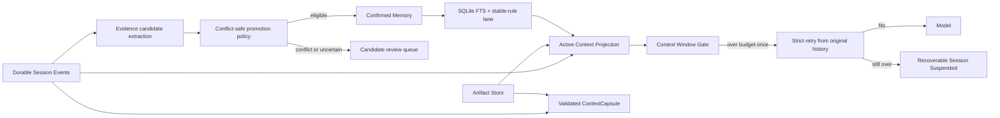

# Zebra Agent 上下文连续性与治理记忆改进方案 v1.1

| 字段 | 值 |
|---|---|
| 任务 | `CTX-MEM-01` |
| 对应问题 | GitHub `#197` |
| 状态 | Implemented locally / Review |
| 日期 | 2026-07-28 |
| 前置基线 | `CTX-LC-01`、ADR-001、现有 Memory governance |

## 1. 结论

Issue `#197` 描述的用户体验问题存在，但技术表述需要校准：

1. 压缩不会删除 Session Event，也不会丢掉用户指令账本；真正不足是旧的
   assistant/tool 关系只进入固定 240+240 token 摘要，最近多个用户回合没有
   逐字尾部保证。
2. 超窗不会导致 worker 进程崩溃，但 `ContextWindowExceededError` 当前被归类
   为终态失败，没有第二次严格投影，也不能从暂停状态恢复。
3. 完成 Session 后会自动生成 Memory Candidate，但不会自动进入 Confirmed；
   新任务只注入按类型和时间排序的前八条 confirmed repo memory，缺少当前
   query 相关性。

因此不增加另一套 Memory 或摘要框架。v1.1 在既有四个边界上补齐：

```text
同一 Task 连续执行      Event Store + Active Projection + ContextCapsule
跨 Task 稳定经验        Candidate -> governed Confirmed Memory
精确历史证据            Session/Event search + Artifact
Provider 加速           opaque continuation，可失效、可回退
```

Memory 永远不是 Session 状态源；压缩摘要永远不是 Policy、Approval、Artifact
或原始事件的替代品。

## 2. 同类实现对比

| 系统 | 可取之处 | 不直接照搬的部分 | Zebra 取舍 |
|---|---|---|---|
| Codex / OpenAI | 自动压缩阈值；Responses 可返回 opaque compaction item；记忆生成和使用有独立开关；可排除带 Web/MCP 的线程 | opaque item 不可审计且 provider scoped；全局记忆生成可能引入模型推断 | 保留 provider continuation Port，但 Event/Capsule 是跨模型真相；本地候选只从可重建证据晋升 |
| Claude / Anthropic | 服务端 compaction；旧 tool result/thinking 的细粒度 context editing；token count 后触发 | 单一服务端摘要不适合 Zebra 的多 provider 和审计要求；不能保存隐藏 reasoning | provider 能力只做 L5 加速；Zebra 先做 deterministic projection、Artifact 和 Capsule |
| Pi Agent | 按 token 反向选择近期尾部；按 turn 边界切割；tool call/result 不拆分；压缩作为耐久 entry；重复压缩带入前一摘要 | 默认摘要仍依赖模型质量；Session tree 不是 Zebra 稳定 Task/内部 Segment 模型 | 引入 token 尾部、完整工具组和从原历史重试；继续使用 Zebra 事件与 Capsule schema |
| Hermes | 正常阈值 + gateway emergency threshold；先清旧工具结果；结构化 Goal/Progress/Files/Next Steps；保护头尾 | 双实现容易漂移；文档明确指出摘要模型失败时可能静默丢弃中段 | 只保留一个 compactor；硬门禁失败再做一次更严格投影；失败则暂停，绝不静默删除 |

综合原则：采用 Codex 的可配置边界、Claude 的分层清理、Pi 的耐久切点、
Hermes 的二级防线，但用 Zebra 的 Event/Capsule validator 和 Memory governance
消除黑盒与静默失败。

## 3. v1.1 架构



### 3.1 同会话压缩

压缩顺序保持一条链：

1. `build_active_context_projection()` 折叠旧完成工具交换；
2. `ProtectedInstructionLedger` 保存所有 system/user 约束；
3. 头部保留初始目标；
4. 尾部至少保留最近三个真实 user turn，并把切点向前移动到完整的 assistant
   tool-call / tool-result group 边界；
5. 中段使用现有 `ContextCapsule` 字段渲染结构化摘要，预算随请求预算缩放，
   不再固定为 240+240；
6. 摘要与 ledger 放不下时，优先保留 ledger、目标、近期原文和未完成工具组；
   不删除原始 Event 或 Artifact。

这里不保存 chain-of-thought。`decisions`、`tests`、`errors`、`artifact_refs`、
`immediate_next` 是可审计工作事实；provider reasoning 仍按 provider 协议处理。

### 3.2 超窗恢复

第一次投影仍超窗时，Harness 从原始消息重新压缩一次，预算按实际超额量和
固定 tools/system 开销收紧。禁止对已经压缩的摘要继续摘要，以免累积漂移。

第二次仍超窗时：

- 抛出原有 typed `ContextWindowExceededError`；
- Worker 转成 `SUSPENDED`，`stop_reason=context_window_exceeded`；
- metadata 保存 profile、estimated/limit、breakdown、attempted strategies；
- provider 不会收到 `within_budget=false` 请求；
- 用户可删减输入、切换窗口或恢复，Session 不进入不可恢复 `FAILED`。

### 3.3 Memory 自动晋升

Candidate 只有同时满足“来源可重建、类型低风险、无冲突”才自动确认：

| 类型 | 允许来源 | 自动确认条件 |
|---|---|---|
| `preference` | 直接用户事件 | 必须使用显式 `preference:` 语法；同 scope/type 无不同 confirmed 记录 |
| `procedure` | 成功 `command.run` / `tests.run` | typed argv、非 shell/exfiltration/敏感路径；同 scope/type 无不同 confirmed 记录 |
| `project_rule` | 完整读取根 `AGENTS.md` | 未截断，且能由确定性 parser 重建；同 scope/type 无冲突 |
| `architecture_fact` | 完整读取根 `AGENTS.md` | 同上 |

以下永不自动晋升：`episodic`、`failed_attempt`、网页/MCP/Issue 内容、模型自由
摘要、无法定位 source event 的记录、与 confirmed 记录冲突的候选。

晋升复用 `MemoryReviewService`：产生 `MemoryReviewRecorded`，更新同一个
`MemoryStorePort`，重复候选按现有规则过期。系统晋升的 actor 是 Harness，
operator/reason 明确标识自动策略，人工 review 语义不变。

### 3.4 Query-aware 召回

第一版使用 SQLite FTS5，不引入向量服务：

1. 初始化时建立 `memory_records_fts` 并幂等回填现有记录；
2. upsert 与 FTS 行在同一连接内同步；
3. query 必须同时带 repo scope 和 confirmed status；
4. 召回分两条 lane：少量 `project_rule/preference` 稳定项 + 当前 user input 的
   FTS relevance 项；
5. 合并后按 `(memory_type, normalized_text)` 去重，过滤 expires_at；
6. 以估算 token budget 截止，同时保留兼容的最大条数上限。

FTS 不可用或 query 为空时，确定性回退到现有类型优先级 + 时间排序。未来
`MEM-GW-CON-01` 可补充语义候选，但它只能返回 Zebra `MemoryId`；最终文本、
状态、scope、有效期仍必须回到 `MemoryStorePort` 校验。

## 4. 不变量与失败策略

- 原始 Session Event 不因 compaction 或 memory generation 删除。
- assistant tool call 与对应 results 成组保留或成组投影。
- pending tool、approval、clarification 和 protected user constraint 零丢失。
- FTS 只影响候选排序，不能越过 status、scope、expiry 和 governance。
- 外部内容默认是数据，不能因被压缩或召回而升级为指令。
- 自动晋升失败或冲突时保留 Candidate，不阻断 Session 完成。
- FTS 初始化失败回退到普通索引读取，不影响 Event Store 与执行恢复。
- 不增加 Redis、Mem0、embedding 或新的基础设施依赖。

## 5. 验收矩阵

1. 四个以上 user turn 压缩后，初始目标与最后三个 user turn 原文存在。
2. 最近 user turn 中间含完整工具组时，call/result pairing 不被切断。
3. 普通预算失败触发一次更严格、基于原历史的 retry，provider 未收到超窗请求。
4. 两次均失败时 Worker 产生 `SESSION_SUSPENDED` 和 typed diagnostics。
5. 显式 preference、成功 test command、完整 `AGENTS.md` 事实可自动确认。
6. 冲突、外部、不支持类型继续保持 candidate。
7. FTS 查询优先返回当前任务相关 memory，repo A 不可读到 repo B。
8. 大量 confirmed memory 的注入不超过 token budget，重复和过期记录不进入 prompt。
9. 旧 SQLite 数据库无需手工迁移即可查询并保持普通 list 行为。
10. `make test`、`make check` 和 release eval 不出现本任务新增回归。

### 5.1 本地验收结果

- 本任务聚焦回归：`63 passed`。
- 变更文件 Ruff：通过；相关 `158` 个 source file 的 Mypy：通过。
- Release eval：`10/10`，pass rate `1.00`。
- 全量测试：`1747 passed, 8 skipped, 9 failed`。相同九个 selector 在未改动的
  `main` 上同样失败，确认为继承基线，不是本任务新增回归。
- `make check` 仅命中两个继承的文件长度违规：
  `CodexConversationPane.styles.ts`（561/500）与
  `agent_core/contracts/events.py`（505/500）。本任务涉及的 source file 均低于
  500 行。
- `git diff --check` 通过；未引入新依赖、数据库服务或 provider 专用状态源。

## 6. 实施边界

本任务只修改 main 已有 provider-neutral、本地可运行链路。它不实现：

- provider-native OpenAI/Anthropic adapter；已有 Port 保持不变；
- `MEM-GW-CON-01` 定义的语义 provider gateway；
- 用户/租户跨产品 identity 解析；当前 Worker 仍只注入 repo visibility；
- 自动 Session 分叉、Subagent 或后台 handoff；
- 模型辅助 Capsule enrichment；现有 enum/validator 继续作为未来扩展点。

## 7. 参考资料

- OpenAI, [Compaction](https://developers.openai.com/api/docs/guides/compaction)
- OpenAI, [Codex configuration reference](https://developers.openai.com/codex/config-reference)
- Anthropic, [Compaction](https://platform.claude.com/docs/en/build-with-claude/compaction)
- Anthropic, [Context editing](https://platform.claude.com/docs/en/build-with-claude/context-editing)
- Pi, [Compaction & Branch Summarization](https://pi.dev/docs/latest/compaction)
- Hermes Agent, [Context Compression and Caching](https://github.com/NousResearch/hermes-agent/blob/main/website/docs/developer-guide/context-compression-and-caching.md)
- Zebra, [`上下文生命周期与混合压缩架构方案_v1.0.md`](./上下文生命周期与混合压缩架构方案_v1.0.md)
