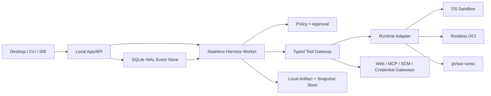
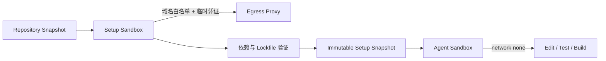
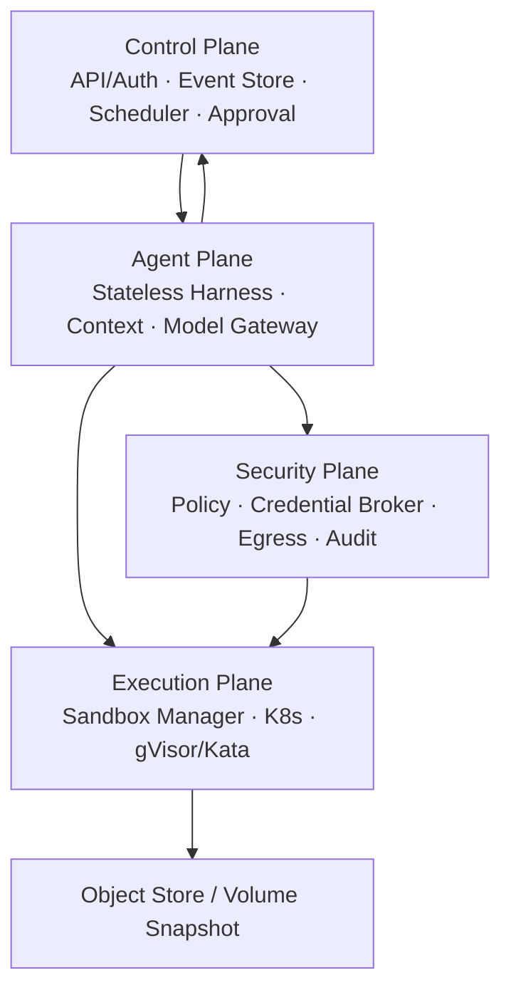
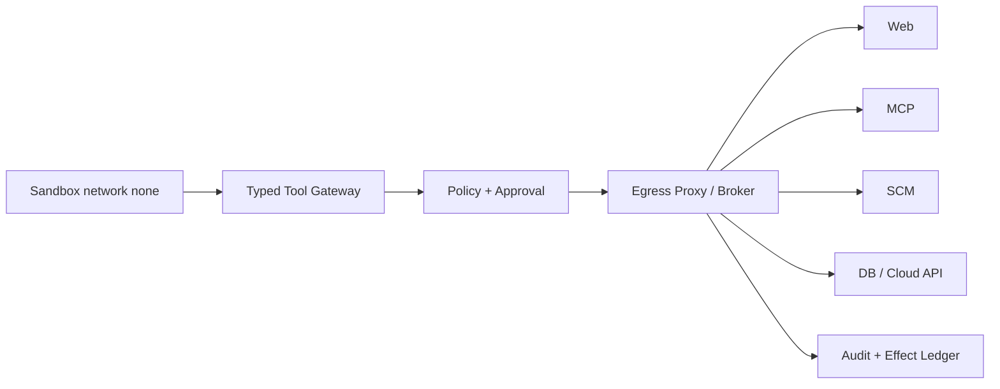

# Zebra Agent 单机与云平台 Runtime 目标架构方案 v1.0

> 状态：目标架构已确认，实施任务未自动激活
>
> 日期：2026-07-18
>
> 任务：`ARCH-RT-BP-01`
> 适用范围：Zebra Agent 单机版、私有云单租户、云端多租户

## 1. 执行摘要

Zebra 不应照搬 Codex 或 Claude Code 的 Runtime。适合本项目的组合是：

- 保留 Zebra 已有的持久事件流、无状态 Harness、Typed Tool Gateway、
  Policy/HITL、Effect Ledger、Artifact 和可恢复 Sandbox 语义；
- 单机采用“OS Sandbox 提升日常体验 + gVisor 提供 Linux 强隔离”；
- 云端采用“PostgreSQL 控制面 + 无状态 Harness Worker + Kubernetes
  gVisor/Kata 执行面 + 外置 Credential/Egress Broker”；
- 本地和云端共享同一领域合同，只替换 Event Store、Artifact Store、Lease、
  Runtime、Credential 和 Egress 等基础设施 Adapter；
- Sandbox 内默认断网且没有原始凭证。依赖安装放入独立 Setup Phase，Web、MCP、
  SCM、云 API 和 Secret 均通过 Sandbox 外的受控 Gateway/Broker。

最终选型：

> **单机：`trusted-local` 仅显式使用，日常默认目标为 `os-sandbox`，Linux
> 生产和不可信代码使用 `gvisor`。云端：PostgreSQL 是事实源，无状态 Worker
> 调度 Kubernetes Sandbox；私有云优先 gVisor，多租户默认 Kata，极高风险任务
> 后续进入 Firecracker/Kata-VM 专用池。**

## 2. 背景与设计依据

### 2.1 三种 Runtime 思路的取舍

| 设计来源 | 值得吸收 | 不直接复制 |
|---|---|---|
| Codex | 结构化会话/事件、长期运行服务边界、Sandbox 与审批互补、配置驱动权限 | 不为追求实现语言或产品形态重写 Zebra 内核 |
| Claude Code | OS 级子进程继承隔离、Sandbox 内减少审批、外置网络代理、强本地体验 | 不把 CLI Harness 或 Bash 权限模型变成 Zebra 的领域事实源 |
| Zebra 现状 | Durable Event Store、无状态 Harness、Typed Tools、Policy/HITL、恢复与审计 | 不把当前单机实现夸大为云端多租户平台 |

Codex 与 Claude Code 的共同启示不是“选择审批还是 Sandbox”，而是：先建立
可证明的执行边界，再在边界内自动放行低风险行为，在越界或产生外部副作用时
请求审批。Zebra 应把这一原则落在现有 Typed Tool、Policy 和 durable event
合同上，而不是另建命令字符串规则体系。

### 2.2 当前已实现事实

截至本方案基线，主线已经具备：

- `trusted-local`、`oci-rootless`、`gvisor` 三类 Runtime；
- Production profile 强制 `gvisor` 和 digest-pinned image，能力不满足时
  在工具执行前 fail closed；
- 只读根文件系统、非 root、drop capabilities、no-new-privileges、默认断网、
  资源限制、session 标签清理和 durable effective authority；
- Snapshot 完整性校验、authority drift 拒绝、fresh Sandbox restore；
- Linux CI 的真实 `runsc` gVisor smoke；
- Web、MCP、SCM 与凭证在 Sandbox 外执行的既有边界。

必须继续如实描述的限制：

- Snapshot 是 Workspace/状态恢复，不是进程内存 checkpoint；
- bind-mounted Workspace 的磁盘 quota 需要部署存储层强制；
- macOS 合同测试不等于原生 gVisor；
- Kubernetes、PostgreSQL 控制面、Kata/Firecracker、多租户、集中式
  Credential/Egress Broker 尚未实现。

## 3. 架构原则与不变量

### 3.1 核心原则

1. Event Store 是唯一 durable authority，Worker 内存不是事实源。
2. Harness 保持无状态；崩溃后从事件、Projection、Artifact 和 Ledger 恢复。
3. Runtime 只负责执行隔离，不复制 Session、Policy 或 Tool 状态机。
4. 所有执行都通过 Typed Tool Gateway；模型不能直接获得宿主 Shell。
5. Policy 决定“能否做”，Sandbox 强制“最多能做到什么”。
6. 凭证、网络和外部副作用与代码执行平面分离。
7. 恢复不能扩大权限，也不能重复已完成或结果不确定的副作用。
8. 本地与云端共享领域语义，差异仅在 Adapter 和部署拓扑。
9. 生产能力必须有真实平台证据；模拟测试不能替代内核级验收。
10. 先做单主 Agent 和单 Sandbox，再扩展协作、生态和多 Agent。

### 3.2 绝对安全不变量

- Sandbox 不挂载 Home、SSH、Docker/containerd socket、宿主 Secret 目录。
- Sandbox 不接收长期 Token、云密钥、SCM 私钥或 Secret 明文。
- Agent Phase 默认无网络；DNS 也属于网络权限。
- Runtime profile 不可用时拒绝执行，不静默降级到 `trusted-local`。
- Authority 只允许保持或收紧，不允许在 resume/retry/failover 时扩大。
- 跨租户 Event、Artifact、Snapshot、Volume、Cache、Log 和 Metric 均需隔离。
- 不确定副作用必须进入 reconciliation，不能自动重放。

## 4. 统一领域合同

本地与云端必须复用以下合同：

| 合同 | 职责 |
|---|---|
| `Session / Attempt / Event` | 持久任务身份、顺序和生命周期 |
| `Harness` | 从 Projection 构造一次有界模型/工具循环 |
| `ToolCall / ToolResult` | 结构化输入、输出、错误和副作用分类 |
| `PolicyDecision / Approval` | 决定 allow、deny、ask、约束和审批范围 |
| `RuntimePort` | provision、exec、stream、snapshot、restore、destroy |
| `SandboxSpec` | 镜像、Workspace、资源、网络、挂载、租户和寿命 |
| `EffectiveRuntimeAuthority` | 实际生效权限及其不可变摘要 |
| `ArtifactRef / SnapshotRef` | 大输出、交付物和恢复状态的内容寻址引用 |
| `EffectLedger` | 副作用 reserve、commit、uncertain、reconcile |
| `Trace / Eval` | 版本、时延、成本、安全和质量证据 |

部署差异通过 Adapter 表达：

| Port | 单机 Adapter | 云端 Adapter |
|---|---|---|
| Event Store | SQLite WAL | PostgreSQL append-only store |
| Projection | 本地事务内更新 | PostgreSQL projection worker |
| Lease/Scheduler | SQLite lease / 单机队列 | PostgreSQL lease + outbox scheduler |
| Artifact | 本地内容寻址目录 | S3/MinIO |
| Runtime | OS Sandbox / OCI / gVisor | Kubernetes Pod + RuntimeClass |
| Snapshot | 本地归档 + checksum | VolumeSnapshot + Object Store manifest |
| Credential | OS Keychain / 本地安全存储 | Vault/KMS/Cloud Secret Manager broker |
| Egress | 本地受控 Gateway | 集中式 Egress Proxy/Gateway |
| Observability | JSONL + OTel | OTel + Metrics/Logs/Trace backend |

禁止为了云端另建一套 `CloudSession`、`CloudTool` 或 `CloudPolicy` 领域模型。

## 5. 单机 Runtime 目标架构

### 5.1 运行拓扑

单机仍可部署为多个本地进程，但不引入云控制面。API、Worker 和 UI 通过同一
SQLite Event Store 收敛状态，Artifact 与 Snapshot 使用本地内容寻址存储。

### 5.2 Runtime profile

| Profile | 场景 | 默认网络 | 失败行为 |
|---|---|---|---|
| `trusted-local` | 用户明确可信、兼容性优先 | 可按显式策略开放 | UI 明示“宿主可信执行” |
| `os-sandbox` | 日常 Desktop/CLI 默认目标 | `none` | OS 机制不可用则 fail closed 或让用户显式切换 |
| `oci-rootless` | Linux/VM 兼容和单租户容器 | `none` | OCI 能力不足则 fail closed |
| `gvisor` | Linux 生产、不可信仓库/依赖 | `none` | `runsc`、镜像或 handler 不满足即拒绝 |

`os-sandbox` 是待实现目标：

- macOS 使用 Seatbelt profile，限制读写路径、进程和网络；
- Linux 优先 bubblewrap + user/mount/pid/network namespaces，并根据平台能力
  叠加 Landlock、seccomp 和 AppArmor/SELinux；
- Windows 首版不承诺原生强隔离；在安全合同完成前请求该 profile 必须
  fail closed，可在受支持的 Linux VM/WSL2 环境运行；
- 所有子进程必须继承同一边界，不能只保护 Zebra 自带文件工具。

### 5.3 Setup Phase 与 Agent Phase

依赖安装是最容易把“需要联网”扩大成“全程联网”的环节，因此拆成两个阶段：

Setup Phase 要求：

- 只允许包管理器需要的域名和方法；
- 临时 Credential 在阶段结束时撤销；
- 记录 lockfile、镜像、下载来源、hash、SBOM 和 Setup Artifact；
- Setup 结果通过 Snapshot 进入 Agent Phase，不能继承代理 Token；
- 无法证明 allowlist 或依赖完整性时拒绝进入生产 Agent Phase。

Agent Phase 要求：

- Sandbox 内 `network=none`；
- Web 搜索、MCP、GitHub/GitLab、数据库或云 API 走外部 Typed Gateway；
- Gateway 返回带 provenance、截断、策略与审计信息的结构化结果；
- 用户批准的是具体工具、目标、Scope 和副作用，不是笼统“允许联网”。

### 5.4 自动批准策略

在 Sandbox 能证明边界的前提下，允许减少审批；判断维度至少包括：

- tool identity 与参数 schema；
- 目标路径是否位于当前 Worktree；
- 是否访问网络、凭证、外部系统或敏感数据；
- 是否产生可逆、本地、远程或不可逆副作用；
- 当前 Session/Attempt 的 authority、Policy 和用户授权；
- 是否命中已批准的精确 operation/idempotency key。

建议默认：

- Worktree 内读、搜索、受限写和无网测试可自动执行；
- Workspace 外读写、权限扩大、未知二进制、Setup 新域名进入审批；
- Push、PR、部署、数据库写、云资源变更必须经 Gateway 和精确审批；
- 不提供“本次会话永久信任所有命令”的模糊授权。

### 5.5 单机持久化与恢复

- SQLite 使用 WAL、事务和 fencing/lease 语义；
- 每个写任务使用独立 Git Worktree；
- Artifact 与 Snapshot 内容寻址并校验 manifest；
- restore 创建新 Sandbox，再由 Event/Projection 恢复 Harness；
- 已完成 Effect 直接复用结果，`uncertain` Effect 必须人工或 Broker 对账；
- 备份必须包含 SQLite、Artifact、Snapshot manifest 和必要的 Git refs；
- 恢复演练必须证明不会重复 Patch、Push 或其他外部副作用。

### 5.6 单机完成标准

- `os-sandbox` 在声明支持的平台通过真实逃逸、网络和子进程继承测试；
- 生产 `gvisor` 继续通过真实 Linux `runsc` CI；
- Setup/Agent 网络切换和 Credential 撤销有端到端证据；
- 磁盘 quota 由真实存储层执行，不只存在于 `SandboxSpec`；
- 长流、取消、崩溃、重启、快照篡改、authority drift 和磁盘耗尽可恢复；
- Desktop/Tauri 真实 E2E 能展示 Runtime 等级、审批、失败和恢复状态；
- 安全失败为零静默降级，外部副作用为零无账本重放。

## 6. 云平台 Runtime 目标架构

### 6.1 四平面模型

#### Control Plane

- API/Auth、Tenant/Project/Session 身份；
- PostgreSQL append-only Event Store 与 Projection；
- DB lease scheduler、transactional outbox、审批和 clarification；
- 配额、并发、预算、取消、租户状态和发布策略。

#### Agent Plane

- 无状态 Harness Worker；
- Context Compiler、Model Gateway、routing、rate limit 和 provider telemetry；
- 从 durable state 领取 Attempt，完成后提交事件，不持有长期 Session 真相。

#### Security Plane

- Policy Decision/Enforcement Point；
- Credential Broker、短时 Capability、Vault/KMS 集成；
- Egress Proxy、Web/MCP/SCM/Database/Cloud Gateway；
- 审计、脱敏、Trace、安全告警和策略模拟。

#### Execution Plane

- Sandbox Manager、Kubernetes Scheduler 与 RuntimeClass；
- gVisor/Kata 节点池、资源限额、NetworkPolicy、Pod Security；
- PVC、VolumeSnapshot、对象存储 Artifact、warm pool 和销毁清理。

### 6.2 数据与调度

PostgreSQL 是云端唯一 durable authority：

- Event 按 tenant/session 分区并保持单 Session 顺序；
- Projection 可重建，不能反向成为事实源；
- Worker 通过 lease + fencing token 领取 Attempt；
- 状态变更与 outbox 在同一事务提交；
- Artifact、Snapshot payload 放对象存储，数据库只保存不可变引用与摘要；
- Redis 仅用于 cache、rate limit 或短暂协同，不保存唯一 Session 真相；
- Temporal 仅在复杂定时器、长暂停、补偿达到明确阈值后作为 Scheduler Adapter，
  不能代替 Agent Event Store。

### 6.3 Kubernetes 与隔离等级

首版先使用标准 Pod、Job/PVC、RuntimeClass、NetworkPolicy、ResourceQuota、
Pod Security 和 node pool；不要先自建 Firecracker 管理器。

| 场景 | Runtime | 调度建议 |
|---|---|---|
| 私有云单租户、内部可信仓库 | gVisor | 共享 gVisor 节点池，Session/Sandbox 独立 |
| 多租户、执行客户代码 | Kata Containers | tenant-aware 节点池，独立内核，默认选择 |
| 极高风险/强合规 | Kata-VM 或 Firecracker 专用池 | 专属节点/集群，较低密度，严格准入 |
| 兼容性例外 | 普通 OCI | 只用于明确信任工作负载，不作为多租户默认 |

Kubernetes Agent Sandbox CRD 可在标准 Pod 模型稳定后评估，用于稳定 Sandbox
身份、生命周期与持久卷编排；它不能替代 Zebra Session/Event/Policy 合同。

命名空间不是不互信租户的充分安全边界。多租户至少需要：

- Tenant/Project/Session 全链路身份与数据库 row-level/应用层双重隔离；
- Namespace、ServiceAccount、RBAC、ResourceQuota、LimitRange；
- default-deny NetworkPolicy 和支持其强制执行的 CNI；
- RuntimeClass、Pod Security、seccomp、只读 rootfs、无特权与 node isolation；
- tenant-scoped bucket prefix/key、PVC、KMS key、log/metric labels 与访问策略；
- admission policy 阻止 hostPath、hostNetwork、privileged、runtime socket 和
  未批准 RuntimeClass；
- 高风险租户可升级到专属节点、专属集群或专属加密域。

### 6.4 Credential Broker

Sandbox 只接收短时、窄 Scope、一次操作绑定的 capability reference：

1. Tool Gateway 请求 PolicyDecision；
2. Policy/HITL 确认 tenant、actor、tool、resource、operation 和期限；
3. Broker 从 Vault/KMS/Cloud Secret Manager 获取或签发临时凭证；
4. Broker 代理执行，或在必须直连时注入短时凭证到专用 sidecar/FD；
5. 结果写入 Effect Ledger 和 Audit；
6. 凭证立即撤销或自然过期，Secret 不进入 Event、Artifact、Snapshot、Log。

优先让 Broker 代理 Git Push、PR、云 API 和数据库写；只有协议或性能确实要求时
才让 Sandbox 使用短时 capability，且不得通过普通环境变量进入快照。

### 6.5 Egress 架构

Egress 不只做域名白名单，还应绑定：tenant、Session、tool、HTTP method、目标、
数据分类、速率、字节数、超时、审批和 operation key。生产代理需要防 DNS
rebinding、私网/metadata 访问、重定向越界和域名前置；高敏感场景可增加 TLS
终止与内容策略，但必须明确隐私和证书边界。

### 6.6 云端恢复与灾难恢复

- Worker crash：lease 到期后由其他 Worker 以新 fencing token 恢复；
- Pod crash：从 VolumeSnapshot/Artifact manifest 创建新 Sandbox；
- Node loss：在兼容 RuntimeClass 节点重新调度，authority 不变；
- Region/cluster 故障：按已批准的 RPO/RTO 恢复 PostgreSQL、对象存储和 KMS；
- Event 与 Artifact 引用不一致时 fail closed 并进入 repair queue；
- 外部 Effect 未确认时进入 reconciliation，不自动重试；
- RPO、RTO、备份周期和跨区域策略必须在私有云生产准入前由维护者确定，本方案
  不虚构具体数字。

### 6.7 云端完成标准

- 任意 Worker/Pod/Node 故障不会丢失 Session durable state；
- 同一 Attempt 不会被两个有效 fencing token 同时提交；
- 跨租户 Event、Artifact、Snapshot、Network、Credential 泄漏测试为零；
- 生产 Egress 100% 经过受控 Gateway/Broker，Sandbox 无直接外网；
- 原始 Secret 不出现在模型上下文、事件、日志、Artifact 或 Snapshot；
- gVisor/Kata 在真实集群完成逃逸、资源、网络、恢复和性能基线测试；
- 备份恢复、密钥轮换、租户删除、审计导出和灾难演练有可重复 Runbook；
- 容量、排队时延、Sandbox 启动、任务成功率、成本和错误预算可观测。

## 7. 分阶段实施路线

### Phase A：单机生产收口

范围：

- 实现 `os-sandbox` 与平台能力探测/fail-closed；
- Setup Phase、受控依赖 Egress 和 Snapshot 交接；
- 真实 Workspace 磁盘 quota；
- 长流、磁盘耗尽、进程树、取消、故障注入和 soak；
- packaged Tauri/Desktop 真实 E2E 与 operator UX。

入口：现有 Runtime v1、Event/Effect/Artifact/Snapshot 合同稳定。

退出：单机完成标准全部通过，且未引入新的 durable state 模型。

### Phase B：私有云单租户

范围：

- PostgreSQL Event Store、Projection、lease/outbox；
- S3/MinIO Artifact 与 Snapshot manifest；
- 多 Worker 横向扩展；
- Kubernetes gVisor RuntimeClass、PVC/VolumeSnapshot；
- 基础 Credential/Egress Broker、OTel 和备份恢复。

入口：Phase A 合并，数据库迁移和恢复模型评审通过。

退出：单租户真实集群完成端到端执行、故障切换和恢复演练。

### Phase C：多租户生产

范围：

- Tenant/RBAC/组织 Policy、quota、成本和审计；
- Kata 默认 Runtime、节点池和 admission policy；
- Vault/KMS、多租户 Egress、数据/日志/对象存储隔离；
- 容量、SLO、DR、密钥轮换、租户删除与合规证据。

入口：Phase B 运行稳定，并完成正式 threat model 与 tenant isolation review。

退出：多租户安全矩阵、压测、故障注入、DR 和运维演练通过。

### Phase D：生态与高级调度

范围：

- ACP、Skill/MCP Registry、共享记忆和生态治理；
- Agent Sandbox CRD、warm pool 和高级 Scheduler/Temporal Adapter；
- 按风险路由 gVisor/Kata/Firecracker；
- 多 Agent/A2A 仅在单 Agent 效果和治理证据证明需求后实施。

入口：生态任务分别创建、领取并通过产品价值与安全评审。

退出：每个能力独立验收，不以“平台已搭好”代替用户价值证据。

## 8. 实施任务拆分原则

本方案不应以一个“大云平台 PR”实施。每个阶段至少拆为：

1. 合同/ADR 与威胁模型；
2. Event Store/Lease/Outbox；
3. Artifact/Snapshot；
4. Runtime/Sandbox；
5. Credential/Egress；
6. API/Worker/Operator 接线；
7. 测试、Eval、故障注入、Runbook 和发布证据。

每张任务卡必须只有一个 owner、branch、worktree 和 Owned paths。共享合同先合并，
Adapter 后并行；不能让两个任务同时修改 `agent-core` 或同一数据库迁移。

## 9. 明确不做

- 不为 Runtime 重写 Rust 内核；当前 Python 领域合同和测试资产继续复用。
- 不复制 Claude Code 的完整 CLI Harness 或权限配置格式。
- 不让 Sandbox 直接自由访问互联网。
- 不把 Namespace 单独当作不互信租户隔离方案。
- 不先自研 Firecracker 管理器、Kubernetes Operator 或复杂微服务体系。
- 不把 Temporal、Redis、Kafka 或 Workflow History 当作 Event Store。
- 不把原始凭证放入环境变量、模型上下文、Snapshot 或 Artifact。
- 不让云端创建第二套 Session、Tool、Policy 或恢复语义。
- 不在私有云基础完成前启动 marketplace、跨组织 A2A 或自动生产发布。

## 10. 风险与控制

| 风险 | 影响 | 控制 |
|---|---|---|
| OS Sandbox 平台差异 | 行为和安全不一致 | 能力矩阵、真实平台 CI、不可用即 fail closed |
| gVisor/Kata 兼容或性能成本 | 构建失败、冷启动增加 | profile 路由、镜像基线、warm pool、性能门禁 |
| Setup Egress 被滥用 | 供应链攻击、数据外泄 | 独立阶段、allowlist、hash/SBOM、临时凭证、审计 |
| 多 Worker 重复执行 | 重复 Patch/外部副作用 | lease、fencing、idempotency、Effect Ledger |
| 多租户横向越权 | 严重数据泄漏 | 分层身份、DB/对象/网络/节点/KMS 隔离与红队测试 |
| Broker 成为高价值目标 | 凭证集中暴露 | 最小 Scope、短时签发、HSM/KMS、审计、网络隔离 |
| 云组件过早膨胀 | 交付变慢、双内核 | 先单租户、标准 K8s 原语、Adapter 边界、阶段门禁 |
| 文档超前于实现 | 错误产品承诺 | “当前事实/目标态”分栏、任务状态与真实验收同步 |

## 11. 架构决策记录

| 决策 | 结论 |
|---|---|
| Runtime 核心 | 继续使用 Zebra durable kernel，不重写 |
| 单机默认目标 | `os-sandbox`，`trusted-local` 仅显式 |
| 单机强隔离 | Linux `gvisor` |
| 云端事实源 | PostgreSQL Event Store |
| 云端调度首版 | DB lease + transactional outbox |
| 云端执行编排 | 标准 Kubernetes Pod + RuntimeClass 优先 |
| 私有云隔离 | gVisor |
| 多租户默认隔离 | Kata Containers |
| 极高风险隔离 | 后续 Kata-VM/Firecracker 专用池 |
| 网络 | Agent Sandbox 默认断网，外置 Egress |
| 凭证 | 外置 Broker，短时 capability，不下发长期 Secret |
| Redis | 仅 Cache/Rate limit/协同，不作事实源 |
| Temporal | 达到复杂度阈值后作为 Scheduler Adapter |
| 本地/云端关系 | 共享合同，只替换 Adapter |

## 12. 后续激活顺序

本方案落地后，不自动开始实现。维护者下一步应按以下顺序决策：

1. 是否先激活 Phase A 的 `os-sandbox + Setup Egress`；
2. 明确首批支持平台、最低版本和真实 CI 环境；
3. 将 Phase A 拆为 Owned-path 明确的 Ready 任务；
4. Phase A 验收后，再决定是否启动 Phase B 私有云单租户；
5. Phase B 稳定运行并完成 threat model 后，才允许 Phase C 多租户。

在以上决策完成前，当前状态仍是：单机/单主机生产候选已具备，云端与多租户
是目标架构而非已交付能力。

## 13. 参考资料

### 项目内部

- `docs/Codex-like工程Agent平台最终架构设计_v1.0.md`
- `docs/生产级Runtime实施方案_v1.0.md`
- `docs/Issue_129_架构整改与延期实施计划.md`
- `docs/operator_runbook.md`
- `PROGRESS.md`

### 官方外部资料

- OpenAI Codex Sandbox：<https://developers.openai.com/codex/concepts/sandboxing>
- OpenAI Agent approvals & security：
  <https://developers.openai.com/codex/agent-approvals-security>
- OpenAI Codex App Server：<https://developers.openai.com/codex/app-server>
- Claude Code Sandboxing：<https://code.claude.com/docs/en/sandboxing>
- Anthropic Sandbox Runtime：
  <https://github.com/anthropic-experimental/sandbox-runtime>
- gVisor Security Architecture：
  <https://gvisor.dev/docs/architecture_guide/intro/>
- Kubernetes RuntimeClass：
  <https://kubernetes.io/docs/concepts/containers/runtime-class/>
- Kubernetes Multi-tenancy：
  <https://kubernetes.io/docs/concepts/security/multi-tenancy/>
- Kubernetes SIG Agent Sandbox：
  <https://github.com/kubernetes-sigs/agent-sandbox>
- Kata Containers：<https://katacontainers.io/docs/>
