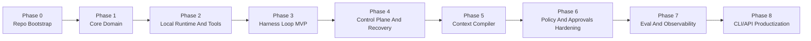

# Zebra Agent 实施任务拆解与阶段验收

## 1. 文档目标

本文档把 `docs/Codex-like工程Agent平台最终架构设计_v1.0.md` 转成可执行的实施路线，用于：

- 明确阶段目标和边界
- 约束任务拆解顺序
- 定义每阶段的验收标准
- 减少“架构正确但无法开工”的状态

本文档优先解决 Phase 0 到 Phase 4 的落地问题；Phase 5 之后保留扩展接口，但不要求一次做完。

## 2. 实施原则

### 2.1 开发顺序原则

按以下顺序推进，不倒置：

1. 先定义核心领域和 Ports
2. 再实现本地运行时和最小工具闭环
3. 再接入 Harness 主循环
4. 再补控制平面和恢复能力
5. 最后扩展 Web、远程 Sandbox、凭证代理和云端部署

### 2.2 验收原则

每阶段完成必须同时满足：

- 有代码，不只是文档
- 有可运行路径，不只是类型声明
- 有测试，不只是手工验证
- 有文档回写，不只是聊天说明

### 2.3 范围控制原则

第一阶段默认只支持：

- 本地单机
- 单 Agent 主循环
- Python 实现
- 本地工作目录
- 受控 shell/file/patch/test/git 工具

第一阶段明确不做：

- 多 Agent 编排
- 浏览器自动化内核化
- 生产级多租户控制面
- 远程凭证代理
- Kubernetes 级沙箱编排

## 3. 阶段总览



## 4. 分阶段任务拆解与验收

## Phase 0: Repo Bootstrap

### 目标

把仓库从“只有架构文档”变成“可持续开发的工程骨架”。

### 任务拆解

1. 建立 monorepo + `uv` workspace 根配置
2. 建立 `apps/` 与 `packages/` 的基础结构
3. 建立仓库协作文件：`AGENTS.md`、`PROGRESS.md`、`task_plan.md`、`findings.md`、`WORKLOG.md`
4. 建立 `Makefile`、`.env.example`、`.python-version`、`.gitignore`
5. 建立最小 smoke test 和 CLI 引导入口

### 验收标准

- `uv sync --all-packages --group dev` 可执行
- `uv run pytest` 通过
- `uv run zebra-agent` 可运行
- 文档能说明仓库结构、当前阶段和下一步

### 当前状态

已完成。

## Phase 1: Core Domain

### 目标

建立不依赖基础设施的核心领域模型、事件模型和 Ports，形成后续所有实现的稳定中心。

### 任务拆解

1. 在 `packages/agent-core` 中补齐 `domain/identifiers.py`
2. 定义 `domain/sessions.py` 的 Session 聚合和状态迁移
3. 定义 `domain/events.py` 的基础事件模型和核心事件枚举
4. 定义 `domain/messages.py`、`domain/tools.py`、`domain/artifacts.py`
5. 在 `ports/` 中定义：
   - `event_store.py`
   - `projection_store.py`
   - `model_gateway.py`
   - `tool_gateway.py`
   - `policy_engine.py`
   - `runtime.py`
   - `artifact_store.py`
   - `clock.py`
6. 为领域状态迁移和事件合法性编写单元测试

### 验收标准

- `agent-core` 不依赖 FastAPI、Docker SDK、OpenAI SDK、数据库客户端
- 所有核心 Ports 均有明确类型签名
- 事件、Session、消息模型可以被测试直接实例化
- 存在针对状态迁移和事件字段的测试

### 退出产物

- 稳定的 `agent-core` 领域模型
- 第一版事件协议草案
- 后续包可依赖的抽象接口

## Phase 2: Local Runtime And Tools

### 目标

打通本地受控执行路径，使系统能在抽象 Runtime 下执行基础动作。

### 任务拆解

1. 在 `agent-runtime` 中实现 `LocalRuntime`
2. 增加进程执行、超时、输出截断和退出码处理
3. 增加本地 workspace/worktree 抽象
4. 在 `agent-tools` 中定义工具契约和统一结果模型
5. 实现首批 builtin tools：
   - files
   - patch
   - command
   - tests
   - git
6. 编写运行时与工具的集成测试

### 验收标准

- Harness 外部可以通过 `RuntimePort` 执行命令
- 工具执行不直接暴露自由 shell 字符串接口给 core
- 至少能完成“读文件 -> 改文件 -> 跑测试 -> 返回结果”的本地闭环
- 出现超时、非零退出码、输出过长时有结构化结果

## Phase 3: Harness Loop MVP

### 目标

实现最小可跑的 Harness 主循环，让系统具备任务接收、计划、执行、验证的基本闭环。

### 任务拆解

1. 在 `agent-core` 或独立 harness 子模块中实现：
   - loop
   - planner
   - verifier
   - stopping
   - budgets
2. 定义模型网关抽象和最小 mock provider
3. 将 `tool_gateway`、`runtime`、`policy_engine`、`event_store` 串起来
4. 实现单次任务运行和结构化输出
5. 实现失败后基于工具结果的再尝试逻辑

### 验收标准

- 可以在无真实模型条件下用 mock provider 跑通闭环
- 可以把用户输入转成事件和执行动作
- 可以产生结构化 plan、tool call、verification result
- 至少有一条 e2e smoke 用例覆盖主循环

## Phase 4: Control Plane And Recovery

### 目标

建立 Durable Session 能力，让任务状态可恢复、可重放、可审计。

### 任务拆解

1. 在 `agent-storage` 中实现 SQLite Event Store
2. 实现 Projection Builder 和基础查询投影
3. 实现租约/恢复的最小机制
4. 定义 `SessionCreated`、`UserMessageReceived`、`ToolExecutionCompleted` 等核心事件 JSON Schema 草案
5. 实现 `apps/worker` 的消费与恢复入口
6. 编写 worker 中断恢复测试

### 验收标准

- Session 事件可追加、可读取、可按顺序重放
- Worker 中断后可从事件恢复到最近稳定状态
- 工具执行重复提交有幂等保护
- 最少有一条 resilience 测试覆盖恢复流程

## Phase 5: Context Compiler

### 目标

从“直接拼 prompt”升级到可解释、可压缩、可缓存的上下文编译。

### 任务拆解

1. 实现 repo scanner、repo map、related files 和基础 ranker
2. 定义 context item、provenance、token budget
3. 增加 conversation compaction 和 tool output compaction
4. 建立 prompt layout 和 cache key 规则
5. 增加 prompt injection 基础识别

### 验收标准

- 给定任务输入，能稳定输出一组排序后的上下文项
- 每个上下文项有来源信息
- 有 token budget 裁剪逻辑
- 压缩前后行为有测试覆盖

## Phase 6: Policy And Approvals Hardening

### 目标

把安全边界从“约定”变成“代码中的硬控制”。

### 任务拆解

1. 定义 policy profiles：`read_only`、`workspace_write`、`full_access`
2. 增加文件系统、命令、网络、git、mcp 规则
3. 增加 pre-tool 和 post-tool hooks
4. 增加 approval service 与 risk summary
5. 编写 path traversal、shell injection、secret exfiltration 等安全测试

### 验收标准

- 高风险操作会被明确拒绝或进入审批
- 规则判断可以被单元测试和集成测试覆盖
- 安全测试至少覆盖路径越权、shell 注入和敏感信息泄露

## Phase 7: Eval And Observability

### 目标

建立回归评测、任务质量评测和运行观测，避免系统“能跑但无法持续优化”。

### 任务拆解

1. 建立 traces、audit、metrics、cost 记录模型
2. 建立 eval case 目录与 grader
3. 建立本地 replay runner
4. 增加 bugfix/refactor/recovery 基线任务
5. 把评测接入发布前检查

### 验收标准

- 每次任务运行至少能记录事件、工具结果和成本摘要
- 可以回放至少一条历史任务
- 有最小 eval 数据集和 grader

## Phase 8: CLI/API Productization

### 目标

把工程内核包装成可供开发者使用的稳定入口。

### 任务拆解

1. 完善 CLI 命令：`run`、`resume`、`inspect`、`approve`
2. 增加 API app 基础路由和健康检查
3. 增加 SSE 或 websocket 流式输出
4. 增加配置加载和 profile 选择
5. 补齐 operator runbook

### 验收标准

- CLI 可以创建、恢复、查看任务
- API 可以暴露基础会话和健康检查接口
- 主要操作有清晰的 operator 使用方式

## 5. 并行策略

以下工作可以并行，但必须在依赖满足后启动：

- `apps/api` 与 `apps/cli` 可在 Phase 3 之后并行
- `agent-context` 可在 Phase 1 后并行推进
- `agent-security` 可在 Phase 2 后并行推进
- `evals/` 与 `agent-observability` 可从 Phase 3 开始预铺目录，但正式验收在 Phase 7

以下工作不要过早并行：

- `services/sandboxd`
- `credential-broker`
- `egress-proxy`
- `web`
- `kubernetes` 部署

## 6. 当前推荐执行顺序

```text
本周建议顺序：
1. Phase 1: 完成 agent-core 领域对象和 Ports
2. Phase 2: 完成 LocalRuntime 和最小 builtin tools
3. Phase 3: 跑通 mock harness loop
```

## 7. 阶段验收清单模板

每阶段结束时都应补一份相同结构的验收记录：

```markdown
## 验收记录
- 阶段：
- 日期：
- 负责人：
- 目标是否完成：
- 代码入口：
- 测试命令：
- 测试结果：
- 未完成项：
- 风险与下一步：
```
